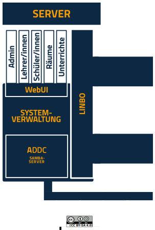

.. |zb| unicode:: z. U+00A0 B. .. Zum Beispiel 

.. |_| unicode:: U+202F
   :trim:

.. |copy| unicode:: 0xA9 .. Copyright-Zeichen
   :ltrim:

.. |reg| unicode:: U+00AE .. Trademark
   :ltrim:

.. _what-is-linuxmuster.net-label:

========================
Was ist linuxmuster.net?
========================

.. sectionauthor:: `@cweikl <https://ask.linuxmuster.net/u/cweikl>`_,
                   `@MachtDochNix <https://ask.linuxmuster.net/u/machtdochnix>`_

linuxmuster.net ist eine Komplettlösung für den digital unterstützten Unterricht für Schüler:innen und Lehrer:innen einer zeitgemäßen Bildungseinrichtung.

Die langjährigen Erfahrungen aller Beteiligten aus der linuxmuster.net Gemeinde haben gezeigt, dass sich ein Firnmennetzwerk fundamental von den Anforderungen an ein 
heutige Schulnetz unterscheiden. 

Die Entwicklung von linuxmuster.net greift all diese Anforderungen auf und stellt eine modulare Lösung für ein Schulnetz zur Verfügung. 

Diese kann von einer Ein-Server-Lösung bis hin zu einer
Mehr-Server-Lösung mit Cloud-Anbindung und BYOD-Integration skaliert werden.

Die Anforderungen, die heute an ein Schulnetz gestellt werden, erklären wir im nachfolgenden Abschnitten detailliert. Im Anschluss zeigen wir auf, wie linuxmuster.net diese umsetzt.

Schulnetzwerk vs. "normales" Netzwerk
=====================================

**Welche Unterschiede in der IT in einer Firma und einer Schule sind für uns relevant?**

Im Prinzip gibt es vier große Merkmale, die auffallen:

1. Das Verhältnis der Anzahl von Usern zu den Arbeitsmitteln

.. tabularcolumns:: |c|c|c|c|

+-----------+-----------+
| Firma     | Schule    |
+------+----+------+----+
| User | PC | User | PC |
+======+====+======+====+
|  50  | 50 | 500  | 50 |
+------+----+------+----+

2. Die Zusammensetzung von Usern in  Abteilungen

.. tabularcolumns:: |c|c|c|c|

+------------------+---------------+
|      Firma       |    Schule     |
+------+-----------+------+--------+
| User | Abteilung | User | Gruppe |
+======+===========+======+========+
|  A   | Marketing |  A   | Klasse |
|      |           |      +--------+
|      |           |      | Kurs 1 |
|      |           |      +--------+
|      |           |      | Kurs 2 |
|      |           |      +--------+
|      |           |      | AG 1   |
+------+-----------+------+--------+
|  B   | Marketing |  B   | Klasse |
|      |           |      +--------+
|      |           |      | Kurs 3 |
|      |           |      +--------+
|      |           |      | Kurs 2 |
|      |           |      +--------+
|      |           |      | AG 1   |
+------+-----------+------+--------+

3. Die Fluktuation im jährlichen Wechsel

   Zum Schuljahreswechsel verlässt eine große Anzahl an Schüler:innen die Einrichtung und neue müssen in das System eingepflegt werden. Die Zusammensetzung der Klassen, Kurse und Arbeitsgruppen werden zu großen Teilen neu formiert.

   Solch ein administrativen Aufwand ergibt sich in einer Firma selten.

4. Der Umgang mit den Arbeitsmitteln

   Schüler:innen teilen sich ein und dasselbe Arbeitsmittel im schulischen Alltag. Dabei ist es für die nächste Unterrichtseinheit entscheidend, dass zum Start immer eine einheitliche Umgebung auf den Rechnern vorhanden ist. Die zeitliche Taktung zwischen den Wechseln kann sehr kurz sein.

   Dies ist in einer Firma so nicht gegeben. Wenn ein User seinen Rechner verlässt, findet er ihn der Regel immer genauso wieder.

Aus diesen Gründen sprechen wir von einem

Schulnetz
=========

Mit linuxmuster.net wird die schulische IT mit einer voll integrierten Open-Source-Lösung abgebildet. Dieses umfasst alle Bereiche, die in einer Bildungseinrichtung anzutreffen sind.

Unser Anspruch liegt dabei auf der Bereitstellung eines Systems, das folgende Punkte erfüllt:

    * automatisierte Installation der Server-Komponenten
    * durch einen freien Zugang zu einer umfänglichen Dokumentation eine möglichst einfache Installation
    * einfache Integration in vorhandene Infrastruktur
    * bestehend aus Server, Firewall und vorkonfigurierten Arbeitsstationen
    * mehrstufige ausbau- und anpassbare Struktur mit heterogenen Clients und unterschiedlichsten Diensten bzw. Cloud-Lösungen
    * ein frei zugängliches `Community-Wiki <https://wiki.linuxmuster.net/community/>`_ mit einer Vielzahl an ergänzenden Anleitungen und Erweiterungen aus dem Umfeld der Unterstützer von linuxmuster.net

**Schulnetz - Komplett - Anpassbar!**

.. image::    media/structure_of_version_7.svg
   :name:     structure-over-all 
   :alt:      Struktur über alles
   :height:   40px

Ein Augenmerk liegt dabei auf der Unabhängigkeit von der eingesetzten Hard- und Software. Dieses wird unter anderem erkennbar an dem Umfang der unterstützten Betriebssysteme für die Arbeitsstationen.

Proprietäre Betriebssysteme, |zb| aus dem Hause Microsoft |reg|, können aufgrund der Lizenzpolitik der Hersteller nicht von uns vorbereitet ausgeliefert werden. Diese lassen sich aber ebenso leicht in unsere Infrastruktur integrieren, wie solche, die als Open-Source erhältlich sind.

Auf der Basis von Linux stellen wir ein Open-Source-Betriebssystem zur Verfügung, das folgende Vorteile bietet:

    * entwickelt von Praktikern für den täglichen Einsatz an Schulen
    * mit hilfreichen Schulfunktionen für den Unterrichtseinsatz
    * in einfacher Form anpass- und erweiterbar an die eigenen Bedürfnisse
    * keine Lizenzkosten

.. image::    media/structure_of_version_7_lmn.svg
   :name:     structure-basic-components
   :alt:      Struktur der Basis-Komponenten
   :width:    500px
   :align:    center

Im Zusammenspiel der Clients mit dem Server und einer Firewall entsteht so die grundlegende professionelle Infrastruktur zur zentralen Administration der Schülergeräte und der Verwaltung des pädagogischen Schulnetzwerkes.

Dieses lässt sich aufgrund des modularen Aufbaus weiter an die darüber hinausgehenden Anforderungen, unter anderem einer schulweiten WLAN-Verfügbarkeit erweitern und anpassen.

Die Basis
---------

Der linuxmuster.net-Server
++++++++++++++++++++++++++

Die Basisdienste des links abgebildeten Servers sind für die Funktion des ganzen Systems verantwortlich:

Benutzer- und Gruppenverwaltung
^^^^^^^^^^^^^^^^^^^^^^^^^^^^^^^

Die Benutzer- und Gruppenverwaltung orientiert sich an den Bedürfnissen, die der Schulbetrieb vorgibt.

    * Schüler:innen bekommen mit der Einschulung ihren persönlichen Benutzer-Account.
    * Dieser bleibt ihnen bis zum Ende ihrer Laufbahn an der Schule erhalten.
    * Die Gruppenzugehörigkeit der einzelnen Schüler:innen werden in Klassen, Kursen und Projekten abgebildet.
    * Zu Beginn eines Schuljahres können diese Daten und Abhängigkeiten aus der Schulverwaltung mittels Import der Daten eingespielt bzw. fortgeschrieben werden.
      Gleiches gilt selbstverständlich auch für Veränderungen während eines laufenden Schuljahres.
    * Für Lehrer:innen gilt dies ebenso.

Unterrichtssteuerung
^^^^^^^^^^^^^^^^^^^^

Vielfältige Möglichkeiten stehen den Lehrkräften zur Verfügung, um Einfluss auf die Rechner der zu Unterrichtenden zu nehmen.

    * Internet - An/Aus
    * Intranet - An/Aus
    * Wi-Fi - An/Aus
    * Drucker - An/Aus

Klassenarbeitsmodus
^^^^^^^^^^^^^^^^^^^^

In Prüfungssituationen wie Abitur, Klassenarbeiten und andere Leistungsüberprüfungen kann die Lehrkraft mit einfachen Mitteln die Nutzung des Systems für die Prüfungsgruppe einschränken. Das Spektrum umfasst dabei alle Möglichkeiten der Unterrichtssteuerung ergänzt um die Sperrung des persönlichen Speicherbereichs.

Dateiverwaltung und -verteilung
^^^^^^^^^^^^^^^^^^^^^^^^^^^^^^^^

Alle Nutzer besitzen einen persönlichen Bereich auf dem Netzwerkspeicher. Ebenso steht ein solcher den Gruppen für den Austausch ihrer gemeinschaftlichen Arbeit zur Verfügung.

Selbstheilende Arbeitsstationen durch LINBO 4.2
+++++++++++++++++++++++++++++++++++++++++++++++

.. image::    media/structure_of_version_7_client.svg
   :name:     structure-linbo-client-management
   :alt:      Struktur der Basis-Komponente - LINBO (Client-Managements)
   :height:   40px
   :align:    left

Das Konzept der Selbstheilenden Arbeitsstationen (SheilA) ermöglicht einheitliche, identische Schulungssysteme. Diese können bei jedem Start der Rechner in einen vorher definierten Zustand zurückgesetzt werden. Dieser Standard wird durch die letzte Veränderung oder Installation festgelegt, in dem ein Abbild des Betriebssystems auf dem Server gespeichert wird. Weitere Vorteile sind:

    * verschiedene Betriebssysteme auf jedem Client möglich
    * schnelle Erst- oder Neueinrichtung
    * keine Einschränkung der Nutzer durch Benutzerrechte auf den Clients nötig
    * einfache Wiederherstellung der Clients ist jedem Benutzer möglich
    * einfache Softwareverteilung durch Installation auf einem Client - keine gesonderten Kenntnisse erforderlich, bei demjenigen, der die Software-Installation betreut.
    * Möglichkeit der zeit- und/oder ferngesteuerten Aktualisierung der Clients.
    * mit sogenannten Postsync-Scripten kann der Administrator für einzelne, raumweite oder für alle Geräte notwendige Konfigurationsänderungen beim Systemstart einpflegen.

Nähere Information sind im Kapitel "Clientverwaltung" beschrieben.

Integration unterschiedlicher Geräte (BYOD)
+++++++++++++++++++++++++++++++++++++++++++

Da sich alle Steuerungsfunktionen in unserer Lösung an den Benutzern orientieren, ist es unerheblich an welchem Gerät sie sich befinden. Das Gleiche gilt auch für mitgebrachte Geräte, mit denen sie sich mit dem Intranet via WLAN verbinden.

Firewall
++++++++

OPNsense |reg|: wird als Standard-Firewall ausgeliefert.

   .. image::    media/structure_of_version_7_firewall.svg
      :name:     structure-firewall
      :alt:      Struktur der Basis-Komponente - Firewall 
      :height:   40px
      :align:    left

   Durch die Integration der Firewall an AD DS (Active Directory Domain Services) des Servers (Samba4) werden sämtliche Benutzer-Zugriffe der Nutzer mittels Single-Sign-On auf das Internet geregelt.

   Sämtliche verfügbaren Bausteine dieser Open-Source-Firewall stehen selbstverständlich zur Verfügung.

Für weitergehende Informationen `siehe opnsense.org <https://opnsense.org/>`_.

.. note::
   Diese vorgestellten Bestandteile werden vom Verein **linuxmuster.net e. V. entwickelt und unterstützt**.

   Diese Unterstützung wird durch das

   **Hilfe-Forum** `<https://www.linuxmuster.net/de/support-de/discourse-forum/>`_

   und die

   **telefonische Hotline** `<https://www.linuxmuster.net/de/support-de/hotline/>`_

   geleistet.

   **All diese Leistungen sind nicht von einer Mitgliedschaft im Verein abhängig.**

   Aufgrund der Vielzahl möglicher Einsatzszenarien umfasst der telefonische Support alle bereitgestellten Basis-Dienste, die in der Dokumentation beschrieben sind.

   **Das Support-Team berät aber gerne und zeigt alle Möglichkeiten und Alternativen auf.**

Anpassbar
---------

Alle bisher vorgestellten Basisdienste werden mithilfe des Setups konfiguriert, bleiben aber frei anpass- und erweiterbar. Es folgt eine einführende Beschreibung der letzten drei Bausteine, die linuxmuster.net zu der Komplettlösung machen.

.. image::    media/structure_of_version_7_community.svg
   :name:     structure-community-components
   :alt:      Struktur der Erweiterungen (Community)
   :height:   500px
   :align:    center 

.. note:: Die Unterstützung erfolgt für die nachfolgenden Bestandteile durch das

   Hilfe-Forum https://www.linuxmuster.net/de/support-de/discourse-forum/

   Die detaillierte Beschreibung ist nicht Gegenstand dieser Dokumentation, sondern wird durch die Community in deren Wiki festgehalten.

   Community-Wiki: https://wiki.linuxmuster.net/community/

:Alternative Firewall: Einsatzszenarien, die mit einer anderen Firewall als OPNsense |reg| ausgestattet sein sollen, lassen sich mit linuxmuster.net ebenfalls umsetzen.

   .. image::    media/structure_of_version_7_alternate.svg
      :name:     structure-alternativ-firewall
      :alt:      Struktur der Einbindung einer alternativen Firewall
      :width:    150px
      :align:    right

   Wenn die eingesetzte (alternative) Firewall über die Möglichkeit einer Anbindung an den Samba4-Dienst des linuxmuster.net-Servers verfügt, kann diese alle aufgezeigten Vorteile nutzen.

:Optionale Server: Für weitergehende Anpassungen besteht die Möglichkeit, optionale Server einzubinden.

   .. image::    media/structure_of_version_7_optional.svg
      :name:     structure-option-server
      :alt:      Struktur der Einbindung optionaler lokaler Server
      :width:    150px
      :align:    right

  In der Darstellung ist etwa ein Docker-Server als Erweiterung an die Bedürfnisse der Bildungseinrichtung eingebunden. Docker ist ein Open-Source-Projekt zur automatisierten Anwendungsverteilung durch Container, die alle benötigten Pakete mitbringen. So vereinfacht sich die Bereitstellung und Verteilung. Außerdem gewährleisten sie die Trennung und Verwaltung der auf dem Docker-Server genutzten Ressourcen.

 Für weitergehende Informationen siehe die Docker-Homepage: https://www.docker.com

:Extra: Ein Porfolio an unterschiedlichen externen Diensten lässt sich an die linuxmuster.net Lösung anbinden, sodass eine einheitliche Authentifizierung erfolgt.

   .. image::    media/structure_of_version_7_extra.svg
      :name:     structure-extra-server-and-services
      :alt:      Struktur der Einbindung externer Server und Dienste
      :width:   150px
      :align:    right

   Es können z.B. extern gehostete Server wie Nextcloud, Moodle oder Konferenzsysteme integriert werden.

:download:`Komplette Struktur als Inkscape SVG <media/structure_of_version_7_simple.svg>`

