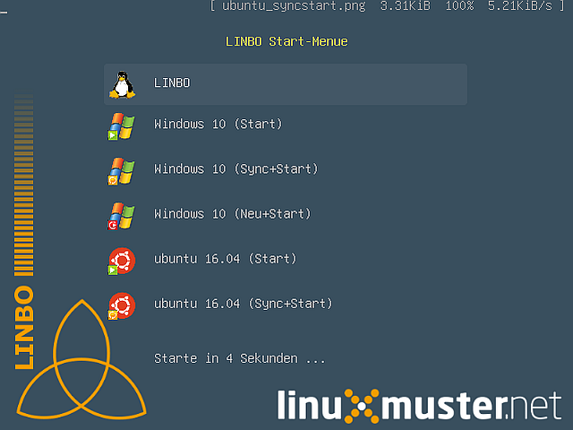
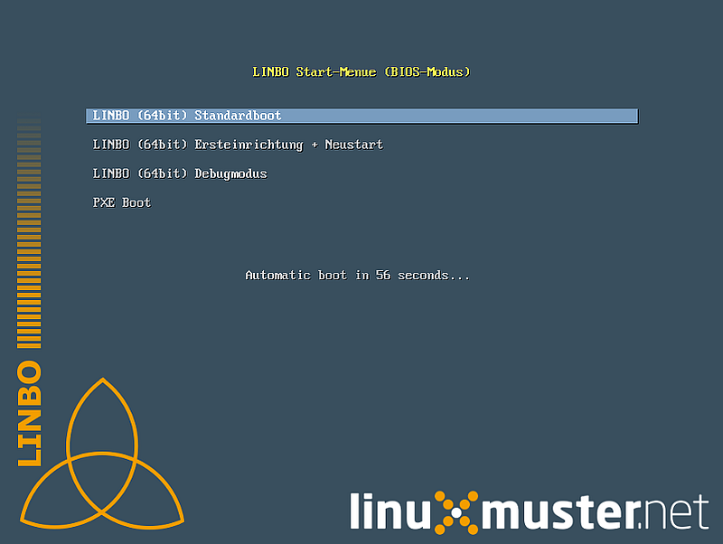
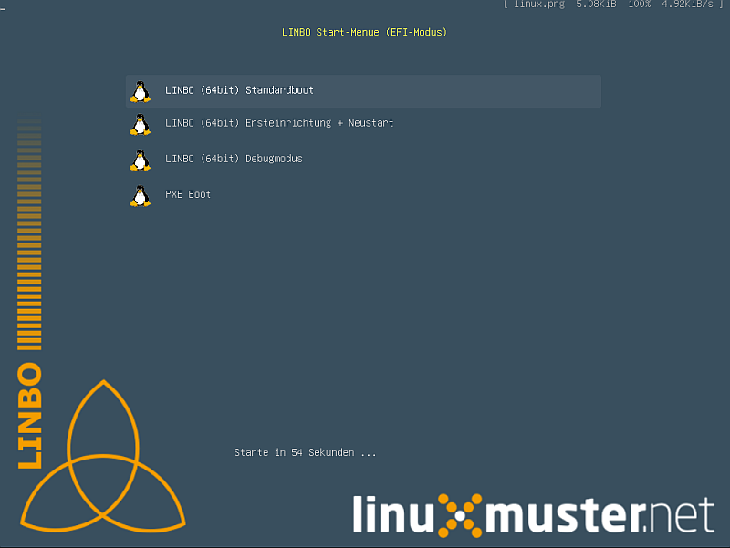
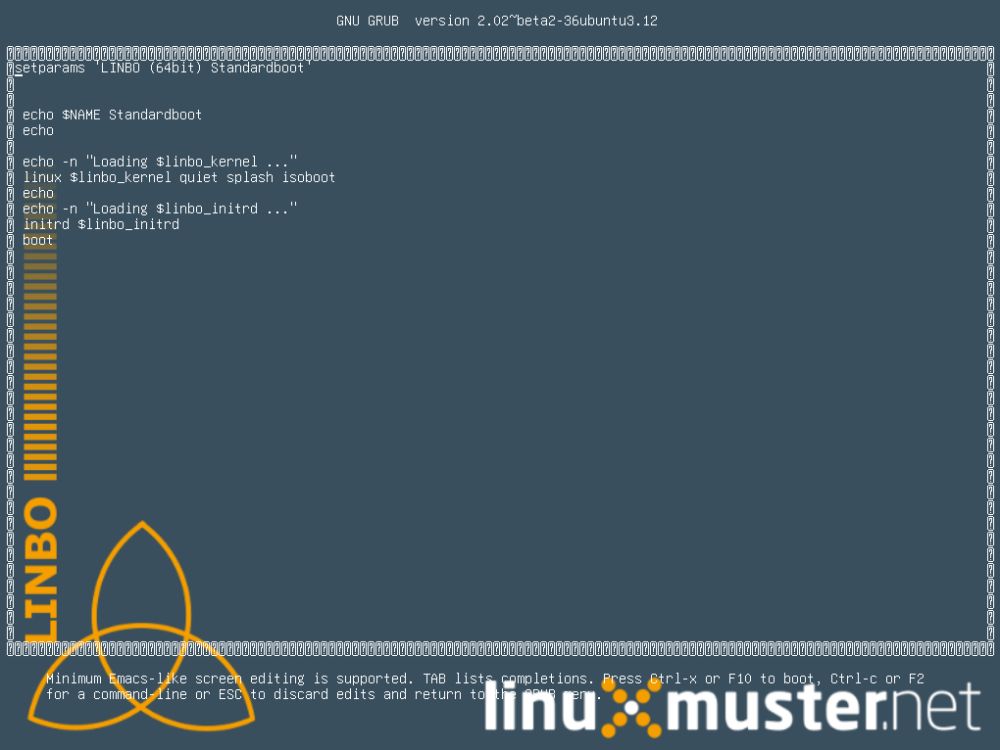

Neuerungen in linuxmuster-linbo 2.3
-----------------------------------

- Kernel 4.9.x mit **aktuellen Hardwaretreibern**

  - Native Unterstützung von 64bit-Hardware zur LINBO-Laufzeit
  - Automatische Erkennung von 32bit PAE, 32bit non-PAE und 64bit-Hardware
  - Neuer Partitionsmechanismus

- Umstellung des lokalen und PXE-Bootsystems auf **Grub** 2

  - Vereinfachte Boot-Konfiguration in nur noch einer
    Grub-Konfigurationsdatei für lokalen und Netzwerkboot
  - Vorkonfigurierte Grub-Bootmenüs können einfach aktiviert und
    angepasst werden
  - Automatischer Reboot vor jedem Betriebssystemstart minimiert Hardwareprobleme
  - Automatisches Linbo- oder Grub-Update auf lokal gebooteten Clients
    mit automatischem Reboot
  - Unterstützung für Grub-Themes

- Unterstützung von **UEFI-Boot**-Clients

  - Partitionierung im GPT-Modus auf EFI-Systemen
  - Die start.conf-Dateien erhalten eine neue Option *SystemType*, der
    man die Werte *bios\|bios64\|efi32\|efi64* zuweisen kann. Zunächst
    ist der Standardwert *bios* eingetragen, der für alle Clients mit
    konventionellem BIOS-Boot funktioniert.
  - Unterstützung von Multiboot-Systemen mit UEFI

- Automatische Erstellung und vereinfachter Download von
  **Bootmedien**-Abbilder für USB-Speicher oder zum direkten Brennen auf
  CD/DVD

- Unterstützung des Setzens der **Systemzeit** durch einen Zeitserver

- Einheiten-Angabe für Partitionsgrößen in der start.conf-Datei (M für
  Megabyte, G für Gigabyte, T für Terabyte)

Reparatur und Neuerstellen eines Abbildes nach Partitionierung
~~~~~~~~~~~~~~~~~~~~~~~~~~~~~~~~~~~~~~~~~~~~~~~~~~~~~~~~~~~~~~

Ab Version 2.3.0 wird ein anderes Partitionsprogramm verwendet, um für
UEFI sowie BIOS valide Partitionstabellen anlegen zu können. Bei
Neupartitionierung erfordert Windows eine Systemstartreparatur und
danach das erneute Erstellen eines Abbildes. Lesen Sie :ref:`hier
<howtos-upgrade-image-label>` nach, wie es genau geht.

Boot-Konfiguration mit Grub
~~~~~~~~~~~~~~~~~~~~~~~~~~~

linuxmuster-linbo ab Version 2.3.0 verwendet
`Grub <http://www.gnu.org/software/grub/manual/>`__ als Bootloader für
Netzwerkboot und lokalen Boot.

.. important::

   Die bisherige PXE-Bootkonfiguration unter ``/var/linbo/pxelinux.cfg``
   ist damit obsolet.

Kerneloptionen werden aus der start.conf übernommen. Dafür gibt es
eine neue Option *KernelOptions*, der man Leerzeichen getrennt
Kernel-Parameter übergibt (keine Leerzeichen innerhalb eines Parameters):

.. code-block:: sh

   KernelOptions = quiet splash dhcpretry=10 acpi=noirq

   
Spezifische PXE-Boot-Einstellungen für eine
bestimmte Rechnergruppe werden jetzt in den Boot-Konfigurationsdateien
vorgenommen, die im Verzeichnis ``/var/linbo/boot/grub`` unter dem
Namen der jeweiligen Rechnergruppe mit der Erweiterung *.cfg* angelegt
werden. In dieser Datei können für spezielle Zwecke Anpassungen
gemacht werden.

Beim Start über Grub wird zunächst die Konfigurationsdatei geladen, die
lokal unter
`/cache/boot/grub/grub.cfg <https://github.com/linuxmuster/linuxmuster-linbo/blob/2.3.0-8/share/templates/grub.cfg.local>`__
bzw. auf dem Server unter
`/var/linbo/boot/grub/grub.cfg <https://github.com/linuxmuster/linuxmuster-linbo/blob/2.3.0-8/share/templates/grub.cfg.pxe>`__
abgelegt ist. Diese Datei veranlasst den Grub-Bootloader eine etwaige
lokal im Cache abgelegte Grub-Konfiguration auszulesen. Wurde zuvor
durch einen von Linbo initiierten Betriebssystemstart die
Grub-Environmentvariable *reboot\_grub* mit einer Partitionsinformation
belegt, startet Grub das Betriebssystem, das auf dieser Partition
installiert ist. Ist die Variable nicht gesetzt, wird die
gruppenspezifische Konfigurationsdatei nachgeladen, die für die
jeweilige Rechnergruppe spezifische Menüeinträge enthält.

Gruppenspezifische Boot-Konfiguration
~~~~~~~~~~~~~~~~~~~~~~~~~~~~~~~~~~~~~

Die gruppenspezifische Boot-Konfigurationsdatei wird automatisch beim
Workstationimport (siehe Abschnitt :doc:`../../clients/windows10clients/registration`) aus der
start.conf-Datei der Gruppe erstellt. Sie enthält einen Menü-Eintrag für
Linbo und drei weitere für jedes in der start.conf-Datei definierte
Betriebssystem. Das Menü ist standardmäßig ausgeblendet und so
konfiguriert, dass automatisch Linbo gebootet wird.

Hier ein Beispiel für ein System mit Windows 7. Zunächst der globale
Teil:

.. code-block:: sh

   # global part of group specific grub.cfg template for linbo net boot
   # thomas@linuxmuster.net
   # 12.02.2016
   #
   
   # if you don't want this file being overwritten by import_workstations remove the following line:
   # ### managed by linuxmuster.net ###
   
   # edit to your needs
   set default=0
   set timeout=0
   set fallback=1
   
   set gfxpayload=800x600x16
   
   # set apropriate linbo kernel and initrd
   if cpuid -l; then
      set linbo_kernel=/linbo64
      set linbo_initrd=/linbofs64.lz
   else
      set linbo_kernel=/linbo
      set linbo_initrd=/linbofs.lz
   fi
   
   # theme settings (modify for custom theme)
   set theme=/boot/grub/themes/linbo/theme.txt
   set font=/boot/grub/themes/linbo/unifont-regular-16.pf2

   # load theme
   if [ -e "$theme" -a -e "$font" ]; then
      loadfont "$font"
      export theme
   fi

   
-  Um das Boot-Menü zu aktivieren, setzt man einfach den
   `Timeout <http://www.gnu.org/software/grub/manual/grub.html#timeout>`__-Wert
   hoch. Nach Ablauf der angegebenen Sekunden wird der
   `Default <http://www.gnu.org/software/grub/manual/grub.html#default>`__-Eintrag
   gestartet. Schlägt dies fehl, wird versucht den
   `Fallback <http://www.gnu.org/software/grub/manual/grub.html#fallback>`__-Eintrag
   zu starten.

   -  Mit dem Wert für
      `gfxpayload <http://www.gnu.org/software/grub/manual/grub.html#gfxpayload>`__
      lassen sich Auflösung und Farbtiefe anpassen.
   -  Alternative Grub-Themes lassen sich per
      `theme <http://www.gnu.org/software/grub/manual/grub.html#theme>`__-Variable
      konfigurieren (``set theme=``). Diese müssen in einem Verzeichnis
      unter ``/var/linbo/boot/grub/themes`` abgelegt werden.

Nach dem globalen Teil folgen die Menüeinträge für **LINBO** und die
Betriebssysteme (je einer für Start, Sync und Neu).

Der erste Menü-Eintrag (Nr. 0) startet **LINBO**, falls möglich aus dem
lokalen Cache, ansonsten über Netzwerk:

.. code-block:: sh

   # linbo part, boot local or net (default #0)
   menuentry 'LINBO' --class linux {

     echo LINBO $bootflag for group win7
     echo

     set root="(hd0,2)"
     if [ -e "$linbo_kernel" -a -e "$linbo_initrd" ]; then
        set bootflag=localboot
     elif [ -n "$pxe_default_server" ]; then
        set root="(tftp)"
        set bootflag=netboot
     fi

     if [ -n "$bootflag" ]; then
        echo -n "Loading $linbo_kernel ..."
        linux $linbo_kernel splash quiet $bootflag
        echo
        echo -n "Loading $linbo_initrd ..."
        initrd $linbo_initrd
        boot
     else
        if [ "$grub_platform" = "pc" ]; then
           set ipxe="/ipxe.lkrn"
        fi
        if [ -e "$ipxe" ]; then
           echo -n "Initiating pxe boot ..."
           linux16 $ipxe dhcp
           boot
        fi
     fi

   }

Danach folgt der Eintrag (Nr. 1) für den unsynchronisierten Start des
Betriebssystems:

.. code-block:: sh

   # start "Windows 7" directly
   menuentry 'Windows 7 (Start)' --class win_start {
 
      set root="(hd0,1)"
      set win_efiloader="/EFI/Microsoft/Boot/bootmgfw.efi"

      if [ -e /vmlinuz -a -e /initrd.img ]; then
         linux /vmlinuz root=/dev/sda1
         initrd /initrd.img
      elif [ -e /vmlinuz -a -e /initrd ]; then
         linux /vmlinuz root=/dev/sda1
         initrd /initrd
      elif [ -e /grub.exe -a -e /noinitrd_placeholder ]; then
         linux /grub.exe root=/dev/sda1
         initrd /noinitrd_placeholder
      elif [ -e /grub.exe ]; then
         linux /grub.exe root=/dev/sda1
      elif [ -s /boot/grub/grub.cfg ] ; then
         configfile /boot/grub/grub.cfg
      elif [ "$grub_platform" = "pc" ]; then
         if [ -s /bootmgr ] ; then
            ntldr /bootmgr
         elif [ -s /ntldr ] ; then
            ntldr /ntldr
         elif [ -s /grldr ] ; then
            ntldr /grldr
         else
            chainloader +1
         fi
      elif [ -e "$win_efiloader" ]; then
	 chainloader $win_efiloader
         boot
      fi

   }

		
Der nächste Menü-Eintrag (Nr. 2) ermöglicht den synchronisierten Start
des Betriebssystems:

.. code-block:: sh

   # boot LINBO, sync and then start "Windows 7"
   menuentry 'Windows 7 (Sync+Start)' --class win_syncstart {

      set root="(hd0,2)"
   
      if [ -e "$linbo_kernel" -a -e "$linbo_initrd" ]; then
         set bootflag=localboot
      elif [ -n "$pxe_default_server" ]; then
         set root="(tftp)"
         set bootflag=netboot
      fi

      if [ -n "$bootflag" ]; then
         echo LINBO $bootflag for group win7
         echo
         echo -n "Loading $linbo_kernel ..."
         linux $linbo_kernel splash quiet linbocmd=sync:1,start:1 $bootflag
         echo
         echo -n "Loading $linbo_initrd ..."
         initrd $linbo_initrd
         boot
      fi

   }

Schließlich folgt der Menü-Eintrag (Nr. 3) für Neu+Start:

.. code-block:: sh

   # boot LINBO, format os partition, sync and then start "Windows 7"
   menuentry 'Windows 7 (Neu+Start)' --class win_newstart {

      set root="(hd0,2)"
   
      if [ -e "$linbo_kernel" -a -e "$linbo_initrd" ]; then
         set bootflag=localboot
      elif [ -n "$pxe_default_server" ]; then
         set root="(tftp)"
         set bootflag=netboot
      fi
   
      if [ -n "$bootflag" ]; then
         echo LINBO $bootflag for group win7
         echo
         echo -n "Loading $linbo_kernel ..."
         linux $linbo_kernel splash quiet linbocmd=format:1,sync:1,start:1 $bootflag
         echo
         echo -n "Loading $linbo_initrd ..."
         initrd $linbo_initrd
         boot
      fi
   
   }

Die Bootmenü-Einträge müssen in der Regel nicht angepasst werden. Je
nach eigener Anforderung kann es eventuell notwendig werden die
Reihenfolge oder den Text der Menü-Einträge zu ändern oder einzelne
Einträge (z.B. für den unsychronisierten Start) zu entfernen. Im letzten
Fall löscht man einfach den kompletten Zeilenbereich von *menuentry* bis
zur schließenden geschweiften Klammer.

Pflegt man eigene Anpassungen in die Datei ein, sollte man noch die
Zeile ``### managed by linuxmuster.net ###`` entfernen, damit die
Änderungen beim Workstationsimport nicht wieder überschrieben werden.

.. tip::

   Die gruppenspezifische Bootkonfiguration kann auch über
   die Schulkonsole angepasst werden.

Hat man das Grub-Bootmenü aktiviert, präsentiert es sich beim nächsten
Start des Clients z.B. so:

Linux-Clients mit UEFI-Boot einrichten
~~~~~~~~~~~~~~~~~~~~~~~~~~~~~~~~~~~~~~

Für die Installation einer Linux-Distribution auf UEFI-Systemen ist in
der start.conf-Datei eine EFI-Partition (200 MB) vorzusehen. Außerdem
ist die Option *SystemType* auf *efi64* einzustellen. Damit wird die
Clientfestplatte entsprechend dem
`GPT-Schema <https://de.wikipedia.org/wiki/GUID_Partition_Table>`__
partitioniert. Eine Beispiel-Datei ist auf dem Server unter
`/var/linbo/examples/start.conf.ubuntu-efi <https://github.com/linuxmuster/linuxmuster-linbo/blob/2.3.0-8/var/examples/start.conf.ubuntu-efi>`__
abgelegt.

Die Vorgehensweise unterscheidet sich nicht von der bei BIOS-Systemen:
Nachdem man die Clientfestplatte mit Linbo partitioniert hat, bootet man
den Installationsdatenträger (natürlich im UEFI-Modus) und installiert
nach Anleitung.

Alternativ lässt sich auch das Cloop-Image einer Installation von
einem BIOS-Rechner auf einem UEFI-Rechner einspielen ((Hat hier mit
Ubuntu 14.04 problemlos geklappt und sollte auch mit anderen Linuxen
funktionieren)). Nachdem man den UEFI-Rechner einmal gebootet hat,
erstellt man einfach ein neues Image und verteilt das an die
restlichen Rechner. Das Image lässt sich fürderhin für BIOS- und
UEFI-Rechner gleichermaßen verwenden.

Windows-Clients mit UEFI-Boot einrichten
~~~~~~~~~~~~~~~~~~~~~~~~~~~~~~~~~~~~~~~~

Für Windows auf UEFI-Systemen ist zusätzlich zur EFI-Partition noch eine
*Microsoft reserved partition (msr))* (128 MB) vorzusehen, sodass das
Betriebssystem in die dritte Partition installiert wird. Ein
entprechendes start.conf-Beispiel ist unter
`/var/linbo/examples/start.conf.win7-efi <https://github.com/linuxmuster/linuxmuster-linbo/blob/2.3.0-8/var/examples/start.conf.win7-efi>`__
abgelegt. Die Vorgehensweise ist wie gehabt: zuerst Partitionierung mit
Linbo, danach Installation.

Auch mit Windows ist es möglich ein auf einem BIOS-Rechner erstelltes
Image auf der UEFI-Maschine zu verwenden. Zunächst wird das
Betriebssystem zwar nicht starten, aber die Chancen stehen gut, dass es
nach einer Startreparatur mit dem Installationsdatenträger klappt. Hat
man Glück und Windows bootet schließlich, kann man das auf dem
UEFI-Rechner erstellte Image auch auf BIOS-Systemen verwenden.

Vorgehensweise bei der Installation von Windows mit UEFI
^^^^^^^^^^^^^^^^^^^^^^^^^^^^^^^^^^^^^^^^^^^^^^^^^^^^^^^^

Erstellung der start.conf-Datei
'''''''''''''''''''''''''''''''

Im ersten Schritt erstellen Sie für die Rechnergruppe *win7-efi* unter
*/var/linbo* eine EFI-gerechte start.conf-Datei für eine neue
Rechnergruppe *win7-efi*. Kopieren Sie dazu einfach die Beispiel-Datei
*start.conf.win7-efi* nach */var/linbo* (als Benutzer root auf dem
Server):

.. code-block:: console

   # cp /var/linbo/examples/start.conf.win7-efi /var/linbo/start.conf.win7-efi

Falls Ihre Rechnergruppe anders heißt, passen Sie den Namen der
Zieldatei entsprechend an.

Passen Sie die Partitionsgrößen in der start.conf-Datei nach Ihren
Bedürfnissen an. Sie können Einheiten für die Größen angeben (M für
Megabyte, G für Gigabyte, T für Terabyte):

.. code-block:: sh

   # LINBO start.conf Beispiel mit EFI (GPT)
   # EFI 64 Partition 1
   # MSR  Partition 2
   # Windows 7  Partition 3
   # Cache auf Partition 4
   # Daten auf Partition 5
   # Festplatte 160G
		
   [LINBO]                  # globale Konfiguration
   Server = 10.16.1.1       # IP des Linbo-Servers, der das Linbo-Repository vorhaelt
   Group = win7-efi           # Name der Rechnergruppe fuer die diese Konfigurationsdatei gilt
   # Achtung: Server und Group werden beim Workstationsimport automatisch gesetzt!
   Cache = /dev/sda4        # lokale Cache Partition
   RootTimeout = 600        # automatischer Rootlogout nach 600 Sek.
   AutoPartition = no       # automatische Partitionsreparatur beim LINBO-Start
   AutoFormat = no          # kein automatisches Formatieren aller Partitionen beim LINBO-Start
   AutoInitCache = no       # kein automatisches Befuellen des Caches beim LINBO-Start
   DownloadType = torrent   # Image-Download per torrent|multicast|rsync, default ist rsync
   BackgroundFontColor = white         # Bildschirmschriftfarbe (default: white)
   ConsoleFontColorStdout = lightgreen # Konsolenschriftfarbe (default: white)
   ConsoleFontColorStderr = orange     # Konsolenschriftfarbe fuer Fehler-/Warnmeldungen (default: red)
   SystemType = efi64                  # moeglich ist bios|bios64|efi32|efi64 (Standard: bios fuer bios 32bit)
   KernelOptions = quiet splash        # Beispiele:
   #KernelOptions = acpi=noirq irqpoll # LINBO Kerneloptionen (z. B. acpi=off), m. Leerz. getrennt
   #KernelOptions = server=10.16.1.5   # Abweichende Linbo-Server-IP als Kerneloption gesetzt
                                       # falls gesetzt wird diese IP beim Workstationsimport verwendet

   [Partition]              # Partition fuer EFI
   Dev = /dev/sda1          # Device-Name der Partition (sda1 = erste Partition auf erster Platte)
   Label = efi              # Partitionslabel efi (efi system partition)
   Size = 200M              # Partitionsgroesse 200M, ist keine Einheit (M, G oder T) angegeben, wird kiB angenommen
   Id = ef                  # Partitionstyp (83 = Linux, 82 = swap, c = FAT32, 7 = NTFS, ef = efi)
   FSType = vfat            # Dateisystem auf der Partition (FAT32)
   Bootable = yes           # Bootable-Flag gesetzt

   [Partition]              # Partition fuer MSR
   Dev = /dev/sda2          # Device-Name der Partition (sda2 = zweite Partition auf erster Platte)
   Label = msr              # Partitionslabel msr (microsoft reserved partition)
   Size = 128M              # Partitionsgroesse 128M
   Id = 0c01                # Partitionstyp 0c01
   FSType =                 # kein Dateisystem
   Bootable = no            # kein Bootable-Flag
   
   [Partition]              # Partition fuer Windows
   Dev = /dev/sda3          # Device-Name der Partition (sda3 = dritte Partition auf erster Platte)
   Label = win7             # Partitionslabel win7
   Size = 50G               # Partitionsgroesse 50G
   Id = 7                   # Partitionstyp 83
   FSType = ntfs            # Dateisystem ext4
   Bootable = no            # kein Bootable-Flag
   
   [Partition]              # Cache-Partition
   Dev = /dev/sda4          # Device-Name der Partition (sda4 = vierte Partition auf erster Platte)
   Label = cache            # Partitionslabel cache
   Size = 50G               # Partitionsgroesse 50G
   Id = 83                  # Partitionstyp 83
   FSType = ext4            # Dateisystem ext4
   Bootable = no            # kein Bootable-Flag
   
   [Partition]              # Daten-Partition
   Dev = /dev/sda5          # Device-Name der Partition (sda5 = sechste Partition auf erster IDE-Platte)
   Label = daten            # Partitionslabel daten
   Size =                   # Partitionsgroesse nicht angegeben = Rest der Platte
   Id = 7                   # Partitionstyp 7
   FSType = ntfs            # Dateisystem ntfs
   Bootable = no            # kein Bootable-Flag
   
   [OS]                         # Beginn einer Betriebssystemdefinition
   Name = Windows 7             # Name des Betriebssystems
   Version =                    # Version (unbenutzt, leer lassen)
   Description = Windows 7 SP1  # Beschreibung
   IconName = winxp.png         # Icon für den Startbutton, muss unter /var/linbo/icons abgelegt sein
   Image =                      # differentielles Image (Erweiterung .rsync, Verwendung nicht empfohlen)
   BaseImage = win7.cloop       # Dateiname des Basisimages (Erweiterung .cloop)
   Boot = /dev/sda3             # Bootpartition (unbenutzt, immer gleich Rootpartition)
   Root = /dev/sda3             # Rootpartition, in die das BS installiert ist
   Kernel = auto                # Windows: auto (LINBO & Grub erkennen die Startparameter automatisch)
   Initrd =                     # Windows: leer
   Append =                     # Windows: leer
   StartEnabled = yes           # "Start"-Button anzeigen
   SyncEnabled = yes            # "Sync+Start"-Button anzeigen
   NewEnabled = yes             # "Neu+Start"-Button anzeigen
   Autostart = no               # automatischer Start des Betriebssystems (yes|no)
   AutostartTimeout = 5         # Timeout in Sekunden für Benutzerabbruch bei Autostart
   DefaultAction = sync         # Standardaktion bei Autostart: start|sync|new
   Hidden = yes                 # verstecke OS-Reiter (unbenutzte Option, auf "yes" lassen)

Falls Sie keine Datenpartition benötigen, löschen Sie die Definition für
die fünfte Partition einfach heraus. Sie können auch weitere Partitionen
anfügen (bis zu insgesamt 128).

Beachten Sie, dass für den EFI-Betrieb als erste und zweite Partition
eine EFI- und eine MSR-Partition definiert sein müssen. Diese
Partitionen sollten Sie also nicht ändern.

Ist die start.conf-Datei erstellt, nehmen Sie den Rechner über den
Workstations-Import in die Gruppe *win7-efi* auf.

Neueinrichten des Clients
'''''''''''''''''''''''''

Aktivieren Sie, falls noch nicht geschehen, in der Rechnerfirmware des
vorbereiteten Rechners den UEFI-Netzwerk-Boot. In den BIOS-Einstellungen
wird dabei oft zwischen *Legacy*- und *UEFI*-Boot unterschieden.
Gegebenenfalls müssen Sie auf das Rechnerhandbuch zurückgreifen, um die
entsprechende Einstellung zu finden.

Bevor Sie den Rechner mit der geänderten Einstellung booten, veranlassen
Sie zunächst das Partitionieren per *linbo-remote* auf dem Server.
Angenommen der Rechner heißt *r100-pc01* bereitet das folgender Befehl
auf dem Server vor:

.. code-block:: console

   # linbo-remote -i r100-pc01 -p format,halt

Alternativ können Sie in der Schulkonsole als Benutzer *Administrator*
unter *LINBO\|Fernsteuerung* eine entsprechende Aufgabe erstellen.

Schalten Sie danach den vorbereiteten Rechner ein, wird **LINBO** die
Festplatte gemäß dem in der start.conf-Datei definierten
Partitionsschema neu partionieren und anschließend wieder
herunterfahren.

Installieren Sie nun Windows 7 mit Hilfe des Installationsdatenträgers
wie gewohnt. Wählen Sie dazu zu Beginn der Installation die richtige
Partition für die Installation aus (im Beispiel ist es die dritte
Partition). Gegebenenfalls muss sie formatiert werden.

Ist der Rechner eingerichtet, erstellen Sie mit **LINBO** ein Image, das
Sie wie gewohnt auf weitere Rechner derselben Gruppe ausrollen können.

Multiboot-Systeme mit UEFI
~~~~~~~~~~~~~~~~~~~~~~~~~~

Auch mehrere parallel installierte Betriebssysteme sind für Linbo kein
Problem. Es erstellt und verwaltet automatisch die notwendigen
UEFI-Booteinträge.

.. _release-linbo-bootmedium-label:

LINBO-Bootmedien erstellen
~~~~~~~~~~~~~~~~~~~~~~~~~~

Bei der Installation von **linuxmuster-linbo** wird automatisch unter
``/var/linbo/linbo.iso`` eine ISO-Datei erstellt, mit der sich
Bootmedien erzeugen lassen. Das ist nützlich für den Fall, in dem sich
bestimmte Hardware nicht über das Netzwerk booten lässt. Dann brennt
man die Datei ``linbo.iso`` einfach auf einen CD-Rohling oder kopiert
sie mit einem Tool wie zum Beispiel dem `ROSA ImageWriter <http://wiki.rosalab.com/en/index.php/ROSA_ImageWriter#Where_can_I_take_it.3F>`_
auf einen USB-Stick.  Das so erstellte Bootmedium lässt sich
universell einsetzen, denn es erkennt automatisch auf welchem System
(BIOS, UEFI, 64bit, 32bit, Non-PAE) es gestartet wird.

Um einen Rechner mit Hilfe des LINBO-Bootmediums einzurichten, bootet
man ihn mit angeschlossenem Netzwerkkabel. Das LINBO-Startmenü
präsentiert sich je nachdem ob es sich um ein BIOS- oder UEFI-System
handelt leicht unterschiedlich:

   LINBO-Startmenü im BIOS-Modus (unter Verwendung von Syslinux), siehe `Syslinux Menü-System <http://www.syslinux.org/wiki/index.php?title=Menu>`_

   LINBO-Startmenü im UEFI-Modus (unter Verwendung von Grub), siehe `Grub-Manual <https://www.gnu.org/software/grub/manual/>`_

Die Startoptionen im Einzelnen:

Standardboot
  Es wird mit den Standardparametern bis zur Clientoberfläche durchgestartet.

Ersteinrichtung + Neustart
  Die Clientfestplatte wird automatisch nach
  den Vorgaben der vom Server heruntergeladenen start.conf-Datei der
  Rechnergruppe partitioniert und formatiert.  Anschließend startet
  der Client neu. Danach kann das Bootmedium entfernt werden und man
  arbeitet mit dem lokal im Cache installierten **LINBO** weiter.

Debugmodus
  Es wird im Textmodus nur bis zur Konsole gebootet.

Nach einem Timeout von 10 Sekunden wird automatisch die Option //Standardboot// aktiviert.

Die LINBO-Bootparameter lassen sich bei Bedarf anpassen.

Im BIOS-Modus wird nach Betätigen der [TAB]-Taste eine Zeile
eingeblendet, in der sich die Startparameter editieren lassen. Hat man
die notwendigen Anpassungen gemacht, startet die [ENTER]-Taste den
Bootvorgang:

.. figure:: media/linbo_screen4.png

   Bearbeiten des LINBO-Startmenü im BIOS-Modus 

Im UEFI-Modus lässt sich nach Drücken der [E]-Taste der entsprechende
Bootmenü-Eintrag editieren. Mit [CTRL-X] oder [F10] startet man nach
getaner Anpassung den Bootvorgang.

   Bearbeiten LINBO-Startmenü im UEFI-Modus

LINBO kann die Systemuhr setzen
~~~~~~~~~~~~~~~~~~~~~~~~~~~~~~~

Seit LINBO-Version 2.3.13 kann LINBO die Systemzeit setzen
(``hwclock``) und hat das Programm ``ntpd`` zur Abfrage eines
NTP-Servers integriert. Das bedeutet, dass man mit Hilfe eines
postsync-Skriptes sowohl die aktuelle Uhrzeit mit dem IPFire
synchronisieren kann und danach auch die Hardware-Uhr auf diese Zeit
setzen kann.

.. code-block:: console

   echo -n "Setting date from: [$(date)] to ...wait for it... "
   ntpd -nq -p 10.16.1.254
   hwclock -u -w
   echo -n "[$(date)]"

Die Synchronisation dauert etwa 6 Sekunden. Die Hardware-Uhr wird so
auf UTC gestellt, woraufhin Windows-Clients angepasst werden müssen,
z.B. mit

.. code::

   [HKEY_LOCAL_MACHINE\SYSTEM\CurrentControlSet\Control\TimeZoneInformation]
   "RealTimeIsUniversal"=dword:00000001

Weitere Informationen finden sich `hier <http://www.linuxmuster.net/wiki/anwenderwiki:linbo:ntp_sync>`_.
