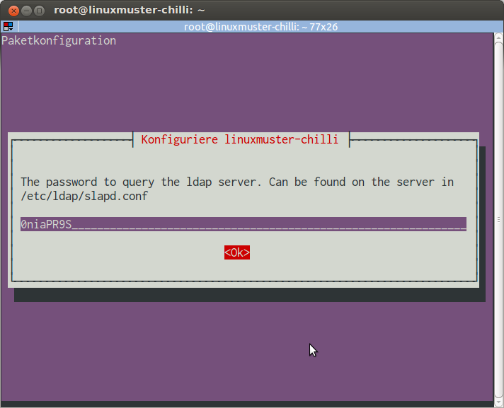
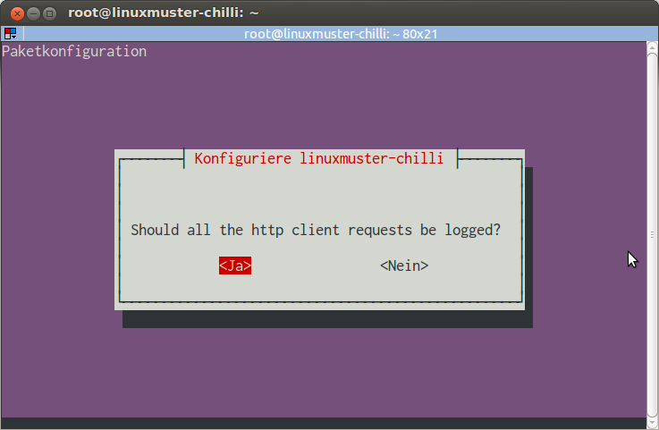

Konfiguration von linuxmuster-chilli
====================================

Unabhängig davon, ob man den CoovaChilli-Server selbst auf einer
Ubuntu-Basis installiert hat oder die virtuelle Appliance für Virtualbox
nutzt, kann man mit dem Befehl

.. code-block:: console

   # dpkg-reconfigure linuxmuster-chilli

das Paket für die eigenen Bedürfnisse konfigurieren. Dieser Vorgang
wird auch durch den Befehl linuxmuster-chilli-turnkey` ausgelöst, der
die virtuelle Appliance personalisiert.

Nachfolgend werden die Schritte der Konfiguration erklärt.

Schrittweise Konfiguration
--------------------------

Adresse des LDAP-Servers
~~~~~~~~~~~~~~~~~~~~~~~~

Zunächst muss die Adresse des LDAP-Servers angegeben werden. Der genaue
Wert hängt davon ab, welches der Szenarien für den Einsatz des Captive
Portals zur Anwendung kommt:

- Zugang zum grünen Netz: Interne IP-Adresse des Servers

- Zugang zum blauen Netz: Interne IP-Adresse des Servers

- Zugang zum roten Netz bzw. direkt ins Internet: Adresse oder
  DynDNS-Name der roten Schnittstelle des IPFire, Portweiterleitung
  für LDAPs (Port 636) von Rot nach Server-IP Grün muss aktiviert
  sein.

.. figure:: media/chillispot-root_linuxmuster-chilli_060.png
   :align: center
   :alt: Eingabe der IP-Adresse des LDAP-Servers

LDAP Suchbasis
~~~~~~~~~~~~~~

Hier muss die LDAP Suchbasis des Schulservers angegeben werden,
standardmäßig ``dc=linuxmuster-net,dc=lokal``. Diese kann auf dem
Schulserver durch den Befehl ``grep basedn
/var/lib/linuxmuster/network.settings`` ermittelt werden.

.. figure:: media/chillispot-root_linuxmuster-chilli_061.png
   :align: center
   :alt: Eingabe der Suchbasis für den LDAP-Server

Passwort für den LDAP Server
~~~~~~~~~~~~~~~~~~~~~~~~~~~~

Hier muss das Passwort zur Abfrage des LDAP Servers eingegeben werden.
Dieses kann auf dem Schulserver durch den Befehl ``grep rootpw
/etc/ldap/slapd.conf`` ermittelt werden.

Netzwerkbereich/Netzmaske für die Clientseite des Hotspot-Servers
~~~~~~~~~~~~~~~~~~~~~~~~~~~~~~~~~~~~~~~~~~~~~~~~~~~~~~~~~~~~~~~~~

Hier muss ein privates Netzwerksegment angegeben werden. Wenn sich der
CoovaChilli-Server im grünen oder blauen Netz befindet, dann kann die
Vorgabe mit einem 192.168.x.x Netzwerk einfach übernommen werden. Wenn
das dem Internet zugewandte Interface des CoovaChilli-Servers sich
selbst in einem 192.168.x.x Netzwerk befindet (z.B. wenn es am roten
Netz hängt), muss ein anderes privates Netz genommen werden.

.. figure:: media/chillispot-root_linuxmuster-chilli_063.png
   :align: center
   :alt: Eingabe des Netzwerks für die WLAN-Clients

Die Netzmaske für das Clientnetzwerk. Der Standard stellt 255x255
Adressen für Clients zur Verfügung das sollte reichen.

.. figure:: media/chillispot-root_linuxmuster-chilli_064.png
   :align: center
   :alt: Eingabe der Netzmaske für die WLAN-Clients

Nameserver
~~~~~~~~~~

Hier sollten wenn möglich zwei Nameserver angegeben werden, die vom
CoovaChilli-Server zur Adressauflösung verwendet werden. Die Werte
hängen vom Anwendungsfall für den Hotspot ab. Man kann hier auch die
Blaue IP des IPFire eintragen (z.B. 172.16.16.254). Gegebenenfalls
muss aber in der Firewall noch zusätzlich eine Durchlassen-Regel zum
DNS-Port 53 erstellt werden.

.. figure:: media/chillispot-coovaadmin_linuxmuster-chilli_082.png
   :align: center
   :alt: Eingabe der Netzmaske für die WLAN-Clients

Zugangsgruppen
~~~~~~~~~~~~~~

Nur die Mitglieder dieser Systemgruppen auf den Schulserver erhalten
Zugang zum Internet. Mehrere Gruppen werden durch ein Leerzeichen
getrennt.

.. figure:: media/chillispot-root_linuxmuster-chilli_067.png
   :align: center
   :alt: Eingabe der Systemgruppen mit permanentem Zugang zum Internet

Autologout
~~~~~~~~~~

Nach welcher Zeit in Sekunden soll ein Client bei *Untätigkeit*
automatisch abgemeldet werden? Dieser Wert wird in die
Konfigurationsoption HS_DEFIDLETIMEOUT von CoovaChilli übernommen. Ein
harter Logout, unabhängig von der Nutzeraktivität, der durch den
Parameter HS_DEFSESSIONTIMEOUT festgelegt wird, wird durch die
Konfiguration von linuxmuster-chilli nicht gesetzt, dies kann bei Bedarf
manuell an anderer Stelle erfolgen.

.. figure:: media/chillispot-coovaadmin_linuxmuster-chilli_083.png
   :align: center
   :alt: Eingabe der Zeit bis zum automatischen Logout

Logging
~~~~~~~

Sollen alle Seitenaufrufe von der Clientseite aus für 30 Tage mitgeloggt
werden? Auswahl *ja* oder *nein*. Der Datenschutz ist zu beachten.
Werden die Adressen geloggt, müssen die Nutzer darüber informiert werden
und dem zustimmen.

Freie Domains
~~~~~~~~~~~~~

Diese Domains können ohne Anmeldung angesurft werden. Mehrere Domains
durch Komma trennen.

.. figure:: media/chillispot-root_linuxmuster-chilli_068.png
   :align: center

Überschrift der Anmeldeseite
~~~~~~~~~~~~~~~~~~~~~~~~~~~~

.. figure:: media/chillispot-root_linuxmuster-chilli_069.png
   :align: center

SSL Zertifikat
~~~~~~~~~~~~~~

Hier gibt man den Hostnamen ein, den der Server bei der Installation des
Grundsystems erhalten hat.

.. figure:: media/chillispot-root_linuxmuster-chilli_066.png
   :align: center

Konfigurationsänderung
----------------------

Die Konfiguration kann jederzeit durch Aufruf des Befehls

.. code-block:: console
   
   # dpkg-reconfigure linuxmuster-chilli 

geändert werden, dabei werden die oben mit Screenshots beschriebenen
Schritte erneut durchlaufen, die zuletzt vorgenommenen
Konfigurationseinträge werden dabei als Vorgaben verwendet. Man fängt
also stets bei seiner letzten Konfiguration an.

Logging
-------

Der Hotspot loggt alle Anmeldungen und Seitenaufrufe in den Dateien:

.. code-block:: console
   
   /var/log/linuxmuster-chilli/coova-chilli.log  # Anmeldungen und chilli-bezogene Meldungen  
   /var/log/linuxmuster-chilli/ffproxy.log       # Seitenaufrufe

Die Logs werden täglich rotiert, Logs werden 30 Tage aufbewahrt und dann
gelöscht.

Erweiterte Optionen für CoovaChilli
-----------------------------------

In der Datei ``/etc/chilli/userconf`` können eigene Optionen für
CoovaChilli festgelegt werden. Die dort definierten Werte überschreiben
bzw. ergänzen diejenigen aus der Paketkonfiguration von
*linuxmuster-chilli*

Beispiel: Eine Datei ''/etc/chilli/userconf'' mit dem folgenden Inhalt,
würde eine Clientsession unabhängig von der Aktivität des Benutzers nach
900 Sekunden beenden, so dass sich der Nutzer neu anmelden muss:

.. code-block:: console
   
   # Wenn im Radius kein Session Timeout definiert wurde, wann fliegt der Hotspot User wieder raus
   HS_DEFSESSIONTIMEOUT=900 # In Sekunden

