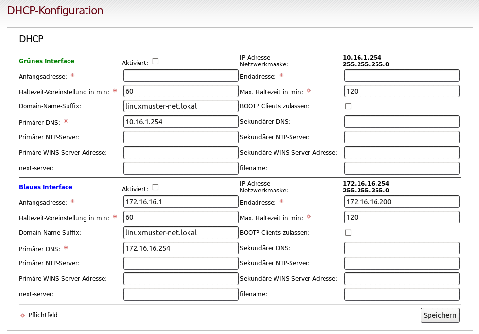
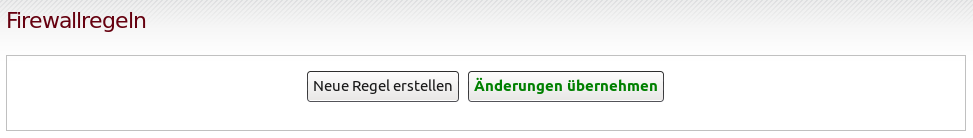

================
 Vorbereitungen
================

Verschiedene Einsatzszenarien
=============================

Mit Hilfe von linuxmuster-chilli kann der Netzwerkzugang von
mitgebrachten Geräten über das grüne, das blaue oder das rote
Netzwerk erfolgen. (Es gibt noch mehr Möglichkeiten, aber diese
drei sollten die häufigsten Anwendungsfälle abdecken...)

Die Firewall IPFire bietet verschiedene Netze mit unterschiedlichen
Vertrauensstellungen an, lesen Sie dazu die :ref:`net-infrastructure-label`.

Zugang über das blaue Netz des IPFire
-------------------------------------

Das blaue Netzwerk wird überlicherweise für genau diese Aufgabe
verwendet: Ein logisch getrenntes Netzwerk zu haben, dem zunächst nicht
vertraut wird.

**Vorteile:**

-  Kontrolle des Internetzugangs mit Hilfe des IPFire möglich
-  Eine Lücke im Hotspot-System kann das grüne Netz nicht exponieren.

**Nachteile:**

-  Nach der Anmeldung ist der Client nicht im grünen Netz (kein Drucken,
   kein Home- oder Tausch-Verzeichnis).

.. figure:: media/chillispot-coova_blue.png
   :align: center
   :alt: Einsatz eines Coova im blauen Netz

Zugang über das grüne Netz des IPFire
-------------------------------------

**Vorteile:**

-  Nach der Anmeldung stehen alle Dienste im grünen Netz zur Verfügung
-  Kontrolle des Internetzugangs mit Hilfe des IPFire möglich

**Nachteile:**

-  Nach der Anmeldung ist der Client im grünen Netz: Eine Lücke im
   Hotspot-System kann das grüne Netz exponieren.

.. figure:: media/chillispot-coova_green.png
   :align: center
   :alt: Einsatz eines Coova im grünen Netz

Zugang im roten Netz des IPFire (Direktzugang)
----------------------------------------------

**Vorteile:**

-  Kontrolle des Internetzugangs mit Hilfe des IPFire möglich
-  Eine Lücke im Hotspot-System kann das grüne Netz nicht exponieren.
-  Für die Anwender sind nur zwei Fälle zu dokumentieren: Am
   Schulrechner/am privaten Gerät.

**Nachteile:**

-  Eine Lücke im Hotspot-System kann zu freiem Internetzugriff führen.
-  Nach der Anmeldung ist der Client nicht im grünen Netz (kein Drucken,
   kein Home- oder Tausch-Verzeichnis).

.. figure:: media/chillispot-coova_red.png
   :align: center
   :alt: Einsatz eines Coova im roten Netz

Je nach gewähltem Szenario müssen entsprechende Einstellungen am
IPFire vorgenommen werden.  Im folgenden wird der Einsatz im blauen
Netzwerk ausführlich dokumentiert. 

IPFire-Konfiguration für den Einsatz im blauen Netz
===================================================

Als Vorbereitung auf die Installation eines CoovaChilli-Servers müssen
das Netzwerk richtig verkabelt werden und der IPFire vorkonfiguriert
werden. Melden Sie sich dazu am IPFire an. Folgende Situation muss
erreicht werden:

- Nur das externe Interface (im folgenden Netzdiagramm dunkelblau) des
  CoovaChilli-Servers muss sich im blauen Netzwerk des IPFire
  befinden.  (Bei Virtualisierung kann diese Verbindung rein virtuell
  erfolgen).

- Der CoovaChilli-Server muss am IPFire mit diesem Interface für den
  "Zugriff auf Blau" freigeschaltet sein.

- Es muss eine Weiterleitung für LDAPs konfiguriert werden, so dass der
  CoovaChilli-Server den im grünen Netz stehenden
  linuxmuster.net-Server erreichen kann.

- Eine zweiten Netzwerkverbindung (mit physikalischer Anbindung bei
  Virtualisierung), an der dann die Access-Points hängen, muss
  geschaffen werden. Das WLAN-Interface (in den oberen Skizze
  hellblau, im Netzdiagramm unten lila) wird nach Installation mit den
  Accesspoints oder frei zugänglichen Netzwerkdosen verbunden.

Die Netzverkabelung versteht man am Besten beim Betrachten eines
Beispiels eines CoovaChilli hier in einer virtualisierten Umgebung:

.. figure:: media/coova-virt.jpg
   :align: center
   :alt: Einsatz eines Coova in einer virtualisierten Umgebung

.. important:: 

   Die folgenden Bilder zeigen wie im obigen Beispiel
   die Einstellungen für einen linuxmuster.net-Server im IP Bereich
   10.16.*.* und dementsprechend einem blauen Netz 172.16.16.*.
   Gegebenenfalls muss das der eigenen Situation angepasst werden, z.B. auf
   10.32.*.* und 172.16.32.*.
   
   Darüberhinaus ist für den Endnutzer der Bereich 192.168.99.1 bis
   192.168.99.255 vorgesehen. Hier kann jedes beliebige andere
   private, außer den bereits verwendeten, Subnetzwerk verwendet
   werden.  Die jeweils richtigen IPs sind aber in der Regel bei den
   Dialogen schon voreingestellt.

1. DHCP-Server
--------------

Zunächst sollte sichergestellt sein, dass der DHCP Server für das
blaue Interface läuft. Das ist insbesondere dann sinnvoll, wenn man
neben dem CoovaChilli-Server noch weitere Clients im blauen Netzwerk
hat, z.B. Schulcomputer die ohne Zugangsüberprüfung Netzwerkzugang
haben sollen. Dies überprüft man im Menü des IPFire unter `Netzwerk
-> DHCP-Server`:

Man setzt den Haken bei "Aktiviert" und speichere.  Ist der
CoovaChilli-Server der einzige Rechner im blauen Netzwerk, ist man
fertig. Gibt es weitere Computer, ist es ratsam dem CoovaChilli die
erste IP-Adresse fest zu vergeben und die Anfangsadresse auf
`172.16.16.2` zu setzen.

2. Zugriff auf Blau
-------------------

Dann wechselt man auf die Seite `Firewall -> Zugriff auf Blau` und
fügt dort die "externe" Schnittstelle/MAC des CoovaChilli-Servers hinzu.

-  Quell-IP-Adresse: 172.16.16.1
-  MAC-Adresse: xx:xx:xx:xx:xx:xx
-  Anmerkung: coovachilli
-  Aktiviert: Ja

.. figure:: media/chillispot-ipfire-chilli-blau.png
   :align: center
   :alt: CoovaChilli im blauen Netz fest zuordnen

3. Zugriff von Blau auf LDAPs zulassen
--------------------------------------

Zuletzt muss das DMZ Schlupfloch gebohrt werden, dazu wechselt man auf
die Seite `Firewall -> Firewallregeln` und fügt eine neue Regel ein.

-  Quelle: Standard-Netzwerk Blau
-  Zieladresse: linuxmuster.net Server-IP (10.16.1.1 oder 10.32.1.1 oder
   ...)
-  Protokoll TCP, Quellport: leer, Zielport 636 für LDAPs
-  Anmerkung, damit man weiß, was man gemacht hat
-  Logging: optional

.. figure:: media/chillispot-ipfire-chilli-ldaps.png
   :align: center
   :alt: Zugriff von Blau auf LDAPs zulassen

Schließlich **"Hinzufügen"** und anschließend auch noch **"Änderungen
übernehmen"** nicht vergessen!

4. Weitere Dienste erlauben
---------------------------

Unter `Firewall -> Firewallregeln` müssen die zusätzlichen Dienste,
die aus dem blauen Netz erlaubt werden sollen, freigeschaltet werden.

Im Beispiel unten wurde für das Protokoll `https` auf den Ports 443
(Webserver), 242 (Schulkonsole) und 631 (Cups-Druckerserver) und für
das Protokoll `ping` je eine Regel hinzugefügt. Für `ping` muss als
Protokoll-Typ `ICMP` ausgewählt werden.

.. figure:: media/chillispot-ipfire-additionalrules.png
   :align: center
   :alt: Weitere Dienste erlauben

Der Zugriff auf den IPFire-DNS-Server muss nicht extra erlaubt werden,
auf einen anderen DNS-Server (z.B. Google - 8.8.8.8) jedoch schon.

5. Advanced Proxy für Blau aktivieren
-------------------------------------

Im Menü `Netzwerk -> Webproxy` sollte für das blaue Netz der
transparente Proxy wie im grünen Netz aktiviert sein. Der Zugriff auf
den Proxy muss in der Firewall **nicht** freigeschaltet werden.

.. figure:: media/chillispot-ipfire-chilli-proxy.png
   :align: center
   :alt: Advanced Proxy für das blaue Netz aktivieren

