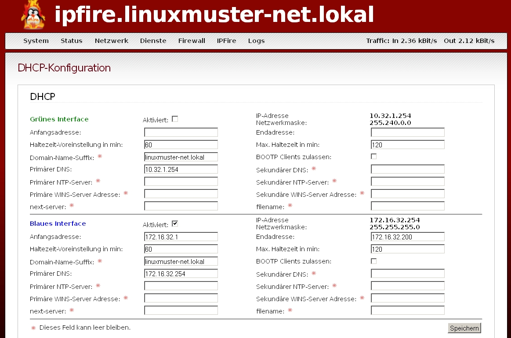
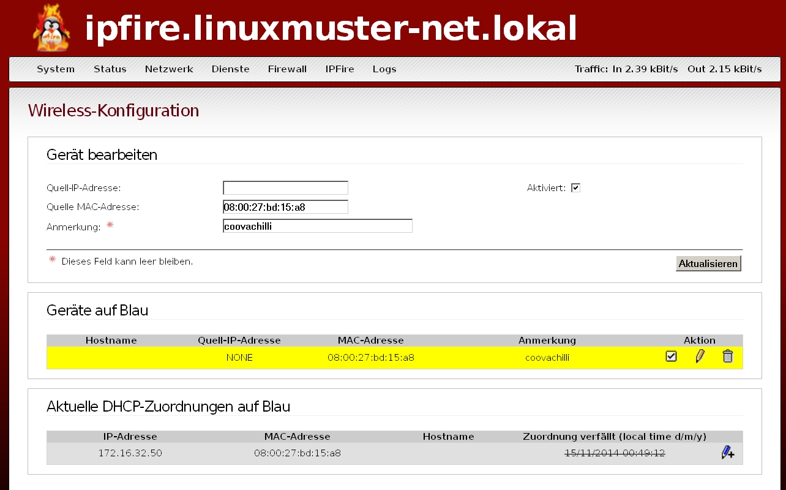
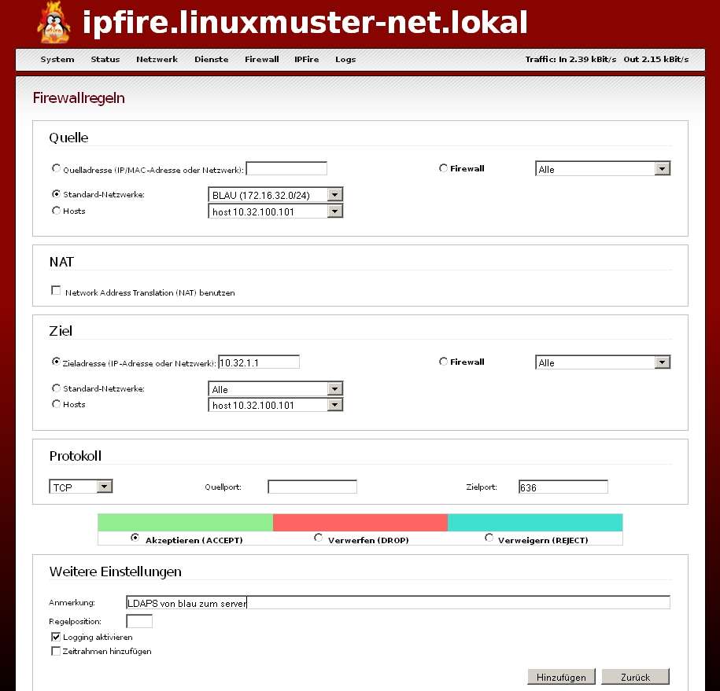
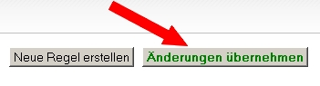
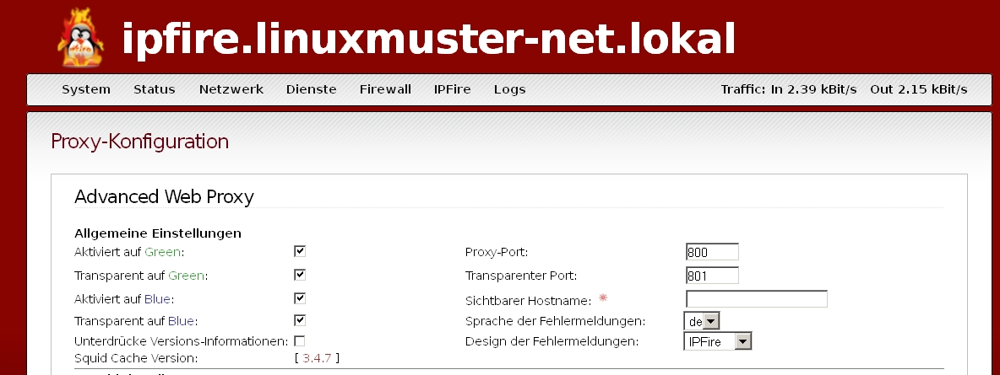
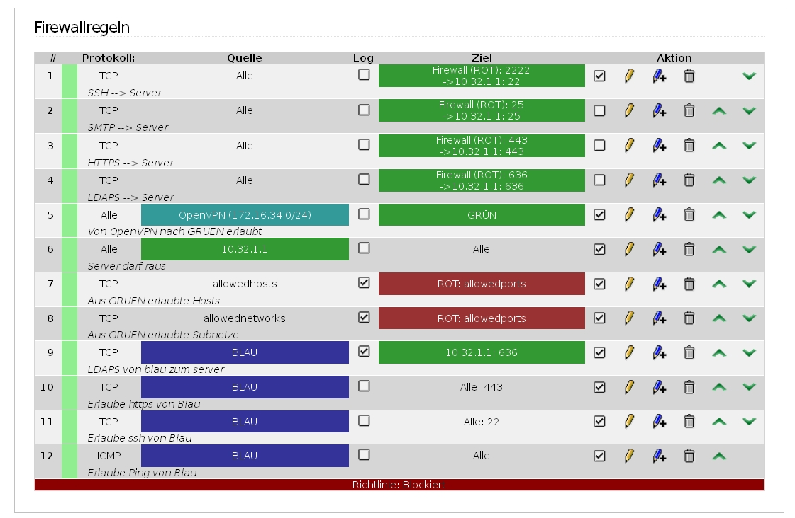

================
 Vorbereitungen
================

Einsatzszenarien
================

Mit Hilfe von linuxmuster-chilli kann der Netzwerkzugang von
mitgebrachten Geräten über das grüne, das blaue oder das rote
Netzwerkinterface erfolgen. (Es gibt noch mehr Möglichkeiten, aber diese
drei sollten die häufigsten Anwendungsfälle abdecken...)

Die Firewall IPFire bietet verschiedene Netze mit unterschiedlichen
Vertrauensstellungen an, siehe
`..preparation:networktopology <..preparation/networktopology>`__.

Zugang über das blaue Netz des IPFire
-------------------------------------

Das blaue Netzwerk wird überlicherweise für genau diese Aufgabe
verwendet: Ein logisch getrenntes Netzwerk zu haben, dem zunächst nicht
vertraut wird.

**Vorteile:**

-  Kontrolle des Internetzugangs mit Hilfe des IPFire möglich

-  Eine Lücke im Hotspot-System kann das grüne Netz nicht exponieren.

**Nachteile:**

-  Nach der Anmeldung ist der Client nicht im grünen Netz (kein Drucken,
   kein Home- oder Tausch-Verzeichnis).

.. figure:: media/chillispot-coova_blue.png
   :align: center
   :alt: Einsatz eines Coova im blauen Netz

Zugang über das grüne Netz des IPFire
-------------------------------------

**Vorteile:**

-  Nach der Anmeldung stehen alle Dienste im grünen Netz zur Verfügung

-  Kontrolle des Internetzugangs mit Hilfe des IPFire möglich

**Nachteile:**

-  Nach der Anmeldung ist der Client im grünen Netz: Eine Lücke im
   Hotspot-System kann das grüne Netz exponieren.

.. figure:: media/chillispot-coova_green.png
   :align: center
   :alt: Einsatz eines Coova im grünen Netz

Zugang im roten Netz des IPFire (Direktzugang)
----------------------------------------------

**Vorteile:**

-  Kontrolle des Internetzugangs mit Hilfe des IPFire möglich

-  Eine Lücke im Hotspot-System kann das grüne Netz nicht exponieren.

-  Für die Anwender sind nur zwei Fälle zu dokumentieren: Am
   Schulrechner/am privaten Gerät.

**Nachteile:**

-  Eine Lücke im Hotspot-System kann zu freiem Internetzugriff führen.

-  Nach der Anmeldung ist der Client nicht im grünen Netz (kein Drucken,
   kein Home- oder Tausch-Verzeichnis).

.. figure:: media/chillispot-coova_red.png
   :align: center
   :alt: Einsatz eines Coova im roten Netz

Je nach gewähltem Szenario müssen entsprechende Einstellungen am IPFire
vorgenommen werden. 

IPFire-Konfiguration für den Einsatz im blauen Netz
===================================================

Als Vorbereitung auf die Installation eines CoovaChilli-Servers müssen
das Netzwerk richtig verkabelt werden und der IPFire vorkonfiguriert
werden. Folgende Situation muss erreicht werden:

-  Nur das externe Interface (in der Skizze dunkelblau) des
   CoovaChilli-Servers muss sich im blauen Netzwerk des IPFire befinden.
   (Bei Virtualisierung kann diese Verbindung rein virtuell erfolgen).

-  Der CoovaChilli-Server muss am IPFire mit diesem Interface für den
   "Zugriff auf Blau" freigeschaltet sein.

-  Es muss eine Weiterleitung für LDAPs konfiguriert werden, so dass der
   CoovaChilli-Server den im grünen Netz stehenden
   linuxmuster.net-Server erreichen kann.

-  Eine zweiten Netzwerkverbindung (mit physikalischer Anbindung bei
   Virtualisierung), an der dann die Access-Points hängen, muss
   geschaffen werden. Das WLAN-Interface (in der oberen Skizze hellblau,
   im Netzdiagramm unten lila) wird nach Installation mit den
   Accesspoints oder frei zugänglichen Netzwerkdosen verbunden.

Die Netzverkabelung versteht man am besten beim Betrachten eines
Beispiels eines CoovaChilli in einer virtualisierten Umgebung:

.. figure:: media/coova-virt.jpg
   :align: center
   :alt: Einsatz eines Coova in einer virtualisierten Umgebung

.. important:: 

   Die folgenden Bilder zeigen wie im obigen Beispiel
   die Einstellungen für einen linuxmuster.net-Server im IP Bereich
   10.16.*.* und dementsprechend einem blauen Netz 172.16.16.*.
   Gegebenenfalls muss das der eigenen Situation angepasst werden, z.B. auf
   10.32.*.* und 172.16.32.*.

Die jeweils richtigen IPs sind aber in der Regel bei den Dialogen schon
voreingestellt.

1. DHCP-Server
--------------

Zunächst sollte sichergestellt sein, dass der DHCP Server für das blaue
Interface läuft. Dies überprüft man im Menü ''Netzwerk -> DHCP-Server'':

2. Zugriff auf Blau
-------------------

Dann wechselt man auf die Seite ''Firewall -> Zugriff auf Blau'' und
fügt dort die "externe" Schnittstelle/MAC des Coovachilli Servers hinzu

-  Quell IP-Adresse: leer

-  MAC Adresse: Vom Coovachilli Server

-  Anmerkung: ...

-  Aktiviert: Ja

3. Zugriff von Blau auf LDAPs zulassen
--------------------------------------

Zuletzt muss das DMZ Schlupfloch gebohrt werden, dazu wechselt man auf
die Seite ''Firewall -> Firewallregeln'' und fügt eine neue Regel ein.

-  Quelle: Standard-Netzwerk Blau

-  Zieladresse: linuxmuster.net Server-IP (10.16.1.1 oder 10.32.1.1 oder
   ...)

-  Protokoll TCP, Quellport: leer, Zielport 636 für LDAPs

-  Anmerkung, damit man weiß, was man gemacht hat

-  Logging: optional

Schließlich **"Hinzufügen"** und anschließend auch noch **"Änderungen
übernehmen"** nicht vergessen!

4. Advanced Proxy für Blau aktivieren
-------------------------------------

Im Menü ''Netzwerk -> Webproxy'' sollte für Blau der transparente Proxy
wie im grünen Netz aktiviert sein. Der Zugriff auf den Proxy muss in der
Firewall **nicht** freigeschaltet werden.

5. Erlaubte Dienste
-------------------

Unter ''Firewall -> Firewallregeln'' müssen die Dienste, die aus dem
blauen Netz erlaubt werden sollen, freigeschaltet werden.

Für https, ssh und ping Regeln 10 bis 12 hinzufügen. Für Ping als
Protokoll "ICMP" auswählen.

Der Zugriff auf den IPFire-DNS-Server muss nicht extra erlaubt werden,
auf einen anderen DNS-Server (z.B. Google - 8.8.8.8) jedoch schon.

Netzwerkkonfiguration auf dem Coovachilli-Server
------------------------------------------------

FIXME: Diese Zeilen gehören zur Konfigurationsseite

Wenn der Coovachilli Server (was sinnvoll ist) der einzige Rechner im
blauen Netz ist, kann man die Schnittstellenkonfiguration problemlos dem
DHCP Server überlassen. Die Datei ''/etc/network/interfaces'' auf dem
coovachilli Server sieht dann folgendermaßen aus:

::

    # This file describes the network ...
    # and how to activate them. For more information, see interfaces(5).
    #

    # The loopback network 
    auto lo
    iface lo inet loopback

    # These interfaces are brought up automatically
    auto eth0
    iface eth0 inet dhcp

Vorbereitung des Hotspot-Servers
================================

Für den Hotspot-Server selbst benötigen Sie einen Server/PC oder eine
virtuelle Maschine mit zwei Netzwerkkarten. Wir empfehlen den Betrieb
als virtuelle Maschine, eine entsprechend vorkonfigurierte Appliance
finden Sie unter `Appliance Download <chillispot-vboxappliance>`__.
