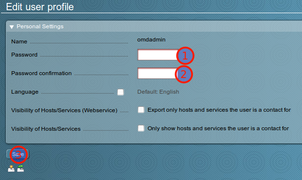
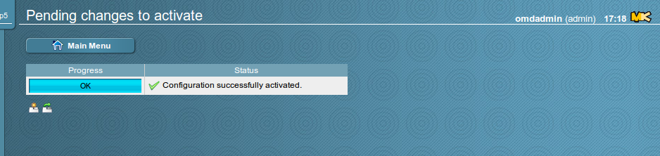
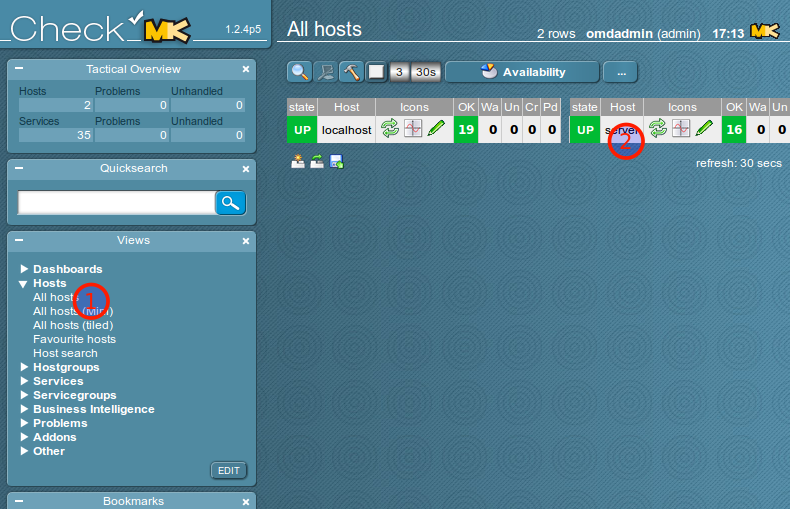
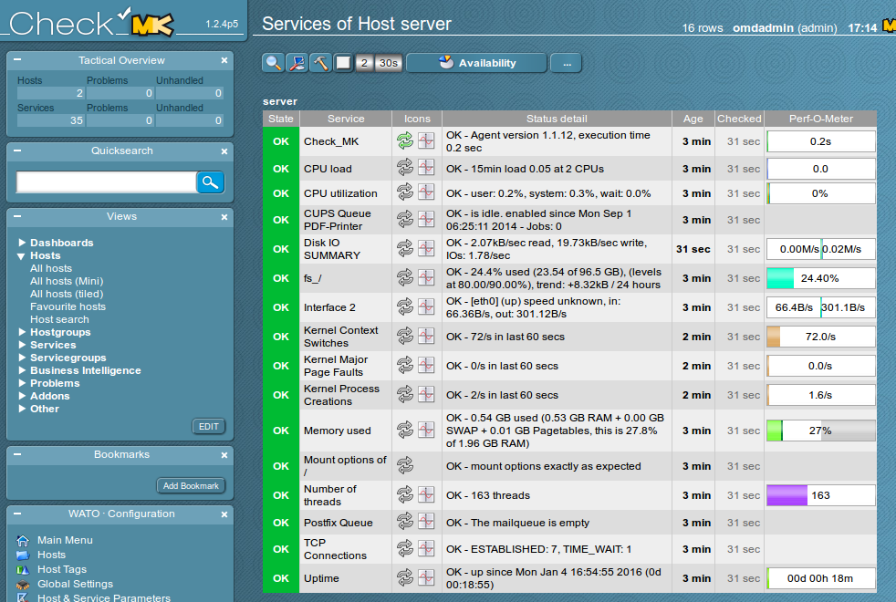

Hinzufügen des Servers zu OMD/check_mk
======================================

Im letzten Schritt muss der vorbereitete Server im Webinterface von OMD/check_mk aufgenommen werden.

Anmeldung am Check_MK Webinterface des MoniPi
---------------------------------------------

Melden Sie sich am Webinterface unter der Adresse ``https://<ip-des-monipi>/default/`` mit den folgenden Zugangsdaten an:

- Benutzername: omdadmin
- Passwort: omd

Die Zertifikatswarnung müssen Sie ignorieren (die Verbindung wird mit einem debian-Snake-Oil-Zertifikat verschlüsselt).

.. figure:: media/wato01.png
   :alt: Anmeldung am Webinterface

Anschließend sollten Sie auf das Webinterface von Check_MK weitergeleitet werden.

.. figure:: media/wato02.png
   :alt: Check_MK Webinterface

Ändern des Passworts
--------------------

.. attention:: Ändern Sie unbedingt als erstes das Passwort für den administrativen Benutzer des Webinterfaces.

Klicken Sie zunächst auf das Werkzeugsymol in der linken unteren Ecke des Webinterfaces.

.. figure:: media/wato04.png
   :alt: Persönliche Einstellungen öffnen

Geben Sie in der nächsten Maske zweimal ein neues Passwort ein und übernehmen Sie es mit Klick auf "Save".

Einrichtung des linuxmuster.net Servers als weiteren Host
---------------------------------------------------------
Wählen Sie in der Box "Wato-Configuration" links unten den Bereich "Hosts" aus, um zur Hostliste zu gelangen.

.. figure:: media/wato03.png
   :alt: Wato: Hosts

Legen Sie durch Klick auf "New Host" einen neuen Host an.

.. figure:: media/newhost01.png
   :alt: Hostliste, "New Host"

Geben Sie einen Hostnamen ein, den das zu überwachende System im Check-MK-Webinterface haben soll, machen Sie das Häkchen bei ``IP address`` und geben Sie die IP-Adresse des Servers ein. Schließen Sie den Vorgang mit einem Klick auf ``Save & go to Services`` ab.

.. figure:: media/newhost02.png
   :alt: Konfiguration des neuen Hosts

Wenn der Server unter der angegebenen IP-Adresse auf Port 6556 erreichbar ist, werden die überwachten Dienste des Servers angezeigt, die die automatische Inventarisierung auf dem Server finden konnte.

Übernehmen Sie diese Dienste mit einem Klick auf ``Automatic Refresh (Tabula Rasa)``.

.. figure:: media/newhost02a.png
   :alt: Automatische Inventarisierung des neuen Hosts

Das Webinterface springt zurück zur Hostliste und zeigt oben in Orange, dass es ungespeicherte Änderungen gibt. Klicken Sie auf den orangenen Button.

.. figure:: media/newhost03.png
   :alt: Hostliste mit ungespeicherten Änderungen

Die ungespeicherten Änderungen werden angezeigt, übernehmen Sie diese mit einem Klick auf ``Activate Changes`` ins System.

.. figure:: media/newhost04.png
   :alt: Liste der Änderungen

Die Änderungen werden übernommen.

Nun taucht der Server in der Hostliste der überwachten Systeme auf, wenn man im Menü ``Views`` den Punkt ``Hosts`` -> ``All Hosts`` öffnet. Durch einen Klick auf den Servernamen gelangt man zur Übersicht der überwachten Dienste.

