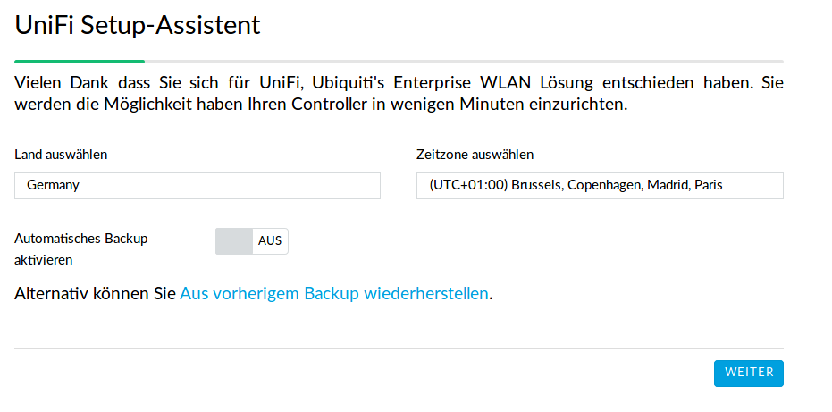
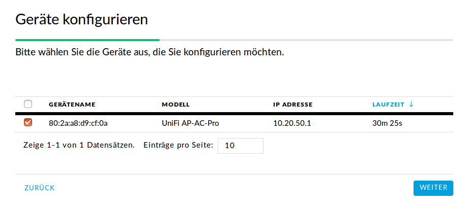
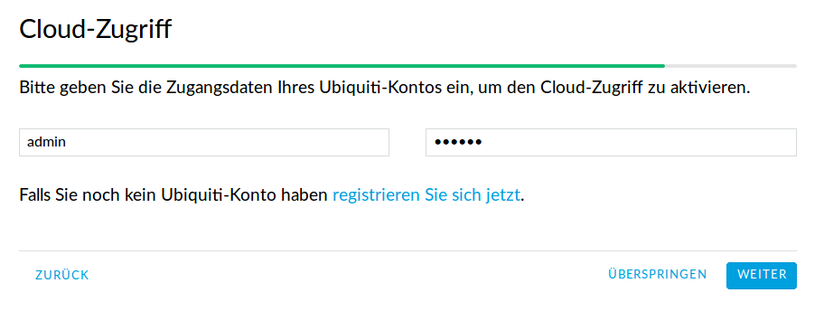
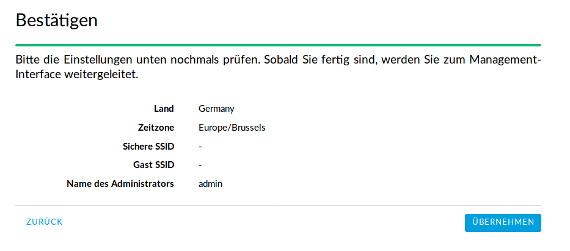

Die Grundkonfiguration
======================

Hier werden die Standardsprache sowie der Adminaccount gewählt und es können die APs aufgenommen werden.

Schritt für Schritt
-------------------

Öffnen Sie von einem Rechner im Schulnetz mit einem Browser `<https://unifi:8443>`_ (falls der Unificontroller in der Datei `workstations` unifi heißt).

Da der Unifi-Kontroller mit einem selbstzertifizierten Zertifikat arbeitet, werden Sie eine Zertifikatswarnung erhalten. 

Wählen Sie Germany als Land und klicken Sie auf `weiter`.

Wählen Sie die Geräte aus, die Sie mit dem Unifi-Kontroller managen wollen (also alle) und klicken auf `WEITER`.

.. figure:: media/u09.png
   :alt: SSID einrichten

An dieser Stelle überspringen Sie die Einrichtung eines WLANs. Das wird später ausführlich beschrieben.

.. figure:: media/u10.png
   :alt: admin

An dieser Stelle wird ein Administrator-Zugang angelegt.

Überspringen Sie auch diesen Schritt.

Bestätigen Sie schließlich Ihre Einstellungen.

