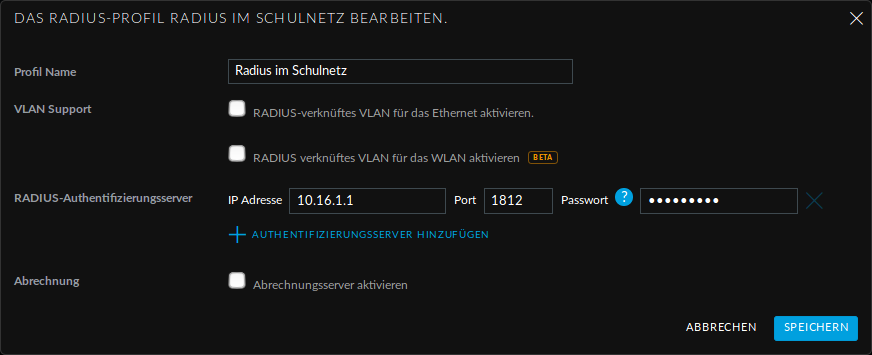

Einrichtung des Schüler-WLANs
=============================

Im Schüler-WLAN sind die Geräte der Schüler. Es liegt im blauen Netz des IPFire. Der Netzwerk-Schlüssel des Schüler-WLANs basiert auf ihrem Benutzernamen und ihrem Kennwort.

Schritt für Schritt
-------------------

Installieren Sie auf dem linuxmuster.net-Server das Paket linuxmuster-freeradius. Siehe :ref:`linuxmuster-freeradius-label`

Melden Sie sich am Unifi-Kontroller an `<https://unifi:8443>`_.

Gehen Sie zu `Einstellungen` -> `Profile` -> `NEUES RADIUS-PROFIL ERSTELLEN`.

Geben Sie dem neuen Radius-Profil einen Namen.

Tragen Sie bei `Radius-Authentifikationsserver` die IP-Adresse des linuxmuster.net-Servers und das Passwort für die APs ein.

Speichern Sie die Einstellungen.

Gehen Sie zu `Einstellungen` -> `Drahtlose-Netzwerke` -> `NEUES DRAHTLOSES NETZWERK HINZUFÜGEN`.

.. figure:: media/u16.png
   :alt: Schülernetz

Geben Sie dem Schüler-WLAN einen Namen.

Sicherheit ist `WPA Enterprise`.

Wählen Sie das vorher definierte Radius-Profil.

Da das blaue Netz des IPFire als getaggtes VLAN mit der VLAN-ID 10 zu den APs kommt, setzen Sie ein Häkchen bei VLAN und geben die VLAN-ID 10 ein.

Speichern Sie die Enstellungen.

Das Schüler-WLAN wird jetzt an die APs ausgerollt.

