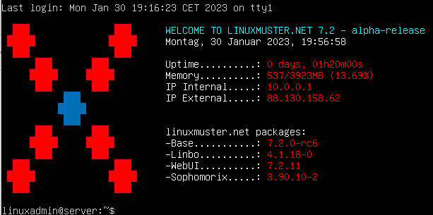

.. include:: ../../guided-inst.subst

.. _beta-lmn72-label:

===========================
B E T A: Update auf lmn 7.2
===========================

.. sectionauthor:: `@cweikl <https://ask.linuxmuster.net/u/cweikl>`_ 

.. attention::

   Die Version linuxmuster.net 7.2 ist noch im Beta-Stadium und n i c h t für den produktiven Einsatz geeignet.

Die Version linuxmuster.net 7.2 bringt

    - volle Unterstützung von Ubuntu 22.04 LTS
    - Linbo 4.1 mit einem akuellen Linux-Kernel 6.1.* und einem nativen NTFS-Kernel Treiber
    - Linbo 4.1: NEW - jetzt mit Option auch differentielle Images zu erstellen

Update auf lmn 7.2
------------------

Vorbereitungen
^^^^^^^^^^^^^^

1. Bringe zuerst den lmn7.1 Server auf den aktuellsten Paketstand.

Führe dazu in der Konsole folgende Befehle aus:

.. code::

   sudo apt update
   sudo apt dist-upgrade

2. Aktualisiere danach das Betriebssystem auf dem Server von Ubuntu 18.04 LTS auf die Version Ubuntu 20.04 LTS. Nutze dazu den Befehl ``do-release-upgrade``.

Gebe dazu auf der Server-Konsole ein:

.. code::

   linuxadmin@server:~$ sudo -i
   root@server:~$ do-release-upgrade

Nach der Überprüfung siehst Du, wieviele Pakete aktualisiert, neu installiert und gelöscht werden.
Bestätige den Vorgang zur Durchführung des Upgrades mit ``j``.

Während des Upgrades erhälst Du mehrere Nachfragen. Für einige Dienste (z.B. samba, ssh) wirst Du gefragt, ob die Konfigurationsdatei aktualisiert werden soll.

.. attention::

   Die Nachfrage zur Aktualisierung der Konfigurationsdateien für diese Dienste musst Du unbedingt mit ``N`` beantworten.

Zudem müssen nach der Installation einiger neuerer Bibliotheken einige Dineste neu gestartet werden. Diese werden Dir in einer Liste angezeigt. Bestätige deren Neustart mit ``OK``.

Danach wirst Du gefragt, ob Du die lokale Version bestimmter Dienste beibehalten möchtest. Beantworte dies jeweils mit ``Ja/OK``.

Nach der Aktualisierung der Pakete wirst Du gefragt, ob die alten Pakete entfernt werden sollen. Bestätige dies mit ``J``.

Danach wirst Du aufgefordert das System neu zu starten. Führe einen ``Reboot`` aus.

3. Aktualisiere danach das Betriebssystem auf dem Server von Ubuntu 20.04 LTS auf die nachfolgende Version Ubuntu 22.04 LTS. Nutze dazu den Befehl ``do-release-upgrade``.

Der weitere Ablauf ist identisch zu den unter 2.) beschriebenen Schritten.

4. Melde Dich nach dem Neustart des Servers an. Hast Du die aktuellsten Pakete, prüfe die Datei ``/usr/lib/linuxmuster-webui/etc/requirements.txt``. Dort sollte als Eintrag für ``crypthography`` stehen:

.. code::

   cryptography==39.0.1

Sollte dies so sein, fahre mit Schritt 5 fort. Falls nicht, aktualisiere zuerst wie unter 1.) beschrieben die installierten Pakete.

5. Führe die erneute Konfiguration der lmn-Pakete aus. Rufe dazu folgenden Befehl auf:

.. code::

   dpkg-reconfigure sophomorix-samba linuxmuster-base7 linuxmuster-webui7

6. Aktiviere das lmn71-Repository wieder, indem Du die Datei ``/etc/apt/sources.list.d/lmn71.list``
editierst und dort das während des Upgrades automatisch eingefügte Kommentarzeichen ``#`` entfernst.

Zudem oder alternativ findest Du die Datei ``/etc/apt/sources.list.d/lmn71.list.distUpgrade``, in der das Repository der lmn 7.1 auskommentiert ist.

7. Füge danach das Repository der lmn72 (Achtung: testing) wie folgt hinzu:

Importiere zuerst die Schlüsseldatei:

.. code::

   sudo wget -qO- "https://deb.linuxmuster.net/pub.gpg" | gpg --dearmour -o /usr/share/keyrings/linuxmuster.net.gpg

Füge danach das Linuxmuster 7.2 Testing-Repro hinzu:

.. code::

   sudo sh -c 'echo "deb [arch=amd64 signed-by=/usr/share/keyrings/linuxmuster.net.gpg] https://deb.linuxmuster.net/ lmn72 main" > /etc/apt/sources.list.d/lmn72.list'

Aktualisiere nun die Paketquellen:

.. code::

   sudo apt update

8. Aktualisiere die installierten Pakete und führe anschließend ein Reboot durch:

.. code:: 

   sudo apt dist-upgrade
   sudo reboot

9. Nach dem Neustart führe den Import der Geräte erneut aus:

.. code::

   sudo linuxmuster-import-devices

10. Starte nun die Clients neu. Du wirst zunächst noch die Version 4.0 von Linbo auf den Clients nach dem ersten Start sehen. Starte den Client ein zweites Mal und Linbo wird dann automatisch auf dem Client auf die Version 4.1 aktualisiert.

11. Synchronisiere das Betriebssystem und melde Dich danach mit einem Domänen-Benutzer an.

.. hint::

   Glückwunsch Dein System ist nun auf lmn 7.2 und Du kannst alle Neuerungen testen. Denke daran, dass die Version noch im Beta-Stadium ist. Bei Fragen oder Auffälligkeiten schaue unter https://ask.linuxmuster.net/t/lmn-7-2-testing/9732

