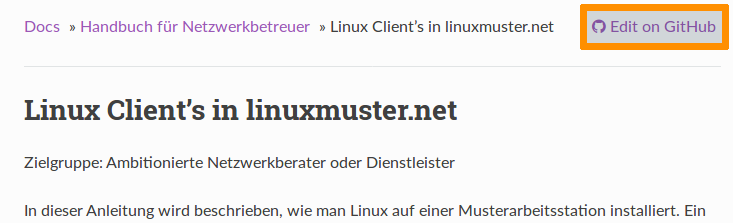

Dokumentation in GitHub ändern
------------------------------

Wenn Sie einen Fehler (Rechtschreibfehler, kleine inhaltliche Fehler, etc.) in der Dokumentation gefunden haben, klicken Sie einfach auf den "Edit on Github" Link am rechten oberen Rand jeder Dokumentationsseite.

Sie werden auf github.com geleitet. Mit einem Klick auf den Stift
(siehe Bild) können Sie das aktuelle Kapitel bearbeiten. Dafür müssen
Sie sich bei GitHub anmelden. Wenn Sie noch kein Konto bei Github
haben, können Sie sich `hier eines anlegen <https://github.com/join>`_
oder oben rechts auf "Sign up" klicken.

.. figure:: media/editChapter.png
   :align: center
   :alt: Edit not signed in

Die Dokumentation ist in der Auszeichnungssprache "rST" geschrieben. `Hier <http://docutils.sourceforge.net/docs/user/rst/quickref.html>`_ finden Sie einen guten Überblick über die am häufigsten verwendeten Elemente.

.. figure:: media/editsignedin.png
   :align: center
   :alt: Edit signed in

Im Beispiel wurde der Rechtschreibfehler und die Länge der zur
Überschrift gehörenden Unterschreichung geändert.

Nachdem du alle Änderungen vorgenommen hast, gib unten einen Titel und
einen Kommentar ein. Die Änderungen können nun mit einem Klick auf
"Propose file changes" eingereicht werden.

.. figure:: media/proposeChanges.png
   :align: center
   :alt: propose changes

Dein Änderungsvorschlag wird dann vom Dokumentationsteam geprüft und
gegebenenfalls übernommen. Sekunden später erscheint die Änderung dann
auch hier in der offiziellen Dokumentation.

.. hint:: Bitte beachten Sie auch unbedingt die :doc:`Leitlinien zur
   Dokumentation <guidelines>`, damit ihre Änderungen schnell
   eingepflegt werden könnnen!

Sollest du bereits Schreibrechte am Repositorium haben und bist dir
sicher, dass die Dokumentation durch deine Änderung nicht
beeinträchtigt wird, kannst du die Änderungen direkt einbauen
("Commit") oder im Zweifel einen Zweig und einen so genannten
Pull-Request erstellen.

.. figure:: media/commitchanges.png
   :align: center
   :alt: commit changes directly

Größere Änderungen an der Dokumentation sind immer über Pull-Requests
zu erstellen. Dafür ist es nützlich, lokal eine Kopie (fork)
vorzuhalten und Änderungen lokal zu testen, das im 
:doc:`entsprechenden Kapitel <new>` erklärt wird.
