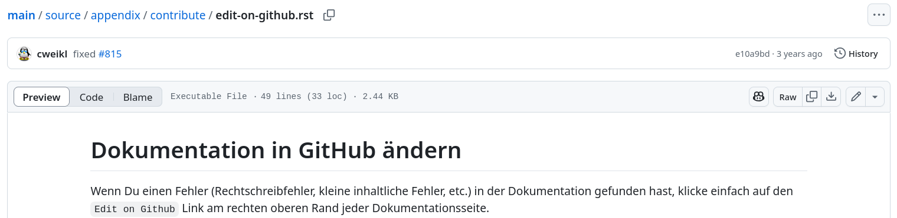
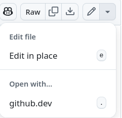
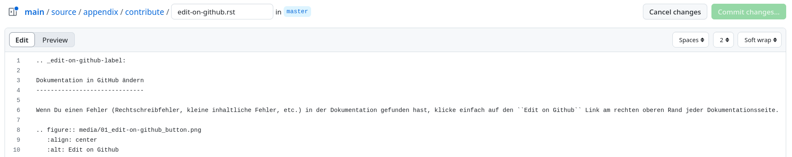
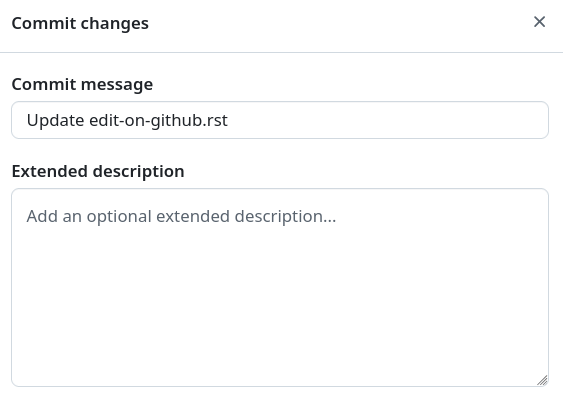

.. include:: /guided-inst.subst
.. _edit-on-github-label:

Dokumentation in GitHub ändern
------------------------------

Um Fehler etc. in der Dokumentation in GitHub ändern zu können, musst Du Dich zuerst in GitHub anmelden und das linuxmuster-docs repository auswählen.

Wenn Du einen Fehler (Rechtschreibfehler, kleine inhaltliche Fehler, etc.) in der Dokumentation gefunden hast, klicke auf die gewünschte Quelldatei, in der Du dies ändern möchtest.

Du siehst dann nachstehende Menüleiste:

   
   Ausgewählte Quelldatei zur Änderung

Klicke dann auf den Pfeil rechts neben dem Stift-Symbol. Es erscheint dann folgendes Untermenü:

   
   Editiere die ausgewählte Datei

Klicke auf ``Edit in place``. Es wird auf GitHub die Datei in einem Online-Editor geöffnet. Diese kann wie in nachstehender Abbildung aussehen.

   
   Fügre die Änderungen online ein

Die Dokumentation ist in der Auszeichnungssprache "rST" geschrieben. `Hier <http://docutils.sourceforge.net/docs/user/rst/quickref.html>`_ findest Du einen guten Überblick über die am häufigsten verwendeten Elemente.

Nachdem Du alle Änderungen vorgenommen hast, klickst Du oben rechts auf ``Commit changes...``. Es öffnet sich ein neues Fenster. 

   
   Füge Deinen Änderungen eine Beschreibung hinzu

Füge hier unter der Überschrift ``Extended description`` die Beschreibung für die von Dir vorgenommenen Änderungen ein und klicke unten rechts auf ``Commit changes``.

Dein Änderungsvorschlag wird dann vom Dokumentationsteam geprüft und gegebenenfalls übernommen. Danach erscheint die Änderung dann auch hier in der offiziellen Dokumentation.

.. hint:: 

   Bitte beachte auch unbedingt die :doc:`Leitlinien zur Dokumentation <guidelines>`, damit Deine Änderungen schnell eingepflegt werden könnnen!

Sollest Du bereits Schreibrechte am Repositorium haben und bist Dir sicher, dass die Dokumentation durch Deine Änderung nicht beeinträchtigt wird, kannst Du die Änderungen direkt einbauen ("Commit") oder im Zweifel einen Zweig und einen so genannten Pull-Request erstellen.

.. figure:: media/05_edit-on-github_commit-changes.png
   :align: center
   :scale: 80%
   :alt: commit changes directly
   
   Füge die Änderungen direkt in den Zweig hinzu.

Größere Änderungen an der Dokumentation sind immer über Pull-Requests zu erstellen. Dafür ist es nützlich, lokal eine Kopie (fork) vorzuhalten und Änderungen lokal zu testen, das im 
:doc:`entsprechenden Kapitel <new>` erklärt wird.
