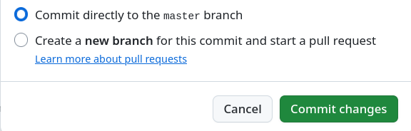

.. _edit-on-github-label:

Dokumentation in GitHub ändern
------------------------------

Wenn du einen Fehler (Rechtschreibfehler, kleine inhaltliche Fehler, etc.) in der Dokumentation gefunden hast, klicke einfach auf den ``Edit on Github`` Link am rechten oberen Rand jeder Dokumentationsseite.

.. figure:: media/01_edit-on-github_button.png
   :align: center
   :alt: Edit on Github

Damit wirst du auf github.com geleitet. Mit einem Klick auf den Stift
(siehe Bild) kannst du das aktuelle Kapitel bearbeiten. Dafür müsst
du dich bei GitHub anmelden. Wenn du noch kein Konto bei GitHub
hast, kannst du `hier eines anlegen <https://github.com/join>`_
oder oben rechts auf "Sign up" klicken.

.. figure:: media/02_edit-on-github_open-a-chapter.png
   :align: center
   :alt: Edit not signed in

Die Dokumentation ist in der Auszeichnungssprache "rST" geschrieben. `Hier <http://docutils.sourceforge.net/docs/user/rst/quickref.html>`_ findest du einen guten Überblick über die am häufigsten verwendeten Elemente.

.. figure:: media/03_edit-on-github_edit-signed-in.png
   :align: center
   :alt: Edit signed in

Im Beispiel wurde der Rechtschreibfehler und die Länge der zur Überschrift gehörenden Unterschreichung geändert.

Nachdem du alle Änderungen vorgenommen hast, gib unten einen Titel und einen Kommentar ein. Die Änderungen können nun mit einem Klick auf "Propose file changes" eingereicht werden.

.. figure:: media/04_edit-on-github_propose-changes.png
   :align: center
   :alt: propose changes

Dein Änderungsvorschlag wird dann vom Dokumentationsteam geprüft und gegebenenfalls übernommen. Sekunden später erscheint die Änderung dann auch hier in der offiziellen Dokumentation.

.. hint:: 

   Bitte beachte auch unbedingt die :doc:`Leitlinien zur Dokumentation <guidelines>`, damit deine Änderungen schnell eingepflegt werden könnnen!

Sollest du bereits Schreibrechte am Repositorium haben und bist dir sicher, dass die Dokumentation durch deine Änderung nicht beeinträchtigt wird, kannst du die Änderungen direkt einbauen ("Commit") oder im Zweifel einen Zweig und einen so genannten Pull-Request erstellen.

Größere Änderungen an der Dokumentation sind immer über Pull-Requests zu erstellen. Dafür ist es nützlich, lokal eine Kopie (fork) vorzuhalten und Änderungen lokal zu testen, das im 
:doc:`entsprechenden Kapitel <new>` erklärt wird.
