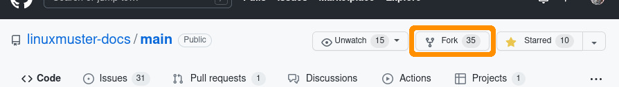
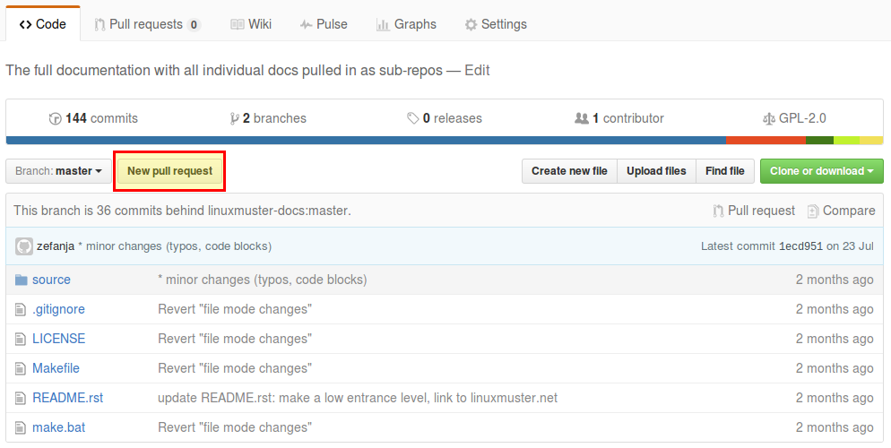

.. _new-label:

Dokumentation lokal bearbeiten und veröffentlichen
==================================================

Wenn du die Dokumentation erweitern willst, z.B. mit einem eigenen HowTo, ein fehlendes Kapitel ergänzen möchtest oder größere Änderungen machen und testen willst, benötigst du folgende Dinge:

- ein Konto bei `Github <https://github.com/join>`_
- Die Software `git <https://git-scm.com/>`_ (wird zur Verwaltung und Versionierung der Dokumentation verwendet)
- Die Software `sphinx <http://www.sphinx-doc.org>`_ (zum Übersetzen und Testen der Quelldateien), die wiederum python voraussetzt
- optional: SSH-Schlüssel bei Github `hochladen <https://help.github.com/articles/generating-an-ssh-key/>`_ (erleichtert die Arbeit mit git)

Lokale Installation (Ubuntu)
----------------------------

Mit folgenden Befehlen kannst du unter einer aktuellen (ab 16.04) Ubuntu-Distributionen git, python und sphinx nachinstallieren:

.. code::

   $ sudo apt install git
   $ sudo apt install python3-pip
   $ pip3 install sphinx 
   $ pip3 install sphinx_rtd_theme

Offizielle Dokumentation kompilieren
------------------------------------

Hast du bereits bereits eine heruntergeladene Dokumentation aus dem offiziellen Repository, dann könntest du nun eine lokale Version der Dokumentation bauen und betrachten. Ansonsten mach mit dem nächsten Punkt weiter: `GitHub Konto erstellen`_ 

Öffne dazu ein Terminal, navigiere zum Ordner `linuxmuster-docs/main`, führe `make clean && make html` aus und rufe die Datei `linuxmuster-docs/main/build/html/index.html` z.B. mit dem Browser Firefox auf, um das Ergebnis zu betrachten.

.. code::

   linuxadmin@lmn-docs:~$ cd linuxmuster-docs/
   linuxadmin@lmn-docs:~/linuxmuster-docs$ cd main/
   linuxadmin@lmn-docs:~/linuxmuster-docs/main$ make celan && make html
   sphinx-build -b html -d build/doctrees   source build/html
   Running Sphinx v1.6.5
   loading translations [de_DE]... done
   loading pickled environment... done
   ...
   linuxadmin@lmn-docs:~/linuxmuster-docs/main$ firefox build/html/index.html

GitHub Konto erstellen
----------------------

Spätestens jetzt solltest du ein Konto bei GitHub erstellen: https://github.com/join. 

Verifziere deine E-Mail-Adresse. Natürlich kannst du die Dokumentation zu GitHub durchlesen. Weiter geht es dann unter https://github.com/linuxmuster-docs/main

.. hint::

   Im folgenden wird das Konto "lmn-docs-bot" verwendet. Überall wo dieser auftaucht, ersetze ihn durch dein Kontonamen bei GitHub.

Linuxmuster Dokumentation forken
--------------------------------

Öffnen Sie die `linuxmuster.net Dokumentation auf Github <https://github.com/linuxmuster-docs/main>`_ und klicken Sie auf "Fork".

Öffne nun einen Terminal / Eingabeauffoderung (``Strg+Alt+t`` in Ubuntu) and gebe folgenden Befehl ein:

.. note::

   Nutze die URL ``git@github.com:lmn-docs-bot/main.git`` falls du bereits einen SSH-Schlüssel bei Github hochgeladen hast!

.. code::

   linuxadmin@lmn-docs:~$ git clone https://github.com/lmn-docs-bot/main.git my-docs
   Klone nach 'my-docs' ...
   ...
   linuxadmin@lmn-docs:~$ cd my-docs

Du kannst nun mit

.. code::

   linuxadmin@lmn-docs:~/my-docs$ make clean && make html
   linuxadmin@lmn-docs:~/my-docs$ firefox build/html/index.html

die Dokumentation in HTML übersetzen und diese lokal in deinem Browser öffnen.

Dokumentation ändern oder neu erstellen
---------------------------------------

Die Dokumentation ist in der Markupsprache "rST" geschrieben. `Hier <http://docutils.sourceforge.net/docs/user/rst/quickref.html>`_ finden Sie einen guten Überblick über die am häufigsten verwendeten Elemente.

.. hint::
   Bitte beachten Sie auch unbedingt die :doc:`Leitlinien zur Dokumentation <guidelines>`, damit ihre Änderungen schnell eingepflegt werden könnnen!

Im Verzeichnis ``source`` und den entsprechenden Unterordnern befinden sich alle Dokumentationsdateien. Öffnen Sie einfach eine dieser Dateien und nehmen Sie die gewünschten Änderungen vor. Sie können auch eine neue Dokumentation in einem der Unterordner anlegen. Erstellen Sie dazu einfach einen Ordner mit einem passenden Namen und die notwendige ``index.rst`` Datei.

.. code-block:: console

   $ mkdir source/howto/foobar
   $ touch source/howto/foobar/index.rst

Schaue dir auch die anderen Dokumentationsdateien an, um mehr über den Aufbau und Syntax zu lernen.

Commit und push
~~~~~~~~~~~~~~~

Hast du alle Änderungen vorgenommen, kannst du diese nun zur Überprüfung einreichen. Dazu sind folgende Schritte notwendig:

.. important::

   Überprüfe bitte zuerst, ob ``make clean && make html`` ohne Fehler durchläuft! Falls nicht, behebe bitte alle Fehler und Warnungen, bevor du deine Änderungen hochlädst!

.. code::

   $ make html

Falls Sie neue Dateien oder Ordner erstellt haben, müssen diese noch hinzugefügt werden:

.. code::

   $ git add source/howto/foobar

Gebe nun noch einen Kommentar zu deinen Änderungen ein und lade alles in deinen Fork hoch:

.. code-block:: console

   $ git commit -a -m"My great documentation"
   $ git push

Pull-Request
~~~~~~~~~~~~

Erstelle nun einen "Pull-Request" unter `<https://github.com/lmn-docs-bot/main>`_, indem du auf "New Pull Request" klickst.

Wenn du weitere Änderungen vornehmen möchtest und diese mit ``git commit -a -m"My comment"`` und ``git push`` bei Github hochlädst, werden diese Änderungen automatisch dem Pull Request hinzugefügt.

Eigenen Fork aktualisieren
--------------------------

Um später weiter Änderungen vornehmen zu können, kann der eigene Fork bei GitHub komplett gelöscht werden und ein neuer erzeugt werden. Alternativ kann der eigene Fork auf den Stand des offiziellen
Repository gebracht werden:

* Verschiebe alle lokalen Änderungen mit ``git stash`` in den Hintergrund

  .. code:: bash

     ~/my-docs$ git stash

* Füge (einmalig) einen remote-tracking branch hinzu:

  .. code:: bash

     ~/my-docs$ git remote add upstream https://github.com/linuxmuster-docs/main.git

* Hole und merge den aktuellen offiziellen branch:

  .. code:: bash

     ~/my-docs$ git fetch upstream
     ~/my-docs$ git merge upstream/master
     Aktualisiere 76e2e32..be2f941
     Fast-forward

* Wenn der merge nicht in einem "Fast-forward" endet, sollte man
  besser den Fork löschen und neu erzeugen. Andernfalls kann man jetzt
  die offiziellen Änderungen hochladen.

  .. code:: bash

     ~/my-docs$ git push

* Jetzt kann man seine lokale Änderungen wieder hervorholen

  .. code:: bash

     ~/my-docs$ git stash pop

Für Fortgeschrittene: andere Zweige bearbeiten
----------------------------------------------

Unterschiedliche Versionen von linuxmuster.net werden in unterschiedlichen Zweigen des github-Repository dokumentiert. Die aktuelle Version ist im Zweig ``master`` untergebracht und obige Abschnitte beziehen sich darauf.

Will man einen anderen Zweig bearbeiten, beispielsweise den Zweig ``v7``, dann gibt es nur Folgendes zu beachten:

1. Man muss einmalig den Zweig mit ``git checkout v7`` lokal initialisieren. Mit ``git branch`` sieht man, welche Zweige aktuell sind.

   .. code::

      linuxadmin@lmn-docs:~/my-docs$ git branch -l
      * master
      linuxadmin@lmn-docs:~/my-docs$ git checkout v7
      Zu Branch 'v7' gewechselt
      Ihr Branch ist auf demselben Stand wie 'origin/v7'.
      linuxadmin@lmn-docs:~/my-docs$ git branch
      master
      * v7

   Man sollte also immer nachschauen, in welchem Zweig man gerade arbeitet.

2. Die Abschnitte zu ``commit`` und ``push`` stimmen in jedem Zweig.

3. Wird ein Pull-Request in Github erstellt, dann ist zu beachten, dass auch die gleichen Zweige verglichen werden.

   .. figure:: media/08_new_pull-request-wrong-branch.png
      :align: center
      :alt: Pull-Request mit falsch gewähltem Zweig

      Ein Pull-Request mit falsch gewähltem Zweig, die sich nicht automatisch zusammenführen lassen.

4. Aktualisiert man den eigenen Fork über das ``upstream``-Repository, dann muss man den Befehl zum Zusammenführen anpassen. Ein Ablauf kann da so aussehen:

   .. code::

      linuxadmin@lmn-docs:~/my-docs$ git fetch upstream
      remote: Enumerating objects: 15, done.
      remote: Counting objects: 100% (15/15), done.
      remote: Compressing objects: 100% (12/12), done.
      remote: Total 19 (delta 4), reused 3 (delta 3), pack-reused 4
      Entpacke Objekte: 100% (19/19), Fertig.
      Von https://github.com/linuxmuster-docs/main
      7d25598..2c31c06  master     -> upstream/master
      4a27d6b..d4edde9  v7         -> upstream/v7
      linuxadmin@lmn-docs:~/my-docs$ git branch
      master
      * v7
      linuxadmin@lmn-docs:~/my-docs$ git merge upstream/v7
      Aktualisiere d3ada10..d4edde9
      Fast-forward
      source/appendix/install-on-kvm/index.rst | 2 ++
      1 file changed, 2 insertions(+)

   Ein "merge" des falschen Zweiges, z.B. ``upstream/master`` hätte hier zu Folge, dass alle Änderungen zwischen den Zweigen versucht würde zusammenzuführen, was bei sich stark unterscheidenden Zweigen
   nicht erfolgreich wäre.
   
Der ``master``-Zweig ist kein besonderer Zweig. Man kann also dorthin zurückkehren, wie man zu jedem Zweig wechselt, mit ``git checkout master``.

