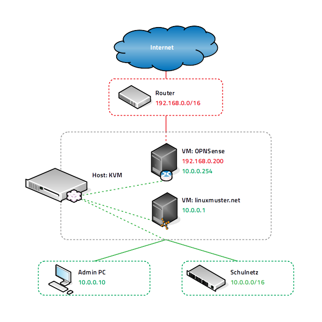

.. _install-on-kvm-label:

==========================
 Virtualisierung über KVM
==========================

.. sectionauthor:: `@morbweb <https://ask.linuxmuster.net/u/morpweb>`_,
		   `@Tobias <https://ask.linuxmuster.net/u/Tobias>`_,
		   `@MachtDochNix (pics) <https://ask.linuxmuster.net/u/MachtDochNix>`_

In diesem Dokument findest Du "Schritt für Schritt" Anleitungen zum
Installieren der linuxmuster.net-Musterlösung in der Version 7.0 auf
Basis von KVM unter Ubuntu Server 18.04 LTS. Lies zuerst die
Abschnitte :ref:`release-information-label` und
:ref:`prerequisites-label`, bevor Du dieses Kapitel durcharbeitest.

Im folgenden Bild ist die einfachste Form der Implementierung der
Musterlösung schematisch mit dem gewählten (Standard-)Netzwerk ``10.0.0.0/12``
dargestellt:

Nach der Installation gemäß dieser Anleitung erhältst Du eine
einsatzbereite Umgebung bestehend aus

* einem Host (KVM) für alle virtuellen Maschinen, 
* einer Firewall (OPNSense) und 
* eines Servers (linuxmuster.net)

Ähnliche, nicht dokumentierte, Installationen gelten für einen
OPSI-Server und einen Docker-Host, die dann ebenso auf dem KVM-Host
laufen können.

Voraussetzungen
===============

* Es wird vorausgesetzt, dass Du einen Administrationsrechner
  (Admin-PC genannt) besitzt, den Du je nach Bedarf in die
  entsprechenden Netzwerke einstecken kannst und dessen
  Netzwerkkonfiguration entsprechend vornehmen kannst. Für diese
  Anleitung reicht ein Rechner mit ssh-Software aus, empfohlen wird
  allerdings ein Ubuntu-Desktop mit der Verwaltungssoftware
  `virt-manager`.

* Der Internetzugang des Admin-PCs und auch des späteren KVM-Hosts
  sollte zunächst gewährleistet sein, d.h. dass beide zunächst z.B. an
  einem Router angeschlossen werden, über den die beiden ins Internet
  können. Sobald später die Firewall korrekt eingerichtet ist, bekommt
  der Admin-PC und bei Bedarf auch der KVM-Host eine IP-Adresse im
  Schulnetz.

Installation des KVM-Hosts
==========================

.. hint:: 

   Der KVM-Host bildet das Grundgerüst für die Firewall *OPNsense* und
   den Schulserver *server*. Da KVM im Gegensatz zu Xen oder VMWare
   auf die Virtualisierungsfunktionen der CPU angewiesen ist, müssen
   diese natürlich vorhanden sein und eventuell im BIOS aktiviert
   werden.

Die folgende Anleitung beschreibt die *einfachste* Implementierung
ohne Dinge wie VLANs, Teaming oder Raids. Diese Themen werden in
zusätzlichen Anleitungen betrachtet.

* :ref:`Anleitung Netzwerksegmentierung <subnetting-basics-label>` 

.. _preface-usb-stick-label:

Erstellen eines USB-Sticks für den KVM-Host
-------------------------------------------

Download für den KVM-Host
  Es wird für die Installation auf dem KVM-Host ein Ubuntu Server 64bit
  in der Version 18.04 LTS verwendet. Ein Installationsimage für
  DVD/USB-Stick kann `hier <https://www.ubuntu.com/download/server>`_
  heruntergeladen werden.

Hilfreiche Befehle sind (Vorsicht - mit ``dd`` werden vorhandene Daten
unwiderruflich zerstört):

.. code-block:: console

   Löschen des MBRs des USB-Sticks
   # sudo dd if=/dev/zero of=/dev/sdX bs=1M count=10
   
   Kopieren des ISOs auf den Stick
   # sudo dd if=<Name des ISOs> | sudo pv -s <Groesse des ISOs> | sudo dd of=/dev/sdX bs=1M && sync

Natürlich können auch alle anderen gängigen Tools zur Erstellung genutzt werden. 

.. raw:: html

   

   <iframe width="696" height="392" src="https://www.youtube.com/embed/7NIoQpSSVQw?rel=0" frameborder="0" allow="autoplay; encrypted-media" allowfullscreen></iframe>
   

..

Installation des KVM-Hosts
--------------------------

.. hint::
   Bei der Installation sind folgende Merkmale zu berücksichtigen:

   * Erstellung eines Nutzers ``lmadmin``, der später wieder gelöscht
     wird.
   * Auswahl des HWE Kernels
   * Einrichtung eines LVMs auf der HDD mit 25GB für das
     Betriebssystem
   * Auswahl der Pakete *Virtual Machine host* und *OpenSSH server*

Des Weiteren ist es (wie in den Voraussetzungen angesprochen)
sinnvoll, die erste Netzwerkkarte des Servers an den Internet-Router
anzuschließen, um eventuell notwendige Pakete (Sprachpakete) während
der Installation zu installieren.

:todo: neues Video auf Basis von Ubuntu 18.04 LTS

.. raw:: html

   
 <iframe width="696" height="392"
   src="https://www.youtube.com/embed/ZL0e07nJI_w?rel=0"
   frameborder="0" allow="autoplay; encrypted-media"
   allowfullscreen></iframe> 

..

 
Netzwerkkonfiguration des KVM-Hosts
-----------------------------------

In diesem Schritt erfolgt die Anbindung des KVM-Hosts an das Schulnetz
und an das Internet sowohl für den KVM-Host selbst, als auch für die
virtuellen Maschinen. Dafür werden virtuelle Netzwerkswitche (so
genannte `bridges`) eingerichtet mit denen die virtuellen Maschinen
netzwerktechnisch verbunden werden. Der KVM-Host selbst kann auch mit
Brücken verbunden werden, wenn er im jeweiligen Netz sichtbar sein
soll.

Herausfinden der Namen der Netzwerkkarten
  .. code-block:: console
     
     # ip addr list

Anpassen der Netzwerkkonfiguration
  .. code-block:: console

     /etc/netplan/lmn-host.yml

     :todo: find netplan-config for kvm-host

.. hint::

   Wer seinen KVM-Host von früheren Ubuntu-Versionen updatet, bei dem
   wird nicht automatisch `netplan` installiert, sondern `ifupdown`
   mit der Konfigurationsdatei ``/etc/network/interfaces`` wird
   beibehalten.

Installation von Updates
------------------------

Nach der Erstinstallation ist es sinnvoll, das System erst einmal auf
den aktuellen Stand zu bringen. Auf der Konsole wird dies mit
folgenden Befehlen durchgeführt:

.. code-block:: console

   # sudo apt-get update
   # sudo apt-get upgrade
   # sudo apt-get dist-upgrade
   # sudo apt-get autoremove
   # sudo apt-get autoclean

.. raw:: html

   
 <iframe width="696" height="392"
   src="https://www.youtube.com/embed/DgMkFhBbrlY?rel=0"
   frameborder="0" allow="autoplay; encrypted-media"
   allowfullscreen></iframe> 

..

Einrichten des SSH-Zugangs auf Zertifikatsbasis
-----------------------------------------------

:todo: check/redo for 18.04

Die Remote-Administration des KVM-Hosts soll per SSH und
Zertifikaten erfolgen. Als Benutzer wird root verwendet.

Setzen des Rootpassworts 
  .. code-block:: console

     # passwd

Aktivierung des SSH-Zugangs für root
  .. code-block:: console

     # nano /etc/ssh/sshd_config
     ...
     PermitRootLogin yes
     ...

Erstellen von SSH-Zertifikaten auf dem Admin-PC und Kopieren auf den KVM-Host
  .. code-block:: console

     # ssh-keygen
     # ssh-copy-id root@192.168.1.10

Deaktivierung des SSH-Zugangs für root per Passwort
  .. code-block:: console

     # nano /etc/ssh/sshd_config
     ...
     PermitRootLogin prohibit-password
     ...

Löschen des Users ``lmadmin`` auf dem KVM-Host
  .. code-block:: console

     # userdel -r lmadmin

.. raw:: html

   
 <iframe width="696" height="392"
   src="https://www.youtube.com/embed/AUGVGgqRkU0?rel=0"
   frameborder="0" allow="autoplay; encrypted-media"
   allowfullscreen></iframe> 

..

Einrichten der Zeit-Synchronisation
-----------------------------------

:todo: check/redo for 18.04

Immer eine gute Sache ist es, z.B. in Logfiles die korrekte Zeit zu
finden. Aus diesem Grund erfolgt die Konfiguration eines NTP-Clients.

.. code-block:: console

   Installieren von ntpdate
   # apt-get install ntpdate

   Einmaliges Stellen der Uhrzeit
   # ntpdate 0.de.pool.ntp.org

   Installieren des NTP-Daemons
   # apt-get install ntp

   Anzeigen der Zeitsynchronisation
   # ntpq -p

.. raw:: html

	
 <iframe width="696" height="392"
	src="https://www.youtube.com/embed/tHqFTfS99xo?rel=0"
	frameborder="0" allow="autoplay; encrypted-media"
	allowfullscreen></iframe> 

..

Vorbereitungen für den Import der virtuellen Maschinen
------------------------------------------------------

Download Virtuelle Maschinen
  Lade auf dem KVM-Host die aktuellen OVA-Abbilder von der `Webseite
  <https://github.com/linuxmuster/linuxmuster-base7/wiki/Die-Appliances>`_
  herunter, die zu dem Adressbereich gehören, den Du brauchst
  (``10.0.0.1/16`` oder ``10.16.1.1/12``)

  .. code-block:: console
     
     # wget http://fleischsalat.linuxmuster.org/ova/lmn7-opnsense-20181109.ova
     # wget http://fleischsalat.linuxmuster.org/ova/lmn7-server-20181109.ova
     # wget http://fleischsalat.linuxmuster.org/ova/lmn7-opsi-20181109.ova
     # wget http://fleischsalat.linuxmuster.org/ova/lmn7-docker-20181109.ova

  und überprüfe die md5-Summe mit dem entsprechenden Werkzeug und
  vergleiche mit der Webseite auf Integrität. In der weiteren Anleitung
  wird statt der Dateien mit Datumsstempel ``20181109`` die Datei mit
  ``*`` verwendet. Solange Du nur je ein (das aktuelle) OVA-Abbild
  vorliegen hast, funktionieren die Befehle auch mit dem ``*``.

KVM-Anpassungen
  Nach der Integration bietet es sich an, die Hardware der
  importierten Appliances anzupassen und z.B. die Festplattentypen auf
  "virtio" zu stellen. Ebenso habe ich den Typ der "Grafikkarte" von
  `spice` auf `vnc` gesetzt.

Import der Firewall
===================

Importiere die Firewall-Appliance `lmn7-opnsense`.

.. code-block:: console

   # virt-convert lmn7-opnsense-*.ova
   ...
   Running /usr/bin/qemu-img convert -O raw lmn7-opnsense-20181109-disk1.vmdk /var/lib/libvirt/images/lmn7-opnsense-20181109-disk1.raw
   Creating guest 'lmn7-opnsense'.

Wer als Speichermedium lieber das LVM verwendet, der muss die
Festplattengröße ermitteln, ein logical volume erstellen, das
Abbild nochmals kopieren und die Konfiguration editieren.

.. code-block:: console

   # qemu-img info /var/lib/libvirt/images/lmn7-opnsense-*disk1.raw | grep virtual\ size
   virtual size: 10G (10737418240 bytes)
   # lvcreate -L 10737418240b -n opnsense vghost
   # qemu-img convert -O raw /var/lib/libvirt/images/lmn7-opnsense-*disk1.raw /dev/vghost/opnsense
   # virsh edit lmn7-opnsense
   ...
   <disk type='block' device='disk'>
      <driver name='qemu' type='raw'/>
      <source dev='/dev/vghost/opnsense'/>
   ...

Falls das Abbild erfolgreich ins LVM des Hosts übertragen wurde,
kann das Abbild in ``/var/lib/libvirt/images`` gelöscht werden.

Netzwerkanpassung der Firewall
------------------------------
   
Die Netzwerkkarten der Appliance werden in der Reihenfolge importiert,
wie sie in der Appliance definiert wurden:

1. `LAN, 10.0.0.254/16`, d.h. diese Schnittstelle wird auf der
   pädagogischen Seite des Netzwerks angeschlossen
2. `WAN, DHCP`, d.h. diese Schnittstelle wird auf der Internetseite
   angeschlossen
3. `OPT1, unkonfiguriert`, d.h. diese Schnittstelle wird für optionale
   Netzwerke verwendet und muss zunächst nicht angeschlossen werden.

Öffne die Konfiguration und editiere die erste Schnittstelle, so dass
sie sich im Schulnetzwerk befindet, hier im Beispiel wird diese an die
virtuelle Brücke `br-green` mit dem Stichwort `bridge` und dem Typ
`bridge` angeschlossen. Die MAC-Adresse sollte bei dieser Gelegenheit
auch (beliebig) geändert werden.

.. code-block:: console

   # virsh edit lmn7-opnsense
   ...
   <interface type='bridge'>
      <mac address='52:54:00:20:ea:70'/>
      <source bridge='br-green'/>
   ...

Die zweite Schnittstelle sollte genauso dem Typ `bridge` zugeordnet
werden, allerdings an die Brücke `br-red` angeschlossen werden.

.. code-block:: console

   # virsh edit lmn7-opnsense
   ...
   <interface type='bridge'>
      <mac address='52:54:00:d2:0c:62'/>
      <source bridge='br-red'/>
   ...

Test der Verbindung zur Firewall
--------------------------------
   
Starte die Firewall. Der Admin-PC sollte sich nach ca. 3 Minuten mit
der Firewall verbinden lassen.

.. code-block:: console

   # virsh start lmn7-opnsense
   Domain lmn7-opnsense started
   # ping 10.0.0.254
   PING 10.0.0.254 (10.0.0.254) 56(84) bytes of data.
   64 bytes from 10.0.0.254: icmp_seq=1 ttl=64 time=0.183 ms
   64 bytes from 10.0.0.254: icmp_seq=2 ttl=64 time=0.242 ms
   ...
   STRG-C
   # ssh 10.0.0.254 -l root
   Password for root@OPNsense.localdomain:
   ...
   LAN (em0)       -> v4: 10.0.0.254/16
   WAN (em1)       -> v4/DHCP4: 192.168.1.23/16
   ...

Man erkennt, dass die Firewall die Netzwerkkarten für innen (LAN) und
außen (WAN) richtig zugeordnet hat. Sollte diese Verbindung nicht
gelingen, dann empfiehlt sich ein Admin-PC, mit dem man über das
Programm `virt-manager` den VM-Host und damit die Firewall über eine
GUI-Verbindung erreicht und die Netzkonfiguration der opnsense
überprüfen und korrigieren kann.

Import des Servers
==================

Importiere die Server-Appliance `lmn7-server`.

.. code-block:: console

   # virt-convert lmn7-server-*.ova
   ...
   Running /usr/bin/qemu-img convert -O raw lmn7-server-20181109-disk1.vmdk /var/lib/libvirt/images/lmn7-server-20181109-disk1.raw
   Running /usr/bin/qemu-img convert -O raw lmn7-server-20181109-disk2.vmdk /var/lib/libvirt/images/lmn7-server-20181109-disk2.raw   
   Creating guest 'lmn7-server'.

Festplattengrößen für den Server
--------------------------------
   
An dieser Stelle sollte man die Festplattengrößen an seine eigenen
Bedürfnisse anpassen. Beispielhaft wird die zweite Festplatte und das
darin befindliche server-LVM vergrößert, so dass ``/dev/vg_srv/linbo``
und ``/dev/vg_srv/default-school`` auf jeweils 175G vergrößert werden.

Zunächst wird der Container entsprechend (10+10+175+175 GB) vergrößert, dann der mit
Hilfe von `kpartx` aufgeschlossen.

.. code-block:: console

   # qemu-img resize -f raw /var/lib/libvirt/images/lmn7-server-*disk2.raw 370G
   Image resized.
   # qemu-img info /var/lib/libvirt/images/lmn7-server-*disk2.raw | grep virtual\ size
   virtual size: 370G (397284474880 bytes)
   # kpartx -av /var/lib/libvirt/images/lmn7-server-*disk2.raw
   # vgdisplay -s vg_srv
   "vg_srv" <100,00 GiB [<100,00 GiB used / 0,00 GiB free]

Durch kpartx wurde der Container über ein so genanntes loop-device
geöffnet und das darin liegende LVM wurde auf dem Serverhost
hinzugefügt. Daher kann jetzt sowohl das loop-device als `physical
volume` vergrößert als auch die `logical volumes` vergrößert werden.
Zu letzt muss noch das Dateisystem geprüft und erweitert werden.

.. code-block:: console

   # pvresize /dev/loop0 
   Physical volume "/dev/loop0" changed
   1 physical volume(s) resized / 0 physical volume(s) not resized
   # vgdisplay -s vg_srv
   "vg_srv" <370,00 GiB [<100,00 GiB used / 270,00 GiB free]

   # lvresize /dev/vg_srv/default-school -L 175G
   Size of logical volume vg_srv/default-school changed from 40,00 GiB (10240 extents) to 175,00 GiB (44800 extents).
   Logical volume vg_srv/default-school successfully resized.
   # e2fsck -f /dev/vg_srv/default-school
   ...
   linbo: 1010/2621440 Dateien (0.6% nicht zusammenhängend), 263136/10485760 Blöcke
   # resize2fs /dev/vg_srv/default-school
   ...
   Das Dateisystem auf /dev/vg_srv/default-school is nun 45875200 (4k) Blöcke lang.

   # lvresize /dev/vg_srv/linbo -L 175G
     Insufficient free space: 34560 extents needed, but only 34559 available
   # lvresize /dev/vg_srv/linbo -l +34599     
   Size of logical volume vg_srv/linbo changed from <40,00 GiB (10239 extents) to <175,00 GiB (44799 extents).
   Logical volume vg_srv/linbo successfully resized.
   # e2fsck -f /dev/vg_srv/linbo
   ...
   default-school: 13/2621440 Dateien (0.0% nicht zusammenhängend), 242386/10484736 Blöcke
   # resize2fs /dev/vg_srv/linbo
   ...
   Das Dateisystem auf /dev/vg_srv/linbo is nun 45874176 (4k) Blöcke lang.

Um den Container wieder ordentlich zu schließen, muss man die `volume
group` abmelden und mit `kpartx` abschließen.

.. code-block:: console

   # vgchange -a n vg_srv
   0 logical volume(s) in volume group "vg_srv" now active
   # kpartx -dv /var/lib/libvirt/images/lmn7-server-*disk2.raw 
   loop deleted : /dev/loop0

Auch hier muss man, wenn man als Speichermedium auf dem Host lieber
LVM verwendet, weitere Anpassungen vornehmen.Hier habe ich auch den
Festplattentyp auf `virtio` und die Festplattenbezeichnung daher auf
`vdX` umgestellt.

.. code-block:: console

   # qemu-img info /var/lib/libvirt/images/lmn7-server-*disk1.raw | grep virtual\ size
   virtual size: 25G (26843545600 bytes)
   # lvcreate -L 26843545600b -n serverroot vghost
   # qemu-img convert -O raw /var/lib/libvirt/images/lmn7-server-*disk1.raw /dev/vghost/serverroot
   # virsh edit lmn7-server
   ...
   <disk type='block' device='disk'>
      <driver name='qemu' type='raw'/>
      <source dev='/dev/vghost/serverroot'/>
      <target dev='vda' bus='virtio'/>
   ...
   # qemu-img info /var/lib/libvirt/images/lmn7-server-*disk2.raw | grep virtual\ size
   virtual size: 370G (397284474880 bytes)
   # lvcreate -L 397284474880b -n serverdata vghost
   # qemu-img convert -O raw /var/lib/libvirt/images/lmn7-server-*disk2.raw /dev/vghost/serverdata
   # virsh edit lmn7-server
   ...
   <disk type='block' device='disk'>
      <driver name='qemu' type='raw'/>
      <source dev='/dev/vghost/serverdata'/>
      <target dev='vdb' bus='virtio'/>      
   ...

Falls die Abbilder erfolgreich ins LVM des Hosts übertragen wurden,
können die Abbilder in ``/var/lib/libvirt/images`` gelöscht werden.

Netzwerkanpassung des Servers
-----------------------------
   
Es muss nur eine Netzwerkschnittstelle angepasst werden und in die
Brücke `br-green` gestöpselt werden.

.. code-block:: console

   # virsh edit lmn7-server
   ...
   <interface type='bridge'>
      <mac address='52:54:00:9f:b8:af'/>
      <source bridge='br-green'/>
   ...

Test der Verbindung zum Server
------------------------------

Starte den Server. Teste, ob Du von deinem Admin-PC auf den Server mit
dem Standardpasswort `Muster!` kommst.

.. code-block:: console

   # virsh start lmn7-opnsense
   Domain lmn7-opnsense started
   # ssh 10.0.0.1 -l root
   root@10.0.0.1's password: 
   Welcome to Ubuntu 18.04.1 LTS (GNU/Linux 4.15.0-38-generic x86_64)
   ...

Sollte diese Verbindung nicht gelingen, dann empfiehlt sich ein
Admin-PC, mit dem man über das Programm `virt-manager` den VM-Host
erreicht und über eine GUI-Verbindung den Server begutachtet.

Abschließende Konfigurationen
=============================

Aktivieren des Autostarts der VMs
---------------------------------

Damit die VMs zukünftig bei einem Neustart des KVM-Servers nicht immer
von Hand gestartet werden müssen, ist es sinnvoll den Autostart zu
aktivieren.

.. code-block:: console

   # virsh autostart lmn7-opnsense
   Domain lmn7-opnsense marked as autostarted
   # virsh autostart lmn7-server
   Domain lmn7-server marked as autostarted

Ab jetzt ist eine Installation der Musterlösung möglich. Folge der
:ref:`Anleitung hier <setup-using-selma-label>`.
