Anlegen und Installieren der Firewall
=====================================

Anlegen der VM OPNSense
-----------------------

.. figure:: media/OPNS01.png

Nachdem du dich auf dem Proxmox-Host angemeldet hast, klickst du in der linken Spalte den Proxmox-Host (hier pve) an. Dann drückst du oben links auf den blauen Knopf ``Erstelle VM``.

Jetzt öffnet sich ein Dialog, in dem du nach und nach die Daten der virtuellen Maschine eingeben kannst.

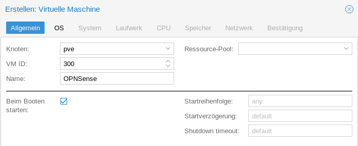

Der ``Knoten`` ist der Proxmox-Host, auf dem die VM läuft. In unserem Fall hat er den Namen ``pve``.

``VM ID`` ist eine Nummer für die VM. In dieser Anleitung fängst du bei 300 an.

Der Name ist frei wähl bar.

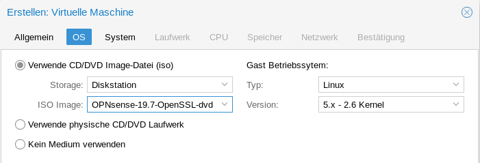

``Storage`` ist der Ort, in dem die iso-Images abgelegt sind. 

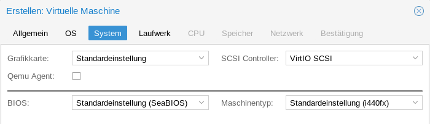

Im System-Bereich kannst du die Vorgaben übernehmen.

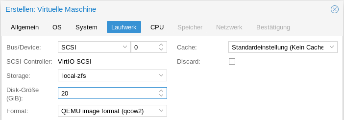

Wie in :ref:`prerequisites-label` beschrieben, ist eine Festplattengröße von 20 GB empfehlenswert.

.. hint:: Achte auf den Ort, an dem das Festplattenimage ``Storage`` abgelegt wird. Proxmox schlägt manchmal eine NAS vor. Du willst aber die Festplatten in deinem Host speichern!

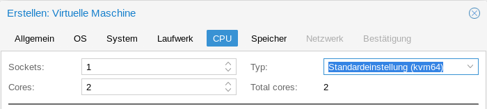

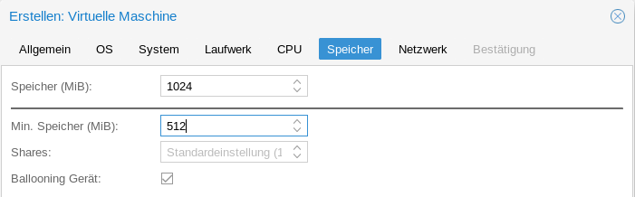

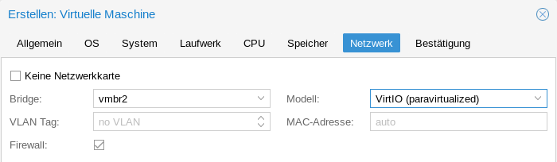

An dieser Stelle kannst du nur eine Netzwerkkarte definieren. Der Rest kommt später.

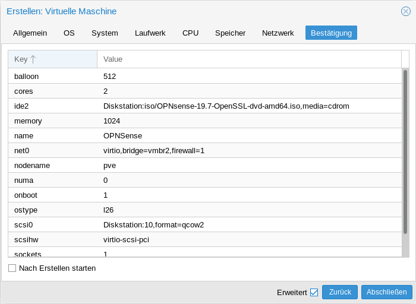

Hier siehst du nochmal eine Zusammenfassung deiner Eingaben. Klick auf ``Abschließen``, damit die VM angelegt wird.

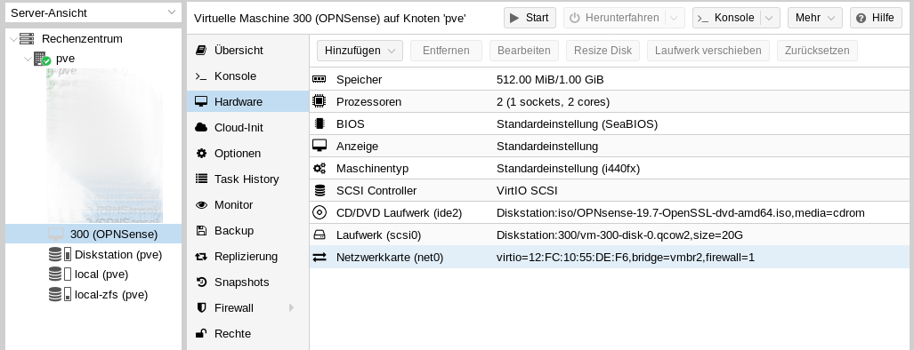

Im Ressourcenbaum (auf der rechten Seite) erscheint nach ein paar Sekunden deine VM OPNSense mit der ID 300.

Im Inhaltsbereich unter Hardware ist die Hardware deiner VM aufgelistet. Mit einem Linksdoppelklick auf eine Hardwarekomponente lassen sich hier Veränderungen vornehmen. 

Klicke auf ``Hinzufügen`` um die zweite Netzwerkkarte hinzuzufügen. Im Pulldownmenü wählst du ``Netzwerkkarte``.

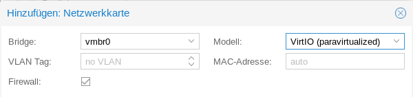

Wähle die Bridge, die mit dem Router verbunden ist.

Damit ist die VM konfiguriert und du kannst damit beginnen OPNSense zu installieren.

Installation der OPNSense
-------------------------

Starte die VM mit dem ``Start``-Knopf und öffne mit dem ``>_ Konsole``-Knopf die Konsole der VM.

OPNSense startet von DVD (dem iso-Image). Melde dich als ``installer`` mit dem Passwort ``opnsense`` an.

Bestätige den Willkommensbildschirm mit Enter.

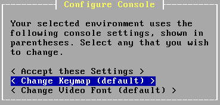

Standardmäßig ist ein amerikanisches Tastaturlayout voreingestellt. Gehe auf ``Change Keymap``.

.. figure:: media/OPNS13.png

Wähle die deutsche Tastatur ``< de.kbd >`` und akzeptiere jetzt mit ``< Accept these Settings >``.

.. figure:: media/OPNS14.png

Wähle ``< Guided installation >``.

Bestätige die Festplatte und wähle ``< MBR mode>``. Jetzt wird OPNSense auf der Festplatte installiert.

.. figure:: media/OPNS15.png

.. hint:: 

   An dieser Stelle muss Muster! als root-Passwort eingegeben werden, da später der lmn-Server beim Einrichten der Firewall davon ausgeht, dass das root-Passwort Muster! ist!!!

Reboote OPNSense.

Der Boot-Vorgang kann schon eine Weile dauern. Vor allem, wenn der Router kein DHCP anbietet.  

Wenn alles geklappt hat, siehst da das:

.. figure:: media/OPNS16.png

* Die erste Netzwerkkarte (LAN) ist mit dem pädagogischen Netz verbunden. Allerdings noch mit den falschen Netzwerkeinstellungen.
* Die zweite Netzwerkkarte (WAN) ist mit dem Router verbunden. In einer Schulumgebung wird der Router keinen DHCP-Service anbieten. 

Für die Konfiguration der OPNSense brauchst du einen Rechner mit Webbrowser im LAN-Bereich der OPNSense. Das kann ein Laptop mit Linux oder Windows sein. Oder du setzt eine VM mit einem Ubuntu auf. Achte darauf, dass sie mit dem LAN-Adapter der OPNSense (hier vmbr2) verbunden ist.

Konfiguration der OPNSense
--------------------------

Gehe mit einem Webbrowser auf ``https://192.168.1.1``.

Du erhältst zunächst eine Zertifikatswarnung, was klar ist, da OPNSense ja ganz frisch installiert ist. 

.. figure:: media/OPNS17.png

Akzeptiere und fahre fort.

.. figure:: media/OPNS18.png

Melde dich mit root und dem Passwort Muster! an. Und starte den General Setup Wizard mit dem ``Next``-Knopf.

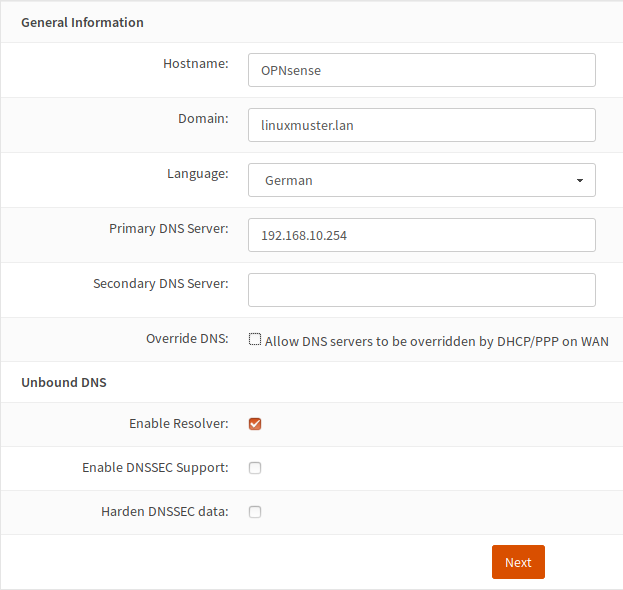

.. hint:: 

   Die Länge des ersten Teils der Domäne darf maximal 15 Zeichen betragen. Die Domäne ``muster-gymnasium.de`` ist um ein Zeichen zu lang, da muster-gymnasium 16 Zeichen lang ist. Eine gute Wahl ist beispielsweise ``linuxmuster.lan``. 

.. figure:: media/OPNS20.png

Die Angaben zum Time Server übernimmst du.

.. figure:: media/OPNS21.png

Falls deine Firewall eine statische IP-Adresse hat, die nicht über DHCP erteilt wird, trägst du sie hier ein.

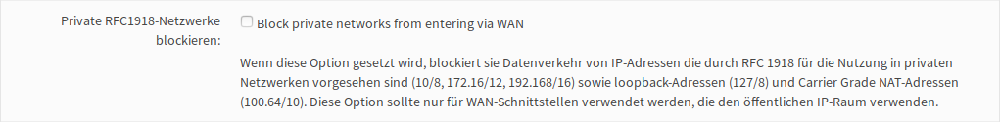

Falls dein Router eine private IP hat, musst du den Haken bei ``Private RFC1918-Netzwerke blockieren`` entfernen.

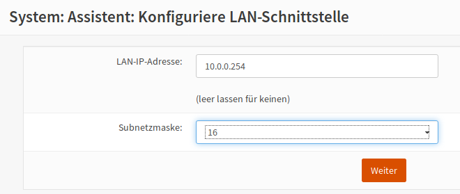

Die IP-Adresse und die Subnetzmaske des Schulnetzes sind hier einzutragen.

.. hint:: Standardmäßig wird das interne Netz aus dem privaten IPv4-Bereich 10.0.x.x mit der 16-bit Netzmaske 255.255.0.0 eingerichtet. Möchtest du jedoch später eine Datenmigration durchführen, solltest du das Netz der bisherigen linuxmuster.net V6.2 wählen. Also Lan-IP-Adresse 10.16.1.254 und Subnetzmaske 12.
 
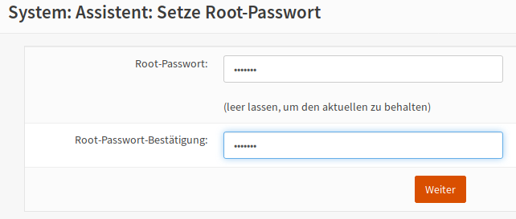

.. hint:: 

   An dieser Stelle muss Muster! als root-Passwort eingegeben werden, da später der lmn-Server beim Einrichten der Firewall davon ausgeht, dass das root-Passwort Muster! ist!!!

.. figure:: media/OPNS24.png

Nachdem du die Einstellungen übernommen hast, haben sich auch die Einstellungen für des LAN-Netzwerks geändert.

Jetzt solltest du deinem Admin PC die IP-Adresse 10.0.0.10/16, DNS: 10.0.0.254 und den Gateway: 10.0.0.254 geben.

Gehe mit einem Webbrowser auf ``https://10.0.0.254``.

.. hint:: Falls du dich für das Netz der linuxmuster.net V6.2 entschieden hast, solltest du die IP-Adresse 10.16.0.10/12, DNS: 10.16.1.254 und den Gateway 10.16.1.254 verwenden. Du solltest dann natürlich auch mit einem Webbrowser auf https://10.16.1.254 gehen.

Du erhältst wieder eine Zertifikatswarnung. Akzeptiere und fahre fort.

Melde dich wieder mit root und dem Passwort Muster! an.

DHCP abschalten
---------------
Jetzt msst du den DHCP-Service der Firewall abschalten. Der wird ja später vom Server übernommen. 

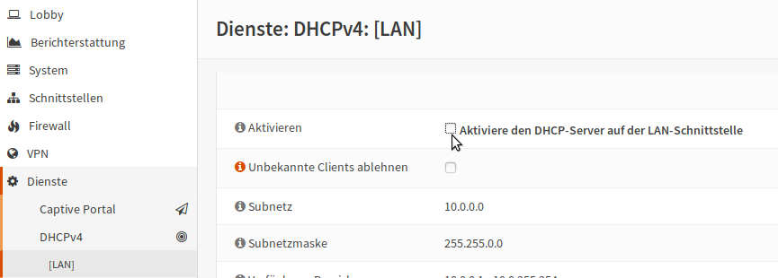

Gehe auf ``Dienste -> DHCPv4 -> [LAN]`` und lösche den Haken bei ``Aktivieren``. Speichere deine Einstellungen.

Zusätzliche Netzwerkkarte hinzufügen
------------------------------------

Die linuxmuster.net V7 läuft bereits mit zwei Netzwerkkarten. Möchtest du allerdings ein WLAN oder in einer DMZ einen Webserver betreiben, brauchst du noch eine Netzwerkkarte.
Wie das geht, siehst du im Folgenden:

.. figure:: media/OPNS26.png

Bei ``Schnittstellen -> Zuweisungen`` drückst du ``+`` um die dritte Schnittstelle deinem System hinzuzufügen. Diese dritte Schnittstelle ist dann als ``OPT1`` im System bekannt. OPT1 muss nur noch aktiviert und es muss ihr noch eine IP-Adresse zugewiesen werden.

.. figure:: media/OPNS27.png

Unter ``Schnittstellen -> [OPT1]`` kannst du diese Einstellungen vornehmen. Der Screenshot zeigt ein Beispiel.

ssh erlauben
------------

Damit der Server Zugriff auf die OPNSense hat, musst du einen ssh-Zugriff erlauben. Gehe dafür auf ``System -> Einstellungen -> Verwaltung``.

.. figure:: media/OPNS28.png

Setze einen Haken bei ``Aktiviere Secure Shell``, ``Erlaube Anmeldung mit dem root-Benutzer`` und ``Anmeldung mit Passwort erlauben``. Speichere die Einstellungen.

Falls du nicht ins Internet kommst, kann es an der Gateway-Einstellung liegen. Gehe auf ``System -> Gateways -> Einzeln`` und editiere deinen Gateway (WANGW).

Setze einen Haken bei ``Deaktiviere Gatewayüberwachung``, speichere die Einstellung und übernimm die Änderung. Jetzt ist dein Gateway online und du kommst ins Internet.

Erstaunlicherweise kannst du die Gatewayüberwachung wieder aktivieren, ohne dass der Gateway offline geht.

