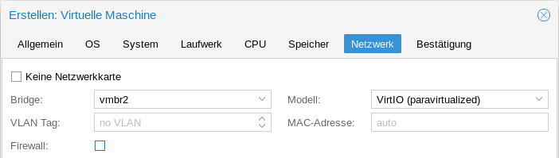
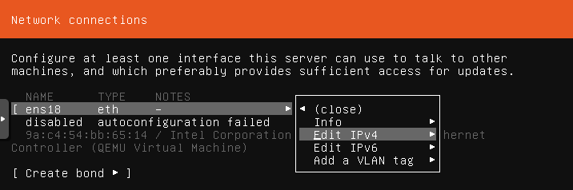
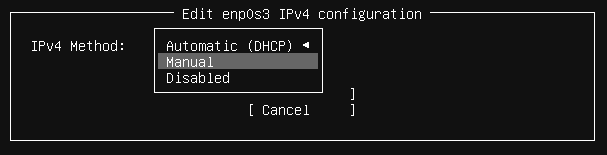
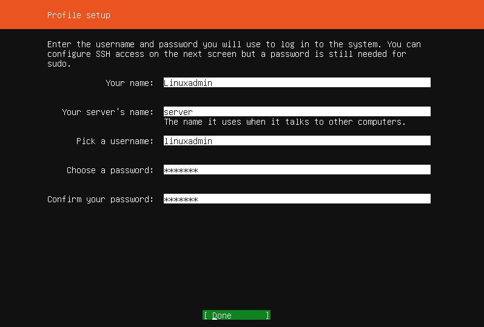

Anlegen und Installieren des Servers
====================================

Anlegen der VM Server7
----------------------

.. figure:: media/OPNS01.png

Klicke wieder in der linken Spalte den Proxmox-Host (hier pve) an. Dann drückst du oben links auf den blauen Knopf ``Erstelle VM``.

Jetzt öffnet sich ein Dialog, in dem du nach und nach die Daten der virtuellen Maschine eingibst.

.. figure:: media/server01.png

Gib diesmal die VM Id 301 ein. Dann erscheinen OPNSense und Server7 direkt untereinander.

.. figure:: media/server02.png

Für die Installation des Servers wählst du das iso-Image des Ubuntu 18.04 Servers.

.. figure:: media/server03.png

.. figure:: media/server04.png

Achte wieder darauf, dass die Serverfestplatte direkt auf dem Host gespeichert wird! Die zweite Festplatte fügst du später hinzu.

.. figure:: media/server05.png

.. figure:: media/server06.png

.. figure:: media/server08.png

Schließe die Installation mit einem Klick auf ``Abschließen`` ab. Im Ressourcenbaum erscheint nach ein paar Sekunden deine VM Server7 mit der ID 301.

Anlegen der zweiten Festplatte
------------------------------

Im Inhaltsbereich unter Hardware ist die Hardware deiner VM aufgelistet. Klicke auf ``Hinzufügen`` und wähle ``Laufwerk`` um die zweite Festplatte hinzuzufügen.

.. figure:: media/server09.png

Achte wieder darauf, dass auch die zweite Festplatte auf deinem Host liegt. Wie in :ref:`prerequisites-label` beschrieben, solltest du für die Datenfestplatte mindestens 500 GB wählen.

Wenn das erledigt ist, kannst du den Server starten.

.. figure:: media/server10.png

Der Start vom iso-Image kann schon ein paar Minuten dauern. Also nicht ungeduldig werden!

Wähle deine bevorzugte Sprache.

.. figure:: media/server11.png

Wähle das Tastaturlayout Deutsch.

.. hint:: Das Tastaturlayout wirkt sich während der Installation noch nicht aus! 

In der Voreinstellung ist die Netzwerkkarte auf DHCP eingestellt. Das klappt natürlich nicht, da der DHCP-Service der Firewall deaktiviert wurde. Du musst also die Konfiguration von Hand einstellen.

Gehe dazu auf die Netzwerkkarte und wähle ``Edit IPv4``.

Wähle ``Manual``.

.. figure:: media/server14.png

Gib die Netzwerkkonfiguration, wie im oberen Bild, ein.

.. hint:: Bedenke, dass das deutsche Tastaturlayout noch nicht aktiv ist. Den ``/``, den du für die Eingabe des Subnetzes brauchst, bekommst du mit der ``-``-Taste!

.. hint:: Falls Du dich für das Netz der linuxmuster.net V6.2 entschieden hast, konfigurierst du das Subnet 10.16.0.0/12, die Adresse 10.16.1.1, den Gateway 10.16.1.254 und den Name server 10.16.1.254. 

.. figure:: media/server15.png

Lass die Proxy-Adresszeile leer.

.. figure:: media/server16.png

Die Mirror-Adresse übernimmst du.

.. figure:: media/server17.png

.. figure:: media/server18.png

.. figure:: media/server19.png

Nenne den Server ``server``. Der Benutzername und das Passwort sind frei wählbar. 

.. figure:: media/server21.png

Installiere OpenSSH **nicht**.

Wenn die Installation abgeschlossen ist und der Server neu gestartet ist, meldest du dich als linuxadmin (Passwort Muster!) an.

Automatische Updates abschalten
-------------------------------

Der frisch installierte Ubuntu-Server hat automatische Updates aktivieret. Das solltest du abgeschalten.

Werde mit ``sudo -i`` root und Editiere beispielsweise mit nano die Datei ``/etc/apt/apt.conf.d/20auto-upgrades``:

``nano /etc/apt/apt.conf.d/20auto-upgrades``

Ersetze bei ``APT::Periodic::Unattended-Upgrade`` die ``"1";`` durch ``"0";``. Mit ``<Strg>+o`` speicherst du die Änderung ab. Und mit ``<Strg>+x`` verlässt du nano wieder.

Jetzt kannst du den Server mit ``apt-get update`` und anschließendem ``apt-get dist-upgrade`` updaten. 

Schlüssel importieren
---------------------

* Zunächst wirst du wieder root mit ``sudo -i``.
* Dann lädst du den key mit ``wget http://pkg.linuxmuster.net/archive.linuxmuster.net.key`` herunter.
* Jetzt fügst du den Schlüssel mit ``apt-key add archive.linuxmuster.net.key`` hinzu.

Das Skript lmn7-appliance
-------------------------

Das Skript lmn7-appliance installiert für dich das Paket linuxmuster-base7 mit all seinen Abhängigkeiten und es richtet die zweite Festplatte für den Serverbetrieb ein.

* Lade dazu das Skript mit ``wget https://archive.linuxmuster.net/lmn7/lmn7-appliance`` herunter.
* Mach es mit ``chmod +x lmn7-appliance`` ausführbar und
* führe ``./lmn7-appliance -p server -u -l /dev/sdb`` aus.

.. hint:: Falls Du dich für das Netz der linuxmuster.net V6.2 entschieden hast, führst du statt ``./lmn7-appliance -p server -u -l /dev/sdb`` ``./lmn7-appliance -p server -u -l /dev/sdb -n 10.16.1.1/12 -f 10.16.1.254`` aus.

Das war's auch schon fast. 

Automatischer Start
-------------------

Jetzt musst du nur noch dafür sorgen, dass beim Start des Proxmox-Hosts der Server und die Firewall automatisch starten.

.. figure:: media/server22.png

Klicke auf der linken Seite die VM an, für die du den Autostart aktivieren möchtest (im Bild ist das OPNSense). Doppelklicke unter ``Optionen`` den Punkt ``Beim Booten starten`` und setze den Haken bei ``Beim Booten starten``.

Das war's. Weiter geht's mit :ref:`Installation und Erstkonfiguration <setup-using-selma-label>`

 
