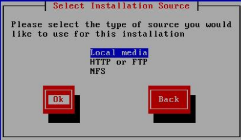
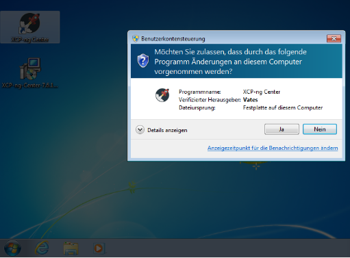
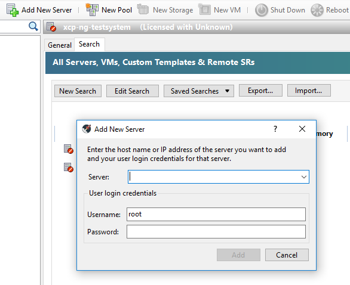
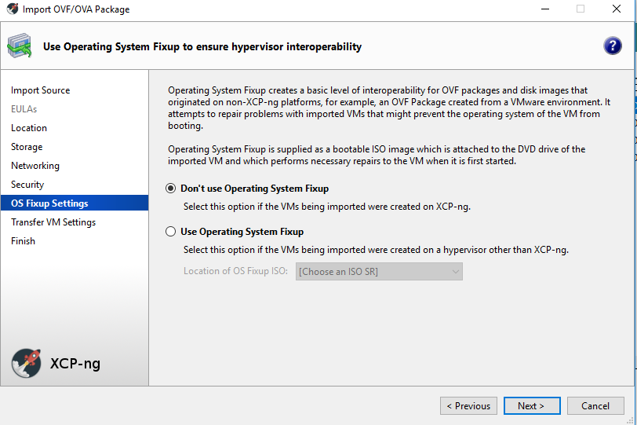
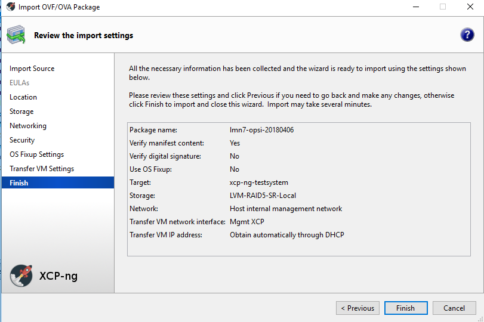
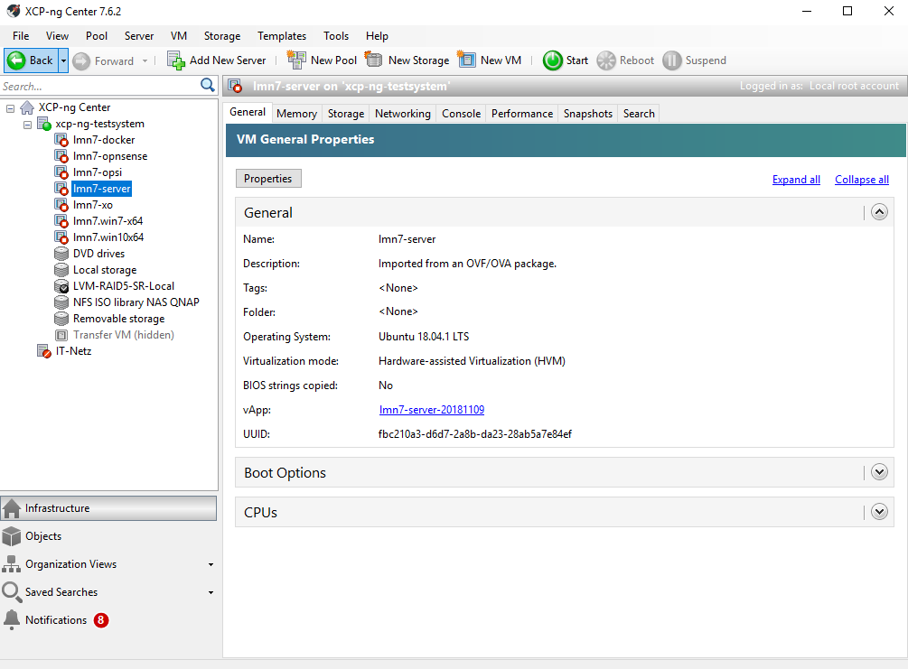
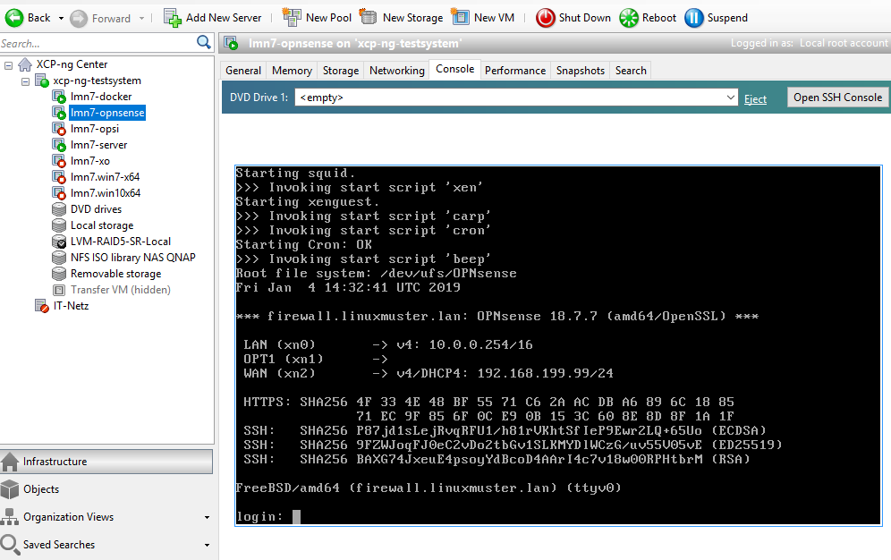
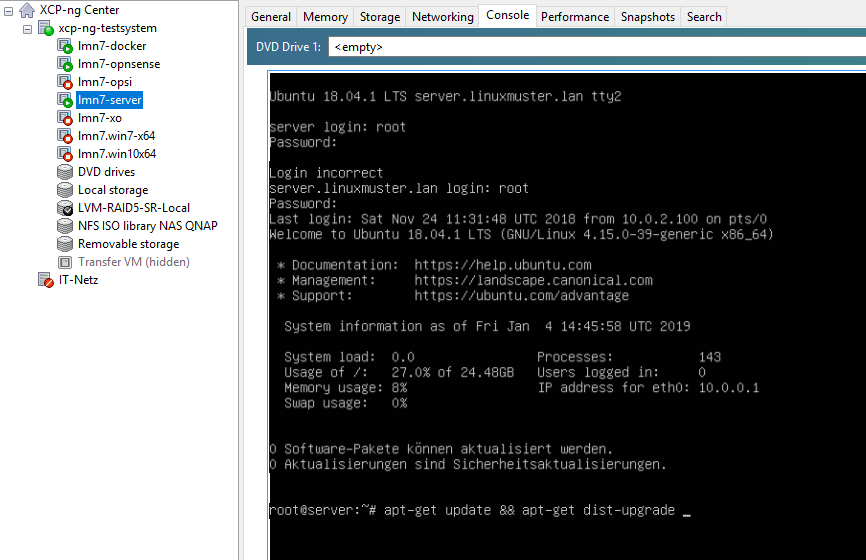

.. _install-on-xen-label:

============================
 Virtualisierung mit XCP-ng
============================

.. sectionauthor:: `@cweikl <https://ask.linuxmuster.net/u/cweikl>`_

XCP-ng ist eine reine OpenSource-Virtualisierungslösung, die auf Basis 
von XEN arbeitet. XCP-ng bietet sog. Enterprise-Features wie Replikation, 
automatisierte Backups, Verschieben von VMs im laufenden Betrieb und 
weitere Funktionen. Daher eignet sie sich besonders für den virtuellen 
Betrieb von linuxmuster.net, da diese recht einfach skalierbar ist,
mehrere Virtualisierungs-Hosts in einem sog. Ressource-Pool zusammengeführt
und verwaltet werden können.

Der Betrieb wird auf jeglicher Markenhardware und auf einer Vielzahl an 
NoName-Hardware unterstützt.

In diesem Dokument findest Du "Schritt für Schritt" Anleitungen zum
Installieren der linuxmuster.net-Musterlösung in der Version 7 auf
Basis von XCP-ng. Lies zuerst die Abschnitte :ref:`release-information-label` 
und :ref:`prerequisites-label`, bevor Du dieses Kapitel durcharbeitest.

Nach der Installation gemäß dieser Anleitung erhältst Du eine
einsatzbereite Umgebung bestehend aus

* einem Host (XCP-ng) für alle virtuellen Maschinen, 
* einer Firewall (OPNSense)  
* einem Serverm (linuxmuster.net)
* einer VM (XOA) zur web-basierten Verwaltung des Virtualisierungs-Hosts

Ähnliche, nicht dokumentierte, Installationen gelten für einen
OPSI-Server und einen Docker-Host, die dann ebenso auf dem XCP-ng-Host
laufen können.

Voraussetzungen
===============

* Es wird vorausgesetzt, dass Du einen Administrationsrechner
  (Admin-PC genannt) besitzt, den Du je nach Bedarf in die
  entsprechenden Netzwerke einstecken kannst und dessen
  Netzwerkkonfiguration entsprechend vornehmen kannst.

* Der Internetzugang des Admin-PCs und auch des XCP-ng-Hosts sollte
  zunächst gewährleistet sein, d.h. dass beide zunächst z.B. an einem
  Router angeschlossen werden, über den die beiden per DHCP oder fester IP 
  ins Internet können. Sobald später die Firewall korrekt eingerichtet
  ist, bekommt der Admin-PC und bei Bedarf auch der XCP-ng-Host eine
  IP-Adresse im Schulnetz.

.. hint:: 

   Virtualisierungs-Hosts sollten grundsätzlich niemals im gleichen Netz wie 
   andere Geräte sein, damit dieser nicht von diesen angegriffen werden kann.
   In dieser Dokumentation wird zur Vereinfachung der Fall dokumentiert, dass
   der XCP-ng-Host sich im internen Schulnetz befindet.

Bereitstellen des XCP-ng-Hosts
==============================

.. hint:: 

   Der XCP-ng-Host bildet das Grundgerüst für die Firewall *OPNsense* und
   den Schulserver *server*. Die Virtualisierungsfunktionen der CPU sollten 
   zuvor im BIOS aktiviert worden sein.

Die folgende Anleitung beschreibt die *einfachste* Implementierung
ohne Dinge wie VLANs, Teaming oder Raids. Diese Themen werden in
zusätzlichen Anleitungen betrachtet.

* :ref:`Anleitung Netzwerksegmentierung <subnetting-basics-label>` 

Erstellen eines USB-Sticks zur Installation des XCP-ng-Host
-----------------------------------------------------------

Für die Installation wird benötigt:

* ein Installationsdatenträger mit XCP-ng

Installation XCP-ng
===================

Herunterladen von XCP-ng
------------------------
Diese Anleitung bezieht sich auf die Version 7.6. Für nachfolgende Versionen ist 
dieses Vorgehen entsprechend anzuwenden.

Die ISO-Datei muss heruntergeladen und ein bootfähiger USB-Stick erstellt werden.

1. Herunterladen: `XCP Webseite <https://xcp-ng.org/#easy-to-install>`_

2. USB-Stick erstellen: In das Download-Verzeichnis wechseln, Buchstaben für 
USB-Stick unter Linux ermitteln, X durch den korrekten Buchstaben ersetzen und 
dann nachstehenden Befehl eingeben:

.. code-block:: console
 
   dd if=XCP-ng_7.6.0.iso of=/dev/sdX bs=8M status=progress oflag=direct

Installieren von XCP-ng
-----------------------

Vom USB-Stick booten, danach erscheint folgender Bildschirm:

.. figure:: media/xcp-ng/xcp-ng-install1.png
   :align: center
   :alt: Schritt 1 der Installation des XCP-ng Servers

Starten der Installtion mit ``ENTER``.

Wählen Sie Ihr Tastaturlayout.

.. figure:: media/xcp-ng/xcp-ng-install2.png
   :align: center
   :alt: Schritt 2 der Installation des XCP-ng Servers

Wir verwenden ``[querz] de``.

Sollten Sie zusätzliche Treiber benötigen können Sie diese nun laden in dem Sie ``F9`` 
drücken. Starten Sie das XCP-ng Setup mit ``Ok``.

.. figure:: media/xcp-ng/xcp-ng-install3-new.png
   :align: center
   :alt: Schritt 3 der Installation des XCP-ng Servers

Akzeptieren Sie danach die Lizenzbedingungen mit ``Accept EULA``.

.. figure:: media/xcp-ng/xcp-ng-install4-new.png
   :align: center
   :alt: Schritt 4 der Installation des XCP-ng Servers

XCP-ng prüft, ob bereits eine vorherige Version entwedern von XenServer oder ggf. auch 
von XCP-ng installiert war. Falls ja, bietet die Installationsroutine an, die 
bestehende Installation zu aktualisieren oder eine Neuinstallation vorzunehmen. Wählen 
Sie das gewünschte Vorgehen aus. Bei einer Aktualisierung legt XCP-ng zuvor eine 
Sicherheitskopie der bereits bestehenden Installation an, um ggf. wieder auf diese Version 
zurückkehren zu können.

.. figure:: media/xcp-ng/xcp-ng-install5-new.png
   :align: center
   :alt: Schritt 5 der Installation des XCP-ng Servers

Wählen Sie danach den Datenträger aus, der verwendet werden soll und setzen Sie den Haken 
bei „Enable thin provisioning“. Bestätigen Sie mit ``Ok``.

.. figure:: media/xcp-ng/xcp-ng-install6-new.png
   :align: center
   :alt: Schritt 6 der Installation des XCP-ng Servers

Bei einer Neuinstallation werden für das gewählte Medium dann die Partitionen erstellt, das 
Dateisystem erzeugt und alle Daten auf dem Medium gelöscht. Bei einem Upgrade bleiben die 
Daten erhalten.

Danach werden Sie nach der Installationsquelle gefragt. 

Geben Sie hier ``Local Media`` an.

Danach werden Sie gefragt, ob das Installationsmedium überprüft werden soll.

.. figure:: media/xcp-ng/xcp-ng-install8-new.png
   :align: center
   :alt: Schritt 8 der Installation des XCP-ng Servers

Bestätigen Sie dies mit ``Verfy installation source``.

Nach Abschluss der erfolgreichen Überprüfung des Installationsmediums wird dies bestätigt.

.. figure:: media/xcp-ng/xcp-ng-install9.png
   :align: center
   :alt: Schritt 9 der Installation des XCP-ng Servers

Legen Sie danach das Kennwort für den Administrator (user: root) fest und bestätigen Sie dieses.

.. figure:: media/xcp-ng/xcp-ng-install10.png
   :align: center
   :alt: Schritt 10 der Installation des XCP-ng Servers

Solltest Du kein Upgrade einer bestehenden Installation durchführen, 
so must Du noch die Netzwerkeinstellungen festlegen.

.. figure:: media/xcp-ng/xcp-ng-install11.png
   :align: center
   :alt: Schritt 11 der Installation des XCP-ng Servers

Vergebe hier eine statische IP-Adresse, mit der XCP-ng eine Internet-Verbindung aufbauen kann.

Lege die DNS-Server fest.

.. figure:: media/xcp-ng/xcp-ng-install12.png
   :align: center
   :alt: Schritt 12 der Installation des XCP-ng Servers

Lege danach die Systemzeit fest (manuelle Auswahl oder via NTP-Server).

.. figure:: media/xcp-ng/xcp-ng-install13.png
   :align: center
   :alt: Schritt 13 der Installation des XCP-ng Servers

Bei manueller Angabe der Systemzeit, wähle die Zeitzone aus.

Erst die Region wählen.

.. figure:: media/xcp-ng/xcp-ng-install14.png
   :align: center
   :alt: Schritt 14 der Installation des XCP-ng Servers

Danach die Stadt auswählen.

.. figure:: media/xcp-ng/xcp-ng-install15.png
   :align: center
   :alt: Schritt 15 der Installation des XCP-ng Servers

Bestätige danach die Frage nach der Installation von XCP-ng.

.. figure:: media/xcp-ng/xcp-ng-install16.png
   :align: center
   :alt: Schritt 16 der Installation des XCP-ng Servers

Danach startet die Installation

.. figure:: media/xcp-ng/xcp-ng-install17.png
   :align: center
   :alt: Schritt 17 der Installation des XCP-ng Servers

Die Frage nach INstallation eines ``Supplemental Pack`` ist mit ``No`` zu beantworten.

.. figure:: media/xcp-ng/xcp-ng-install18.png
   :align: center
   :alt: Schritt 18 der Installation des XCP-ng Servers

Nach erfolgreicher Installation kannSt Du mit ``Ok`` den Server neu starten.
Achte darauf, dass der USB-Stick nicht mehr für den Bootvorgang aktiv ist.

.. figure:: media/xcp-ng/xcp-ng-install19.png
   :align: center
   :alt: Schritt 19 der Installation des XCP-ng Servers

Beim Startvorgang erscheint folgende Auswahl:

.. figure:: media/xcp-ng/xcp-ng-install20.png
   :align: center
   :alt: Schritt 20 der Installation des XCP-ng Servers

XCP-ng wird nach einigen Sekunden automatisch gestartet.

.. figure:: media/xcp-ng/xcp-ng-install21.png
   :align: center
   :alt: Schritt 21 der Installation des XCP-ng Servers

Nach erfolgreichem Start bootet XCP-ng in folgende Konsole des Hypervisors:

.. figure:: media/xcp-ng/xcp-ng-install22.png
   :align: center
   :alt: Schritt 22 der Installation des XCP-ng Servers

Aktualisierung des XCP-ng-Hosts
-------------------------------

Wähle in dem Startbildschirm des XCP-ng Hosts den Menüpunt ``Local Command Shell``
und drücke ``Enter``. Gebe als Benutzer ``root`` an und das Passwort das Du 
während der Installation vergeben hast.

.. figure:: media/xcp-ng/xcp-ng-install23.png
   :align: center
   :alt: Schritt 23 der Installation des XCP-ng Servers

Gebe auf der Konsole den Befehl 

.. code-block:: console
 
   yum update

ein. XCP-ng fragt nun via Internetverbindung die Repositories ab und prüft, ob
Aktualisierungen vorhanden sind. Falls ja, werden die zu aktualisierenden Pakete 
angezeigt. Die Aktualisierung ist mit ``y`` zu starten.

Danach ist Dein XCP-ng Host auf dem aktuellen Stand.

XCP-ng: Administration
=======================

Für die Administration Deines XCP-ng-Hosts stehen Dir zwei Möglichkeiten zur Verfügung.
Zunächst solltest Du Dir auf einem Windows-Rechner im Netzwerk das Programm ``XCP-ng Center`` 
installieren. Hiermit kannst Du die gesamte Umgebund administrieren und insbesondere die 
vorkonfigurierten VMs einfach importieren. 

Zudem kann der XCP-ng-Host ebenfalls web-basiert administriert werden. Dies erfolgt mithilfe 
der Anwendung XenOrchestra (XOA - Xen Orchestra Application). linuxmuster.net stellt hierfür 
ebenfalls eine vorkonfigurierte VM mit einer installierten XOA App zur Verfügung. XOA wurde
hier "from stratch" installiert und an die lmn7 angepasst wurde.

XCP-ng Center installieren
--------------------------

Lade Dir das Windows-Programm zur Verwaltung von der Seite des XCP-ng Projekts herunter:

XCP-ng Center AktuelleVersion_

.. _AktuelleVersion: <https://github.com/xcp-ng/xenadmin/releases>

Installiere das Programm durch einen Rechtsklick auf die MSI-Datei auf dem Windows-Rechner und 
wähle dann ``Als Administrator ausführen`` aus.

.. figure:: media/administration/xcp-ng-admin1.png
   :align: center
   :alt: Installation XCP-ng Center

Bestätige die Rückfrage mit ``Ja``

Rufe nach erfolgreicher Installation das Programm ``XCP-ng Center`` auf.

Wähle hier den Menüpunkt ``Add New Server`` und gebe Sie bei der Installation
vergebene IP-Adresse des XCP-Hosts sowie die Benutzerdaten an.

Netzwerk einrichten
-------------------

Jetzt muss das Netzwerk eingerichtet werden. Notiere Dir hierzu die Bezeichnungen
und MAC-Adressen der eingebauten Netzwerkkarten. Diese findest Du unter der Reiterkarte ``NICs``.
Die Netzwerkkarte, die die Verbindung zum Internet übernehmen soll wird später dem Netzwerk ``Red``, 
diejenige für das interne Schulungsnetz dem Netzwerk ``Green`` und die dritte Netzwerkkarte 
für die Steuerung des WLAN dem Netzwerk ``Blue`` zugeordnet.

Damit dies korrekt erfolgt, ist es wichtig zu wissen, wie NIC 0,1,2 physikalisch angeschlossen sind
und welche MAC-Adressen diese aufweisen. Anhand der Informationen erfolgt dann im folgenden Schritt
die Zuordnung der Netze (vSwitche).

Wähle nun Für den XCP-ng-Host die Reiterkarte ``Networking`` aus.

.. figure:: media/administration/xcp-ng-admin4.png
   :align: center
   :alt: 4. Teil: Netzwerke einrichten

Wähle das erste Netwerk ``Network 0 `` aus, prüfe die Zurdonung der Netzwerkkarte. 
Es muss diejenige zugewiesen sein, die die Internet-Verbindung steuert. Klicke dann auf ``Properties`` 
und ändere den Namen für das Netzwerk in ``RED``.

Führe diese Schritte ebenfalls für die weitere Netze aus und ändere die Namen auf ``BLUE`` und ``GREEN``.

VMs importieren
---------------

Nachdem das Netzwerk korrekt eingerichtet wurde, können nun die VMs der linuxmuster.net 
importiert werden.

Lade Dir vorher zunächst alle VMs, die Du importieren möchtest unter linuxmuster.net herunter.

Danach rufe im XCP-ng Center den Menüpunkt ``File -> Import`` auf.

.. figure:: media/import-vms/xcp-ng-menue-import.png
   :align: center
   :alt: Import aufrufen

Es erscheint ein neues Fenster.

.. figure:: media/import-vms/xcp-ng-import-window.png
   :align: center
   :alt: Import: Speicherort auswählen

Gebe hier den Speicherort und den Dateinamen der zu importierenden VM an. Die VMs 
weisen die Dateiendung ``.ova`` auf.

.. figure:: media/import-vms/xcp-ng-import-filename.png
   :align: center
   :alt: Import: Datei mit Speicherort angeben

Nach Bestätigung mit ``Ok`` erscheint nun das erste Fenster, um den Import zu steuern.
Zunächst must Du den XCP-ng-Host festlegen, für den der Import der VM erfolgen soll.

.. figure:: media/import-vms/xcp-ng-import-part1.png
   :align: center
   :alt: Import: Heimserver angeben

Wähle danach Deinen gewünschten Speicher aus. Bestätige mit ``Next``.

.. figure:: media/import-vms/xcp-ng-import-part2.png
   :align: center
   :alt: Import: Speicher auswählen

Prüfe die Netzwerkeinstellungen, die von der zu importierenden VM stammen.

.. figure:: media/import-vms/xcp-ng-import-part3.png
   :align: center
   :alt: Import: Netzwerkangaben prüfen

Bestätige diese mit ``Next``.

Für die Security settings aktiviere die Option ``Verify manifest content``.

.. figure:: media/import-vms/xcp-ng-import-part4.png
   :align: center
   :alt: Import: Security settings

Bestätige diese mit ``Next``.

Bestätige die Vorauswahl mit ``Next``.

.. figure:: media/import-vms/xcp-ng-import-part6.png
   :align: center
   :alt: Import: Transver VM Settings

Bestätige das Management Network des XCP-Hosts als Transfer-Network.

Prüfe nun nochmals alle Einstellungen für den Import der VM.
Falls Änderungen erforderlich sind, gehe mit ``Previous`` zurück zur
gewünschten Einstellung.

Bestätige nun den Import mit ``Finish``.

Der Import kann einige Zeit dauern. Danach solltest Du die importierte 
VM im XCP-ng Center sehen können.

VMs starten und aktualisieren
-----------------------------

Wähle im XCP-ng Center links die VM aus, die Du starten möchtest.
Klicke danach oben in der Mnüleiste das Icon ``Start`` aus.

Beginne mit der Firewall Opnsense. Starte diese.

Melde Dich auf der Konsole mit den Daten ``root`` und ``Muster!`` an.

.. figure:: media/import-vms/xcp-ng-install-menue-opnsense.png
   :align: center
   :alt: Konsolenmenü OPNsense

Wähle danach in dem Konsolenmenü den Punkt 12) aus, um die Firewall zu 
aktualisieren.

.. figure:: media/import-vms/xcp-ng-install-opnsense-update-started.png
   :align: center
   :alt: Update der VM OPNsense

Bestätige diesen Vorgang mit ``y`` und warte bis die VM neu gestartet wurde.

Starte die VM mit dem linuxmuster.net Server.
Melde Dich mit o.g. Logindaten an, und aktualisiere die VM.

Bestätigen Sie das Update mit ``y``.

Sofern Du weitere VMs importiert hast, führe die Aktualisierungen
analog aus.

Für die weitere Einrichtung von linuxmuster.net für Deine Schule folge
der Dokumentation unter:

* :ref:`Installation und Erstkonfiguration <setup-using-selma-label>` 

Xen Orchestra (XOA)
-------------------

:fixme: Abb. und Text sind zu überarbeiten anzupassen 

.. note::
 Um XOA nutzen zu können, muss die xoa.lmn7 importiert sein!

Öffnen Sie einen Webbrowser und wechseln auf die Seite http://10.0.0.4. Geben Sie den User ``admin@admin.net`` mit dem Passwort ``Muster!`` ein und klicken Sie auf Login.

.. figure:: media/xoa/xoa-setup-part1.png
   :align: center
   :alt: XOA Schritt 1

Klicken Sie auf das Kachelsymbol rechts oben und wählen Settings.

.. figure:: media/xoa/xoa-setup-part1.png
   :align: center
   :alt: XOA Schritt 2

Tragen Sie links die IP-Adresse ``10.X.X.X`` ein und das Passwort, das Sie vergeben haben. Klicken Sie zum Übernehmen auf ``Save``.

.. figure:: media/xoa/xoa-setup-part1.png
   :align: center
   :alt: XOA Schritt 3

Wenn Sie mit der Maus über eine VM fahren erscheinen direkt einige Schaltflächen. Klicken Sie auf VM Console um eine Maschine zu bedienen.

.. figure:: media/xoa/xoa-setup-part1.png
   :align: center
   :alt: XOA Schritt 4

Sie können nun die Virtuelle Maschine bedienen.

.. figure:: media/xoa/xoa-setup-part1.png
   :align: center
   :alt: XOA Schritt 5

