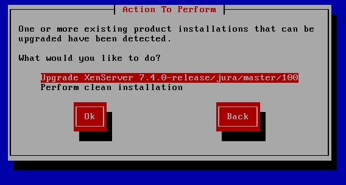
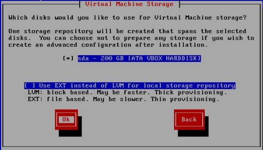
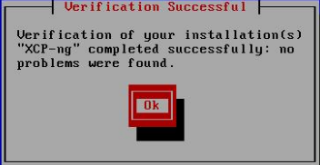
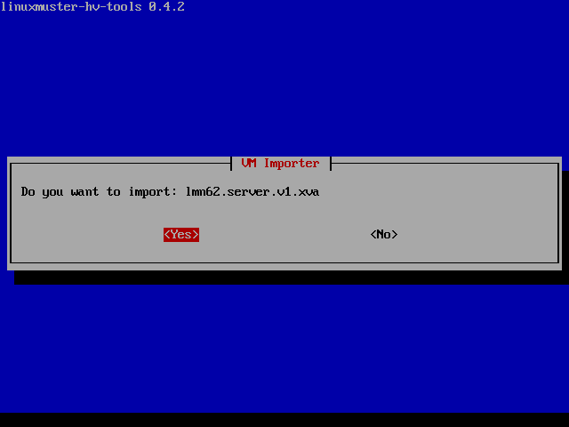
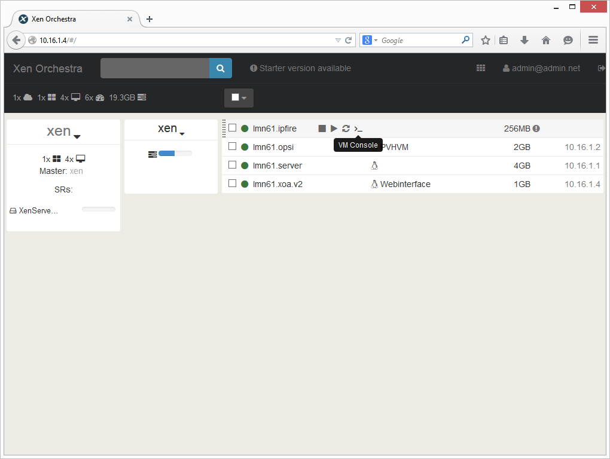

.. _install-on-xen-label:

============================
 Virtualisierung mit XCP-ng
============================

.. sectionauthor:: C. Weikl

XCP-ng ist eine reine OpenSource-Virtualisierungslösung, die auf Basis von XEN arbeitet und alle 
sog. Enterprise-Features wie Replikation, automatisierte Backups, Verschieben von VMs im laufenden Betrieb etc. 
bietet. Daher eignet sie sich besonders für den virtuellen Betrieb von linuxmuster.net, da diese recht einfach skalierbar ist und dann sog. Ressourcen-Pools erstellt und verwaltet werden können.

Der Betrieb wird auf jeglicher Markenhardware unterstützt und auf einer Vielzahl an NoName-Hardware.
linuxmuster.net hat die vorgefertigten virtuellen Maschinen in einem sog. SupplementalPack für XCP-ng zusammengefasst.
Dieses kann sehr einfach am Ende der Installation von XCP-ng zusätzlich während des Installationsprozesses installiert werden.

Für die Installation benötigen Sie lediglich

* einen Installationsdatenträger mit XCP-ng 7.4.1 (zu finden auf `XCP Webseite <https://xcp-ng.org/7.4/XCP-ng_7.4.1.iso>`_)
* sowie die Erweiterungs-DVD linuxmuster.net-SupplementalPack (zu finden auf `linuxmuster.net <http://www.linuxmuster.net>`_)

Nach der Installation gemäß dieser Anleitung erhalten Sie eine einsatzbereite Umgebung bestehend aus

* Server,
* Firewall (OPNsense),
* Web-Administrationsoberfläche (XOA) 
* Docker-Host,
* OPSI.

Installation XCP-ng
===================

Herunterladen von XCP-ng
------------------------

Der Hypervisor kann von der Projekthomepage https://xcp-ng.org/download/
heruntergeladen werden. Diese Anleitung bezieht sich auf die Version 7.4.1. 

Die ISO-Datei muss heruntergeladen und ein bootbarer USB-Stick erstellt werden.

1. Herunterladen: `XCP Webseite <https://xcp-ng.org/7.4/XCP-ng_7.4.1.iso>`_
2. USB-Stick erstellen: In das Download Verzeichnis Wechseln, Buchstaben für USB-Stick unter Linux ermitteln X durch den korrekten Buchstaben ersetzen und dann nachstehenden Befehl ein.

.. code-block:: console
 
   dd if=XCP-ng_7.4.1.iso of=/dev/sdX bs=8M status=progress oflag=direct

Installieren von XCP-ng
--------------------------

Vom USB-Stick booten und dem Setup folgen:

.. figure:: media/xcp-ng/xcp-ng-install1.png
   :align: center
   :alt: Schritt 1 der Installation des XCP-ng Servers

Wählen Sie Ihr Tastaturlayout. Wir verwenden ``[querz] de``.

.. figure:: media/xcp-ng/xcp-ng-install2.png
   :align: center
   :alt: Schritt 2 der Installation des XCP-ng Servers

Sollten Sie zusätzliche Treiber benötigen können Sie diese nun laden in dem Sie ``F9`` drücken und
akzeptieren Sie danach die Lizenzbedingungen mit ``Accept EULA``..

.. figure:: media/xcp-ng/xcp-ng-install3.png
   :align: center
   :alt: Schritt 3 der Installation des XCP-ng Servers

XCP-ng prüft, ob bereits eine vorherige Version ggf. auch von XCP-ng installiert war und bietet an, diese zu aktualisieren oder eine Neuinstallation vorzunehmen. Wählen Sie das gewünschte Vorgehen aus.

.. figure:: media/xcp-ng/xcp-ng-install4.png
   :align: center
   :alt: Schritt 4 der Installation des XCP-ng Servers

Wählen Sie danach den Datenträger aus, der verwendet werden soll und setzen Sie den Haken bei „Enable thin provisioning“. Bestätigen Sie mit ``Ok``.

:fixme: Andere Abb

.. figure:: media/xcp-ng/image5.png
   :align: center
   :alt: Schritt 5 der Installation des XCP-ng Servers

Danach werden Sie nach der Installationsquelle gefragt. Geben Sie hier ``Local Media`` an.

Danach werden Sie danach gefragt, ob Sie Zusatzpakete (SupplementalPacks) installieren möchten. Geben Sie hier ``Yes`` an. Später müssen Sie dann das entsprechende Medium auswählen, auf dem das Ihnen heruntergelade linuxmuster.net-supplemtalpack als ISO-Datei liegt.

Danach werden Sie gefragt, ob das Installationsmedium überprüft werden soll, bestätigen Sie dies mit ``Yes``.

Legen Sie danach das Kennwort für den Administrator (user: root) fest und bestätigen Sie dieses.

Bestätigen Sie die Frage nach der Installation von XCP-ng. Es werden für das gewählte Medium dann die Partitionen erstellt, das Dateisystem erzeugt und alle Daten auf dem Medium gelöscht.

Danach startet die Installation

.. figure:: media/xcp-ng/xcp-ng-install7.png
   :align: center
   :alt: Schritt 7 der Installation des XCP-ng Servers

Nach erfolgreicher Installation können Sie mit ``Ok`` den Server neu starten.

.. figure:: media/xcp-ng/xcp-ng-install8.png
   :align: center
   :alt: Schritt 8 der Installation des XCP-ng Servers

Beim Startvorgang erscheint folgende Auswahl

und nachstehender Startbildschirm

.. figure:: media/xcp-ng/xcp-ng-install10.png
   :align: center
   :alt: Schritt 10 der Installation des XCP-ng Servers

Nach erfolgreichem Start bootet XCP-ng in folgende Konsole des Hypervisors:

.. figure:: media/xcp-ng/xcp-ng-install11.png
   :align: center
   :alt: Schritt 11 der Installation des XCP-ng Servers

Danach gehen Sie weiter zur Initialisierung des Servers.

XCP-ng initialisieren
---------------------

:fixme: Andere Abbildungen angepasst auf das zu erstellen SupplementalPack

Wählen Sie auf der Konsole des XCP-ng Servers den Punkt ``Local Command Shell`` und drücken Sie ``Enter``.

.. figure:: media/xcp-ng/image26.png
   :align: center
   :alt: Schritt 26 der Installation des XCP-ngs

Geben Sie den Benutzer root an und das Passwort das Sie während der Installation vergeben haben.

.. figure:: media/xcp-ng/image27.png
   :align: center
   :alt: Schritt 27 der Installation des XCP-ngs

Geben Sie in der Konsole den Befehl ``linuxmuster-hv-setup --first`` ein und bestätigen Sie mit Enter

.. figure:: media/xcp-ng/image28.png
   :align: center
   :alt: Schritt 28 der Installation des XCP-ngs

Starten Sie die Installation mit ``Ok``

.. figure:: media/xcp-ng/image29.png
   :align: center
   :alt: Schritt 29 der Installation des XCP-ngs

Sofern genügend Netzwerkkarten vorhanden sind erscheint diese Meldung:

.. figure:: media/xcp-ng/image30.png
   :align: center
   :alt: Schritt 30 der Installation des XCP-ngs

Stecken Sie alle Netzwerkkabel außer das Netzwerkkabel GREEN (internes Schulnetz) aus. Es muss eine Verbindung zwischen Switch und Server stehen. Bestätigen Sie dann mit ``Ok``.

.. figure:: media/xcp-ng/image31.png
   :align: center
   :alt: Schritt 31 der Installation des XCP-ngs

Verbinden Sie nun die Netzwerkkarte RED mit Ihrem Modem oder Switch für das Netz RED. Es wird die betroffene Netzwerkkarte erkannt und  konfiguriert.

.. figure:: media/xcp-ng/image32.png
   :align: center
   :alt: Schritt 32 der Installation des XCP-ngs

Verbinden Sie nun das Netzwerk BLUE mit dem gewünschten Interface am Server.

.. figure:: media/xcp-ng/image33.png
   :align: center
   :alt: Schritt 33 der Installation des XCP-ngs

Legen Sie nun die CD „linuxmuster-SupplementalPack“ erneut in das Laufwerk ein und bestätigen Sie mit ``Ok``.

.. figure:: media/xcp-ng/image34.png
   :align: center
   :alt: Schritt 34 der Installation des XCP-ngs

Sie werden nun der Reihe nach abgefragt welche VMs Sie importieren wollen. Wählen Sie jeweils ``Yes`` bzw. ``No`` und bestätigen mit ``Enter``.

.. figure:: media/xcp-ng/image35.png
   :align: center
   :alt: Schritt 35 der Installation des XCP-ngs

.. figure:: media/xcp-ng/image37.png
   :align: center
   :alt: Schritt 37 der Installation des XCP-ngs

Entnehmen Sie nun die CD und bestätigen Sie mit ``Ok``.

.. figure:: media/xcp-ng/image38.png
   :align: center
   :alt: Schritt 38 der Installation des XCP-ngs

Sie werden nun gefragt ob Sie die Autostartfunktion nutzen wollen. Wenn Sie diese Funktion aktivieren können im Folgeschritt VMs ausgewählt werden, die beim Start des XCP-ngs automatisch gestartet werden sollen. Wählen Sie ``Yes`` oder ``No``.

.. figure:: media/xcp-ng/image39.png
   :align: center
   :alt: Schritt 39 der Installation des XCP-ngs

Sie werden nun der Reihe nach abgefragt welche VMs automatisch gestartet werden sollen. Wählen Sie jeweils ``Yes`` bzw. ``No`` und bestätigen Sie mit ``Enter``.

.. figure:: media/xcp-ng/image40.png
   :align: center
   :alt: Schritt 40 der Installation des XCP-ngs

.. figure:: media/xcp-ng/image41.png
   :align: center
   :alt: Schritt 41 der Installation des XCP-ngs

.. figure:: media/xcp-ng/image41a.png
   :align: center
   :alt: Schritt 41a der Installation des XCP-ngs

Sie können nun das System mit der Auswahl ``Yes`` neu starten.

.. figure:: media/xcp-ng/image42.png
   :align: center
   :alt: Schritt 42 der Installation des XCP-ngs

Das System fährt herunter und startet danach wieder. Die VMs, die Sie importiert haben, werden - sofern entsprechend konfiguriert - direkt gestartet und sind bereit für die Konfiguration.

XCP-ng: Administration
=======================

Für die Administration Ihrer virtualisierten Umgebung mit XCP-ng stehen Ihnen mehrere Möglichkeiten zur Verfügung.
Sofern Sie einen Windows-Rechner im Netzwerk haben, können Sie das Programm ``XCP-ng Center`` verwenden.

Für Linuxrechner gibt es einen Clone von XenCenter namens OpenXenManager.

Für eine web-basierte Administration können Sie, die VM „XOA.lmn7“ importieren.

XCP-ng Center
-------------

Laden Sie sich den Windows-Client von der Seite des XCP-ng Projekts herunter:

XCP-ng Center v7.4.2.7-RC3_

.. _v7.4.2.7-RC3: https://github.com/xcp-ng/xenadmin/releases/download/v7.4.2-RC3/XCP-ng_Center_7.4.2.7-RC3_Binaries.zip

Entpacken Sie das ZIP-Archiv auf dem Windows-Rechner inkl. der enthaltenen Verzeichnisse. Legen Sie sich einen Link auf den Desktop, der auf die Datei ``XCP-ng Center.exe`` verweist, die sich im soeben entpackten Verzeichnis befindet.

Starten Sie das Programm

:fixme: Weitere Erklärungen

Xen Orchestra (XOA)
-------------------

.. note::
 Um XOA nutzen zu können, muss die xoa.lmn7 importiert sein!

Öffnen Sie einen Webbrowser und wechseln auf die Seite http://10.0.0.4. Geben Sie den User ``admin@admin.net`` mit dem Passwort ``muster`` ein und klicken Sie auf Login.

.. figure:: media/administration/image48.png
   :align: center
   :alt: XOA Schritt 1

Klicken Sie auf das Kachelsymbol rechts oben und wählen Settings.

.. figure:: media/administration/image49.png
   :align: center
   :alt: XOA Schritt 2

Tragen Sie links die IP-Adresse ``10.X.X.X`` ein und das Passwort, das Sie vergeben haben. Klicken Sie zum Übernehmen auf ``Save``.

.. figure:: media/administration/image50.png
   :align: center
   :alt: XOA Schritt 3

Wenn Sie mit der Maus über eine VM fahren erscheinen direkt einige Schaltflächen. Klicken Sie auf VM Console um eine Maschine zu bedienen.

Sie können nun die Virtuelle Maschine bedienen.

.. figure:: media/administration/image52.png
   :align: center
   :alt: XOA Schritt 5

OpenXen Manager
---------------

Um OpenXen Manager zu verwenden müssen Sie zunächst das Paket installieren. Gehen Sie dazu wie folgt vor.

Öffnen Sie ein Terminal und geben folgenden Befehl ein:

.. code-block:: console

   $ nano /etc/apt/sources.list.d/netzint.list

.. figure:: media/administration/image53.png
   :align: center
   :alt: OpenXen Manager Schritt 1

Schreiben Sie nun in die Zeile:

.. code-block:: console

   deb http://pkg.netzint.de/ precise main

.. figure:: media/administration/image54.png
   :align: center
   :alt: OpenXen Manager Schritt 2

Verlassen Sie den Editor in dem Sie ``Strg+x`` drücken. Sie werden gefragt ob Sie die Änderungen speichern wollen. Drücken Sie ``Y`` und bestätigen den Speicherort/Dateinamen mit ``Enter``.

Schreiben Sie folgende Befehle in die Konsole und bestätigen Sie jeweils mit ``Enter``:

.. code-block:: console

   $ wget http://pkg.netzint.de/netzint.pub.key
   $ apt-key add netzint.pub.key

.. figure:: media/administration/image55.png
   :align: center
   :alt: OpenXen Manager Schritt 3

Schreiben Sie den Befehl ``apt-get update`` in die Konsole und drücken Sie ``Enter``.

.. code-block:: console

   $ apt-get update

.. figure:: media/administration/image56.png
   :align: center
   :alt: OpenXen Manager Schritt 4

Schreiben Sie den Befehl ``apt-get install netzint-xenmanager`` in die Konsole und drücken ``Enter``. Bestätigen Sie die Abfrage fortzufahren mit ``Y``.

.. code-block:: console

   $ apt-get install netzint-xenmanager

.. figure:: media/administration/image57.png
   :align: center
   :alt: OpenXen Manager Schritt 5

Nach der Installation starten Sie OpenXenmanager mit dem Befehl

.. code-block:: console

   $ xenmanager

.. figure:: media/administration/image58.png
   :align: center
   :alt: OpenXen Manager Schritt 6

Klicken Sie auf ``Add New Server`` und geben die IP-Adresse sowie den Benutzernamen root und das Passwort ein. Bestätigen Sie mit ``Connect``.

.. figure:: media/administration/image59.png
   :align: center
   :alt: OpenXen Manager Schritt 7

Sie sehen nun die Verwaltungsoberfläche mit der Sie den XCP-ng Server administrieren können.

.. figure:: media/administration/image60.png
   :align: center
   :alt: OpenXen Manager Schritt 8

