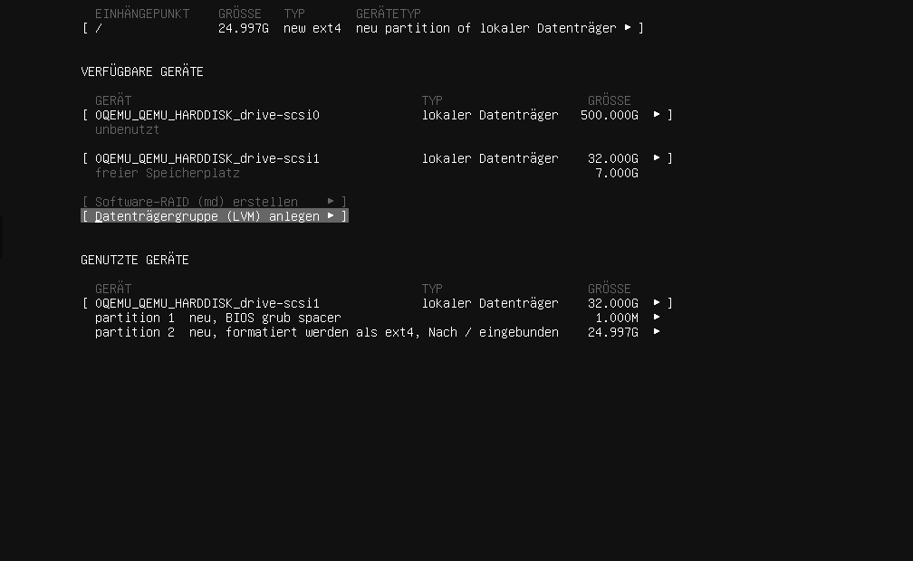
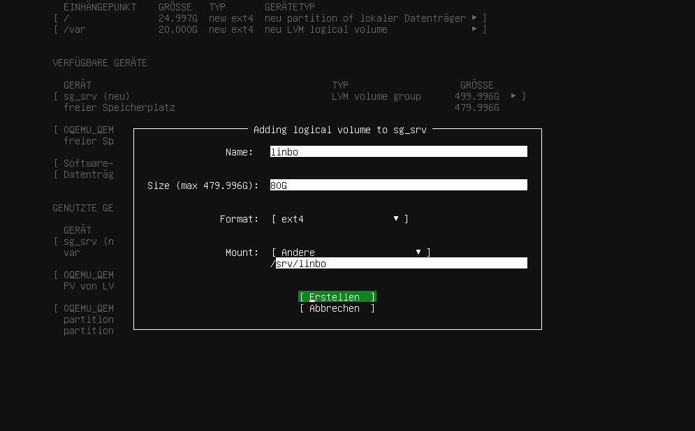
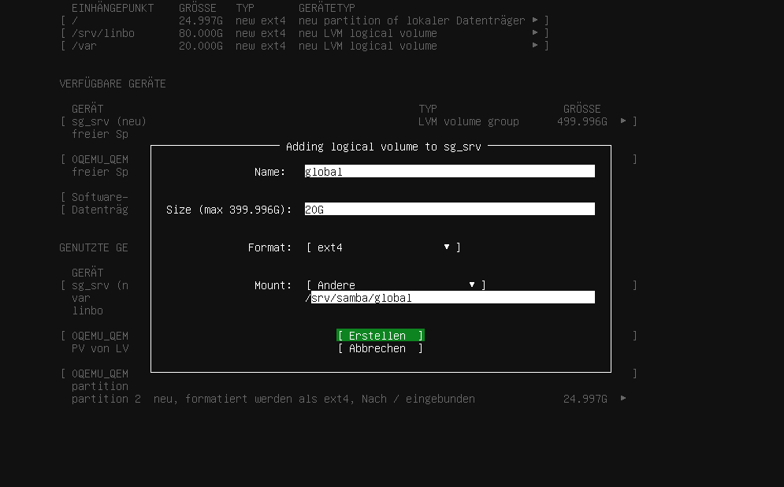

.. include:: ../../guided-inst.subst

.. _lvm_server-label:

LVM des Servers anpassen
========================

.. sectionauthor:: `@cweikl <https://ask.linuxmuster.net/u/cweikl>`_
                   `@MachtDochNiX <https://ask.linuxmuster.net/u/MachtDochNiX>`_

Die nachstehenden Hinweise sind dafür gedacht, 

.. tip::

  Alternativ kannst Du die zweite Platte mit anderen Größenangaben auch mit linuxmuster-prepare im Zuge des Setup ausführen. Möchtest Du dies so durchführen, kannst Du nachstehende Punkte überspringen.

Solltest Du Dich für eine andere Größeneinteilung oder für eine Einrichtung auf realen Festplatten entschieden haben, dann geht es hier für Dich weiter.

   ============== ========================== ================================= ==========
   LV Name        LV Pfad                    Mountpoint                        Größe
   ============== ========================== ================================= ==========
   var            /dev/sg_srv/var            /var                              20G
   linbo          /dev/sg_srv/linbo          /srv/linbo                        80G
   global         /dev/sg_srv/global         /srv/samba/global                 20G
   default-school /dev/sg_srv/default-school /srv/samba/schools/default-school 80G
   ============== ========================== ================================= ==========

Einrichtung eines LVM auf der 2. HDD
++++++++++++++++++++++++++++++++++++

   Lege ein LVM an

Wähle den Eintrag ``Datenträgergruppe (LVM) anlegen`` aus.

.. figure:: media/basis_server_016_lvm_002.png
   :align: center
   :scale: 80%
   :alt: create an lvm volume

   LVM-Volume erstellen

Hier gibst Du einen Namen für die LVM Volume Group an (z.B. sg_srv) und wählst das Gerät aus wo es erstellt werden soll. ``Erstellen`` schließt dieses Fenster.

#####

Bei ``VERFÜGBARE GERÄTE`` gilt es nun in die angelegte ``LVM volume group`` die benötigten ``Logical Volume`` anzulegen.

.. figure:: media/basis_server_016_lvm_003.png
   :align: center
   :scale: 80%
   :alt: create logical volume

   Lege ein Logical Volume an

Bei ``VERFÜGBARE GERÄTE`` findest Du die von Dir zuvor angelegte "LVM volume group". Diese markierst Du , um dann ``Create Logical Volume`` auszuwählen.

.. figure:: media/basis_server_016_lvm_004.png
   :align: center
   :scale: 80%
   :alt: define size of logical volume

   Lege die Größe des Logical Volume fest

Die benötigten Daten entnimmst Du aus der obigen Tabelle.
Die Zuordnung ist folgende:

========== === ===============================
``Name``   --> LV Name
``Size``   --> Größe
``Mount``  --> Mountpoint
========== === ===============================

Bei ``Format`` wählst Du, wie in der Grafik gezeigt "ext4".

Wieder schließt Du diese Aktion mit ``[Èrstellen]`` ab.

#####

Die letzten zwei Schritte wiederholst Du für die anderen Positionen der Tabelle |...|

|...| linbo:

.. figure:: media/basis_server_016_lvm_005.png
   :align: center
   :scale: 80%
   :alt: volume for linbo

   Volume für LINBO festlegen

   Größe für LINBO festlegen

#####

|...| global:

.. figure:: media/basis_server_016_lvm_007.png
   :align: center
   :scale: 80%
   :alt: define volume for global

   Volume für global festlegen

   Größe für global festlegen

#####

|...| default-school:

.. figure:: media/basis_server_016_lvm_009.png
   :align: center
   :scale: 80%
   :alt: define volume vor default-school

   Volume für default-school definieren

.. figure:: media/basis_server_016_lvm_010.png
   :align: center
   :scale: 80%
   :alt: define size for volume default-school

   Größe für das Volume default-school festlegen

######

Zum Abschluss werden Dir die Partitionsierungseinstellungen gemäß Deiner Eingaben angezeigt.

.. figure:: media/basis_server_016_lvm_011.png
   :align: center
   :scale: 80%
   :alt: overview partition settings

   Überblick über die Partitionseinstellungen

Einrichtung ohne LVM auf HDD
++++++++++++++++++++++++++++

Ohne LVM sind die Mount Points ``/var``, ``/srv/linbo``, ``/srv/samba/global`` und ``/srv/samba/schools/default-school`` auf die HDD(s) beziehungsweise auf einzelne Partitionen zu legen.

Auf eine detaillierte Beschreibung verzichten wir hier. Wir gehen davon aus, dass Du weißt, wie Du es umsetzen musst, wenn Du es so einrichten willst. 

Die vorhergehende Beschreibung bietet Dir sicherlich genügende Hinweise, daher verlinken wir sie hier noch einmal für Dich.

Quota-Einstellungen überprüfen
------------------------------

.. hint::

   Nachstehende Schritte musst Du nur durchführen, wenn Du **nicht** mit den default-Einstellungen installierst. 
   
   Überspringe diesen Punkt und gehe zu: `Bezeichnung des Speichermediums für das LVM ermitteln`_
   
   Hast Du bei der Installation des Servers als Speichermediem **kein LVM manuell** angelegt, dann führst Du nachstehende Schritte aus. In allen anderen Fällen überspringt Du diesen Schritt.

.. code:: 

   nano /etc/fstab

Mit diesem Aufruf öffnest Du die Datei ``/etc/fstab`` mit dem Editor nano auf, damit Du die Ersetzung von ``defaults`` durchführen kannst. Das ist der Ersetzungstext:

.. code::

   user_xattr,acl,usrjquota=aquota.user,grpjquota=aquota.group,jqfmt=vfsv0,barrier=1

Vor Deiner Ersetzung:

.. code::
 
   /dev/vg0/var              /var ext4 defaults 0 1
   /dev/vg0/linbo            /srv/linbo ext4 defaults 0 1
   /dev/vg0/global           /srv/samba/global ext4 defaults 0 1
   /dev/vg0/default-school   /srv/samba/schools/default-school ext4 defaults 0 1

Nach der Änderung:
 
.. code::
 
   /dev/vg0/var              /var ext4 defaults 0 1
   /dev/vg0/linbo            /srv/linbo ext4 defaults 0 1
   /dev/vg0/global           /srv/samba/global ext4 user_xattr,acl,usrjquota=aquota.user,grpjquota=aquota.group,jqfmt=vfsv0,barrier=1 0 1
   /dev/vg0/default-school   /srv/samba/schools/default-school ext4 user_xattr,acl,usrjquota=aquota.user,grpjquota=aquota.group,jqfmt=vfsv0,barrier=1 0 1
 
Speichere die Einstellung mit ``Strg+w`` und verlasse den Editor mit ``Strg+x``. 
 
Lade die Eintragungen aus der Datei ``/etc/fstab`` neu mit ``mount -a``. Ggf. erkennst Du auch noch Fehler, die sich aufgrund von Tippfehlern in der Datei /etc/fstab ergeben. Behebe diese zuerst, bevor Du fortfährst.
 
.. _lsblk-command:

Bezeichnung des Speichermediums für das LVM ermitteln
-----------------------------------------------------

Betrifft Dich nur, wenn Du die default-Einstellungen verwendest.

.. code::

   lsblk

Aus dessen Ausgabe kannst Du Namen für die weitere Verwendung ermitteln. Hier wäre er beispielhaft ``/dev/sdb/``

.. figure:: media/basis_server_024.png
   :align: center
   :scale: 80%
   :alt: output of lsblk command

   Ausgabe des lsblk - Befehls

.. note:: Notiere Dir HDD- und Partition-Bezeichnungen für die spätere Verwendung.

