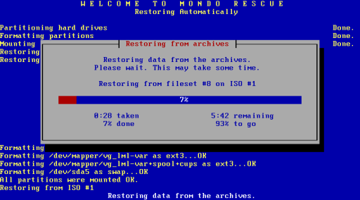

Restore eines Vollbackups
`````````````````````````

Nach der Eingabe von **nuke** am Bootprompt wird der Rechner vollautomatisch aus dem letzten Vollbackupset restauriert. Die Festplatte(n) werden partitioniert und formatiert. Raid- bzw. LVM-Systeme werden wiederhergestellt. Falls auf dem Zielsystem größere Festplatten vorhanden sind, werden die Partitionsgrößen dynamisch angepasst.

.. image:: media/restore/restore10.png

Anschließend wird der auf dem Backupmedium gefundene Vollbackupset, aus dem das zur Restauration verwendete ISO-Image ``mondorescue.iso`` stammt, wieder hergestellt.




Nach Abschluss des Restaurationsvorgangs erscheint noch ein Hinweis, den Sie mit **ENTER** bestätigen müssen,


.. image:: media/restore/restore12.png

um schließlich auf die Konsole zu gelangen.

.. image:: media/restore/restore13.png

Falls Sie keine differentiellen und inkrementellen Backupsets restaurieren müssen, geben Sie am Prompt exit ein, um in den frisch restaurierten Server zu booten. Was im anderen Fall ist noch zu tun ist, lesen Sie im Abschnitt  :doc:`restore-diff`.

