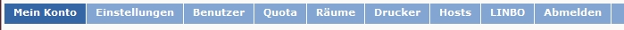
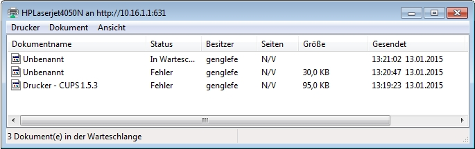
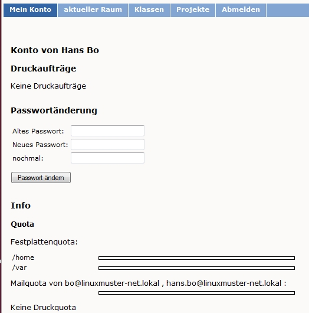

Wir nutzen die linuxmuster.net
==============================

Dieses Kapitel enthält Anleitungen und Übungen zur Nutzung der
*linuxmuster.net*
mit einer
*Windows*
-Arbeitsstation.

**Selbstheilende Arbeitsstationen (SheilA)**

einfaches und schnelles Restaurieren des PCs mittels Knopfdruck

**Erste Schritte im Netzwerk**

An- und Abmelden im Netzwerk, Netzlaufwerke, Netzwerkumgebung

**Rechte im Netzwerk**

Rechtevergabe, Homeverzeichnis, Tauschverzeichnisse

**Drucken im Netz**

Vorteile, Weg des Druckauftrags, Druckaufträge kontrollieren

Selbstheilende Arbeitsstationen
-------------------------------

In diesem Abschnitt wird das
*SheilA*
-Konzept ansatzweise vorgestellt bevor es in Kapitel
vertiefend besprochen wird.

In einem Schulnetz arbeiten sehr viele unterschiedliche Benutzer am selben Rechner. Viele Benutzer versuchen, ein System ihren eigenen Wünschen anzupassen oder Systemeinstellungen zu ändern und sei es nur die Einstellung eines anderen Bildschirmhintergrunds. Im schlimmsten Fall startet eine Arbeitsstation nach solchen „Benutzereingriffen“ überhaupt nicht mehr.

Als Administrator muss man für solche Probleme Lösungen bereit haben. Die einfachste Methode ist, auf einer verkonfigurierten Arbeitsstation das Betriebssystem und die Software von Hand neu einzuspielen, was allerdings einen erheblichen Arbeits- und Zeitaufwand bedeutet. Um sich gegen Benutzereingriffe zu schützen, kann man auch versuchen, ein System möglichst „dicht“ zu machen, indem man den Zugriff auf Systemprogramme und -verzeichnisse sperrt. Allerdings hat man dann aus Benutzersicht ein sehr eingeschränktes System, was die tägliche Arbeit erschwert. Außerdem werden
die Schüler/innen zu Hause oder später an Ihrem Arbeitsplatz kein solches System vorfinden.

Die
*linuxmuster.net*
verfolgt ein anderes Konzept, das der
*Selbstheilenden Arbeitsstationen*
(kurz
*SheilA*
). Das bedeutet, dass ein Abbild („Image“) der gesamten Festplatte der Arbeitsstation vom Administrator auf dem Server gespeichert wird. Ein Image ist ein Abbild einer Installation, das aus seiner lauffähigen Umgebung heraus verlagert wird und erst nach dem Zurückspielen wieder funktionstüchtig ist. Mit Hilfe dieses Festplattenimages kann dann eine Arbeitsstation auf Knopfdruck wieder in ihren ursprünglichen Zustand zurückversetzt werden.

Mit diesem Prinzip System kann man den Benutzern ein vollkommen offenes System anbieten. Selbst wenn ein Benutzer auf die Idee kommen sollte, die Festplatte zu formatieren,
kann er selbst den Schaden durch einfachen Tastendruck beheben. Die Schüler und Lehrer können somit am PC vollkommen angstfrei und unbefangen arbeiten und testen.

In Kapitel
wird das
*SheilA-*
Konzept dazu benutzt, die Installation eines Rechners auf weitere Rechner zu „klonen“. Man richtet dabei eine Arbeitsstation mit ihrem Betriebssystem und der Anwendungssoftware ein, übernimmt die anderen Stationen in diesem Raum ins System
und startet die Installation auf Knopfdruck (sofern die Hardware der Rechner weitgehend übereinstimmt).

Restauration auf Knopfdruck
~~~~~~~~~~~~~~~~~~~~~~~~~~~

Die Restauration auf Knopfdruck entspricht dem Zurückspielen eines Festplattenimages (bzw. nur der Dateien, die verändert wurden)
auf die Arbeitsstation. Dabei wird der Teil der Festplatte (Partition), der die Installation enthält, durch das
Image überschrieben und damit in seinen ursprünglichen Zustand zurückversetzt. Notfalls wird auch die Partitionierung erneuert.

Als Managementsystem für die Images wird hier *Linbo * eingesetzt.
*Linbo* legt zusätzlich zu den auf dem Server gespeicherten Abbildern
das aktuelle Image in einer speziell reservierten Partition auf der
lokalen Festplatte ab, um unnötigen Netzwerkverkehr zu vermeiden und
das Restaurieren zu beschleunigen.

*Linbo* ist außerdem in der Lage auf den Festplatten mehrere auch
unterschiedliche Betriebssysteme zu verwalten, für die dann jeweils
ein eigenes Image benutzt wird.

Im unten gezeigten Beispiel kann der Benutzer entscheiden, ob der Rechner mit *Ubuntu 10.04 LTS* oder *Windows XP* starten soll. In
Kapitel erfahren Sie, wie man *LINBO* konfiguriert, um
unterschiedliche Betriebssysteme wahlweise auf einem Netzwerkrechner
starten zu können.

Schaltet man eine bereits am Server aufgenommene Arbeitsstation ein, erscheint auf dem Bildschirm zunächst die LINBO-Startseite:

|100000000000031F0000025B651F9602_jpg|
Zu jedem Betriebssystem gibt es 4 Schaltflächen, die folgende Bedeutungen und Wirkungen haben:

*   |Nutzen_linbo_syncundstart_png|
    synchronisiert das System mit dem letzten aktuellen Image. Falls ein neueres Image auf dem Server liegt, wird dies zunächst heruntergeladen. Bei Windows-Syste
    men wird eine bereitgestellte Registry-Patch-Datei angewendet. Bei Linux-Systemen werden Hostname und Rootpartition gepatcht.

*   |Nutzen_linbo_start_png|
    startet das System im aktuellen Zustand, unsynchronisiert, keine Patches werden angewandt.

*   |100002010000002000000020BA4D51A8_png|
    formatiert zunächst die Partition und setzt dann das Betriebssystem komplett neu auf, verhält sich sonst wie Sync+Start.

*   |100002010000002000000020D7FFD0EC_png|
    Zeigt den Imagekommentar an, falls der Administrator bei der Erstellung einen eingegeben hat.

Der Bootvorgang und die damit zusammenhängenden Aspekte werden in Abschnitt
näher erläutert.

Für den Basiskurs wurde bereits je ein Image (Abbild der Festplatte) einer Ubuntu- und einer Windowsinstallation auf dem Server abgelegt, so dass Sie das Zurückspielen eines Festplattenimages mit Hilfe der folgenden Übung ausprobieren können.

#.  Zurückspielen eines Festplattenimages

    *   Starten Sie eine Ihrer Arbeitsstationen neu und beobachten Sie den Bootvorgang und das Laden von
        *LINBO*
        .

    *   Starten Sie den PC synchronisiert über den Schalter
        *Sync+Start.*

    *   Machen Sie einen Neustart und starten Sie dann mit
        *Start*
        .

    *   Nur wenn Sie sowieso einen Kaffee trinken wollten, starten Sie ein weiteres Mal mit dem Schalter
        *Neu+Start*
        , dann wird neu formatiert und das Image komplett zurückgespielt. Das dauert je nach Größe des Systems unterschiedlich lange.

Erste Schritte im Netzwerk
--------------------------

Die folgenden Schritte werden an Hand von
*Windows-XP*
illustriert. In ähnlicher Form gelten die dargestellten Grundzüge des Arbeitens im Netz auch für andere Windows- bzw. Linuxsysteme.

Anmelden
~~~~~~~~

Wenn man in einem Netzwerk arbeiten möchte, muss man sich mit einem Benutzernamen (= Loginname) und Kennwort (= Passwort) am Server anmelden (authentifizieren). Dieser Vorgang wird neudeutsch auch mit
einloggen

bezeichnet. In diesem Skript werden im Folgenden die Begriffe Benutzername und Passwort verwendet.

|10000000000004A8000002F73F6B6089_jpg|
Da auf den Arbeitsstationen das Netzwerk schon entsprechend eingerichtet ist, erscheint nach dem Start ein Anmeldefenster. Bei
*Anmelden an*
steht der Name der Domäne, an der man sich anmeldet. Die Domäne heißt bei der
*linuxmuster.net*
standardmäßig
SCHULE
.

Je nachdem, zu welcher Gruppe der Benutzername und das zugehörige Passwort gehören, hat man bestimmte Zugriffsrechte. Im Anhang finden Sie eine Liste der Benutzer, die für den Basiskurs eingerichtet wurden.

Nach dem Einloggen wird auf dem Server eine Batch-Datei gestartet, ein sog.
*Login-Skript. *
Dieses verbindet (
*mappt)*
, abhängig von der Benutzergruppe, der man angehört, Verzeichnisse auf dem Server mit Laufwerksbuchstaben auf der Arbeitsstation, stellt die lokale Zeit ein und weist evtl. Drucker zu.

Wenn der Netzwerkbetreuer es eingerichtet hat, kann man sich auch von außerhalb, z.B. von zu Hause, am Schulserver anmelden, auf seine Daten zugreifen, oder auch als
administrator
den Server administrieren. Näheres dazu finden Sie im Kapitel
.

Veränderungen gegenüber lokalem Windows
~~~~~~~~~~~~~~~~~~~~~~~~~~~~~~~~~~~~~~~

In der
*linuxmuster.net*
werden beim Anmelden automatisch bestimmte Verzeichnisse des Servers mit Laufwerksbuchstaben auf der Arbeitsstation verbunden. (Ist dies in anderen Netzwerken nicht der Fall, kann man über das Kontextmenü von
*Arbeitsplatz*
oder
*Netzwerkumgebung*
Netzlaufwerke verbinden oder trennen.)

In der folgenden Tabelle finden Sie die Netzlaufwerke für Lehrer. Der
*Uniform Resource Name (URN)*
gibt den Pfad an, unter dem ein bestimmtes Serververzeichnis im Netz zur Verfügung steht:

+---------+----------------+-------------------------------------+
| **LW**  | **URN**        | **Verzeichnispfad auf dem Server**  |
|         |                |                                     |
+---------+----------------+-------------------------------------+
| H:      | \\server\homes | /home/teachers/<benutzername>       |
|         |                |                                     |
+---------+----------------+-------------------------------------+
| K:      | \\server\pgm   | /home/samba/progs                   |
|         |                |                                     |
+---------+----------------+-------------------------------------+
| R:      | \\server\cdrom | /home/samba/cds                     |
|         |                |                                     |
+---------+----------------+-------------------------------------+

Im unten abgebildeten Explorer-Fenster sehen Sie für die Schülerin mit Benutzername
frayka
in der Ordnerübersicht die verbundenen Netzlaufwerke (
H:
,
K:
und
R:
) und unter
*Netzwerkumgebung*
die vom Netzwerk unter der Domäne
Schule
zur Verfügung gestellten Ressourcen. Im rechten Fenster sind die Ordner des im linken Fenster ausgewählten
*Home*
-Verzeichnisses der Schülerin angezeigt:

|10000000000003C9000002F09E76347A_jpg|
Welche Netzlaufwerke für die einzelnen Benutzergruppen zur Verfügung stehen, sehen Sie detailliert im Kapitel
dieses Skriptes.

Abmelden
~~~~~~~~

|10000000000001140000007A23EFDCBA_jpg|

Nach beendeter Arbeit sollte man sich immer vom Server abmelden, da
sonst nachfolgende Benutzer Zugriff auf persönliche Daten haben! Das
Abmelden geschieht über *Start | Abmelden* . Alternativ kann die
Arbeitsstation natürlich auch über *Start | Herunterfahren*
heruntergefahren werden.

#.  

#.  
    *   Starten Sie Ihren Rechner und melden Sie sich mit Benutzername und Passwort an. Achten Sie darauf, dass die richtige Domäne eingetragen ist.

    *   Starten Sie den
        *Windows-Explorer.*
        Welche Laufwerke sehen Sie?

    *   Versuchen Sie, auf den Netzlaufwerken Ordner anzulegen. Auf welchen Laufwerken funktioniert dies, auf welchen nicht?

    *   Klicken Sie im
        *Windows-Explorer*
        in der
        *Netzwerkumgebung*
        auf
        *Server;*
        Sie sehen nur ein Symbol
        *Drucker und Faxgeräte*
        .
        Geben sie jetzt als Adresse im Windows-Explorer
        \\server\pgm

        ein. Was ändert sich? Welche Ressourcen gibt es noch und mit welchem Laufwerksbuchstaben sind sie verbunden?

    *   Melden Sie sich als Benutzer ab.

    *   Versuchen Sie, die Netzwerkanmeldung zu umgehen, indem Sie [ESC] drücken. Was passiert?

    *   Trennen und verbinden Sie jetzt verschiedene Netzlaufwerke über das Kontextmenü von
        *Netzwerkumgebung *
        oder
        *Arbeitsplatz*
        . Kontrollieren Sie die Auswirkungen wiederum mit dem
        *Windows-Explorer.*

Rechte im Netzwerk
------------------

Rechtevergabe
~~~~~~~~~~~~~

Im Netz können Verzeichnisse und Dateien durch Rechtevergabe vor unberechtigtem Zugriff geschützt werden. Die Rechte werden vom a
dministrator
vergeben. Im Netz der
*linuxmuster.net*
existieren neben den Klassen- und Projektgruppen die Gruppen
* *
teachers

und
domadmins
, die jeweils spezifische Benutzerrechte besitzen. Wird ein neuer Benutzer angelegt, erhält dieser die Standardrechte der Gruppe, der er zugeordnet ist. So erhalten die Schülerinnen und Schüler als Mitglieder der Klassengruppen im Vergleich zur Lehrergruppe nur eingeschränkte Zugriffsrechte.

Das Homeverzeichnis
~~~~~~~~~~~~~~~~~~~

Im Homeverzeichnis legt ein Benutzer seine
persönlichen
Daten ab. Da dieses Verzeichnis auf dem Server liegt, kann er von allen Arbeitsstationen im Netz darauf zugreifen. Das Homeverzeichnis verhält sich für den Benutzer so, als wäre es ein lokales Laufwerk (
H:
). Der Benutzer selbst darf schreiben und lesen, d.h. alle Dateien öffnen, speichern und löschen. Alle anderen Benutzer haben keinerlei Zugriff auf das Homeverzeichnis.

**Ausnahmen:**
Der Linux-Administrator
root
hat Lese- und Schreibzugriff auf alle Dateien und Verzeichnisse auf dem Server.

Mitglieder
der Gruppe
teachers
können alle Dateien in den Homeverzeichnissen ihrer Schüler lesen aber
nicht
verändern.

Die Tauschverzeichnisse
~~~~~~~~~~~~~~~~~~~~~~~

Zum Datenaustausch zwischen den Benutzern existieren sog. Tauschverzeichnisse auf dem Server. Alle Tauschverzeichnisse, auf die ein Benutzer Zugriff hat, findet er unter
H:\__tauschen
. Darunter gibt es:

*   tausch-schule
    für alle Benutzer/innen,

*   tausch-lehrer
    nur für die Lehrer/innen,

*   tausch-<Klassen/Projektbezeichnung>
    nur für Schüler einer bestimmten Klasse bzw. eines Projektes, sowie für Lehrer, die in die entsprechenden Klassen bzw. Projekte eingetragen sind.

**Achtung:**
Jeder berechtigte Benutzer kann in den Tauschverzeichnissen Dateien abspeichern und Ordner anlegen. In seine eigenen neu angelegten Ordner kann nur der Anleger selbst wiederum Dateien abspeichern oder weitere Ordner anlegen. Alle anderen Benutzer haben in diesen Ordnern nur Lesezugriff.

Eine Ausnahme gilt für den Benutzer
administrator
, der in den Home- und Tauschverzeichnissen auch fremde Dateien und Ordner löschen darf.

Weitere wichtige Verzeichnisse
~~~~~~~~~~~~~~~~~~~~~~~~~~~~~~

Die Programmfreigabe (
verbunden mit Laufwerk
K:
) enthält die von den Benutzern
administrator
oder
pgmadmin
serverbasiert installierten Windows-Anwendungen. Andere Benutzer haben hier nur Leserechte.

Die CDROM-Freigabe (verbunden mit Laufwerk
R:
) enthält die im Schulnetz zur Verfügung gestellten CD-Images. Auch hier haben nur die Benutzer
administrator
und
pgmadmin
Schreibrecht, alle anderen Benutzer Leserecht.

#.  Umgang mit Netzlaufwerken

    *   Melden Sie sich als Lehrer
        *zell*
        an einer
        *Windows*
        -Arbeitsstation an.

    *   Überprüfen Sie, welche Dateioperationen Sie in Ihrem Homeverzeichnis
        H:\
        ausführen können (erstellen Sie einen Ordner, eine Textdatei, verändern Sie den Inhalt, kopieren Sie die Datei, benennen Sie die Datei um, löschen Sie eine der beiden Dateien).

    *   Welche Dateioperationen können Sie in den Tauschverzeichnissen auf
        H:\__tauschen
        ausführen? (Dateien/Ordner kopieren, verschieben, anlegen, löschen)

    *   Melden Sie sich nun an der zweiten
        *Windows*
        -Arbeitsstation als Lehrer
        *ba*
        an.

    *   Schreiben Sie den Lehrern jeweils gegenseitig einen Brief und speichern Sie ihn in den verschiedenen Tauschverzeichnissen. Können Sie jeweilsden Brief des anderen Lehrers löschen?

    *   Versuchen Sie, auf das Homeverzeichnis des anderen Lehrers zuzugreifen.

    *   Versuchen Sie, im Programmverzeichnis
        K:\
        eine Datei zu erstellen.

    *   Melden Sie sich ab und melden Sie sich als Schüler an.

    *   Wiederholen Sie die Übungen von oben nun als Schüler.

    *   Welche Unterschiede gibt es zu vorher?

    *   Spielen Sie verschiedene Schüler-Lehrer-Situationen durch. (L. legt Datei an, S. versucht, sie zu öffnen, zu löschen, zu verändern, zu kopieren etc.)

Möglichkeiten der Schulkonsole
------------------------------

Mit der
*Schulkonsole*
steht ein webbasiertes Werkzeug zur Verfügung, das vielfältige Möglichkeiten für den Unterricht mit der
*linuxmuster.net*
bietet und die Administration des Systems sehr erleichtert.

Gestartet wird die Schulkonsole durch Eingabe von
https://<servername>:242
in einem Webbrowser. (Die Schulkonsole ist optimiert auf die Darstellung in
*Mozilla Firefox*
.)

Es erscheint dann die Anmeldemaske, an der man sich mit Benutzername und Passwort einloggen muss.

Startseite und Seitenaufbau
~~~~~~~~~~~~~~~~~~~~~~~~~~~

Schüler, Lehrer und Administrator sehen nach der Anmeldung die gleiche Startseite:

|100000000000020C0000021283454186_jpg|

H
ier kann der angemeldete Benutzer

*   eigene Druckaufträge löschen

*   sein Passwort ändern und

*   Informationen über den

    *   verbrauchten Plattenplatz (Quota)

    *   seine Projekte erhalten.

*   Außerdem besteht unten auf der Startseite die Möglichkeit ein
    *OpenVPN*
    -Zertifikat zu erstellen, um die Möglichkeit zu bekommen, gesichert von außen (z.B. von zu Hause aus) auf den Server zugreifen zu können.

Die detaillierten Beschreibungen zu den Möglichkeiten finden Sie in Kapitel
.

**Die Seiten der Schulkonsole haben alle folgenden prinzipiellen Aufbau**
:

*   Oben unterhalb des „Logos” befindet sich in der Mitte die Hauptnavigationsleiste, die
    bei den Schülern nur aus den Optionen
    *Startseite*
    und
    *Abmelden*
    besteht.

*   In der linken Spalte befindet sich die Unternavigation, wenn zu der gewählten Option aus der Hauptnavigation eine solche zur Verfügung steht.

*   In der mittleren Spalte werden die Inhalte angezeigt.

*   Die rechte Spalte enthält oben ein Statusfenster, das im Normalfall grün und im Fehlerfall rot hinterlegt ist. Es enthält im Fehlerfall eine entsprechende Rückmeldung.

*   Unterhalb des Statusfensters stehen Erläuterungen und Hilfestellungen zu der ausgewählten Option aus der Navigation.

Die Möglichkeiten des Lehrers
~~~~~~~~~~~~~~~~~~~~~~~~~~~~~

Der Lehrer hat folgende Optionen in der Hauptnavigation:

*   |10000000000001E00000001E5B324081_jpg|
    *aktueller Raum*
    :

    *   Internet, Intranet, Webfilter und Drucker
        für Einzelne oder den ganzen Raum ein- oder ausschalten

    *   Tauschverzeichnisse für einzelne oder den ganzen Raum sperren oder freigeben

    *   Dateien an einzelne oder den ganzen Raum austeilen oder einsammeln

    *   den Klassenarbeitsmodus einschalten

*   *Klassen*
    :

    *   Klassenlisten anzeigen

    *   Schüler-Passwörter verwalten

    *   Dateien an einzelne oder die ganze Klasse austeilen, bereitstellen oder einsammeln

    *   Tauschverzeichnisse ein- oder ausschalten

    *   den Klassenarbeitsmodus aktivieren

*   *Projekte*
    :

    *   Projekte anlegen (inkl. gemeinsamer Tauschverzeichnisse)

    *   Mitglieder verwalten

    *   Dateien an einzelne oder alle Mitglieder des Projekts austeilen, bereitstellen oder einsammeln

    *   Tauschverzeichnisse ein- oder ausschalten,

Die detaillierten Beschreibungen zu den Möglichkeiten des Lehrers finden Sie in Kapitel
.

Die Möglichkeiten des Administrators
~~~~~~~~~~~~~~~~~~~~~~~~~~~~~~~~~~~~

|10000000000002BB0000002277E0D4F1_jpg|
Der Administrator hat folgende Optionen in der Hauptnavigation:

*   *Einstellungen*
    :

    *   Quota (Festplattenplatzkontrolle) ein/ausschalten

    *   Festlegung der Standardquota

    *   Erstellungsregel der Benutzernamen festlegen

    *   Zufallspasswörter einrichten

    *   schulweites Tauschverzeichnis zulassen

    *   Duldungs- und Reaktivierungszeitraum gelöschter Benutzer festlegen

    *   weitere Grundeinstellungen

*   *Benutzer*
    :

    *   Benutzerlisten pflegen

        *   Schüler

        *   Lehrer

        *   Externe Schüler

        *   Kurse mit externen Teilnehmern

    *   Benutzerlisten überprüfen, Ähnlichkeiten feststellen

    *   Benutzer neu aufnehmen

    *   Benutzer versetzen

    *   Benutzer löschen

    *   Berichte/Protokolle zum Anlegen und Prüfen erstellen

*   *Quota*
    :

    *   für einzelne Benutzer festlegen

    *   für ganze Klassen festlegen

    *   zusätzliche Quota für Projekte vergeben

*   *Räume*
    :

    *   Räume als Computerräume ausweisen, damit dann von Lehrern der Zugriff auf Internet, Drucker, ... in diesen Räumen gesteuert werden kann, auch wenn sie selber nicht an einem Rechner dieses Raumes angemeldet sind.

    *   Standardeinstellungen für Räume vornehmen

*   *Drucker*
    :

    *   Nutzung von Druckern für Räume oder auch einzelne PCs festlegen

*   *LINBO:*

    *   Gruppenkonfigurationen verwalten und erstellen

    *   Registry Patches erstellen und ggf. editieren

    *   Basisimages und differentielle Images verwalten

*   *Hosts*
    :

    *   Aufnahme von Rechnern und Druckern in das System, zwecks Zuweisung einer Netzwerkadresse und Teilnahme am Imageverfahren über
        *Linbo*

Damit kann der
administrator
die normalerweise anfallenden Administrationsarbeiten über die Schulkonsole tätigen und muss nur in Ausnahmefällen auf die Konsole des Servers zugreifen.

Die detaillierten Beschreibungen zu
*Einstellungen, Benutzer*
und
*Quota*
finden Sie in Kapitel
, die zu
*Räume*
und
*Drucker*
in Kapitel
und die zu
Hosts
in Kapitel
.

Drucken im Netz
---------------

Vorteile
~~~~~~~~

Die Vorteile eines Netzwerkdruckers gegenüber einem lokal angeschlossenen Drucker sind:

*   alle Arbeitsstationen im Netzwerk können den Drucker nutzen

*   der Wartungsaufwand wird reduziert

*   die Kontrolle der Zugriffsberechtigungen wird möglich

*   die Kosten werden gesenkt.

Einbindung eines Druckers in das lokale Netzwerk
~~~~~~~~~~~~~~~~~~~~~~~~~~~~~~~~~~~~~~~~~~~~~~~~

|100000000000028C00000119D5F4DF9B_png|
Es gibt drei Möglichkeiten, einen Drucker in das lokale Netzwerk einzubinden:

Der Weg des Druckauftrags
~~~~~~~~~~~~~~~~~~~~~~~~~

|100000000000033E000001BCB2A526D6_png|

Die Druckerwarteschlange
~~~~~~~~~~~~~~~~~~~~~~~~

Zur Druckerwarteschlange auf einem Windowsrechner gelangt man über
*Start / Einstellungen / Drucker und Faxgeräte *
mit einem Doppelklick auf
*Drucker*
. Die Druckerwarteschlange listet die Druckaufträge aller Benutzer/innen an diesem Rechner auf.

|10000000000002AD000000D831E9D331_jpg|
Löschen von Druckaufträgen
~~~~~~~~~~~~~~~~~~~~~~~~~~

Im Kontextmenü des Druckauftrages (Rechtsklick) wird durch Auswahl der Option
Druckauftrag abbrechen

der ausgewählte Druckjob gelöscht. Es lassen sich nur eigene Druckjobs löschen.

|10000000000002AA000000D6FA568E68_jpg|

#.  
    *   Schicken Sie, nachdem die Kursleitung den Netzwerkdrucker des Schulungsraums abgeschaltet hat, einen Text zum Drucker.

    *   Kontrollieren Sie, ob sich Ihr Druckauftrag in der Warteschlange befindet.

    *   Löschen Sie Ihren Druckauftrag aus der Warteschlange.

    *   Versuchen Sie den Druckauftrag Ihres Nachbarn zu löschen. Geht das?

.. |100000000000031F0000025B651F9602_jpg| image:: media/100000000000031F0000025B651F9602.jpg
    :width: 12.001cm
    :height: 9.041cm

.. |10000000000002AA000000D6FA568E68_jpg| image:: media/10000000000002AA000000D6FA568E68.jpg
    :width: 12.001cm
    :height: 3.74cm

.. |100000000000028C00000119D5F4DF9B_png| image:: media/100000000000028C00000119D5F4DF9B.png
    :width: 11.501cm
    :height: 4.95cm

.. |10000000000001E00000001E5B324081_jpg| image:: media/10000000000001E00000001E5B324081.jpg
    :width: 12.001cm
    :height: 1.001cm

.. |10000000000001140000007A23EFDCBA_jpg| image:: media/10000000000001140000007A23EFDCBA.jpg
    :width: 9cm
    :height: 3.98cm

.. |10000000000003C9000002F09E76347A_jpg| image:: media/10000000000003C9000002F09E76347A.jpg
    :width: 12.001cm
    :height: 8.591cm

.. |10000000000004A8000002F73F6B6089_jpg| image:: media/10000000000004A8000002F73F6B6089.jpg
    :width: 12.001cm
    :height: 7.64cm

.. |100000000000033E000001BCB2A526D6_png| image:: media/100000000000033E000001BCB2A526D6.png
    :width: 11.501cm
    :height: 6.141cm

.. |100002010000002000000020D7FFD0EC_png| image:: media/100002010000002000000020D7FFD0EC.png
    :width: 1.127cm
    :height: 1.127cm

.. |100002010000002000000020BA4D51A8_png| image:: media/100002010000002000000020BA4D51A8.png
    :width: 1.127cm
    :height: 1.127cm

