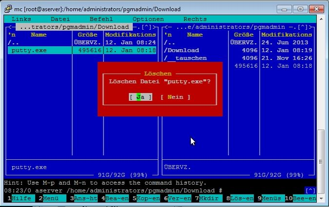
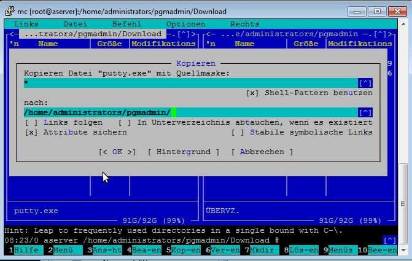
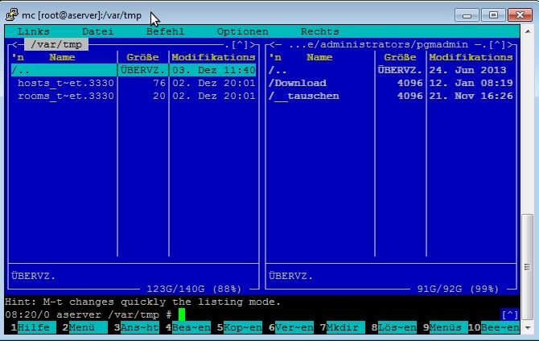

Anhang
======

Basiskurs: Benutzer mit Passwörtern
-----------------------------------

Auf dem Server sind für den Basiskurs die folgenden Benutzer eingerichtet, die alle das Passwort „muster“ haben:

+------------------+---------------------------------+
| **Anmeldename**  | **Benutzergruppe/Bemerkungen**  |
|                  |                                 |
+==================+=================================+
| frayka           | students                        |
|                  |                                 |
+------------------+---------------------------------+
| genglefe         |                                 |
|                  |                                 |
+------------------+---------------------------------+
| ilkesju          |                                 |
|                  |                                 |
+------------------+---------------------------------+
| imbroghe         |                                 |
|                  |                                 |
+------------------+---------------------------------+
| kruegeri         |                                 |
|                  |                                 |
+------------------+---------------------------------+
| gaissijo         |                                 |
|                  |                                 |
+------------------+---------------------------------+
| gelhaata         |                                 |
|                  |                                 |
+------------------+---------------------------------+
| gengleac         |                                 |
|                  |                                 |
+------------------+---------------------------------+
| hartmape         |                                 |
|                  |                                 |
+------------------+---------------------------------+
| schirrmo         |                                 |
|                  |                                 |
+------------------+---------------------------------+
| serdarje         |                                 |
|                  |                                 |
+------------------+---------------------------------+
| ba               | teachers                        |
|                  |                                 |
+------------------+---------------------------------+
| bz               |                                 |
|                  |                                 |
+------------------+---------------------------------+
| bo               |                                 |
|                  |                                 |
+------------------+---------------------------------+
| de               |                                 |
|                  |                                 |
+------------------+---------------------------------+
| dorn             |                                 |
|                  |                                 |
+------------------+---------------------------------+
| do               |                                 |
|                  |                                 |
+------------------+---------------------------------+
| schoen           |                                 |
|                  |                                 |
+------------------+---------------------------------+
| zell             |                                 |
|                  |                                 |
+------------------+---------------------------------+
| zem              |                                 |
|                  |                                 |
+------------------+---------------------------------+

+------------------+-----------------------------------------------------------------------+
| **Anmeldename**  | **Benutzergruppe/Bemerkungen**                                        |
|                  |                                                                       |
+==================+=======================================================================+
| r100-pc01        | Klassenarbeitsnutzer                                                  |
|                  |                                                                       |
+------------------+-----------------------------------------------------------------------+
| ...              |                                                                       |
|                  |                                                                       |
+------------------+-----------------------------------------------------------------------+
| r100-pc22        |                                                                       |
|                  |                                                                       |
+------------------+-----------------------------------------------------------------------+
| administrator    | Administrator für Schulbetrieb                                        |
|                  |                                                                       |
+------------------+-----------------------------------------------------------------------+
| pgmadmin         | Administrator für Programminstallation auf                            |
|                  | *Windows*                                                             |
|                  | -Arbeitsstationen                                                     |
|                  |                                                                       |
+------------------+-----------------------------------------------------------------------+
| domadmin         | Administrator nur zur Domänenaufnahme bei                             |
|                  | *Windows*                                                             |
|                  | -Arbeitsstationen                                                     |
|                  |                                                                       |
+------------------+-----------------------------------------------------------------------+
| wwwadmin         | Administrator für Webanwendungen wie, Horde, Moodle und OpenGroupware |
|                  |                                                                       |
+------------------+-----------------------------------------------------------------------+
| root             | Linux-Hauptadministrator des Servers                                  |
|                  |                                                                       |
+------------------+-----------------------------------------------------------------------+

Für die
*Windows*
-Arbeitsstation wird ein lokaler Administrator benötigt:

+------------------+---------------------------------+
| **Anmeldename**  | **Benutzergruppe/Bemerkungen**  |
|                  |                                 |
+==================+=================================+
| administrator    | Hauptadministrator der          |
|                  | *Windows*                       |
|                  | -Arbeitsstation                 |
|                  |                                 |
+------------------+---------------------------------+

Für den
*I*
FIRE
, der „unabhängig” vom Server installiert ist, sind zwei weitere Benutzer eingerichtet:

+------------------+---------------------------------+
| **Anmeldename**  | **Benutzergruppe/Bemerkungen**  |
|                  |                                 |
+==================+=================================+
| admin            |                                 |
|                  |                                 |
+------------------+---------------------------------+
| root             | Hauptadministrator des IPCop    |
|                  |                                 |
+------------------+---------------------------------+

Sophomorix
-----------

Im der folgenden Tabelle finden Sie Befehle mit denen die sophomorix Skripte direkt an der Serverkonsole aufgerufen werden können. Ausführliche Informationen zu den einzelnen Befehlen erhalten Sie mit:

10:34/0 server # <Name des Sophomorix-Modul> --help

oder

10:34/0 server # man <Name des Sophomorix-Modul>

+------------------------+------------------------------------------------------------------------------------------------------------------------------------------------------------------------------------------+
| **Sophomorix – Modul** | **Bedeutung**                                                                                                                                                                            |
|                        |                                                                                                                                                                                          |
+------------------------+------------------------------------------------------------------------------------------------------------------------------------------------------------------------------------------+
| sophomorix-add         | Legt neue Benutzer mit Namen und Passwort an.                                                                                                                                            |
|                        |                                                                                                                                                                                          |
+------------------------+------------------------------------------------------------------------------------------------------------------------------------------------------------------------------------------+
| sophomorix-check       | *   Überprüft, ob alle Datensätze in den Listen korrekt sind und gibt Fehler in eine Reportdatei für das Sekretariat aus.                                                                |
|                        |                                                                                                                                                                                          |
|                        |                                                                                                                                                                                          |
|                        |                                                                                                                                                                                          |
|                        | *   Vergleicht die Datensätze mit den in der Datenbank bereits angelegten Benutzern und sortiert sie nach solchen,                                                                       |
|                        |                                                                                                                                                                                          |
|                        |     *   die nicht mehr in der Schule sind und auf den                                                                                                                                    |
|                        |         *Dachboden*                                                                                                                                                                      |
|                        |         geschoben werden sollen,                                                                                                                                                         |
|                        |                                                                                                                                                                                          |
|                        |                                                                                                                                                                                          |
|                        |                                                                                                                                                                                          |
|                        |     *   die bereits in der Datenbank vorhanden sind und bleiben,                                                                                                                         |
|                        |                                                                                                                                                                                          |
|                        |                                                                                                                                                                                          |
|                        |                                                                                                                                                                                          |
|                        |     *   die in eine andere Klasse bzw. den                                                                                                                                               |
|                        |         *Dachboden*                                                                                                                                                                      |
|                        |         versetzt werden sollen,                                                                                                                                                          |
|                        |                                                                                                                                                                                          |
|                        |                                                                                                                                                                                          |
|                        |                                                                                                                                                                                          |
|                        |     *   die sich nur geringfügig von einem, der zum Löschen vorgesehen ist, unterscheiden,                                                                                               |
|                        |                                                                                                                                                                                          |
|                        |                                                                                                                                                                                          |
|                        |                                                                                                                                                                                          |
|                        |     *   deren                                                                                                                                                                            |
|                        |         *Duldungszeitraum*                                                                                                                                                               |
|                        |         im                                                                                                                                                                               |
|                        |         *Dachboden*                                                                                                                                                                      |
|                        |         abgelaufen ist,                                                                                                                                                                  |
|                        |                                                                                                                                                                                          |
|                        |                                                                                                                                                                                          |
|                        |                                                                                                                                                                                          |
|                        |     *   deren                                                                                                                                                                            |
|                        |         *Reaktivierungszeitraum*                                                                                                                                                         |
|                        |         auf dem                                                                                                                                                                          |
|                        |         *Dachboden*                                                                                                                                                                      |
|                        |         abgelaufen ist.                                                                                                                                                                  |
|                        |                                                                                                                                                                                          |
|                        |                                                                                                                                                                                          |
|                        |                                                                                                                                                                                          |
|                        |                                                                                                                                                                                          |
|                        |                                                                                                                                                                                          |
|                        | *   Verbindet mittels                                                                                                                                                                    |
|                        |     auto-teach-in                                                                                                                                                                        |
|                        |     Datensätze, die nur geringfügig anders sind, als die von Benutzern, die für den Dachboden vorgesehen wurden und belässt damit den Benutzer mit dem korrigierten Datensatz im System. |
|                        |                                                                                                                                                                                          |
|                        |                                                                                                                                                                                          |
|                        |                                                                                                                                                                                          |
|                        | *   fordert bei erkannten schwachen Abweichungen zum Aufruf von                                                                                                                          |
|                        |     Teach-In                                                                                                                                                                             |
|                        |     auf.                                                                                                                                                                                 |
|                        |                                                                                                                                                                                          |
|                        |                                                                                                                                                                                          |
|                        |                                                                                                                                                                                          |
+------------------------+------------------------------------------------------------------------------------------------------------------------------------------------------------------------------------------+
| sophomorix-class       | Verwaltung der Klassenquota                                                                                                                                                              |
|                        |                                                                                                                                                                                          |
+------------------------+------------------------------------------------------------------------------------------------------------------------------------------------------------------------------------------+
| sophomorix-kill        | Entfernt Benutzer aus dem System und löscht ihre Daten.                                                                                                                                  |
|                        |                                                                                                                                                                                          |
+------------------------+------------------------------------------------------------------------------------------------------------------------------------------------------------------------------------------+
| sophomorix-move        | Versetzt Benutzer in andere Gruppen, z.B. in den                                                                                                                                         |
|                        | *Dachboden (attic)*                                                                                                                                                                      |
|                        | oder beim Schuljahreswechsel in neue Klassen.                                                                                                                                            |
|                        |                                                                                                                                                                                          |
+------------------------+------------------------------------------------------------------------------------------------------------------------------------------------------------------------------------------+
| sophomorix-print       | Gibt Loginkärtchen bzw. Listen mit Namen, Klasse, Benutzernamen und Erstpasswort aus.                                                                                                    |
|                        |                                                                                                                                                                                          |
+------------------------+------------------------------------------------------------------------------------------------------------------------------------------------------------------------------------------+
| sophomorix-project     | Verwaltet Projekte, speziell auch die Zusatzquota.                                                                                                                                       |
|                        |                                                                                                                                                                                          |
+------------------------+------------------------------------------------------------------------------------------------------------------------------------------------------------------------------------------+
| sophomorix-quota       | Verwaltet die Quota im System.                                                                                                                                                           |
|                        |                                                                                                                                                                                          |
+------------------------+------------------------------------------------------------------------------------------------------------------------------------------------------------------------------------------+
| sophomorix-teach-in    | Ermöglicht es dem Netzwerkbetreuer Benutzernamen, deren                                                                                                                                  |
|                        | Datensätze in den Benutzerlisten korrigiert wurden (z.B. Namen oder Geburtsdatum), mitsamt ihren Daten im System zu behalten.                                                            |
|                        |                                                                                                                                                                                          |
+------------------------+------------------------------------------------------------------------------------------------------------------------------------------------------------------------------------------+
| sophomorix-user        | Kann den Status von Benutzern ändern und Benutzerdaten anzeigen                                                                                                                          |
|                        |                                                                                                                                                                                          |
+------------------------+------------------------------------------------------------------------------------------------------------------------------------------------------------------------------------------+

In der Schulkonsole des Administrators bekommt man nach erfolgtem
*Benutzerliste prüfen*
unter
*Benutzer | Benutzerdaten übernehmen*
die Benutzer angezeigt, die angelegt, versetzt oder gelöscht würden. Dabei wird jeweils auch der Status angegeben.

Die folgende Tabelle gibt einen Überblick über die möglichen Status in
*Sophomorix*
:

+------------+----------------------------------------------------------------------------------------------------------------------------------+
| Status     | Bedeutung                                                                                                                        |
|            |                                                                                                                                  |
+------------+----------------------------------------------------------------------------------------------------------------------------------+
| U          | Normaler Benutzer                                                                                                                |
| used       |                                                                                                                                  |
|            |                                                                                                                                  |
+------------+----------------------------------------------------------------------------------------------------------------------------------+
| E          | Durch Eintrag in die Benutzerlisten aus dem                                                                                      |
| enabled    | *Dachboden*                                                                                                                      |
|            | zurückgeholter Benutzer.                                                                                                         |
|            |                                                                                                                                  |
+------------+----------------------------------------------------------------------------------------------------------------------------------+
| T          | Benutzer im Duldungszustand, Anmelden möglich, aber keine Tauschverzeichnisse mehr.                                              |
| tolerated  |                                                                                                                                  |
|            |                                                                                                                                  |
+------------+----------------------------------------------------------------------------------------------------------------------------------+
| D          | Benutzer im Reaktivierungszeitraum, kein Anmelden mehr möglich, Dateien noch im Dachboden.                                       |
| disabled   |                                                                                                                                  |
|            |                                                                                                                                  |
+------------+----------------------------------------------------------------------------------------------------------------------------------+
| R          | Benutzer wird aus dem System entfernt, seine Dateien gelöscht.                                                                   |
| removeable |                                                                                                                                  |
|            |                                                                                                                                  |
+------------+----------------------------------------------------------------------------------------------------------------------------------+
|            | Benutzer mit dem Status T, D, R oder A werden in den Status E versetzt, sobald sie in den Benutzerlisten wieder aufgeführt sind. |
|            |                                                                                                                                  |
+------------+----------------------------------------------------------------------------------------------------------------------------------+
| A          | Benutzer wurde aus dem Dachboden aktiviert (von Status T, D, R oder K) und befindet sich im                                      |
| activated  | *Duldungszustand*                                                                                                                |
|            | , ist aber nicht in den Benutzerlisten aufgeführt. Wird nach Beenden des                                                         |
|            | *Duldungszeitraumes*                                                                                                             |
|            | in Status D versetzt.                                                                                                            |
|            |                                                                                                                                  |
+------------+----------------------------------------------------------------------------------------------------------------------------------+
| K          | Benutzer wird beim nächsten Aufruf von                                                                                           |
| killable   | sophomorix-kill                                                                                                                  |
|            | definitiv entfernt, auch wenn er vorher wieder in den Benutzerlisten erscheinen sollte.                                          |
|            |                                                                                                                                  |
+------------+----------------------------------------------------------------------------------------------------------------------------------+
| P          | Dauerhafter Benutzer, kann nicht durch                                                                                           |
| permanent  | sophomorix-kill                                                                                                                  |
|            | entfernt werden                                                                                                                  |
|            |                                                                                                                                  |
+------------+----------------------------------------------------------------------------------------------------------------------------------+
| F          | Benutzer eingefroren, kann sich nicht anmelden und nicht durch                                                                   |
| freeze     | sophomorix-kill                                                                                                                  |
|            | entfernt werden                                                                                                                  |
|            |                                                                                                                                  |
+------------+----------------------------------------------------------------------------------------------------------------------------------+

Die grundlegende Dokumentation zu
*Sophomorix*
kann man sich mit folgenden Befehlen herunterladen. (Vorher Backup nicht vergessen!):

*   aptitude update

*   aptitude dist-upgrade

*   aptitude install sophomorix-doc-html

Dann kann man die Dokumentation durch Aufruf von
/usr/share/doc/sophomorix-doc-html/html/sophomorix.html

auf dem Server im Browser anzeigen.

Midnight Commander Tutorial
---------------------------

Starten und Beenden
~~~~~~~~~~~~~~~~~~~

Starten Sie den
*Midnight Commander*
an der Server Konsole mit
mc
:

10:34/0 server # mc

Sie erhalten einen Bildschirm wie diesen:

|100000000000029E000001A80B3E9EC6_jpg|
Sie verlassen den Midnight Commander mit [F10]. Bestätigen Sie die Abfrage.

|10000000000002A1000001A70E8C4DC1_jpg|
Verzeichnisse wechseln:
~~~~~~~~~~~~~~~~~~~~~~~

*   nach oben: Markierung (türkisfarbener Balken) auf / .. setzen und mit [ENTER] bestätigen

*   nach unten: Markierung auf Verzeichnis setzen und mit [ENTER] bestätigen

Fensterhälften wechseln
~~~~~~~~~~~~~~~~~~~~~~~

*   Die [TAB] Taste drücken.

Datei kopieren
~~~~~~~~~~~~~~

*   In einer Fensterhälfte ins Zielverzeichnis wechseln.

*   Mit [TAB] in die andere Fensterhälfte wechseln.

*   Die zu kopierende Datei mit den Pfeiltasten markieren (türkisfarbener Balken).

*   |10000000000002A1000001A74ADBF5B0_jpg|
    mehrere Dateien wählt man mit STRG + T aus (sie werden gelb gekennzeichnet).

*   [F5] drücken.

*   Als Ziel wird normalerweise das Verzeichnis der anderen Fensterhälfte angeboten.

*   |100000000000029F000001A9556CF29C_jpg|
    Bestätigen Sie die Abfrage mit [ENTER].

Verzeichnisse kopieren
~~~~~~~~~~~~~~~~~~~~~~

Beim Kopieren von Verzeichnissen verfährt man wie beim Kopieren einer einzelnen Datei. Möchte man ein Unterverzeichnis kopieren, in dem noch weitere Unterverzeichnisse enthalten sind, dann muss man im grauen Fenster
*Kopieren*
, das erscheint, nachdem man die [F5] Taste gedrückt hat, die Option
*in Unterverzeichnis abtauchen, wenn es existiert*
wählen.

Dazu so oft die [TAB] Taste drücken, bis die Option markiert ist (türkisfarbener Balken) und mit der [LEERTASTE] die Option auswählen (
*x*
). Mit [ENTER] schließt man diesen Vorgang ab.

Dateien oder Verzeichnisse verschieben
~~~~~~~~~~~~~~~~~~~~~~~~~~~~~~~~~~~~~~

Statt [F5] benutzt man die Taste [F6].

Dateien oder Verzeichnisse löschen
~~~~~~~~~~~~~~~~~~~~~~~~~~~~~~~~~~

Datei, Dateien oder Verzeichnisse markieren (türkisfarbener Balken bzw. gelb markiert bei Mehrfachauswahl).

[F8] Taste drücken und das rote Abfragefenster mit [ENTER] bestätigen.

|10000000000002A2000001A931BF285E_jpg|
Datei anzeigen
~~~~~~~~~~~~~~

*   Datei markieren (türkisfarbener Balken).

*   [F3] Taste drücken.

*   Verlassen mit [F10].

Datei bearbeiten
~~~~~~~~~~~~~~~~

*   Datei markieren (türkisfarbener Balken).

*   [F4] Taste drücken.

*   Speichern mit [F2].

*   Verlassen mit [F10].

Vorgang beenden
~~~~~~~~~~~~~~~

Im
*Midnight Commander*
dient die Taste [F10] als „Rettungstaste“. Alle Vorgänge können mit der [F10] Taste abgebrochen werden.

Linux-Grundbefehle
------------------

In diesem Abschnitt werden einige wichtige Befehle vorgestellt, mit denen man auf der „Kommandozeile“ von Linux, der so genannten
*Shell*
arbeiten kann. Obwohl man inzwischen selbst unter Linux z.B. mit Hilfe von
*Webmin*
die meisten Administrationsaufgaben auch per Mausklick erledigen kann, wird der Linux-Profi die meisten Aufgaben in der
*Shell*
ausführen. Auch weniger erfahrene Linux-Administratoren werden die Arbeit mit der
*Shell*
nach einer kurzen Eingewöhnungsphase zu schätzen lernen und die Mächtigkeit und Schnelligkeit dieser ureigenen Unix-Kommandozeile entdecken.

Unter Linux existieren eine Vielzahl von
*Shells*
mit jeweils unterschiedlicher Funktionalität. Alle verstehen aber die selben Linux-Grundbefehle und unterscheiden sich hauptsächlich in der Art der Programmierung. Zur Standardshell unter Linux hat sich die
*Bash*
(Bourne Again Shell) etabliert, die auch auf der
*linuxmuster.net*
standardmäßig eingestellt ist.

Die folgende Aufstellung von Befehlen erhebt keinen Anspruch auf Vollständigkeit. Auch werden bei den Befehlen nur die am häufigsten gebrauchten Optionen erklärt. Eine vollständige Auflistung aller Optionen erhält man mit dem Befehl („Manual-Pages“)

man <Befehlsname>

Durch Drücken von [q] kommt man wieder auf die Kommandozeile zurück. Eine Kurzübersicht über die Optionen eines Befehls erhält man auch oft über

<Befehlsname> --help

Beachten Sie dabei die Verwendung von zwei „
--
“ !

Eine Kommandozeile auf dem Linux-Server können Sie sowohl lokal als auch über das Netzwerk erhalten. Mehr darüber finden Sie in Kapitel
. Eine gute Erklärung und Zusammenstellung von Shell-Kommandos, teilweise mit anderen Schwerpunkten, finden Sie auch unter

`http://linuxcommand.org/lc3_learning_the_shell.php <http://linuxcommand.org/lc3_learning_the_shell.php>`_

`http://debiananwenderhandbuch.de/arbeitenmitdateien.html <http://debiananwenderhandbuch.de/arbeitenmitdateien.html>`_

`http://www.bin-bash.de/index.php <http://www.bin-bash.de/index.php>`_

Auf Shell-Programme, Pipes und andere erweiterte Shell-Befehle soll hier höchstens in Form von Beispielen eingegangen werden. Weiteres finden Sie z.B. auf obigen Internetadresse.

Arbeiten mit der Bash
~~~~~~~~~~~~~~~~~~~~~

Beim Arbeiten mit der
*Bash*
will man häufig nochmals lesen, was oben wieder aus der Bildfläche verschwunden ist, d.h. man will nach oben bzw. unten „scrollen“. Dies ist mit der Tastenkombination [Shift] [Bild-Auf] bzw. [Bild-Ab] möglich.

Äußerst hilfreich ist auch die Kommandovervollständigung mit Hilfe der Tabulatortaste [Tab]. Will man z.B. in das Verzeichnis

/var/lib/sophomorix/print-data

wechseln, genügt es, folgendes einzugeben:

cd /v
[Tab]
li
[Tab]
so
[Tab]
p
[Tab]

Möchte man einen Befehl erneut eingeben oder leicht abändern, kann man mit der [↑]- bzw. [↓]-Taste durch die zuletzt eingegebenen Befehle blättern.

Umgang mit Dateien und Verzeichnissen
~~~~~~~~~~~~~~~~~~~~~~~~~~~~~~~~~~~~~

cd
^^

Mit
cd
(change directory) wechseln Sie die Verzeichnisebene.

cd
(ohne weitere Angabe) wechselt in das Heimatverzeichnis des Benutzers.

cd ..

wechselt in das nächst höher gelegene Verzeichnis.

cd /home/lehrer

wechselt in das angegebene Verzeichnis.

cd -

wechselt in das zuletzt gewählte Verzeichnis.

cp, mv
^^^^^^

Mit
cp
(copy) werden Dateien kopiert, mit
mv
(move) verschoben. Dabei werden bei
mv
die Dateiattribute und -rechte beibehalten. Bei
cp
erhält die Zieldatei Zeitstempel und Besitzrechte desjenigen, der den Befehl aufgerufen hat.

cp -p Datei1 Datei2

kopiert
Datei1
nach
Datei2
. Wegen der Option
-p
werden Dateiattribute und Besitzerangaben beibehalten.

cp -r Verzeichnis1 Verzeichnis2
kopiert
Verzeichnis1
mit allen Unterverzeichnissen in
Verzeichnis2
.

mv AltName /tmp/NeuName
verschiebt die Datei
AltName
in das Verzeichnis
/tmp
und bekommt den neuen Namen
NeuName
.

df
^^

df
(disk free) zeigt den freien Platz auf Dateisystemen an.

df -h
zeigt den freien Platz aller Dateisystem in einer gut lesbaren Form an (Speicherplatzangaben in MB und GB statt kB).

du
^^

du
(disk usage) zeigt den Speicherverbrauch von Verzeichnissen und Dateien an.

du -h
zeigt den Speicherverbrauch im aktuellen Verzeichnis in einer gut lesbaren Form an.

du -hs
wie oben, jedoch ohne Auflistung der Unterverzeichnisse.

find
^^^^

Mit
find
können Sie Dateien im gesamten Verzeichnisbaum suchen.

find /home/students -name ``*.mp3``
sucht in den Schülerverzeichnissen nach Dateien mit der Endung
mp3
.

``find /home/students -name "*.mp3" -exec rm -v "{}" \;``
sucht alle Dateien mit der Endung
mp3
in den Schülerverzeichnissen und löscht diese. Die Option
-v
gibt die gelöschten Dateien an.

grep
^^^^

grep
durchsucht eine Datei nach einem festgelegten Zeichenmuster.

grep administrator /var/log/auth.log

durchsucht die Datei
auth.log
nach dem „Muster“
„administrator“.
In diesem Fall wird die Authentifizierungsprotokolldatei nach dem Auftreten des Benutzers
administrator
durchsucht, wodurch man z. B. auch erfolglose Anmeldeversuche von Hackern feststellen kann.

less
^^^^

Mit
less
betrachten Sie den Inhalt einer Datei, ohne diesen ändern zu können. Nach dem Öffnen einer Datei mit
less
können Sie mit [/] nach einem bestimmten Ausdruck suchen,
z.B. sucht
/DHCP_REQUEST
nach dem Wort „DHCP_REQUEST“ in der aufgerufenen Datei. Durch Drücken der Taste [n] gelangen Sie zum nächsten Auftreten des Suchbegriffs. Mit der Taste [q] können Sie das Programm verlassen. Weitere Möglichkeiten entnehmen Sie bitte den Manual-Seiten.

l
ess <Dateiname>

betrachtet die angegeben Datei.

ls
^^

ls
zeigt den Inhalt eines Verzeichnisses an.

ls -l

zeigt den Verzeichnisinhalt im ausführlichen Format mit Dateigröße und Zugriffsrechten an.

ls -al

zeigt zusätzlich auch versteckte Dateien (Dateien mit einem vorangestellten „
.
“ an.

mkdir, rmdir
^^^^^^^^^^^^

Mit
mkdir
können Sie neue Verzeichnisse erstellen,
rmdir
(remove directory) löscht Verzeichnisse, sofern diese leer sind. Zum Entfernen nicht leerer Verzeichnisse sollte
rm
benutzt werden.

mkdir <Verzeichnisname>

erstellt ein Verzeichnis mit dem angegebenen Namen.

rmdir <Verzeichnisname>

löscht das angegebene Verzeichnis.

pwd
^^^

pwd
(print working directory) zeigt das aktuelle Verzeichnis an.

rm
^^

Der Befehl
rm
(remove) löscht Dateien.

rm <Dateiname>

löscht die angegebene Datei.

``rm /tmp/*⋆``

löscht alle Dateien im Verzeichnis
/tmp
.

``rm -r /tmp/*⋆``

löscht rekursiv alle Dateien im Verzeichnis
/tmp
, d.h. inkl. aller Unterverzeichnisse.
**Achtung:**
Gehen Sie vor allem als Benutzer
root
äußerst vorsichtig mit diesem Befehl um. Wenn Sie z.B. im Wurzelverzeichnis aus Versehen den Befehl
``rm -r *⋆``
eingeben, können Sie Ihr Backup-Medium hervor holen, denn alle Dateien in sämtlichen Verzeichnissen sind gelöscht!

sort
^^^^

sort
ordnet den Inhalt von Dateien nach einer vorgegebenen Reihenfolge (z.B. alphabetisch)

sort schueler.txt

ordnet die Datei
schueler.txt
alphabetisch (in diesem Fall nach der Klassennummer) und gibt sie auf dem Bildschirm aus.

sort schueler.txt > schueler_geordnet.txt

gibt das Ergebnis der Sortierung in die Datei
schueler_geordnet.txt
aus.

sort -t ";" -k 2 schueler.txt

sortiert die Datei
schueler.txt
nach dem Nachnamen (zweites Datenfeld nach „
;
“)

tail
^^^^

Mit
tail
(engl. Ende, Rest) können Sie das Ende einer Datei betrachten.

tail <Dateiname>

gibt die letzten 10 Zeilen der angegeben Datei aus.

tail -f /var/log/syslog

gibt fortlaufend das Ende der angegebenen Datei aus. In diesem Fall kann man die neuen Einträge in die Datei
/var/log/syslog
fortlaufend mitlesen. Sie können das Programm mit der Tastenkombination [Strg]-[c] wieder veralssen.

tar
^^^

Der
tar
–Befehl (tape archive) hat die folgende Syntax:

tar Aktion [Option(en)] Dateien

Die folgende Tabelle erläutert einige wichtige Parameter. Eine vollständige Liste erhalten Sie durch Eingabe von
tar --help
oder durch Aufruf des Manuals mit
man tar
.

+------------------+--------------------------------------------------------------------------------------------------------------------------------+
| **Parameter**    | **Erklärung**                                                                                                                  |
|                  |                                                                                                                                |
+------------------+--------------------------------------------------------------------------------------------------------------------------------+
| -c               | (Aktion:                                                                                                                       |
|                  | create                                                                                                                         |
|                  | ) erzeugt ein neues Archiv                                                                                                     |
|                  |                                                                                                                                |
+------------------+--------------------------------------------------------------------------------------------------------------------------------+
| -r               | (Aktion:                                                                                                                       |
|                  | append                                                                                                                         |
|                  | ) erweitert das Archiv um zusätzliche Dateien                                                                                  |
|                  |                                                                                                                                |
+------------------+--------------------------------------------------------------------------------------------------------------------------------+
| -t               | (Aktion:                                                                                                                       |
|                  | list                                                                                                                           |
|                  | ) zeigt den Inhalt des Archivs an. Geht nur bei unkomprimierten Archiven!                                                      |
|                  |                                                                                                                                |
+------------------+--------------------------------------------------------------------------------------------------------------------------------+
| -x               | (Aktion:                                                                                                                       |
|                  | extract                                                                                                                        |
|                  | ) extrahiert die Dateien aus dem Archiv und kopiert sie in das aktuelle Verzeichnis. Die Verzeichnisstruktur wird beibehalten. |
|                  |                                                                                                                                |
+------------------+--------------------------------------------------------------------------------------------------------------------------------+
| -f <Datei>       | (Option:                                                                                                                       |
|                  | File                                                                                                                           |
|                  | ) Gibt die Zieldatei oder das Zieldevice an                                                                                    |
|                  |                                                                                                                                |
+------------------+--------------------------------------------------------------------------------------------------------------------------------+
| -v               | (Option:                                                                                                                       |
|                  | verbose                                                                                                                        |
|                  | ) zeigt während des Prozesses Informationen an                                                                                 |
|                  |                                                                                                                                |
+------------------+--------------------------------------------------------------------------------------------------------------------------------+
| -p               | (Option:                                                                                                                       |
|                  | preserve                                                                                                                       |
|                  | ) erhält die Datei-Rechte                                                                                                      |
|                  |                                                                                                                                |
+------------------+--------------------------------------------------------------------------------------------------------------------------------+
| -z               | (Option:                                                                                                                       |
|                  | zip                                                                                                                            |
|                  | ) komprimiert das gesamte Archiv                                                                                               |
|                  |                                                                                                                                |
+------------------+--------------------------------------------------------------------------------------------------------------------------------+
| -C <Verzeichnis> | extrahiert die Dateien in das angegebene (statt in das aktuelle) Verzeichnis                                                   |
|                  |                                                                                                                                |
+------------------+--------------------------------------------------------------------------------------------------------------------------------+
| -X <Datei>       | (Option:                                                                                                                       |
|                  | exclude                                                                                                                        |
|                  | ) die Dateien, die in der angegebenen Datei aufgelistet sind, übergehen                                                        |
|                  |                                                                                                                                |
+------------------+--------------------------------------------------------------------------------------------------------------------------------+

Netzwerkkonfiguration
~~~~~~~~~~~~~~~~~~~~~

ifconfig
^^^^^^^^

ifconfig
dient der Konfiguration und Einstellungsanzeige der Netzwerkschnittstellen. Die Konfiguration von Schnittstellen ist nur dem Benutzer
root
möglich.

ifconfig

zeigt die aktuelle Konfiguration der Netzwerkschnittstellen an.

ifconfig eth1:0 192.168.0.254 netmask 255.255.255.0 up

richtet auf dem Netzwerkinterface 1 eine zusätzliche IP-Adresse ein. Dies ist besonders dann nützlich, wenn man Verbindung zu einem Gerät (z.B. einem Printserver) aufnehmen will, das bereits eine IP-Adresse voreingestellt hat. Beachten Sie bitte, dass dieser Befehl nur auf dem
*IPCop*

Sinn macht.

nslookup
^^^^^^^^

nslookup
befragt den Domain Name Service.

nslookup

ohne weitere Angaben startet den interaktiven Modus, den man mit der Tastenkombination [Strg]–[D] wieder verlassen kann.

nslookup www.lehrerfortbildung-bw.de

gibt die zu dem DNS-Namen gehörige IP-Adresse an.

nslookup 141.79.113.2

gibt den DNS-Namen zu der IP-Nummer an.

ping
^^^^

Mit dem Befehl
ping
testet man die Erreichbarkeit anderer Rechner oder Geräte im Netzwerk.
ping
ist bei der Einrichtung und Fehlersuche in Netzwerken einer der wichtigsten Befehle überhaupt. Auch unter MS-
*Windows*
ist dieser Befehl auf der Kommandozeile verfügbar. Unter Linux wiederholt
ping
den Sendevorgang bis zum expliziten Abbruch durch Drücken der Tastenkombination [Strg]-[c].

ping 10.16.1.1

sendet Signale an der Rechner mit der IP-Nummer
10.16.1.1
und gibt eine Statistik aus.

route
^^^^^

route
zeigt die aktuelle Routing-Tabelle an.

Sonstige Befehle
~~~~~~~~~~~~~~~~

date
^^^^

date
zeigt das System-Datum und -Zeit an.

kill
^^^^

kill
sendet Signale an Prozesse. Der Befehl wird vornehmlich dazu verwendet, bestimmte Prozesse oder hängende Programme „abzuschießen“.

kill -9 1234

beendet den Prozess mit der Prozess-ID „1234“. Die Prozess-ID erhält man mit dem Befehl
ps
(s. u.).

ps
^^

Mit
ps
werden laufende Prozesse auf dem System angezeigt.

ps -aux

zeigt alle Prozesse auf dem System mit dem entsprechenden Benutzer an.

su
^^

Mit
su
(super user) können Sie ihre Benutzer-Identität wechseln. Als Benutzer
root
benötigen Sie dazu kein Kennwort. Am häufigsten wird dieses Kommando vom Systemadministrator dazu benutzt, um kurz einen Befehl als
root
auszuführen. Durch Eingabe von
exit
gelangen Sie wieder zur ursprünglichen Identität zurück.

su - schorsch

wechselt die aktuelle Identität zum Benutzer „schorsch“. Durch das „
-
“-Zeichen gelangen Sie außerdem ins Startverzeichnis des Benutzers.

top
^^^

top
listet Prozesse sortiert nach ihrem Anteil an CPU-Zeit auf. Mit [q] verlassen Sie das Programm wieder.

.. |10000000000002A1000001A74ADBF5B0_jpg| image:: media/10000000000002A1000001A74ADBF5B0.jpg
    :width: 12.001cm
    :height: 6.002cm

.. |10000000000002A1000001A70E8C4DC1_jpg| image:: media/10000000000002A1000001A70E8C4DC1.jpg
    :width: 12.001cm
    :height: 6.002cm

