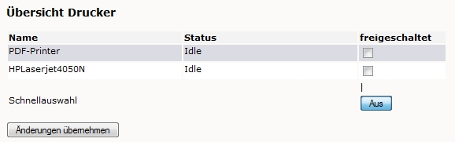
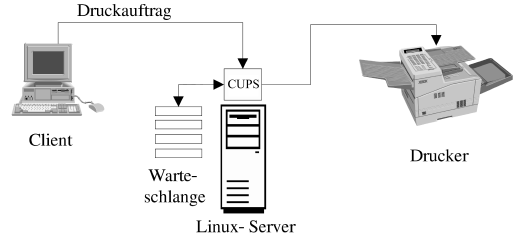
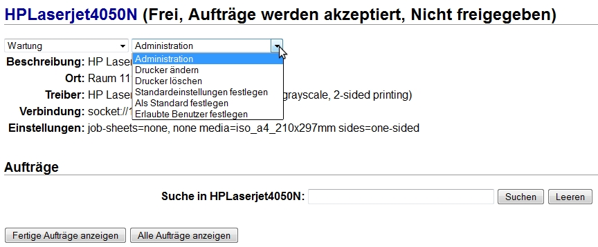
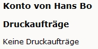
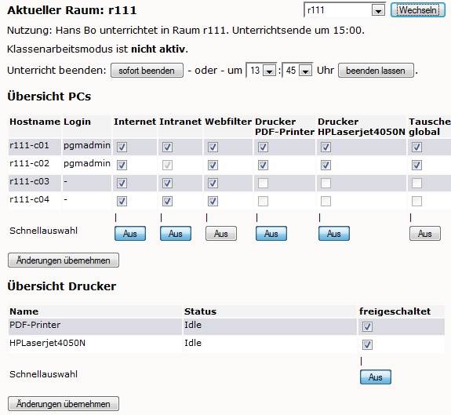
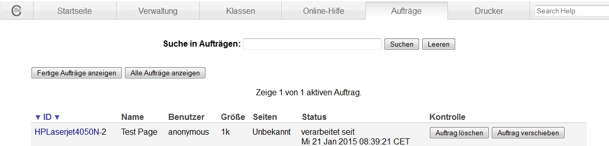

Drucken im Netz
===============

Im diesem Kapitel lernen Sie, einen Netzwerkdrucker so auf Ihrem Server einzurichten, dass Sie von den Arbeitsstationen aus in Ihrem Netzwerk drucken können.

Zunächst wird ein Netzwerkdrucker auf dem Server eingerichtet. Danach folgt die Installation auf den Arbeitsstationen. Das Kapitel endet mit der Beschreibung, wie Sie Drucker raum- und platzweise ein- und ausschalten können.

**Drucken mit Cups**

Dieser Abschnitt beschreibt das Prinzip des Druckens unter Linux über
*CUPS*
.

**Einrichtung eines Druckers im Netzwerk**

In diesem Abschnitt üben Sie die Installation eines Druckers zunächst auf dem Server, dann auf der Arbeitsstation, die über den Server ausdrucken soll.

**Steuerung des Druckers**

Hier lernen Sie, eine Druckerwarteschlange auf dem Server auf unterschiedliche Arten zu steuern. Mit Hilfe der
*Schulkonsole*
können alle Lehrkräfte einen Drucker raum- und platzweise ein- und ausschalten.

Drucken mit CUPS
----------------

In der
*linuxmuster.net*
5.1 wird
*CUPS*
(Common Unix Printing System) zur Verwaltung der Druckaufträge im Netzwerk verwendet.
*CUPS*
hat sich mittlerweile zum Standard auf UNIX-artigen Betriebssystemen entwickelt. Es wurde ursprünglich von dem Unternehmen
*Easy Software Products*
entwickelt, später von
*Apple*
* Inc.*
aufgekauft und weiterentwickelt. Es ist OpenSource und kann unter der
*GPL*
verwendet werden.

*CUPS*
unterstützt
*IPP*
und ist somit in der Lage, den unterschiedlichsten Clientplattformen (
*Windows*
, Linux, MAC OS u.v.a.m.) als Drucksystem zu dienen.

*CUPS*
mit
*IPP*
bietet somit ein umfassendes und modernes Drucksystem mit einer weitreichenden Unterstützung für eine große Bandbreite an Druckermodellen.

Auf dem Musterlösungsserver läuft ein zentraler
*CUPS*
-Dienst, welcher die Druckaufträge verwaltet, administrative Befehle entgegennimmt und Statusinformationen weitergibt.

In der Abbildung wird der Ablauf eines Druckauftrags gezeigt. Ein Client schickt über das Netzwerk einen Druckjob zum Server. Der
*CUPS*
-Dienst nimmt ihn entgegen und reiht ihn zunächst in die Warteschlange ein, die nacheinander abgearbeitet wird. Der Druckjob wird im nächsten Schritt entsprechend den Vorgaben des Druckertreibers aufbereitet und schließ
lich an den Drucker weitergeleitet. Dabei ist es unerheblich, ob der Drucker per Netzwerk, USB- oder Parallelanschluss mit dem Server verbunden ist.

|100000000000020C000000F0EE401615_png|
Einrichtung eines Druckers im Netzwerk
--------------------------------------

Wir gehen davon aus, dass ein Drucker zur Verfügung steht, der entweder über eine Parallel- oder USB-Schnittstelle direkt am Musterlösungsserver angeschlossen ist oder eine eigene Netzwerkschnittstelle (Print-Server) besitzt. Sobald Sie Arbeitsstationen und Drucker in mehr als einem Raum haben, empfehlen wir dringend die Anschaffung von netzwerkfähigen Druckern oder Printservern, mit denen man fast alle Drucker netzwerkfähig machen kann. Im Schulungsraum steht ein Drucker mit eingebauter Netzwerkschnittstelle zur Verfügung.

In den folgenden Übungen installieren Sie einen Drucker im Netz. Zunächst müssen
Sie diesen auf dem Server einrichten. Im zweiten Schritt erfolgt die Installation auf der Arbeitsstation. Wie Sie bei der Einrichtung von Druckern vorgehen müssen, ist im Installationshandbuch
ausführlich beschrieben.

Einrichtung eines Druckers auf dem Server
~~~~~~~~~~~~~~~~~~~~~~~~~~~~~~~~~~~~~~~~~

CUPS
bietet mit seinem Webinterface eine komfortable Möglichkeit Netzwerkdrucker zu verwalten. In der folgenden Übung nutzen Sie dieses Werkzeug, um auf dem Server einen Netzwerkdrucker einzurichten.

#.  Einrichten eines Netzwerkdruckers auf dem Server

    *   Beschaffen Sie sich folgende Informationen über den Netzwerkdrucker im Schulungsraum:

    *   Richten Sie den Drucker nach der Anleitung des Installationshandbuchs auf dem Server ein.

    *   Lassen Sie eine Testseite ausdrucken.

Druckereinrichtung unter Windows XP
~~~~~~~~~~~~~~~~~~~~~~~~~~~~~~~~~~~

Der auf dem Musterlösungsserver eingerichtete Drucker muss nun auch auf der Arbeitsstation verfügbar gemacht werden. Obwohl man einen Netzwerkdrucker auch direkt von der Arbeitsstation aus ansprechen könnte, bringt es einige Vorteile mit sich, den Ausdruck über die Warteschlange des Musterlösungsservers zu leiten. Zum Beispiel ist es so möglich, das Ausdrucken auf einem bestimmten Drucker (in einem bestimmten Raum) über den Server auszuschalten (siehe nächster Abschnitt).

Auf dem Musterlösungsserver ist ein PDF-Drucker (PDF-Printer) voreingerichtet. Dieser ermöglicht es, auf dem Client aus beliebigen Anwendungen heraus in eine PDF-Datei zu drucken.

In der nun folgenden Übung richten Sie den Schulungsraumdrucker und den PDF-Drucker auf einem
*Windows*
-XP-Client ein. Die Vorgehensweise ist im Installationshandbuch beschrieben
.

#.  Druckereinrichtung auf dem
    *Windows*
    -XP-Client

    *   Beschaffen Sie sich
        den
        *Windows*
        -XP-Druckertreiber des Schulungsraumdruckers, falls der Treiber nicht schon vom Betriebssystem bereitgestellt wird.

    *   Installieren Sie den Drucker nach der Anleitung des Installationshandbuchs
        .

    *   Lassen Sie eine Testseite ausdrucken.

    *   Installieren Sie nun den PDF-Drucker auf dem Client.

    *   Erstellen Sie PDF-Dateien, indem Sie aus verschiedenen Anwendungen (z. Bsp.
        *LibreOffice*
        ,
        *Firefox*
        ) auf den PDF-Drucker ausdrucken. Wo wird die PDF-Datei abgelegt?

Steuerung des Druckers
----------------------

In diesem Abschnitt werden Möglichkeiten zur Steuerung des Druckers und der Verwaltung der Druckerwarteschlange auf dem Server dargestellt. Besonders wichtig ist die Möglichkeit zum Löschen von
Druckaufträgen. So kommt es in der Praxis ab und zu vor, dass der Drucker versehentlich ausgeschaltet ist, der Netzwerkstecker gezogen wurde oder ein Papierstau vorliegt. Ein Druckbefehl kann nun nicht ausgeführt werden und wird in der Warteschlange geparkt. Da nun der Drucker nicht reagiert, schicken viele Benutzer den Druckauftrag wiederholt ab, wodurch die Druckerwarteschlange immer mehr anwächst. Wenn man vor der Behebung des Fehlers die überzähligen Druckaufträge nicht löscht, werden viele Druckaufträge unnötigerweise mehrfach ausgedruckt. Ein oft benötigtes pädagogisches Instrument ist daher die Steuerung des Druckers durch die Lehrkraft. Dies wird am Ende dieses Abschnitts beschrieben.

Drucker- und Druckauftragsverwaltung über das CUPS-Webinterface
~~~~~~~~~~~~~~~~~~~~~~~~~~~~~~~~~~~~~~~~~~~~~~~~~~~~~~~~~~~~~~~

Um auf dem Webinterface von
*CUPS*
administrativ tätig werden zu können, müssen Sie sich als Benutzer
administrator
authentifizieren. Die Authentifizierung wird jedoch erst dann notwendig, wenn Sie eine Änderung vornehmen. Die Seiten können zunächst ohne Anmeldung aufgerufen werden.

Mit Hilfe des Webinterfaces können Sie bequem und ohne Kenntnis von speziellen Kommandos die eingerichteten Drucker verwalten. Sie gelangen zur Druckerverwaltungsseite mit Hilfe eines Webbrowsers und der Eingabe von folgender Adresse (beachten Sie, dass administrative Zugriffe auf das
*CUPS*
-Webinterface über
*https*
erfolgen müssen):

https://<servername>:631/printers/

Hier können Sie unter anderem folgende Aktionen ausführen:

*   Drucker stoppen
    : Der Drucker wird angehalten, die Druckerwarteschlange nimmt aber weiterhin Druckaufträge entgegen.

*   Aufträge ablehnen
    : Die Druckerwarteschlange des Druckers nimmt keine Aufträge mehr an. Der Client erhält eine Fehlermeldung.

*   |1000000000000360000001666547476D_jpg|
    |100000000000038400000170127A5C29_jpg|
    Alle Aufträge verschieben
    : A
    lle Druckaufträge des Druckers können
    zu einem anderen Drucker verschoben werden.

*   Alle Aufträge abbrechen
    : Alle Druckaufträge des Druckers werden aus der Warteschlange entfernt.

Zugriff auf die aktuellen Druckaufträge aller Drucker erhalten Sie
auf der Verwaltungsseite für Druckaufträge unter der Adresse:

https://<servername>:631/jobs/

Hier erhalten Sie eine Liste aller aktuell zu bearbeitenden Druckaufträge inklusive Status- und Benutzerinformationen. Sie können Druckaufträge anhalten, angehaltene Aufträge wieder starten, einzelne Druckaufträge auf andere Drucker verschieben und Druckaufträge abbrechen:

#.  Druckerverwaltung mit dem
    *CUPS*
    -Webinterface

    *   Stoppen Sie den Schulungsraumdrucker so, dass er noch Druckaufträge annimmt.

    *   Melden Sie sich an einer Arbeitsstation an und schicken Sie mehrere Druckaufträge zum Drucker.

    *   Rufen Sie die Verwaltungsseite für Druckaufträge auf.

    *   Brechen Sie Druckaufträge ab.

    *   Verschieben Sie Druckaufträge auf den PDF-Drucker.

    *   Halten Sie Druckaufträge an.

    *   |100000000000049C0000011D6E63A9FE_jpg|
        Starten Sie den Schulungsraumdrucker wieder.

    *   Starten Sie die zuvor angehaltenen Druckaufträge neu.

Eigene Druckaufträge mit der Schulkonsole verwalten
~~~~~~~~~~~~~~~~~~~~~~~~~~~~~~~~~~~~~~~~~~~~~~~~~~~

Jeder Benutzer (Administratoren, Lehrkräfte und Schüler) kann seine eigenen Druckaufträge über seine Startseite in der
*Schulkonsole*
verwalten. Dazu loggt man sich einfach über die URL

https://<servername>:242

in die
*Schulkonsole*
ein und erhält sofort einen Überblick über die eigenen Druckaufträge:

|10000000000000A50000005344D925D6_jpg|
Die zu löschenden Druckaufträge wählt man mit Mausklick aus und löscht sie dann über die Schaltfläche
*Druckaufträge löschen*
.

#.  Eigene Druckaufträge über die
    *Schulkonsole*
    löschen.

    *   Stoppen Sie den Schulungsraumdrucker so, dass er noch Aufträge annimmt.

    *   Schicken Sie einen Druckauftrag ab.

    *   Löschen Sie den Druckauftrag über die Startseite der Schulkonsole.

    *   Überprüfen Sie über die Druckjob-Verwaltungsseite in
        *CUPS*
        , ob der Druckauftrag auch tatsächlich gelöscht wurde.

Druckersteuerung über die Schulkonsole im Unterricht
~~~~~~~~~~~~~~~~~~~~~~~~~~~~~~~~~~~~~~~~~~~~~~~~~~~~

Damit Lehrkräfte Drucker während des Unterrichts im Computerraum steuern können, muss man als Benutzer
administrator
den Drucker in der Schulkonsole dem entsprechenden Raum zuordnen
.

Ist das erledigt, steht den Lehrer/innen über die Schulkonsolenrubrik

*aktueller Raum*
die Druckersteuerung im Unterricht zur Verfügung:

|100000000000023F00000211AE95A50F_jpg|
Zunächst muss natürlich der Unterricht begonnen werden (siehe Abschnitt
). Danach kann entweder für einzelne oder alle Schülerarbeitsplätze der Zugriff auf die Drucker gesteuert werden, indem man entsprechende Häkchen setzt. Im unteren
Bereich der Seite unter

*Übersicht Drucker*
kann über die Spalte
*freigeschaltet*
der Zugriff auf Drucker global gesteuert werden. Diese Einstellung betrifft dann alle Benutzer/innen der Schule, nicht nur die des Raumes:

#.  |1000000000000242000000B50F3883BD_jpg|
    Druckersteuerung über die
    Schulkonsole

    *   Machen Sie den Schulungsraumdrucker in der
        Schulkonsole
        für Raum
        r100
        verfügbar.

    *   Loggen Sie sich an Ihren beiden Arbeitsstationen jeweils einmal als Lehrer und als Schüler ein.

    *   Beginnen Sie als Lehrer in der
        Schulkonsole
        einen Unterricht in Raum
        r100
        .

    *   Entziehen Sie dem Schüler über die
        Schulkonsole
        den Zugriff auf den Drucker. Überprüfen Sie die Wirksamkeit dieser M
        aßnahme.

    *   Schalten Sie den Drucker global ab. Überprüfen Sie wiederum die Wirksamkeit dieser Maßnahme.

.. |100000000000038400000170127A5C29_jpg| image:: media/100000000000038400000170127A5C29.jpg
    :width: 12.001cm
    :height: 6.002cm

