.. _basiskurs-security-remote-access-label:

Sicherheit / Zugang von außen
=============================

Wer heute einen Computer ungesichert mit dem Internet verbindet, wird nicht lange Freude damit haben. Was für einzelne Rechner gilt, gilt erst recht für ein ganzes Netz. Bei der
*linuxmuster.net*
wird deshalb der gesamte Internetverkehr von einem eigenen Rechner (einem sogenannten „Firewall-Rechner“) gesteuert, dem
*IPCop*
. Er soll zunächst einmal ermöglichen, dass alle Rechner im Schulnetz über dieselbe Internetverbindung Daten übertragen können. Außerdem soll er nach Möglichkeit Angriffe von außen abwehren, aber auch den Verkehr von innen kontrollieren, z. B., um den Zugriff auf unerwünschte Webseiten zu blockieren.

Bei den Vorgängerversionen der
*linuxmuster.net*
war diese Funktionalität im Server integriert, bei der aktuellen Version ist dafür ein eigener (echter oder virtueller) Computer vorgesehen. Der Vorteil eines eigenen Rechners als Firewall besteht darin, dass auf ihm nur sehr wenige Programme laufen müssen und er deshalb besonders stark gesichert werden kann.

In diesem Kapitel werden zunächst einige der zugrundeliegenden Konzepte erklärt. In weiteren Abschnitten erfahren Sie, wie Sie die Firewall auf dem
*IPCop*
Ihren Bedürfnissen anpassen können, wie Sie den Zugriff auf Webseiten konfigurieren können und welche Informationen Sie den Logdateien auf dem
*IPCop*
entnehmen können.

Das beste Sicherheitskonzept ist wirkungslos, wenn man unbedacht damit arbeitet, und das gilt vor allem für den Umgang mit Kennwörtern. Wenn jemand das Passwort des Superusers kennt, kann er auf dem Server nach Belieben schalten und walten, selbst wenn der Server noch so gut gesichert ist. Deshalb beginnt das Kapitel „Sicherheit“ mit einem Abschnitt zu Kennwörtern.

Eine in der Schule vergessene Datei besorgen, die Moodle-Hausaufgaben erledigen, die Schul-E-Mail abrufen, kleinere Wartungsarbeiten am Server durchführen – es gibt viele Gründe, von zu Hause aus auf das Schulnetz zuzugreifen. In den weiteren Abschnitte dieses Kapitels wird erklärt, wie man den Zugang von außerhalb einrichten und nutzen kann.

Kennwörter
----------

Der einzige Schutz davor, dass sich jemand unter fremdem Namen anmeldet und dann unbefugt und unkontrolliert Dateien verändert, im Internet surft, auf dem Server ein Hacker-Programm installiert, den Server komplett löscht oder ähnlichem ist: Ein Kennwort. Ein sicheres Kennwort ist deshalb insbesondere für die administrativen Benutzerzugänge unabdingbar.

Es reicht dabei nicht, sich ein für alle mal ein gutes Kennwort einzurichten; vielmehr ist ist auch ein sicherer Umgang mit dem Kennwort entscheidend:

*   Wählen Sie ein sicheres Kennwort.

*   Wechseln Sie Ihr Kennwort regelmäßig.

*   Lassen Sie sich nicht über die Schulter sehen. Wenn jemand zusieht, wie Sie Ihr Kennwort eingeben, bemerkt ein etwas geschickter Beobachter, dass Sie nur Kleinbuchstaben eingeben. Der nächste bemerkt, dass Sie mit einem d beginnen, und irgendwann ist Ihr Kennwort bekannt.

*   Vergewissern Sie sich, dass Sie das Kennwort nicht in das Feld für den Benutzernamen eingeben, da es sonst am Bildschirm und mit Pech sogar am Beamer sichtbar wird.

*   Sollten Sie Ihr Kennwort irgendwo aufschreiben, machen Sie dies handschriftlich, damit auf keinem Rechner eine Datei „alle meine Kennwörter“ existiert. Legen sie Ihr Kennwort an einer sicheren Stelle ab (Schultresor).

*   Wenn Sie Ihre Kennwörter unbedingt in elektronischer Form verwalten möchten, verwenden Sie dafür ein geeignetes Programm wie „Password-Safe“. Schreiben Sie Ihre Kennwörter auf keinen Fall, auch nicht vorübergehend, im Klartext in eine Datei.

*   Sorgen Sie dafür, dass Ihr Kennwort von keinem minderwertigen Betriebssystem oder Programm in mäßig verschlüsselter Form zwischengespeichert (neudeutsch: gecached) wird.

Gute Kennwörter
~~~~~~~~~~~~~~~

Ein Kennwort ist dann gut, wenn es nur mit unverhältnismäßigem Aufwand geknackt werden kann. Programme zum Knacken von Kennwörtern verfolgen im Wesentlichen zwei Ansätze:

**Wörterbuchangriff:**
Bei einem Wörterbuchangriff werden der Reihe nach alle Wörter aus einer gegebenen Liste getestet. Diese Liste enthält etwa die häufigsten 20000 deutschen Wörter. Wenn Ihr Kennwort in der Liste enthalten ist, ist es in wenigen Sekunden geknackt. Auch geringfügige Modifikationen, wie etwa das Anhängen einer Ziffer, schützen nicht: Auf diese Idee sind die Programmierer der Hackertools auch schon gekommen.

**Brute Force:**
Alle möglichen Kennwörter werden der Reihe nach durchprobiert. Dies geht bei kurzen Kennwörtern sehr schnell, bei langen Kennwörtern dauert es gleich viel länger. Als Faustregel gilt: Ein Zeichen mehr bedeutet einen Faktor 100 in der Rechenzeit. Entscheidend ist auch, welche Zeichen man in seinem Kennwort verwendet. Ein Kennwort nur aus Kleinbuchstaben ist erheblich unsicherer als eines, das auch Großbuchstaben, Ziffern und Sonderzeichen enthält.

*Ein gutes Kennwort besteht folglich aus einer hinreichend sinnlosen und langen Folge von Klein- und Großbuchstaben, Ziffern und Sonderzeichen.*

An dieser Stelle sei erwähnt, dass Passwörter früher nicht allzu lang sein durften, unter Linux gab es mal eine Beschränkung auf 8 Zeichen. Dies gilt nicht mehr, bei der
*linuxmuster.net*
dürfen Passwörter erheblich länger sein.

Hier einige Beispiele von schlechten Kennwörtern:
Müller
,
Sesamöffnedich
,
vergessen
,
ich
,
asdfghjkl
,
Britney01
,
p9!H
(alle diese Kennwörter fanden sich auf einem Server mit etwa 700 Benutzern. Ein Standardtool hatte diese und über 100(!) weitere in weniger als 10 Minuten geknackt. Bis auf das letzte stehen alle im Wörterbuch, das letzte ist zu kurz.)

Und hier ein Beispiel für ein gutes Kennwort:
!aSbIidK34$lg!

Um sich solche Kennwörter zu merken, bietet sich an, sie als Akronym zu erstellen. Für das obige Beispiel stand der Satz „Am Sonntag bin Ich in der Kneipe 34 $ los geworden!“ Pate. Solche Sätze sind leicht zu merken, und wenn man von jedem Wort den Anfangsbuchstaben nimmt und das ganze mit ein paar Sonderzeichen garniert, erhält man ein recht gutes Kennwort.

Benutzergruppen
~~~~~~~~~~~~~~~

Bei der
*linuxmuster.net*
gibt es verschiedene Benutzerkategorien:

*   Administrative Benutzer

*   Lehrer

*   Schüler

*   Workstation-Accounts (für Klassenarbeiten)

Der Benutzer mit den höchsten Rechten heißt unter Linux
root
. Als sogenannter Superuser unterliegt er auf dem Server keinerlei Einschränkungen. Das Kennwort dieses Benutzers müssen Sie deshalb ganz besonders sorgfältig wählen und so wenig Personen wie möglich zugänglich machen. Melden Sie sich auch nur dann als
root
auf dem Server an, wenn Sie wirklich den allmächtigen Superuser benötigen. Die weiteren administrativen Benutzer (die Kennwörter für die Basiskursinstallation finden Sie im Anhang unter Abschnitt
) sind:

+------------------+----------------------------------------------------------------------+
| **Benutzername** | **Rechte / Funktion**                                                |
|                  |                                                                      |
+==================+======================================================================+
| root             | Allmächtig auf dem Server, nicht vorhanden auf den Arbeitsstationen. |
|                  |                                                                      |
+------------------+----------------------------------------------------------------------+
| domadmin         | Domänenbeitritt von Windows-Arbeitsstationen.                        |
|                  |                                                                      |
+------------------+----------------------------------------------------------------------+
| pgmadmin         | Administrator auf den Windows-Arbeitsstationen                       |
|                  |                                                                      |
|                  | *   Serverbasierte und lokale Installation von Programmen.           |
|                  |                                                                      |
|                  |                                                                      |
|                  |                                                                      |
|                  | *   Darf CD-Images auf dem Server ablegen.                           |
|                  |                                                                      |
|                  |                                                                      |
|                  |                                                                      |
|                  | *   Darf die Netlogon-Skripte anpassen.                              |
|                  |                                                                      |
|                  |                                                                      |
|                  |                                                                      |
+------------------+----------------------------------------------------------------------+

+---------------+----------------------------------------------------------------------------------------+
| administrator | Wie                                                                                    |
|               | pgmadmin                                                                               |
|               | , zusätzlich:                                                                          |
|               |                                                                                        |
|               | *   Anmelden am Server.                                                                |
|               |                                                                                        |
|               |                                                                                        |
|               |                                                                                        |
|               | *   Darf auf dem                                                                       |
|               |     *CUPS*                                                                             |
|               |     -Webinterface Drucker einrichten.                                                  |
|               |                                                                                        |
|               |                                                                                        |
|               |                                                                                        |
|               | *   Schreibzugriff auf die Homeverzeichnisse von Schülern und die Tauschverzeichnisse. |
|               |                                                                                        |
|               |                                                                                        |
|               |                                                                                        |
|               | *   Netzwerkberaterrechte bei der                                                      |
|               |     *Schulkonsole*                                                                     |
|               |     .                                                                                  |
|               |                                                                                        |
|               |                                                                                        |
|               |                                                                                        |
|               | *   Zugriff auf das Image-Share                                                        |
|               |     linbo-repo                                                                         |
|               |     .                                                                                  |
|               |                                                                                        |
|               |                                                                                        |
|               |                                                                                        |
+===============+========================================================================================+
| linbo         | LINBO-Administrator                                                                    |
|               |                                                                                        |
|               | *   Zugriff auf das Image-Share                                                        |
|               |     linbo-repo                                                                         |
|               |     .                                                                                  |
|               |                                                                                        |
|               |                                                                                        |
|               |                                                                                        |
+---------------+----------------------------------------------------------------------------------------+
| wwwadmin      | *   Administrator der Webanwendungen                                                   |
|               |     *Horde3*                                                                           |
|               |     und                                                                                |
|               |                                                                                        |
|               |     *Moodle*                                                                           |
|               |     .                                                                                  |
|               |                                                                                        |
|               |                                                                                        |
|               |                                                                                        |
|               | *   Keine Windows-Anmeldung.                                                           |
|               |                                                                                        |
|               |                                                                                        |
|               |                                                                                        |
+---------------+----------------------------------------------------------------------------------------+

Bei der Installation werden Sie nach all diesen Kennwörtern gefragt (
domadmin
und
linbo
erhalten dasselbe Kennwort wie der
administrator
).

Auf dem
*IPCop*
gibt es ebenfalls einen Benutzer
root
sowie einen Benutzer
admin
, mit dem man sich am Webinterface anmeldet.

Eigenes Kennwort ändern
~~~~~~~~~~~~~~~~~~~~~~~

Von den diversen Methoden, wie man sein Kennwort ändern kann, seien hier zwei kurz vorgestellt:

**Schulkonsole**

Die
*linuxmuster.net*
bringt mit der
*Schulkonsole*
ein äußerst komfortables Tool mit, das unter anderem ermöglicht, Kennwörter zu ändern. Wie das geht, haben Sie schon in Kapitel 3 kennengelernt. Dies sollte auch die Methode der Wahl sein, außer für die administrativen Accounts, deren Kennwörter man direkt auf dem Server ändern muss.

**Server**

Die Kennwörter für manche administrativen Accounts können nur direkt auf dem Server geändert werden. Das Kommando dazu heißt
sophomorix-passwd
. Gibt man es
mit dem Parameter
--help
ein, wird eine kurze Hilfe ausgegeben. Der Superuser
root
darf die Kennwörter von allen anderen Accounts ändern. Der Befehl
sophomorix-passwd –interactive --user administrator
etwa ändert das Kennwort des Benutzers
administrator
.

Eine Ausnahme gibt es: Um sein eigenes Kennwort zu ändern, muss der Superuser
root
den Befehl
passwd
verwenden.

Fremde Kennwörter ändern
~~~~~~~~~~~~~~~~~~~~~~~~

Gerade in der Schule muss man häufig die Kennwörter anderer Benutzer ändern; nicht nur Schüler neigen dazu, ihre Passwörter häufig zu vergessen. Dies erledigt man bevorzugt mit der
*Schulkonsole*
, die es auch ermöglicht, für eine ganze Klasse auf einmal neue Kennwörter einzurichten. Einzelne Kennwörter kann man auch per Kommandozeile am Server ändern. Hier eine Übersicht, wer welche Kennwörter verändern darf:

+--------------------------------------------+-------------------+--------------------------+
| **Welches Kennwort soll geändert werden?** | **Wer darf das?** | **Wie geht das?**        |
|                                            |                   |                          |
+============================================+===================+==========================+
| Eigenes Kennwort                           | Jeder             | *Schulkonsole*           |
|                                            |                   | (näheres siehe Abschnitt |
|                                            |                   | bzw.                     |
|                                            |                   | )                        |
|                                            |                   |                          |
+--------------------------------------------+-------------------+--------------------------+
| Einzelner Schüler                          | Lehrer            | *Schulkonsole*           |
|                                            |                   | (näheres siehe Abschnitt |
|                                            |                   | )                        |
|                                            |                   |                          |
+--------------------------------------------+-------------------+--------------------------+
| Mehrere Schüler oder gesamte Klasse        | Lehrer            | *Schulkonsole*           |
|                                            |                   | (näheres siehe Abschnitt |
|                                            |                   | bzw.                     |
|                                            |                   | )                        |
|                                            |                   |                          |
+--------------------------------------------+-------------------+--------------------------+
| Alle Workstationaccounts in einem Raum     | Lehrer            | *Schulkonsole*           |
|                                            |                   | (näheres siehe Abschnitt |
|                                            |                   | )                        |
|                                            |                   |                          |
+--------------------------------------------+-------------------+--------------------------+
| Einzelner Lehrer                           | administrator     | *Schulkonsole*           |
|                                            |                   | (näheres siehe Abschnitt |
|                                            |                   | )                        |
|                                            |                   |                          |
+--------------------------------------------+-------------------+--------------------------+
| Mehrere Lehrer                             | administrator     | *Schulkonsole*           |
|                                            |                   | (näheres siehe Abschnitt |
|                                            |                   | )                        |
|                                            |                   |                          |
+--------------------------------------------+-------------------+--------------------------+
| Beliebige Benutzer                         | root              | Auf dem Server: Kommando |
|                                            |                   | sophomorix-passwd        |
|                                            |                   |                          |
+--------------------------------------------+-------------------+--------------------------+
| Kennwort von                               | root              | Auf dem Server: Kommando |
| root                                       |                   | passwd                   |
|                                            |                   |                          |
+--------------------------------------------+-------------------+--------------------------+

LINBO-Kennwort ändern
~~~~~~~~~~~~~~~~~~~~~

Das Kennwort des administrativen Benutzers
linbo
ist auf dem Server in der Datei
/etc/rsyncd.secrets
im Klartext abgelegt und kann nur vom Superuser
root
gelesen und geändert werden. Um es zu ändern müssen Sie sich also entweder von einer Arbeitsstation aus mit
*putty*
oder direkt am Server an einer Konsole als
root
einloggen.

Gehen Sie so vor:

#.  Loggen Sie sich auf dem Server als Benutzer
    root
    ein.

#.  Öffnen Sie die Datei
    /etc/rsyncd.secrets
    in einem Editor
    (z. Bsp.
    mcedit
    ):

    # mcedit /etc/rsyncd.secrets

#.  Ändern Sie das Kennwort in der Zeile nach
    linbo:

    linbo:kennwort

#.  Speichern Sie die Datei (
    mcedit
    : F2) und verlassen Sie den Editor (
    mcedit
    : F10).

#.  Nun muss das geänderte Kennwort dem Samba-Dienst (Zugriff auf Share
    linbo-repo
    ) bekannt gemacht und in verschlüsselter Form in die gruppenspezifischen LINBO-Dateien geschrieben werden. Das wird alles vom Workstationimport-Skript erledigt. Geben Sie also an der Konsole noch den Befehl

    # import_workstations

    ein.

Damit ist die
Kennwort
-Änderung für den Benutzer
linbo
abgeschlossen.

#.  
    *   Ändern Sie das Kennwort von
        root
        .

    *   Ändern Sie das Kennwort des
        administrator
        .

    *   Richten Sie ein neues LINBO-Kennwort für das Imaging ein.

IPCop – Einführung
------------------

Der
*IPCop*
ist zwischen das Schulnetz und das Internet geschaltet. Bei der
*linuxmuster.net*
sind zwei Varianten vorgesehen:

*   Die Installation auf einem eigenen Computer („dedizierter
    *IPCop*
    “) oder

*   Die Installation auf einer Art „simuliertem Computer“ auf dem eigentlichen
    Musterlösungsserver („integrierter
    *IPCop*
    “).

Der Vorteil der ersten Variante ist, dass sie eine noch höhere Sicherheit bietet, der Vorteil der zweiten Variante ist, dass man bei einem schon sehr hohen Maß an Sicherheit einen zweiten Computer einspart.

Beim IPCop werden vier Netze unterschieden, die der einfacheren Orientierung halber durch Farben gekennzeichnet sind:

*   Internet (Rot): Die Anbindung nach außen, externes Netz.

*   Intranet (Grün): Das schulinterne Netz mit den Arbeitsstationen und dem LML-Server. Die Rechner im grünen Netz sind von den drei anderen Netzen aus nicht erreichbar, Ausnahmen müssen explizit eingerichtet werden.

*   DMZ (Orange, optional): Eine „Demilitariserte Zone“, etwa für zusätzliche Webserver oder Mailserver. Rechner in der DMZ sind von allen drei anderen Netzen aus erreichbar, umgekehrt jedoch wird jeder Verkehr blockiert. Ein Webserver etwa muss ja von außen erreichbar sein und ist damit besonders gefährdet. Wird er gehackt, so ist ein Angriff auf Rechner im grünen Netz dadurch erschwert, dass eine Verbindung von orange nach grün blockiert wird.

*   WLAN (Blau, optional): Ein schulinternes Funknetz. Im Prinzip dasselbe wie das grüne Netz. Die Aufteilung in kabelgebundenes und Funknetz ermöglicht es jedoch, ein Funknetz besonders abzusichern, etwa durch eine restriktivere Authentifizierung. Zudem sind die „grünen“ Arbeitsstationen vor den Rechnern im Funknetz geschützt, falls sich doch einmal jemand in das Funknetz einschleichen sollte.

Bei der Zwei-Server-Variante benötigt der
*IPCop*
somit zwei bis vier Netzwerkkarten, der Server hängt im internen („grünen“) Netz und benötigt nur eine.

Bei der Ein-Server-Variante wird auf dem LML-Server ein Computer simuliert, auf dem der
*IPCop*
läuft. Etwas vereinfacht dargestellt, erhält er die Kontrolle über die im Server physikalisch vorhandenen Netzwerkkarten, und der Server erhält eine virtuelle Netzwerkkarte, mit der er im internen Netz hängt.

Die Netzstruktur ist letztlich bei beiden Varianten identisch, und so gilt das im Folgenden Beschriebene für beide Installationsarten gleichermaßen.

Der
*IPCop*
hat unter anderem folgende Aufgaben:

*   Die Steuerung und Kontrolle des Internetverkehrs. Dies wird als Firewall im eigentlichen Sinne bezeichnet (das Wort „Firewall“ hat genau wie „Server“ eine Doppelbedeutung: Ein Programm beziehungsweise Dienst, das den Internetverkehr regelt, und der Computer, auf dem ein solches Programm läuft).

*   Eine zusätzliche Kontrolle der Webzugriffe. Dazu läuft auf dem
    *IPCop*
    ein Webproxy und ein Webfilter. Dies ermöglicht, den Zugang zu bestimmten Internetseiten zu sperren sowie zu protokollieren, wer wann welche Internetseiten betrachtet hat.

In den folgenden Abschnitten erfahren Sie, wie sie diese beiden Komponenten des
*IPCop*
Ihren Bedürfnissen anpassen können und wie Sie die generierten Protokolle auswerten können.

Administration des IPCop
------------------------

Der
*IPCop*
ist ein für Firewallaufgaben optimiertes Linux-System, es stehen also die gewohnten Linux-Bordmittel für die Administration zur Verfügung. Normalerweise wird man diese jedoch nicht benötigen, weil es für so gut wie alle administrativen Arbeiten ein komfortables Webinterface gibt. Man kann somit alles, was in diesem Kapitel beschrieben ist, von einem beliebigen Rechner im Schulnetz aus bequem mit seinem Lieblingsbrowser erledigen.

Rufen Sie dazu an einem Rechner im Schulnetz die folgende URL auf:

https://ipcop:445

Wenn alles klappt, sehen Sie die Einstiegsseite mit einer kurzen Information zum Zustand der Internetverbindung:

|Sicherheit_IPCop_Willkommen_gif|

Über das Menü ganz oben haben Sie Zugriff auf alle hier beschriebenen Konfigurationsmöglichkeiten.

Die Webseite kann ja jedermann im Schulnetz aufrufen, Einstellungen verändern darf natürlich nur der Administrator. Deshalb werden Sie gegebenenfalls nach einem Benutzernamen und Passwort gefragt. Sie müssen den Benutzernamen
admin
verwenden, das Passwort haben Sie bei der Installation vergeben. Das Kennwort für die Basiskursinstallation finden Sie im Anhang
.

Firewall
--------

Die vier Netze werden als unterschiedlich „gefährlich“ und mit unterschiedlichem „Schutzbedarf“ angesehen, woraus sich ergibt, welchen Datenverkehr der
*IPCop*
zulässt und welchen nicht.

Die größte Gefahr droht aus dem („roten“) Internet, und die („grünen“ oder „blauen“) Arbeitsstationen müssen davor geschützt werden. Deshalb wird kein Verkehr vom roten in das grüne oder blaue Netz weitergeleitet, außer, man lässt dies explizit zu. Dies ist etwa erforderlich, wenn es möglich sein soll, sich per SSH von außen auf dem Server anzumelden, der ja im grünen Netz hängt, oder auch von außen auf die Schulhomepage zugreifen zu können.

Die Computer im grünen Netz sollen natürlich zumindest eingeschränkten Zugang zum Internet haben, deshalb wird Verkehr vom grünen in das rote Netz teilweise zugelassen (und natürlich auch die zugehörigen Antworten). Ein Beispiel wäre, dass ein Client eine Internetseite anfordert. Dies ist erlaubt, die Anfrage wird zugelassen, und die Antwort an die Arbeitsstation weitergeleitet – nicht ohne vorher den Webfilter passieren zu müssen, näheres dazu im nächsten Abschnitt.

Die Firewall ist für den Schulbetrieb vollständig konfiguriert, und die Einstellungen sollten nur von Experten verändert werden. Eine Ausnahme sind höchstens die Portweiterleitungsregeln, dazu später mehr.

Webfilter
---------

Nicht alle Internetseiten sind für Schüler geeignet, und die Schule muss in angemessener Weise dafür sorgen, dass für die Schüler solche Seiten nicht zugänglich sind. Eine Maßnahme ist, den Zugang zu Internetseiten technisch zu beschränken. Dies ermöglicht bei der
*linuxmuster.net*
das Zusammenspiel von Webproxy und URL-Filter.

Einführung
~~~~~~~~~~

Wenn von einem Rechner eine Webseite angefordert wird, so muss diese Anfrage den
*IPCop*
passieren. Sie kann nun auf verschiedene Weise in das Internet weitergeleitet werden:

*   Direkt, also ohne jegliche Kontrolle

*   Der
    *IPCop*
    fängt die Anfrage ab und reicht sie an ein Programm weiter, das auf dem
    *IPCop*
    läuft. Dieser sogenannte „Proxy“ fordert nun die gewünschte Seite an und reicht die Antwort an die Arbeitsstation weiter.

Im ersten Fall kommuniziert die Arbeitsstation direkt mit dem Internet, eine Kontrolle findet nicht statt. Im zweiten Fall lässt sich jedoch eine Filterung einrichten:

Zunächst einmal kann man den Proxy so konfigurieren, dass generell nur bestimmte Rechner oder bestimmte Benutzer Internetseiten laden dürfen. Man kann aber auch den Zugriff auf bestimmte Seiten unterbinden. Dazu reicht der Proxy die Anfrage zunächst an ein weiteres Programm weiter, den „URL-Filter“. Der URL-Filter entscheidet anhand der URL, ob die Anfrage zulässig ist; eine Webseite „www.porno.com“ hätte hier keine Chance. Ist die Anfrage erlaubt, so fordert der Proxy die Webseite an und reicht die Antwort an die Arbeitsstation weiter.

Bevor eine Arbeitsstation eine Webseite erhält, muss die Anfrage also die folgenden Schritte durchlaufen:

*   Die Arbeitsstation stellt eine Anfrage nach einer Webseite.

*   Der
    *IPCop*
    fängt die Anfrage ab und reicht sie an den Proxy weiter.

*   Der Proxy entscheidet, ob die Arbeitsstation / der Benutzer die Anfrage stellen darf und reicht die Anfrage gegebenenfalls an den URL-Filter weiter.

*   Der URL-Filter prüft anhand der URL, ob die Anfrage zulässig ist.

*   Der Proxy lädt die Seite aus dem Internet und leitet sie an die Arbeitsstation weiter.

Im Folgenden erfahren Sie, wie Sie sowohl den Proxy-Server als auch den URL-Filter konfigurieren und pflegen können.

Advanced Proxy
~~~~~~~~~~~~~~

Der
*Advanced Proxy*
ist im Auslieferungszustand der
*linuxmuster.net*
vollständig konfiguriert, und zwar so, dass er alle Anfragen an Webseiten abfängt und über den URL-Filter leitet, also genau so wie oben beschrieben. Nur wenn Sie an diesem Verhalten etwas ändern möchten, müssen Sie die Konfiguration verändern. Sie erreichen die Konfigurationsseite unter
*Dienste | Advanced Proxy. *
Vergessen Sie nicht, nach etwaigen Änderungen mit der Schaltfläche
*Speichern und Neustart*
den Proxy neu zu starten, damit die Änderungen wirksam werden.

URL-Filter verwenden
^^^^^^^^^^^^^^^^^^^^

Wenn Sie hier das Häkchen entfernen, so wird der URL-Filter umgangen. Dies kann sinnvoll sein, wenn Sie schon einen anderen Filter verwenden, z. B. von BelWü.

Authentifizierung
^^^^^^^^^^^^^^^^^

We
nn Sie die Authentifizierung aktivieren, muss man sein Kennwort eingeben, bevor man im Internet surfen darf. Dies bietet eine noch höhere Zugangskontrolle, kann aber in der Praxis lästig sein. Sie können eine der Methoden
*LDAP*
oder
*Windows*
verwenden. Bei der Methode
*Windows*
sollten Sie
*Verwende integrierte Windows Authentifizierung*
wählen, dann muss man an einem Windows-Client kein Kennwort angeben, weil das Kennwort von der Domänenanmeldung verwendet wird. Beachten Sie, dass Sie dazu ganz oben das Häkchen bei
*Transparent auf Grün*
entfernen müssen. Sie müssen dann auf den Clients bei den Webbrowsern den Proxyserver
ipcop
und den Port 800 explizit einstellen.

Die Authentifizierung hat jedoch einen angenehmen Nebeneffekt: In den weiter unten angesprochenen Logdateien steht unmittelbar der Name desjenigen, der eine Internetseite angefordert hat. Ein nicht-transparenter Proxy birgt jedoch einige Fallstricke, und so wird dieser Weg nur erfahrenen Administratoren empfohlen.

URL-Filter
~~~~~~~~~~

Auch der URL-Filter ist im Auslieferungszustand der
*linuxmuster.net*
vollständig konfiguriert. Wie oben beschrieben, entscheidet er anhand der URL, ob eine Anfrage nach einer Webseite zulässig ist oder nicht. Dazu gibt es zwei Mechanismen: Zum einen wird die URL respektive die IP-Adresse mit einer Liste von gesperrten IP-Adressen und URLs verglichen, der sogenannten „Blacklist“. Zum anderen wird die URL auf bestimmte Textbausteine hin untersucht. So können auch Seiten blockiert werden, die nicht in der Blacklist aufgeführt sind.

Zur Feineinstellung dieses Mechanismus gibt es auch eine sogenannte „Whitelist“. URLs und IP-Adressen, die in dieser Whitelist enthalten sind, werden immer zugelassen, selbst wenn sie verbotene Textbausteine enthalten oder in der Blacklist stehen.

Sie erreichen die Konfigurationsseite über
*Dienste | URL-Filter*
. Sie ist in zwei Bereiche unterteilt:

Im oberen Bereich
*URL-Filter Einstellungen*
können Sie neben einigen Einstellungen auch die Black- und Whitelist anpassen. Am unteren Ende des oberen Bereichs findet sich gut versteckt ein Knopf
*Speichern und Neustart*
, mit dem Sie jegliche Änderung übernehmen müssen.

Der untere Bereich
*URL-Filter Wartung*
dient zum Aktualisieren der Blacklist aus dem Internet.

Vorab noch ein Tipp: Wenn Sie Ihre Änderungen an der Konfiguration testen möchten, sind sie manchmal scheinbar wirkungslos. Dies liegt oft daran, dass Sie eine Seite aus einem Cache (ein Zwischenspeicher) geliefert bekommen. Wenn Sie die [Shift]-Taste gedrückt halten und dann den Knopf
*Neu Laden*
in Ihrem Browser betätigen, so wird normalerweise der Cache umgangen und die Seite wird komplett neu angeford
ert.

Ein- und Ausschalten
^^^^^^^^^^^^^^^^^^^^

Sie könn
en den URL-Filter komplett deaktivieren, z. B., wenn Sie schon einen anderen Filter einsetzen. Dies müssen Sie allerdings nicht beim URL-Filter selbst, sondern wie o
ben beschrieben auf der Konfigurationsseite des
Advanced Proxy
einstellen.

Einzelne Rechner freigeben oder sperren
^^^^^^^^^^^^^^^^^^^^^^^^^^^^^^^^^^^^^^^

In der Rubrik
Netzwerkbasierte Zugrif
*fskontrolle*
können Sie für einzelne Rechner – etwa Lehrerrechner oder den Rechner, an dem Sie Programme installieren – die Filterung komplett abschalten. Diese Rechner haben also Zugang zu allen Internetseiten.

|1000000000000129000000B42200A39D_jpg|
Tragen Sie dazu die IP-Adresse des Rechners in das linke Textfeld ein. Im Beispiel würden also Anfragen vom Rechner mit der IP-Adresse 10.16.1.1 nicht gefiltert.

B
eachten Sie, dass Sie damit versierten Schülern ermöglichen, unter Umgehung des Webfilters im Internet zu surfen. Sie müssen dazu nur die von Ihnen freigegebenen IP-Adressen herausfinden und auf ihrem Rechner einstellen.

Ebenso können Sie für einzelne IP-Adressen alle Internetseiten sperren.

Sperrkategorien aktivieren
^^^^^^^^^^^^^^^^^^^^^^^^^^

Die Blacklist ist in Kategorien unterteilt, die Sie einzeln aktivieren können. Diese Einstellung wird ganz oben auf der Konfigurationsseite vorgenommen. Setzen Sie die Häkchen entsprechend Ihren Bedürfnissen.

Achtung:
Wenn Sie eine neue Blacklist einspielen (siehe Abschnitt
), kommen eventuell neue Kategorien hinzu. Sie müssen also nach dem Aktualisieren der Blacklist
immer die Sperrkategorien überprüfen!

Sperrung von Dateierweiterungen
^^^^^^^^^^^^^^^^^^^^^^^^^^^^^^^

In dieser Kategorie können Sie drei Gruppen von
Dateinamenerweiterungen blockieren: Ausführbare Dateien wie ``*.exe`` ,
Archive wie ``*.zip`` und Audio/Video-Dateien wie ``*.mp3``. Dateien mit
dieser Endung können dann nicht mehr heruntergeladen werden. Dabei
wird lediglich die Endung überprüft; falls also die Dateien auf dem
Webserver mit einer anderen Endung versehen wurden, können sie
heruntergeladen und dann umbenannt werden.

|1000000000000260000000415DC8D6B3_jpg|
Angepasste Black- und Whitelist verwenden
^^^^^^^^^^^^^^^^^^^^^^^^^^^^^^^^^^^^^^^^^

Die Blacklists aus dem Internet werden typischerweise von „Such-Bots“ erstellt, die das Internet durchstöbern und die Seiten anhand von einschlägigen Begriffen bewerten. Dabei werden selbstverständlich nicht alle unerwünschten Seiten gefunden und indiziert. Ärgerlich ist, dass manchmal auch relativ harmlose Seiten gesperrt werden, z. B., wenn ein Internetportal neben vielen nützlichen Diensten auch ein paar Hinweise auf Erotik-Seiten bietet.

In diesen Fällen können Sie eingreifen. Dazu gibt es grundsätzlich zwei Möglichkeiten:

*   Sie können die automatisch erstellten Listen bearbeiten.

*   Sie können eigene Listen erstellen, die Vorrang vor den automatisch erstellten Listen haben.

Die zweite Variante ist dabei unbedingt zu bevorzugen, denn sonst müssen Sie nach einem Update der Standardlisten alles erneut anpassen!

Sie finden den relevanten Bereich oben auf der Konfigurationsseite:

|10000000000002FD00000178C3C74A19_jpg|
Zunächst müssen Sie mithilfe der beiden Kreuzchen die angepassten Listen aktivieren. Dann tragen Sie die erlaubten bzw. gesperrten Seiten in die Textfelder ein. In die linken Felder können Sie dabei ganze Domains eingeben, in die rechten Fenster Teile der URL. Im abgebildeten Beispiel wären also alle Seiten der Domain
web.de
erlaubt und alle Seiten von
msn.com
gesperrt. Der Webauftritt des Stern ist erlaubt, außer URLs, die mit
http://www.stern.de/lifestyle/liebesleben
anfangen.

Die angepasste Whitelist hat dabei Vorrang vor der angepassten Blacklist. Hierzu ein Beispiel:

*   |10000000000002F80000017E77FBCE9D_jpg|
    Obwohl die Sportseiten des Spiegel in der Blacklist stehen, werden sie nicht gesperrt, da die Domain
    spiegel.de
    in der Whitelist steht. Dies hat Vorrang vor dem Sperren der URL
    www.spiegel.de/sport
    .

*   Die Seite
    www.stern.de
    ist nicht erreichbar, ebensowenig deren Unterseiten. Beginnt die URL jedoch mit
    www.stern.de/wissenschaft
    , so ist die Seite erreichbar. Wieder hat die Whitelist Vorrang vor der Blacklist.

Vergessen Sie nicht, die Änderungen mit der Schaltfläche
*Speichern und Neustart*
zu übernehmen.

Blacklist aktualisieren
^^^^^^^^^^^^^^^^^^^^^^^

Von Zeit zu Zeit sollten Sie Ihre Blacklist aktualisieren. Es gibt verschiedene Anbieter von aktuellen Blacklists, viele davon erhalten Sie kostenlos. Der URL-Filter basiert auf
SquidGuard
, die Listen müssen deshalb in einem
SquidGuard
-kompatiblen Format vorliegen
.

Die Blacklist ist in verschiedene Kategorien unterteilt. Bei einem Update werden immer ganze Kategorien ersetzt. Wenn also ein Update eine Liste zum Bereich „drugs“ enthält, wird die alte drugs-Liste komplett gelöscht und durch die neue ersetzt. Wenn ein Update zu einem Bereich keine neue Teilliste enthält, so wird für diesen Bereich die alte Liste beibehalten. Ein Update kann auch eine Liste zu einer neuen Kategorie enthalten. Dann wird eine neue Kategorie eingerichtet, aber eventuell nicht automatisch aktiviert. Sie sollten deshalb nach dem Aktualisieren der Blacklist immer ganz oben auf der Konfigurationsseite die Kategorien überprüfen.

Ein Update kann man mithilfe einer heruntergeladenen Datei oder direkt über das Internet vornehmen.

Bei der ersten Variante müssen Sie eine Datei im vorgeschriebenen
Format mit der Endung ``*.tar.gz`` aus dem Internet herunterladen.

|1000000000000396000000A85CE98F0B_jpg|
Tragen Sie den Pfad zur Datei in das Textfeld ein (dabei hilft der blaue
Durchsuchen
-Knopf) und drücken Sie auf
Blacklist hochladen
.

Die Blacklist wird nun in den
IPCop
geladen und verarbeitet. Danach müssen Sie den URL-Filter neu starten. Beachten Sie bitte, dass das Einarbeiten der Liste eine ganze Weile dauern kann. Starten Sie den URL-Filter erst danach neu.

Alternativ kann man die Liste direkt über das Internet aktualisieren. Es sind schon einige Downloadquellen vorkonfiguriert, man wählt einfach eine aus (Speichern ist nicht erforderlich) und klickt
auf
Jetzt updaten
.

|10000000000001DE00000082822B63C9_jpg|
Möchte man eine andere als die vorkonfigurierten Downloadquellen verwenden, so wählt man
Angepasste Quellen-URL
und trägt die URL in das entsprechende Feld ein. Wieder muss man nicht speichern, sondern kann gleich auf
Jetzt updaten
klicken.

Wenn das Update bei einer Downloadquelle zuverlässig funktioniert, kann man den Vorgang automatisieren:

|10000000000002BC0000007FA0A325B5_jpg|
Man wählt zunächst wie oben die Downloadquelle, stellt ein Updateintervall ein, setzt das Häkchen bei
Automatische Updates aktivieren
und übernimmt die Änderungen mit
Updateeinstellungen spei
chern
.

Mit Ausdruckslisten arbeiten
^^^^^^^^^^^^^^^^^^^^^^^^^^^^

Ein prinzipielles Problem bei ei
ner auf einer Blacklist basierenden Filterung ist, dass immer nur bekannte Seiten gesperrt werden können. Nun ist es sicher unmöglich, das gesamte
Web zu sichten und eine vollständige Blacklist zu erstellen. Zudem kommen täglich neue Seiten hinzu, jede Blacklist ist somit sofort veraltet.

Beim URL-Filter kann man deshalb eine URL auf einschlägige Bestandteile hin untersuchen lassen. Diese Bestandteile kann man in der Rubrik
*Ausdruckslisten*
als „Regular Expressions“ eingeben. Es gibt vorgefertigte Ausdruckslisten, die zusammen mit
einem Blacklist-Update eingespielt werden, und benutzerdefinierte Ausdruckslisten.

Beim Verwenden von Ausdruckslisten kann es schnell unerwünschte Effekte geben. Nimmt man etwa das Wort „retaliation“ in die Liste auf, so wird zwar wie gewünscht die Ballerspiel-Seite
www.retaliation.de
gesperrt, allerdings kann man sich das Wort nun auch nicht mehr bei
www.dict.cc
übersetzen lassen, da es in der Antwortseite in der URL enthalten ist:
www.dict.cc/?s=retaliation

Es ist also wichtig, die „Regular Expressions“ so geschickt zu wählen, dass diese Fälle unterschieden werden können. Wenn Sie im Umgang mit „Regular Expressions“ versiert
sind, können Sie mithilfe einer benutzerdefinierten Ausdrucksliste den URL-Filter noch mächtiger filtern lassen. Aber auch die bei den Blacklists mitgelieferten Ausdruckslisten bieten eine recht t
reffsichere Filterung auch unbekannter URLs.

Einstellungen sichern und wiederherstellen
^^^^^^^^^^^^^^^^^^^^^^^^^^^^^^^^^^^^^^^^^^

Ganz unten auf der Einstell
ungsseite findet sich noch die Möglichkeit, alle Einstellungen des URL-Filters komplett zu sichern oder die Konfiguration mithilfe einer Sicherung wiederherzustellen.

|10000000000002AA0000008C22E0F192_jpg|

Man muss lediglich entscheiden, ob man die derzeit aktuelle Blacklist komplett sichern möchte oder nicht. Dies bezieht sich nur auf die heruntergeladene Blacklist, die Einstellungen zur angepassten Blacklist werden auf jeden Fall mitgesichert.

Logdateien
----------

Unter dem Menüpunkt
*Logs*
bietet der
*IPCop*
einen bequemen Zugriff auf die wichtigsten Logdateien per Webbrowser.

Einstellungen
~~~~~~~~~~~~~

Über
*Log | Logdatei-Einstellungen*
gelangt man zur Konfigurationsseite für diesen Bereich. Es handelt sich dabei lediglich um grundlegende Einstellungen, wie die Logfiles angezeigt werden sollen. Welche Daten in die Protokolldateien geschrieben werden, muss man bei den entsprechenden Diensten konfigurieren.

Im obersten Bereich stellt man ein, wie die Logdateien für die Ansicht aufbereitet werden. Es empfiehlt sich, das Kreuzchen bei
*In umgekehrter chronologischer Reihenfolge sortieren*
zu setzen, dann stehen die neusten Einträge oben in der Liste.

Unter
*Log Übersicht*
kann man angeben, für wie viele Tage die Logdateien aufgehoben werden sollen. Die Vorgabe beträgt acht Wochen. Wer ausführlichere Informationen wünscht, kann einen höheren „Detaillierungsgrad“ einstellen.

System-Logdateien
~~~~~~~~~~~~~~~~~

Unter diesem Menüpunkt finden sich eine ganze Reihe von Protokollen, die hier als Abschnitte bezeichnet werden. Man wählt den gewünschten Abschnitt sowie den Tag und drückt auf
*Aktualisieren*
. Hier als Beispiel der Abschnitt
*SSH*
:

|10000000000003D4000001502654A064_jpg|
Im Abschnitt
*SSH*
werden alle Versuche protokolliert, sich per SSH auf dem
*IPCop*
anzumelden, allerdings nur solche, die theoretisch Aussicht auf Erfolg hätten. In der Standardkonfiguration kann man sich auf dem
*IPCop*
nur aus dem grünen Netz anmelden. Anmeldeversuche aus dem Internet werden sofort verworfen und gar nicht erst protokolliert.

Man kann sich von außen nur auf dem eigentlichen Server anmelden. Wie in Abschnitt
beschrieben, muss man dazu den
*IPCop*
auf dem Port 2222 kontaktieren. Dieser Verbindungsversuch wird dann an den Server weitergeleitet. Informationen darüber finden sich dann in der Datei
/var/log/auth.log
auf dem Server, nicht auf dem
*IPCop*
.

Im abgebildeten Beispiel wurde um 13:51 der SSH-Server neu gestartet. Um 13:52 hat sich der User
root
per SSH angemeldet.

Der Knopf
*Export*
erzeugt eine Textdatei mit dem gesamten Abschnitt. Diese Datei kann man anschließend herunterladen.

Die weiteren Abschnitte aus dem System-Log sind im Alltag weniger wichtig. Eventuell werden Sie bei Supportanfragen gebeten, wie oben beschrieben einen Abschnitt aus dem System-Log als Textdatei zu exportieren und per E-Mail an den Support zu schicken.

Proxy und URL-Filter – Wer war wann und wo im Internet?
~~~~~~~~~~~~~~~~~~~~~~~~~~~~~~~~~~~~~~~~~~~~~~~~~~~~~~~

Möchte man herausfinden, wer welche Internetseiten heruntergeladen hat, findet man die relevanten Informationen in den Logdateien des
*Advanced Proxy*
und des URL-Filters. Der Proxy protokolliert die ausgelieferten Internetseiten, der URL-Filter hingegen, wenn jemand versucht, eine gesperrte Internetseite zu
besuchen.

Advanced Proxy
^^^^^^^^^^^^^^

Die Logdateien kann man unter dem Menüpunkt
Logs | Proxy-Log
*dateien*
einsehen. Zusätzlich zu den schon bekannten Filtern zu Monat und Tag kann man hier die Ausgabe anhand der Quell-IP-Adresse auf bestimmte Arbeitsstationen beschränken.

|10000000000003D3000000DE884C01DA_jpg|
Der Ignorieren-Filter dient dazu, dass etwa auf Webseiten eingebundene Bilder nicht gesondert aufgeführt werden, um das Protokoll übersichtlicher zu halten. Wieder kann man das Protokoll als Textdatei exportieren und herunterladen.

Beispiel:

|10000000000003930000012BB4E4F2F1_jpg|
Um 15:23:46 Uhr wurde auf dem Rechner mit der IP 10.16.1.1 (das ist hier der Server) die Homepage des
*IPCop*
aufgerufen, dort die Seite mit den Zusatzmodulen. Es ging weiter über die Homepage des
*Advanced Proxy*
zu dessen FAQ-Seite, dann zur Quick-Reference des URL-Filters.

Um 15:24:30 Uhr wurde von dem Rechner mit der IP-Adresse 10.16.101.1 bei Google nach „Retaliation“ gesucht und dann die Seite
www.retaliation.de
aufgerufen.

Die URLs werden praktischerweise gleich als Links ausgegeben, so dass man die Seite per Mausklick
aufrufen kann.

URL-Filter
^^^^^^^^^^

Aus dem Proto
koll des Proxy geht nicht hervor, ob die Seite tatsächlich ausgeliefert wurde, oder ob sie vielleicht vom URL-Filter geblockt wurde. Diese Informationen findet man unter
*Logs | URL-Filter-Logdateien*
. Wieder unser Beispiel:

|10000000000003D200000152B58EF9CC_jpg|
Die Einstellmöglichkeiten funktionieren wie gewohnt, und die Ballerspiel-Seite
www.retaliation.de
wurde tatsächlich geblockt.

Zugehörigen Benutzernamen herausfinden
^^^^^^^^^^^^^^^^^^^^^^^^^^^^^^^^^^^^^^

Es stellt sich die Frage, welcher Schüler d
enn nun auf diesen schlimmen Seiten surfen wollte. Diese Information liegt auf dem
*IPCop*
nur vor (und erscheint dann auch direkt bei der Ausgabe der Logdatei), wenn man den Proxy mit Authentifizierung betreibt, was in der Standardeinstellung aus rechtlichen Gründen nicht der Fall ist. Man kann es aber trotzdem herausfinden, indem man überprüft, wer zum fraglichen Zeitpunkt an dem betreffenden Computer angemeldet war. Man muss sich also die Uhrzeit und die Quell-IP-Adresse der Anfrage notieren, entweder aus dem Proxy-Log oder dem des URL-Filters. In unserem Beispiel wurde die Anfrage um 15:24:45 Uhr vom Rechner mit der IP 10.16.101.1 aus gestellt.

Jetzt durchsucht man auf dem Server (also nicht auf dem
*IPCop*
) die Datei
/var/log/linuxmuster/userlogins
nach den entsprechenden Informationen. Man könnte die Ausgabe, wie in Kapitel
erklärt, der besseren Übersicht halber nach der IP-Adresse filtern. Hier die zu unserem Beispiel passenden Zeilen:

070221-150650 Katrin Fray (frayka, 10a) log
s in on r101pc01 (10.16.101.1)

070221-155153 Katrin Fray (frayka, 10a) logs out from r101pc01 (10.16.101.1)

Katrin Fray aus der Klasse 10a hat sich um 15:06 Uhr an dem fraglichen Rechner an- und erst um 15:51 Uhr wieder abgemeldet, sie war also die Schuldige!

#.  
    *   Melden Sie sich an einer Arbeitsstation an und besuchen Sie einige erlaubte und gesperrte Internetseiten.

    *   Versuchen Sie, anhand der Logdateien nachzuvollziehen, welcher Benutzer diese Seiten aufgerufen hat.

    *   Die Schüler sollen ihre Mail-Accounts von
        *Web.de*
        und
        *GMX*
        nutzen können.

    *   Aktualisieren Sie Ihre Blacklist. Ist
        *Web.de*
        noch erreichbar?

Zugang von außen mit OpenVPN
----------------------------

Ein Zugang zum Schulnetz von zu Hause aus – Zugriff auf die Homeverzeichnisse,
*Moodle*
, E-Mail, die Webseiten im Intranet, die
*Schulkonsole*
– ist mehr als eine reine Arbeitserleichterung; für modernes E-Learning ist dies vielmehr unabdingbar. Aber auch als Administrator schätzt man es schnell, wenn man von zu Hause aus kleinere Wartungsarbeiten am Server durchführen kann.

Bei der
*linuxmuster.net*
ist für den Zugang von außerhalb ein sogenanntes
*Virtuelles Privates Netzwerk (VPN)*
vorgesehen. Die Grundidee eines VPN ist, dass man mit einer Art Tunnel das Schulnetz über das Internet bis zu seinem Computer zu Hause erweitert. Wenn eine VPN-Verbindung hergestellt ist, verhält sich der Computer weitgehend so, als befände er sich im Schulnetz. Man kann also alle Dienste, die im Intranet zur Verfügung stehen, genau so nutzen, als wäre man in der Schule.

Die Verbindung des Rechners mit dem Schulnetz wird dabei mit einer besonders starken Methode verschlüsselt und ist somit sehr sicher. Es genügt auch nicht, sich mit einem Kennwort zu authentifizieren, zusätzlich benötigt man ein sogenanntes Zertifikat, das man aus der Schule auf einer Diskette oder einem USB-Stick mit nach Hause nehmen muss. Aus Sicherheitsgründen sollte man es auf keinen Fall per E-Mail versenden.

In der
*linuxmuster.net*
ist mit der freien Software
*OpenVPN*
ein solches VPN bereits einsatzfertig konfiguriert. Um es zu nutzen, muss ein Schüler oder Lehrer das erwähnte Zertifikat erstellen und dann ein kleines Programm auf seinem Rechner installieren, das mithilfe des Zertifikats das VPN aufbaut. Vorher muss der Administrator das Zertifikat noch aktivieren. Dies alles wird in diesem Abschnitt Schritt für Schritt beschrieben.

Einzige Voraussetzung für die Nutzung von
*OpenVPN*
ist, dass der Server in der Schule aus dem Internet erreichbar ist. Eventuell sind dafür einige kleinere Vorarbeiten nötig, die im Abschnitt
ausführlich beschrieben werden.

Zertifikat erstellen
~~~~~~~~~~~~~~~~~~~~

Jeder Benutzer, der das VPN nutzen möchte, benötigt ein eigenes Zertifikat. Ein solches kann er sich schnell selbst erstellen. Gleich auf der Startseite der
*Schulkonsole*
findet sich der folgende Abschnitt:

|100000000000017E000000A821D25A13_jpg|
Das Zertifikatspasswort kann später jederzeit geändert werden. Wenn man die Schaltfläche
*Zertifikat erstellen und herunterladen*
betätigt, wird das neue Zertifikat erstellt und in das
Homeverzeichnis des Benutzers kopiert, und zwar in den Ordner
OpenVPN
(der Ordner wird dabei erstellt, falls er noch nicht vorhanden ist).

Hat man einmal sein Zertifikat erstellt, so wird in Zukunft der Bereich zum Erstellen eines Zertifikates in der
*Schulkonsole*
nicht mehr angezeigt. Stattdessen findet man einen Knopf
*OpenVPN-Zertifikat herunterladen*
, mit dem man das Zertifikat jederzeit erneut in das Homeverzeichnis kopieren kann.

|100000000000013200000067CB777CE3_jpg|
Achtung: Auch wenn die Schaltfläche
*herunterladen*
heißt, so öffnet sich trotzdem kein Dialog zum Speichern der Datei. Sie wird ja nicht auf den Rechner heruntergeladen, an dem man gerade sitzt, sondern in das Homeverzeichnis des angemeldeten Benutzers kopiert.

Im Ordner
OpenVPN
findet man drei Dateien: Das eigentliche Zertifikat mit der Endung
``*.p12``
sowie zwei Konfigurationsdateien, eine für eine Verbindung aus dem (roten) Internet und eine für eine Verbindung aus dem (blauen) Funknetz in der Schule. Diese werden später benötigt, um die Verbindung herzustellen. Am besten kopiert man den ganzen Ordner
OpenVPN
auf eine Diskette oder einen USB-Stick.

Die Zertifikats-Datei ermöglicht zusammen mit dem Kennwort einen Zugang zum internen Schulnetz. Man sollte also ein sicheres Kennwort wählen und sehr sorgfältig mit der Datei umgehen!

Zertifikat aktivieren
~~~~~~~~~~~~~~~~~~~~~

Wenn sich ein Schüler oder Lehrer ein Zertifikat erstellt, so erhält der User
administrator
eine E-Mail, die ihn darüber informiert. Er muss dann das Zertifikat freischalten, bevor es verwendet werden kann.

Dies erledigt man am
*IPCop*
wie gewohnt per Webinterface. Unter dem Menüpunkt
*VPNs | OpenVPN*
findet man oben einen Bereich mit Einstellungen, die man nicht verändern sollte, und ganz unten eine Liste aller Zertifikate – hier im Beispiel nur das der Schülerin Katrin Fray.

|10000000000003AE000000D4CE42221A_jpg|
Rechts sieht man unter
*Aktion*
ein leeres Kästchen. Wenn man darauf klickt, wird das Zertifikat aktiviert. Mithilfe des Papierkorb-Symbols ganz rechts kann man ein Zertifikat löschen, der Benutzer kann sich daraufhin ein neues Zertifikat erstellen.

Der Status zeigt an, ob der User gerade per VPN verbunden ist oder nicht:

|1000000000000391000000528E6CD30E_jpg|

Installation und Starten des VPN
~~~~~~~~~~~~~~~~~~~~~~~~~~~~~~~~

Die eigentliche Verbindung stellt ein kleines Programm her, das jeder zu Hause auf seinem Rechner installieren muss. Unter Debian-Linux etwa benötigt man das Paket
*openvpn*
, für Windows gibt es das ebenfalls kostenlose Programm
*OpenVPN GUI*
, das man auf der Seite
`http://openvpn.se <http://openvpn.se/>`_
herunterladen kann. Unter
*Download | Stable*
werden mehrere Varianten des Programms zum Download angeboten, bei der Erstinstallation benötigt man das
*Installation Package*
(derzeit trägt es den Dateinamen
openvpn-2.0.9-gui-1.0.3-install.e
xe
).

Linux-Arbeitsstation
^^^^^^^^^^^^^^^^^^^^

Zunächst kopiert man
den Ordner
OpenVPN
mit den Konfigurationsdateien und dem Zertifikat an einen geeigneten Ort. Nun kann man mit folgendem Befehl (im Ordner
OpenVPN
) eine Verbindung initiieren:

openvpn frayka-TO-IPCop-RED.ovpn

Das Beispiel bezieht sich wieder auf die Schülerin Katrin Fray, den
Namen des Zertifikats muss man natürlich entsprechend
anpassen. Wichtig ist, dass man die Konfigurationsdatei mit dem RED im
Namen verwendet, sie gilt für Verbindungen aus dem Internet.

Windows-Arbeitsstation
^^^^^^^^^^^^^^^^^^^^^^

Unter Windows
muss man zunächst das oben erwähnte Programm installieren. Der Installationspfad kann beliebig gewählt werden.

Im Installationsverzeichnis (Vorgabe:
C:\Programme\OpenVPN
) befindet sich nach der Installation ein Ordner
config
, in den man die in der Schule erstellten Konfigurationsdateien sowie das Zertifikat kopieren muss. Diejenige Datei mit BLUE im Namen benötigt man dann, wenn man z. B. mit einem Notebook über das Funknetz der Schule ins interne („grüne“) Netz einen VPN-Tunnel aufbauen will. Aus diesem Grund sollten Sie die Datei nicht löschen.

Das Programm
*OpenVPN GUI*
nistet sich im
*Infobereich*
der Taskleiste von
*Windows*
ein. Ein Rechtsklick auf das Icon öffnet das folgende Menü:

|1000000000000148000000CBCC24B789_jpg|
Der Menüeintrag
*Change Password*
erlaubt, jederzeit das Passwort für das Zertifikat zu ändern.

Wählt man
*Connect*
, so wird man noch nach dem Kennwort für das Zertifikat gefragt, dann wird die Verbindung hergestellt. Den Erfolg zeigt das nun mit grünen Bildschirmen verzierte Icon.

Die VPN-Verbindung beendet man mit
*Disconnect*
.

Um sich mit
*OpenVPN GUI*
mit einem VPN zu verbinden, benötigt man auf der
*Windows*
-Arbeitsstation Administratorrechte.
Auf der Homepage zum Programm sind mehrere Varianten beschrieben, wie man trotzdem auch mit einem eingeschränkten Benutzer arbeiten kann.

Wenn es mit dem Verbinden nicht klappt, so liegt es oftmals an einer Personal Firewall, die die Verbindung blockiert.

VPN verwenden
~~~~~~~~~~~~~

Wenn der Computer per VPN mit dem Schulnetz verbunden ist, verhält er sich fast so wie ein Rechner in der Schule. Man kann auf seine eigenen Dateien und auf die
*Schulkonsole*
zugreifen, E-Mails abrufen,
*Moodle*
verwenden, die Webseiten im Intranet besuchen oder auch als Administrator die Webseiten des
*IPCop*
aufrufen.

Homeverzeichnisse – Linux
^^^^^^^^^^^^^^^^^^^^^^^^^

Auf die Homeverzeichnisse kann man per smb-Protokoll zugreifen. Besonders einfach geht dies etwa im Konqueror: Dort gibt man eine URL der Form
smb://server/frayka
ein (der Benutzername muss natürlich angepasst werden). Nach der Eingabe von Benutzername und Kennwort wird das Homeverzeichnis angezeigt:

|10000000000002830000019901CF3C0F_jpg|
Homeverzeichnisse – Windows
^^^^^^^^^^^^^^^^^^^^^^^^^^^

Unter
*Windows*
startet man den Dateiexplorer und gibt als Adresse den UNC-Pfad
\\server\frayka
ein (der Benutzername muss angepasst werden). Man wird nach Benutzernamen und Kennwort gefragt, und wenn alles klappt, wird das Homeverzeichnis angezeigt:

|10000000000004AD000002A048B1B073_jpg|
Es dauert beim Explorer manchmal eine ganze Weile, bis die Verbindung hergestellt ist. Eventuell wird man auch mehrmals nach dem Kennwort gefragt. Solange man keine Fehlermeldung erhält, besteht jedoch kein Grund aufzugeben.

Das Programm
*OpenVPN GUI*
ermöglicht es übrigens, dass nach erfolgreicher Verbindung automatisch eine Batchdatei ausgeführt wird. Erfahrene Benutzer können so einen Laufwerksbuchstaben vergeben und die Eingabe von Benutzername und Kennwort überflüssig machen.

Webseiten: E-Mail, Schulkonsole, Moodle, IPCop
^^^^^^^^^^^^^^^^^^^^^^^^^^^^^^^^^^^^^^^^^^^^^^

Ohne weitere Konfigu
ration kann man auf die Webseiten im Schulnetz zugreifen. Man verwendet dazu dieselben Adressen wie in der Schule. E-Mail über
*Horde3*
,
*Moodle*
, die
*Schulkonsole*
, das Webinterface des
*IPCop*
– alles funktioniert wie gewohnt.

Beachten Sie bitte, dass Sie dazu in Ihrem Web-Browser keinen Proxy eingetragen haben dürfen. Dieser muss für die Dauer der VPN-Verbindung deaktiviert werden („Direkter Zugang zum Internet“).

SSH-Zugang zum Server
^^^^^^^^^^^^^^^^^^^^^

Für die Fernwartung des Servers benötigt man eine Möglichkeit, auf dem Server die gewohnten Kommandos auszuführen. Dies bietet eine sogenannte
*Secure Shell (SSH).*
Linux-Rechner bringen das zugehörige Programm normalerweise von Haus aus mit, für Windows-Rechner benötigt man einen gesonderten Secure-Shell-Client. Sehr verbreitet und auch sehr zu empfehlen ist das kostenlose Programm
*Putty*
.

Ein solcher Zugang zum Server ist nur für administrative Arbeiten erforderlich, und deshalb können sich nur die Benutzer
administrator
und
root
per SSH anmelden. Schüler und Lehrer können dies nicht, für sie ist es nicht erforderlich und wäre nur ein Sicherheitsrisiko.

Von einem Linux-Rechner meldet man sich einfach mit
ssh server
an. Bei einem Windows-Rechner müssen Sie, wie gesagt, ein spezielles Programm verwenden. Hier sei kurz das eben erwähnte
*Putty*
beschrieben.

|10000000000001CA000001BB98748334_jpg|
Wenn Sie
*Putty*
per Doppelklick starten, landen Sie im Konfigurationsfenster im Bereich
*Session*
.

In das Feld
*Host Name*
tragen Sie den Namen des Servers ein, und bei
*Port*
den Wert 22. Im Feld
*Saved Sessions*
geben Sie einen prägnanten Namen ein, dann klicken Sie auf
*Save*
.

Nun sind Ihre Einstellungen gespeichert und Sie können per Doppelklick auf Ihren Session-Namen eine Verbindung initiieren. Wenn alles klappt, erscheint ein Kommandozeilenfenster, und Sie werden nach Benutzername und Passwort gefragt. Wie schon erwähnt, kann man hier nur
administrator
oder
root
verwenden.

Wenn Sie sich an einem Rechner zum ersten mal anmelden, kommt vorher noch eine Meldung
*Security Alert*
, die besagt, dass der sogenann
te „
host key“
des
Servers
noch nicht bekannt ist. Bei der ersten Verbindung ist dies auch völlig normal, und man kann mit
*Ja*
de
n „
host key“
a
kzeptieren.

Hat man sich erfolgreich angemeldet, kann man wie in einem Kommandozeilenfenster direkt am Server arbeiten. Man beendet die Verbindung mit
exit
oder der Tastenkombination [Strg][D].

Graphische Oberfläche am Server
^^^^^^^^^^^^^^^^^^^^^^^^^^^^^^^

Möchten Sie nicht nur per Kommandozeile, sondern komfortabel mit graphischer Oberfläche am Server arbeiten, so bietet sich das sogenannte
*VNC*
-Protokoll an (
*VNC*
steht für
*Virtual Network Computing*
).

Dabei startet man auf dem Server ein Programm, das eine graphische Oberfläche verwaltet – den
*VNC*
-Server. Diese graphische Oberfläche ist jedoch auf dem Server gar nicht zu sehen, stattdessen kann man über das Internet mit einem
*VNC*
-Client darauf zugreifen. Es gibt diverse kostenlose
*VNC*
-Clients für alle gängigen Betriebssysteme, etwa
*Tightvnc*
oder
*Realvnc*
. Es gibt sogar einen Client als Java-Applet, so dass man mit jedem beliebigen Browser ohne Zusatzprogramme mit graphischer Oberfläche am Server arbeiten kann.

Wie schon der SSH-Zugang per Kommandozeile, ist erst recht eine graphische Anmeldung auf dem Server nur für den Benutzer
administrator
sinnvoll, auch
root
sollte sich aus Sicherheitsgründen nicht graphisch anmelden. Wenn man als
administrator
angemeldet ist, kann man immer noch diejenigen Programme, die man für die eigentliche Administration benötigt, als Superuser
root
star
ten.

VNC-Server starten und stoppen
""""""""""""""""""""""""""""""

Zunächst muss man auf dem S
erver den
*VNC*
-Server starten, und zwar am besten als Benutzer
administrator
. Man kann dies entweder am Server direkt erledigen oder sich von zu Hause aus wie oben beschrieben mit
*Putty*
per SSH anmelden. Wenn der
*VNC*
-Server einmal läuft, kann man sich immer wieder mit ihm verbinden.

Das Kommando
vncserver
(wie gesagt, als
administrator
aufgerufen) startet einen
*VNC*
-Server. Beim ersten Start wird man nach einem Passwort gefragt, das man später angeben muss, wenn man sich mit dem
*VNC*
-Server verbinden möchte.

Wenn alles geklappt hat, sieht man in der Ausgabe eine Meldung wie
New X-Desktop is server:1
. Die Desktop-Nummer
1
bedeutet, dass es der erste VNC-Server ist, der auf der Maschine läuft. Dies ist insofern relevant, als dann die Kommunikation über die Ports 5901 und 5801 für den Java-Client läuft. Falls noch ein anderer (oder auch derselbe) Benutzer einen
*VNC*
-Server startet, so würde der die Desktop-Nummer
2
erhalten und über die Ports 5902 und 5802 kommunizieren. Da auf Ihrem Server immer nur der Administrator einen
*VNC*
-Server starten sollte, und auch nur einen, so ist etwas schief gelaufen, wenn eine andere Nummer als
1
verwendet wird. (Die Desktop-Nummer
0
ist übrigens für die „echte“ graphische Oberfläche direkt am Server reserviert.)

Möchte man den
*VNC*
-Server wieder beenden, so geschieht dies mit
vncserver -kill :1

(für die Desktop-Nummer
1
).

VNC-Server konfigurieren
""""""""""""""""""""""""

Der
VNC
-Server ist schon sinnvoll vork
onfiguriert, so dass man nichts mehr anpassen muss. Deshalb hier nur einige kurze Tipps:

Möchte man das Kennwort ändern – was auch geht, wenn der
*VNC*
-Server schon läuft –, so geschieht dies mit dem Kommando
vncpasswd.

Der
*VNC*
-Server legt ein Verzeichnis
.vnc
im Homeverzeichnis desjenigen an, der ihn gestartet hat, bei uns also des Benutzers
administrator
. Darin befinden sich alle zugehörigen Dateien. Wenn man bei der
*VNC*
-Oberfläche die
*KDE*
-Menüleiste verwenden möchte, ersetzt man in der Datei
xstartup
in diesem Verzeichnis in der letzten Zeile den Aufruf
x-window-manager &
durch den Befehl
startkde &
.

Ebenfalls in diesem Verzeichnis findet man eine Logdatei, in der steht, wann sich jemand mit dem
*VNC*
-Server in Verbindung geset
zt hat.

Mit dem VNC-Server verbinden
""""""""""""""""""""""""""""

Wenn
Sie einen
*VNC*
-Client wie
*Tightvnc*
starten, werden Sie nach einem Servernamen und dem Port gefragt, mit dem sich der Client in Verbindung setzen soll. Hier geben Sie den Servernamen ein sowie den Port 5901.

|100000000000017600000086B0384EC8_gif|
Achtung: Beim
*Tightvnc*
-Client muss man den Port durch zwei Doppelpunkte vom Servernamen trennen.

Wenn die Verbindung klappt, wird man nach dem Kennwort gefragt, und anschließend öffnet sich ein Fenster mit der graphischen Oberfläche. Nun kann man wie gewohnt arbeiten, als ob man direkt am Server sitzen würde.

Bei einer schlechten Verbindung kann es manchmal zu lästigen Verzögerungen kommen. Stellt man eine etwas schlechtere Bildqualität ein, so geht es schneller.

Möchte man den Java-Client nutzen, muss man kein gesondertes Programm herunterladen. Stattdessen startet man seinen Lieblingsbrowser und gibt als URL den Servernamen und den Port 5801 ein, also beispielsweise
http://server:5801
.

Man beendet die Verbindung, indem man das Client-Fenster schließt, ein Abmelden ist nicht erforderlich. Beim Java-Client im Browser hingegen klickt man auf
*Disconn*
ect
.

Beachten Sie bitte, dass die
VNC
-Sitzung auf dem Server weiterläuft, obwohl Sie den
*VNC*
-Client geschlossen haben, d. h. alle Programme, die Sie auf der
*VNC*
-Oberfläche gestartet haben, laufen weiter. Beim Wiederverbinden mit dem
*VNC*
-Server finden Sie die Oberfläche so vor, wie Sie sie verlassen haben, so, als ob Sie nur den Bildschirm ausgeschaltet hätten.

Anmerkungen zur Sicherheit
""""""""""""""""""""""""""

Noch ein kurzer Hinweis zur
Sicherheit: Wenn Sie auf der
*VNC*
-Oberfläche Programme mit erweiterten administrativen Rechten starten, etwa ein Kommandozeilenfenster mit angemeldetem Superuser
root
, sich auf dem
*IPCop*
anmelden, als
administrator
auf der
*Schulkonsole*
angemeldet sind etc., sollten Sie diese Programme unbedingt beenden, bevor Sie einen
*VNC*
-Client schließen. Ansonsten kann jeder, dem es gelingt, sich mit dem
*VNC*
-Server zu verbinden, ohne weitere Zugangskontrolle mit diesen Programmen und den entsprechenden Rechten arbeiten.

#.  
    *   Melden Sie sich als Lehrer oder Schüler an der
        *Schulkonsole*
        an und erstellen Sie ein Zertifikat für
        *OpenVPN*
        .

    *   Kopieren Sie den Ordner mit den Zertifikaten auf einen USB-Stick oder eine Diskette.

    *   Aktivieren Sie das Zertifikat.

    *   Installieren Sie an einem Rechner, der nicht im „Schulnetz“ hängt, die
        *OpenVPN*
        -Clientsoftware.

    *   Kopieren Sie die Konfigurationsdateien und das Zertifikat in den dafür vorgesehenen Ordner.

    *   Stellen Sie eine VPN-Verbindung mit dem „Schulnetz“ her.

    *   Testen Sie, ob Sie Zugriff auf das Homeverzeichnis, E-Mail, den
        *IPCop*
        und
        *Moodle*
        haben.

    *   Melden Sie sich mit
        *Putty*
        per SSH auf dem Server an.

    *   Wiederholen Sie die Übungen 5-8 an einem Linux-Rechner.

Zugriff von außen: Der Weg zum Server
-------------------------------------

*OpenVPN*
ist fix und fertig konfiguriert, und Sie konnten auch schon damit arbeiten. Bei Ihnen in der Schule sind jedoch eventuell weitere Vorarbeiten nötig. Zunächst einmal muss man dafür sorgen, dass das Schulnetz aus dem Internet grundsätzlich erreichbar ist. In einem zweiten Schritt muss man gegebenenfalls vorgelagerte Router so konfigurieren, dass sie die Datenpakete aus dem Internet an den Musterlösungsserver (genauer: den
*IPCop*
) weiterleiten.

Der Weg zur Schule
~~~~~~~~~~~~~~~~~~

Möchte man aus dem Internet auf das Schulnetz zugreifen, so müssen die Datenpakete erst einmal den Weg dorthin finden. Dazu dient die IP-Adresse. Sie legt fest, an welchen Rechner ein Datenpaket vermittelt wird.

Hier ergeben sich nun zweierlei Probleme:

*   Zum einen arbeitet kein Anwender mit IP-Adressen, sondern mit einem Computernamen in der Form
    server.meineschule.de
    . Es muss also dieser Name in eine IP-Adresse übersetzt werden. Dies erledigen sogenannte DNS-Server.

*   Zum anderen hat Ihr Rechner vielleicht gar keine statische (permanente) IP-Adresse, unter der er immer erreichbar ist. Wenn Sie sich etwa per DSL über die Telekom einwählen, erhält der Rechner bei jeder Einwahl eine zufällige IP-Adresse aus einem Pool von IP-Adressen, die der Provider zu diesem Zweck reserviert. Diese dynamischen IP-Adressen können also bei jeder Einwahl wechseln.

Für beide Probleme gibt es Abhilfe: Eine DynDNS-Adresse. Im folgenden wird beschrieben, wie Sie sich eine solche Adresse verschaffen und welche Einstellungen Sie auf Ihrem Server dafür vornehmen müssen.

Falls Sie (wie z. B. die meisten
*BelWü*
-Kunden) von Ihrem Provider eine statische Adresse erhalten haben, und diese Adresse einem ansprechenden Rechnernamen zugeordnet ist, können Sie diesen Abschnitt überspri
ngen.

DynDNS
^^^^^^

Die Grundidee bei DynDNS
(DynDNS steht für Dynamisches DNS) ist die folgende:

Jedes Mal, wenn ein Rechner sich mit dem Internet verbindet und eine neue IP-Adresse zugeteilt bekommt, setzt er sich mit einem sogenannten DynDNS-Server im Internet in Verbindung und übermittelt ihm diese. So weiß dieser Server, unter welcher IP-Adresse Ihr Rechner gerade erreichbar ist. Man betraut nun diesen DynDNS-Server damit, den Rechnernamen (der dann etwa
server-meineschule.dnsalias.net
lauten könnte) in die zugehörige IP-Adresse aufzulösen.

Es gibt mehrere Provider, die einen solchen Dienst kostenlos anbieten. Einer der ältesten und bekanntesten hat dem System seinen Namen gegeben,
*DynDNS.org*
. Die folgende Beschreibung bezieht sich auf diesen Provider, man kann aber selbstverständlich auch andere DynDNS-Provider verwenden.

Die Nutzung von DynDNS ist nicht auf den Fall von dynamischen IP-Adressen beschränkt. Sie können ihn auch dann nutzen, wenn Sie zwar über eine feste IP-Adresse, aber keinen dazugehörigen aus dem Internet auflösbaren Rechnernamen verfügen, oder Sie einen unschönen Rechnernamen zugeteilt bekommen haben und einen anderen verwenden mö
chten.

Registrieren bei DynDNS
^^^^^^^^^^^^^^^^^^^^^^^

Um den Servic
e von
*DynDNS*
nutzen zu können, muss man sich zunächst registrieren.

Rufen Sie die Seite
`http://www.dyndns.org <http://www.dyndns.org/>`_
auf und folgen Sie dem Link
*Create Account*
. Sie müssen nun einen Benutzernamen wählen (der nichts mit dem später verwendeten Rechnernamen zu tun hat) und Ihre E-Mail Adresse angeben. Folgen Sie den Anweisungen, bis Sie Ihren „Account“ eingerichtet haben. Sie erhalten eine E-Mail mit einem Aktivierungslink. Es kann also sein, dass Sie nicht gleich w
eiterarbeiten können.

DynDNS-Host einrichten
^^^^^^^^^^^^^^^^^^^^^^

Wenn Sie sich erfolgr
eich bei
*DynDNS*
registriert haben, können Sie einen (sogar bis zu 10)
Rechnernamen konfigurieren:

*   Melden Sie sich bei

    `www.dyndns.org <http://www.dyndns.org/>`_
    an.

*   Wählen Sie
    *Account*
    in der Menüleiste oben im Fenster.

*   Wählen Sie
    *My Services*
    links im Menü.

*   Im Untermenü zu
    *My Services*
    wählen Sie
    *Add Host Services*
    .

*   Im Fenster können Sie nun
    *Add Dynamic DNS Host *
    oder
    *Add Static DNS Host*
    wählen (der Unterschied wird weiter unten erklärt).

*   Auf der eigentlichen Konfigurationsseite geben Sie den gewünschten Rechnernamen ein. Bei der Wahl des Namens haben Sie völlige Freiheit, er darf aus allen erlaubten Zeichen bestehen. Als Domäne können Sie aus dem Auswahlmenü auch andere Suffixe als
    dyndns.org
    wählen, etwa
    dnsalias.net
    und viele weitere. Eventuell haben Sie Pech und Ihr Wunschname ist schon vergeben, dann müssen Sie es mit einem anderen Namen bzw. einer anderen Domäne noch einmal versuchen.

*   Im Feld
    *IP Address*
    erscheint die IP-Adresse des Rechners, an dem Sie gerade sitzen. Sie können dies unverändert lassen. Die anderen Felder sollten Sie zunächst leer lassen.

*   Mit
    *Add Host*
    schließen Sie die Konfiguration ab.

|100000000000030400000193F3B86D83_gif|

Beim Einrichten mussten Sie sich zwischen
*Dynamic DNS*
und
*Static DNS*
entscheiden. Beide Varianten funktionieren im Prinzip völlig gleich, sie werden nur von DynDNS anders verwaltet. Ein Dynamic-DNS-Host ist für dynamische IP-Adressen gedacht, die häufig aktualisiert werden. Wenn man die IP-Adresse 35 Tage lang nicht aktualisiert, verfällt der reservierte Hostname – man wird allerdings rechtzeitig durch eine E-Mail gewarnt. Anders bei einem Static-DNS-Host: Hier verfällt der Hostname nie. Der Nachteil ist, dass eine Aktualisierung der IP-Adresse eventuell nicht sofort wirksam wird, es kann also sein, dass Ihr Rechner eine Weile nicht erreichbar ist, wenn sich seine IP-Adresse geändert hat.

Was für Sie die bessere Wahl ist, hängt davon ab, wie häufig Ihr Server eine neue IP-Adresse bekommt. Selbst bei einer eigentlich dynamischen IP-Adresse kann dies manchmal sehr selten sein, etwa weil man mehrere Monate ununterbrochen online ist. Es kann auch vorkommen, dass der Server nach einer Trennung der Verbindung bei der Wiedereinwahl dieselbe IP-Adresse wie vorher erhält.

Es schadet nichts, es zunächst mit einem Dynamic-DNS-Host zu versuchen. Kontrollieren Sie regelmäßig Ihre E-Mail. Wenn Sie alle 5 Wochen eine Meldung erhalten, dass Ihr Hostname zu verfallen droht, weil sich die IP-Adresse zu selten geändert hat, können Sie ihn jederzeit in einen Static-DNS-Host umwan
deln.

DynDNS-Client konfigurieren
^^^^^^^^^^^^^^^^^^^^^^^^^^^

Sie haben als
o erfolgreich einen Hostnamen wie
server-meineschule.dnsalias.net

registriert. Jetzt bleibt noch, dafür zu sorgen, dass bei jeder Einwahl ins Internet die neue IP-Adresse an den
*DynDNS*
-Server übertragen wird. Ein Programm, das dies erledigt, nennt man DynDNS-Client.

Wie Sie dies in Ihrer Schule konfigurieren müssen, hängt davon ab, wie im Detail Ihr Schulnetz mit dem Internet verbunden ist. Der DynDNS-Client muss nämlich auf derjenigen Hardware laufen, die die eigentliche Verbindung herstellt, denn nur dort ist die neue IP-Adresse bekannt, und nur dort liegt die Information vor, ob gerade eine neue Verbindung aufgebaut wurde. Im Folgenden werden zwei typische Beispiele beschrieben, die die meisten Fälle abdecke
n.

DynDNS-Client des IPCop
^^^^^^^^^^^^^^^^^^^^^^^

Dieser A
bschnitt gilt für die Situation, dass der
*IPCop*
direkt mit dem Internet verbunden ist. Dies trifft zum Beispiel dann zu, wenn ein DSL-Modem direkt an den
*IPCop*
angeschlossen ist. (Sie haben in diesem Fall während der Installation des Servers bzw. des
*IPCop*
in der Rubrik
*Netzwerkanbindung*
die Option
*pppoe*
ausgewählt.)

Wie gewohnt werden die Einstellungen per Webinterface vorgenommen. Sie finden sich unter
*Dienste | Dynamischer DNS*
:

|10000000000002E500000109DDDB3D94_gif|
Es empfiehlt sich, das Häkchen bei
*Updates minimieren*
zu setzen und mit
*Speichern*
zu übernehmen. Dies bewirkt, dass bei einer Einwahl ins Internet nur dann der DynDNS-Server kontaktiert wird, wenn sich die IP-Adresse tatsächlich geändert hat (ein zu häufiges Aktualisieren mit derselben IP-Adresse wird eventuell als Missbrauch angesehen – kontrollieren Sie Ihre E-Mail).

Im nächsten Abschnitt richten Sie Ihren „Host“ ein.

|10000000000002E50000011BC88F8BA3_gif|
Bei
*Dienst*
wählt man seinen Provider aus, in unserem Fall
*dyndns.org*
. Wenn Sie einen „Static-DNS-Host“ eingerichtet haben, so müssen Sie
*dnydns-static*
auswählen. In das Feld
*Hostname*
kommt der von Ihnen eingerichtete Hostname, in das Feld darunter die gewählte Domäne. In unserem Beispiel wird also der Hostname
server-meineschule.dnsalias.net
eingerichtet.

Benutzername und Passwort sind erforderlich, damit nicht jemand unbefugt Ihren Hostnamen umleitet. Sie müssen diejenigen Daten angeben, mit denen Sie sich auf der Webseite
www.dyndns.org
anmelden können.

Mit
*Hinzufügen*
wird die Einrichtung abgeschlossen. Wenn alles geklappt hat, wird weiter unten in der Hostliste ein neuer Eintrag angezeigt:

|10000000000002E70000009E0E82A1E0_gif|
Nun ist es an der Zeit zu testen, ob alles funktioniert. Der erste Test ist, mithilfe der Schaltfläche
*Sofortiges Update*
ein solches zu starten. Wenn es keine Fehlermeldung gibt, können Sie auf der Webseite von DynDNS überprüfen, ob die Aktualisierung erfolgreich war. Melden Sie sich dazu an und rufen Sie unter
*Account | Services | My Hosts*
die Konfigurationsseite für Ihren Host auf:

|10000000000002F20000012A04802234_gif|
Hier sehen Sie die aktuelle IP-Adresse in der Datenbank von
*DynDNS*
, und den Zeitpunkt, zu dem sie aktualisiert wurde. Im Feld
*New IP Address*
sehen Sie diejenige IP-Adresse, an die die Webseite, auf die Sie gerade sehen, verschickt wurde – normalerweise also Ihre aktuelle IP-Adresse.

Der zweite Test besteht darin, die DSL-Verbindung zu trennen und wiederherzustellen. Jetzt sollte die Aktualisierung automatisch vorgen
ommen werden.

DynDNS-Client in einem vorgelagerten Router
^^^^^^^^^^^^^^^^^^^^^^^^^^^^^^^^^^^^^^^^^^^

Dieser Abschnitt beschreibt den Fall, dass e
in vorgelagerter Router die eigentliche Internetverbindung herstellt. Dies könnte beispielsweise ein kleiner Hardware-Router mit eingebautem DSL-Modem sein, oder ein Router, der ein gesondertes DSL-Modem ansteuert.

In diesem Fall ist es am besten, wenn der Router einen DynDNS-Client eingebaut hat, was bei den meisten der neueren Router der Fall ist. Die Oberfläche mag sich von der des
*IPCop*
unterscheiden, und vielleicht sind die einzelnen Felder auch anders bezeichnet, Sie müssen aber im Prinzip dieselben Daten eingeben. Als Beispiel sei hier die Konfigurationsseite eines
*Linksys*
-Geräts wiedergegeben:

Falls Ihr Router keinen DynDNS-Client mitbringt, haben Sie noch nicht verloren: Sie können trotzdem den Client des
*IPCop*
verwenden. Verwenden Sie dazu die Einstellung
*Schätze die echte öffentliche IP-Adresse mithilfe eines externen Servers*
. Der
*IPCop*
fordert dann eine speziell präparierte Webseite an, die die öffentliche IP-Adresse enthält und verwendet diese für das DynDNS-Update. Es kann bei dieser Variante jedoch passieren, dass der
*IPCop*
nicht merkt, wenn sich die öffentliche IP-Adresse geändert hat.

Vorgelagerter Router – Portweiterleitungsregeln einrichten
~~~~~~~~~~~~~~~~~~~~~~~~~~~~~~~~~~~~~~~~~~~~~~~~~~~~~~~~~~

Falls der
*IPCop*
in Ihrer Schule nicht direkt mit dem Internet verbunden ist, sondern über einen Router, ist die erste Anlaufstelle der Datenpakete aus dem Internet nicht der
*IPCop*
, sondern der vorgelagerte Router. Von dort müssen sie zunächst an den
*IPCop*
weitergeleitet werden.

Für jeden Dienst läuft die Kommunikation über einen speziellen Port. So können die Datenpakete an das richtige Programm zugestellt werden. Eine Anfrage nach einer Webseite wird
üblicherweise an den Port 80 gestellt, eine SSH-Sitzung läuft über Port 22,
*OpenVPN*
über Port 1194 und ein
*VNC*
-Server kommuniziert über Port 5901.

Für jeden Dienst, der aus dem Internet erreichbar sein soll, muss eine sogenannte Portweiterleitungsregel eingerichtet werden. Dies können alle neueren Router, die Konfiguration funktioniert aber bei jedem Modell etwas anders. Als Beispiel ist wieder die Konfigurationsseite für ein Linksys-Gerät abgebildet, einige Regeln sind schon eingetragen. Wie Sie sehen, findet man die Konfiguration der Portweiterleitung bei diesem Gerät unter dem nicht gerade treffenden Menüpunkt
*Applications & Gaming*
:

|10000000000001C40000020D15F27D80_gif|
Zunächst kann man bei diesem Gerät zur eigenen Orientierung unter
*Application*
einen sprechenden Namen eintragen. Dann folgt hier ein Bereich von Ports, für die die Regel gelten soll. Unter
*Protocoll*
kann man TCP oder UDP auswählen.
*OpenVPN*
läuft via UDP, die meisten anderen Anwendungen über TCP.
*IP Address*
schließlich ist die IPAdresse desjenigen Rechners, der den Dienst anbietet, bei uns also der
*IPCop*
(Sie müssen die externe (rote) IP-Adresse des
*IPCop*
verwenden, sie kann durchaus von der Abbildung abweichen).

Der erste Eintrag z. B. bewirkt folgendes: Wenn jemand aus dem Internet eine Anfrage an Port 1194 stellt, landet sie zunächst beim Router. Der reicht sie dann anhand der Weiterleitungsregel an den Port 1194 des
*IPCop*
weiter.

Normalerweise benötigen Sie nur eine Regel für
*OpenVPN*
und eventuell noch für SSH. Nur wenn Sie weitere Dienste im Internet freigeben möchten, müssen Sie dafür zusätzliche Regeln erstellen.

Besonderheiten bei BelWü
^^^^^^^^^^^^^^^^^^^^^^^^

Viele Schulen sind über
*BelWü*
ans Internet angebunden. Dann haben Sie keinen Zugriff auf Ihren Router. Stattdessen wartet
*BelWü*
den Router für Sie. In diesem Fall erhält Ihr Server (bzw. der
*IPCop*
) direkt eine öffentliche IP-Adresse, wodurch Weiterleitungsregeln auf dem
*BelWü*
-Router entfallen. Allerdings blockiert
*BelWü*
aus Sicherheitsgründen auf dem Router standardmäßig viele Ports, die Sie vielleicht für Ihre Zwecke benötigen (z. B. Port 80 von au
ßen).
Nun müssen Sie BelWü bitten, die gewünschten Ports von außen freizugeben, was meist unverzüglich erledigt wird.

Dienste im Internet freigeben
-----------------------------

Mit
*OpenVPN*
haben Sie ein mächtiges Werkzeug, um auf Ihr Intranet zuzugreifen. Es dient jedoch nicht dazu, Dienste aus dem Intranet für jedermann im Internet zugänglich zu machen, denn wenn jemand kein Zertifikat besitzt, so kann er auf das Schulnetz nicht zugreifen.

Falls Sie Ihre Schulhomepage im Internet sichtbar machen möchten, müssen Sie den Zugriff auf diese allgemein freigeben. Wenn z. B. eine Anfrage nach der Schulhomepage aus dem Internet ankommt, so erreicht diese zunächst den
*IPCop*
(falls Sie einen vorgelagerten Router haben, müssen Sie
–
wie im letzten Abschnitt beschrieben 
–
auf dem Router eine Portweiterleitungsregel einrichten). Die Schulhomepage wird jedoch gar nicht vom
*IPCop*
, sondern vom Musterlösungsserver „gehostet“. Wenn nun eine Anfrage nach einer Webseite beim
*IPCop*
ankommt, muss sie folglich an den Musterlösungsserver weitergeleitet werden.

Auch hierfür richtet man wieder eine Portweiterleitungsregel ein, diesmal jedoch auf dem
*IPCop*
.

Portweiterleitung im IPCop aktivieren
~~~~~~~~~~~~~~~~~~~~~~~~~~~~~~~~~~~~~

Eine Portweiterleitung wird beim
*IPCop*
auf der Seite
*Firewall | Port-Weiterleitung*
eingerichtet. (Achtung: Der Menüpunkt
*Firewall | Externer Zugang*
ist etwas völlig anderes. Hier geht es um Zugang zum
*IPCop*
von außen, und Sie sollten dort nichts verändern.) Nach dem Aufruf der Seite sehen Sie, dass schon einige Portweiterleitungsregeln vorkonfiguriert, aber bis auf eine nicht aktiviert sind (die IP-Adressen können bei Ihnen von der Abbildung abweichen).

|1000000000000374000001161E9A30E2_gif|
Sehen wir uns anhand der vorletzten Zeile an, was die Spalten im einzelnen bedeuten:

*Proto*
: Das Protokoll, normalerweise TCP.

*Quelle*
: Dies ist etwas missverständlich. Es ist nicht die Quelle der Anfrage, sondern der Anfangspunkt der Weiterleitung. Gemeint ist also, dass jemand versucht, von außen mit dem
*IPCop*
Verbindung aufzunehmen, und zwar bei der angegebenen IP-Adresse und dem aufgeführten Port. „DEFAULT IP“ steht dabei für die IP der roten Netzwerkkarte. Die Regel in der vorletzten Zeile greift also, wenn jemand versucht, von außen aus dem „roten“ Internet am Port 80 den
*IPCop*
zu kontaktieren – im Normalfall eine Anfrage nach einer Webseite.

*Ziel*
: Gibt an, an welchen Rechner und welchen Port der Verbindungsversuch weitergeleitet wird. Im Beispiel ist das der Rechner mit der IP 10.16.1.1 und der Port 80, also der Port 80 auf dem Musterlösungsserver. Dort lauscht nämlich der Webserver.

*Anmerkung*
: Hier kann man einen beliebigen Kommentar eingeben.

*Aktion*
: Das erste Kästchen gibt an, ob die Regel aktiviert ist oder nicht. Wie Sie sehen, ist nur der SSH-Zugang aktiviert, die anderen Regeln sind zwar vorkonfiguriert, aber nicht aktiviert.

Mithilfe der zweiten Schaltfläche
*Externen Zugang hinzugefügt*
(der rote Stift mit dem Pluszeichen) können Sie den Zugang weiter einschränken; die Beschriftung ist dabei völlig missverständlich. Gemeint ist das Folgende: Wenn Sie eine Weiterleitungsregel einrichten, wird jede Anfrage aus dem Internet weitergeleitet, ganz egal, woher Sie kommt. Es ist jedoch möglich, dies einzuschränken. So kann man etwa angeben, dass die Regel nur für eine bestimmte IP-Adresse gilt. Eine Anwendung wäre, dass Sie die Regel nur für den Computer des Administrators an Ihrer Schule freigeben, dann werden Anfragen von anderen Rechnern abgewiesen. Dies ist jedoch nur dann sinnvoll, wenn der Computer des Administrators eine feste IP-Adresse hat. Sie können jede Weiterleitungsregel durch mehrere Zusatzregeln ergänzen.

Bei der dritten Schaltfläche
*Edit*
(der gelbe Stift) ist die Erklärung wieder richtig und selbsterklärend.

Die vierte Schaltfläche mit dem Mülleimer-Symbol dient zum Löschen der kompletten Regel.

Werfen wir noch einen Blick auf die erste Zeile: Hier wird eine Anfrage an Port 2222 des
*IPCop*
an den Port 22 des Musterlösungsservers weitergeleitet. Wie Sie sehen, muss die Portnummer nicht notwendigerweise übereinstimmen. Dass für SSH-Verbindungsversuche nicht der Port 22 verwendet wird, hat zweierlei Gründe:

Zum einen ist der Standardport 22 für SSH nach außen hin geschlossen. Wenn also ein Hacker versuchen möchte, per SSH den Server anzugreifen, muss er zunächst einmal herausfinden, dass er nicht am Standardport 22, sondern am willkürlich gewählten Port 2222 anfragen muss. Dies ist zwar keine große Hürde, aber viele automatischen Hackerskripte laufen auf diese Weise schon einmal ins Leere.

Der zweite Grund ist, dass man sich eventuell auch von außen per SSH auf dem
*IPCop*
anmelden möchte, und dann wäre der Port 22 ja schon belegt.

|100000000000030600000104CB42EF5A_gif|
Im oberen Teil der Seite findet sich das Formular zum Anlegen weiterer Regeln. Dabei muss man das
*Protokoll*
,
*Quell-IP*
und
*Quell-Port*
,
*Ziel-IP*
und
*Ziel-Port*
sowie eine Beschreibung angeben. Die Beschriftung ist wieder irreführend:
*Alias-IP*
bezeichnet die IP-Adresse des
*IPCop*
, auf der die Anfrage eingeht, also die IP-Adresse der „roten“ Netzwerkkarte. Hier kann man „DEFAULT-IP“ eingestellt lassen. In der Übersicht im unteren Teil der Seite wird dies „Quelle“ genannt, und die Bezeichnung
*Quell-Port*
rechts daneben greift dies auf. Das letzte Feld namens
*Quell-IP oder Netzwerk*
(rote Schrift) hingegen bezieht sich auf eine der oben beschriebenen Zusatzregeln. Wenn Sie das Feld leer lassen, gilt die Weiterleitungsregel für alle Anfragen aus dem Internet. Wenn Sie eine IP-Adresse oder einen IP-Bereich angeben, wird nicht nur die Weiterleitungsregel erstellt, sondern zusätzlich gleich eine der einschränkenden Zusatzregeln, die man später auch mit der Schaltfläche mit dem roten Stift einrichten kann.

In der Abbildung sind die Felder gleich für ein Beispiel ausgefüllt, und zwar für eine Regel, die das
*Webmin*
-Interface nach außen sichtbar macht.

Einen Überblick über die auf dem Musterlösungsserver laufenden Dienste, für die Sie eventuell weitere Regeln einrichten möchten, finden Sie im Abschnitt
.

Dienste auf dem Musterlösungsserver
~~~~~~~~~~~~~~~~~~~~~~~~~~~~~~~~~~~

Hier finden Sie eine Übersicht über die Dienste, die auf dem Musterlösungsserver laufen. Es sind nicht alle Dienste aufgeführt, nur solche, bei denen es eventuell sinnvoll ist, sie auch im Internet sichtbar zu machen.

+-----------------+----------+-------------------------------------------------------------------------------------+
| **Dienst**      | **Port** | **Beschreibung**                                                                    |
|                 |          |                                                                                     |
+=================+==========+=====================================================================================+
| SSH             | 22       | *   Per Konsole auf dem Server anmelden                                             |
|                 |          |                                                                                     |
|                 |          |                                                                                     |
|                 |          |                                                                                     |
|                 |          | *   Dateien mit                                                                     |
|                 |          |     *Winscp*                                                                        |
|                 |          |     kopieren                                                                        |
|                 |          |                                                                                     |
|                 |          |                                                                                     |
|                 |          |                                                                                     |
|                 |          | *   Ist von außen auf Port 2222 erreichbar                                          |
|                 |          |                                                                                     |
|                 |          |                                                                                     |
|                 |          |                                                                                     |
+-----------------+----------+-------------------------------------------------------------------------------------+
| *VNC*           | 5901     | *   Graphische Oberfläche auf dem Server                                            |
| -Server         |          |     (Vorsicht: unverschlüsselte Verbindung, besser über                             |
|                 |          |     *OpenVPN*                                                                       |
|                 |          |     nutzen)                                                                         |
|                 |          |                                                                                     |
|                 |          |                                                                                     |
|                 |          |                                                                                     |
+-----------------+----------+-------------------------------------------------------------------------------------+
| *VNC*           | 5801     | *   Java-Client für den                                                             |
| -Server: Java   |          |     *VNC*                                                                           |
|                 |          |     -Server                                                                         |
|                 |          |     (Vorsicht: unverschlüsselte Verbindung, besser über                             |
|                 |          |     *OpenVPN*                                                                       |
|                 |          |     nutzen)                                                                         |
|                 |          |                                                                                     |
|                 |          |                                                                                     |
|                 |          |                                                                                     |
+-----------------+----------+-------------------------------------------------------------------------------------+
| Webseiten http  | 80       | *   Unverschlüsselte Übertragung von Internetseiten                                 |
|                 |          |                                                                                     |
|                 |          |                                                                                     |
|                 |          |                                                                                     |
|                 |          | *   Schulhomepage, Mail,                                                            |
|                 |          |     *Moodle*                                                                        |
|                 |          |     ,                                                                               |
|                 |          |     *OpenGroupware*                                                                 |
|                 |          |     (für                                                                            |
|                 |          |     *Moodle*                                                                        |
|                 |          |     sind weitere Anpassungen erforderlich, siehe Installationshandbuch)             |
|                 |          |                                                                                     |
|                 |          |                                                                                     |
|                 |          |                                                                                     |
+-----------------+----------+-------------------------------------------------------------------------------------+
| Webseiten https | 443      | *   Verschlüsselte Übertragung von Internetseiten                                   |
|                 |          |                                                                                     |
|                 |          |                                                                                     |
|                 |          |                                                                                     |
|                 |          | *   Schulhomepage, E-Mail,                                                          |
|                 |          |     Moodle                                                                          |
|                 |          |     ,                                                                               |
|                 |          |     OpenGroupware                                                                   |
|                 |          |     (für Moodle sind weitere Anpassungen erforderlich, siehe Installationshandbuch) |
|                 |          |                                                                                     |
|                 |          |                                                                                     |
|                 |          |                                                                                     |
+-----------------+----------+-------------------------------------------------------------------------------------+
| *Schulkonsole*  | 242      | *   Die                                                                             |
|                 |          |     *Schulkonsole*                                                                  |
|                 |          |                                                                                     |
|                 |          |                                                                                     |
|                 |          |                                                                                     |
+-----------------+----------+-------------------------------------------------------------------------------------+
| SMTP            | 25       | *   Über den Schulserver E-Mails verschicken                                        |
|                 |          |     (normalerweise von außen nicht zu empfehlen)                                    |
|                 |          |                                                                                     |
|                 |          |                                                                                     |
|                 |          |                                                                                     |
+-----------------+----------+-------------------------------------------------------------------------------------+
| *Webmin*        | 999      | *   Die Webmin-Administrationsseiten                                                |
|                 |          |                                                                                     |
|                 |          |                                                                                     |
|                 |          |                                                                                     |
+-----------------+----------+-------------------------------------------------------------------------------------+
| *Cups*          | 631      | *   Drucker konfigurieren                                                           |
|                 |          |                                                                                     |
|                 |          |                                                                                     |
|                 |          |                                                                                     |
+-----------------+----------+-------------------------------------------------------------------------------------+
| *Samba*         | 139      | *   Zugang zu den Homeverzeichnissen per                                            |
|                 |          |     *Windows*                                                                       |
|                 |          |     -Freigabe                                                                       |
|                 |          |                                                                                     |
|                 |          |                                                                                     |
|                 |          |                                                                                     |
+-----------------+----------+-------------------------------------------------------------------------------------+

Wie schon erwähnt, müssen Sie den Nutzen gegen das erhöhte Sicherheitsrisiko abwägen, wenn Sie Ihr Schulnetz nach außen öffnen. Beispielsweise kann man den gesamten Webverkehr verschlüsselt über Port 443 abwickeln und muss nicht den Port 80 öffnen. Dann werden die Passwörter für die E-Mail-Anmeldung nicht im Klartext übertragen, die Anwender müssen in diesem Fall die URL mit
https://
statt mit
http://
beginnen.

Die sicherste Variante ist jedoch, ausschließlich den Zugang per
*OpenVPN*
zu verwenden.

Freigegebene Dienste nutzen
~~~~~~~~~~~~~~~~~~~~~~~~~~~

Im letzten Abschnitt haben Sie erfahren, wie Sie als Administrator Ihr Schulnetz zum Internet öffnen. Hier soll nun aus Anwendersicht beschrieben werden, wie auf die Ressourcen zugegriffen werden kann. Als Beispiel wird hier immer der Servername
server-meineschule.dnsalias.net
verwendet, den Sie natürlich durch Ihren eigenen Servernamen ersetzen müssen.

Voraussetzung ist jeweils, dass die erforderlichen Portweiterleitungen eingerichtet sind, wie es im letzten Abschnitt beschrieben wurde.

Wenn Sie – und das ist sehr zu empfehlen –
*OpenVPN*
verwenden, können sie auf manches in diesem Abschnitt verzichten.

Webseiten
^^^^^^^^^

Aus Sicht der Anwender besteht kein Unterschied, ob Sie in der Schule oder von zu Hause aus die Schulhomepage besuchen. Schüler und Lehrer können die
*Schulkonsole*
aufrufen, E-Mails lesen oder mit
*Moodle*
arbeiten.

Der Administrator muss dazu die Weiterleitungsregel für den Port 443 (oder zusätzlich 80) aktivieren.

Wenn nur die verschlüsselte Verbindung erlaubt ist, muss man die URLs mit https beginnen, anderenfalls genügt ein http. Man erreicht die Seiten also über:

https://server-meineschule.dnsalias.net

https://server-meineschule.dnsalias.net/moodle

https://server-meineschule.dnsalias.net/horde3

https://server-meineschule.dnsalias.net/OpenGroupware

Wenn für den Port 242 eine Weiterleitungsregel eingerichtet wurde, kann man sich auch an der
*Schulkonsole*
anmelden:

https://server-meineschule.dnsalias.net:242

Nochmals: Wenn nur Schüler und Lehrer auf die Webseiten zugreifen sollen, so ist ein Zugang per
*OpenVPN*
einer Öffnung des Schulnetzes nach außen vorzuziehen.

Zugriff auf die Homeverzeichnisse als Windows-Freigabe
^^^^^^^^^^^^^^^^^^^^^^^^^^^^^^^^^^^^^^^^^^^^^^^^^^^^^^

Wenn der Administrator dies eingerichtet hat (er muss dazu wie im letzten Abschnitt beschrieben eine Weiterleitung für Port 139 einrichten), können Lehrer und Schüler von zu Hause aus auf Ihre Homeverzeichnisse zugreifen. An einem
*Windows*
-Rechner startet man dazu den
*Windows*
-Explorer und gibt in die Adresszeile folgenden Pfad ein:
\\server-meineschule.dnsalias.net\<Benutzername>

Wenn man möchte, kann man der Freigabe einen Laufwerksbuchstaben zuweisen, also die Freigabe als Netzlaufwerk verbinden, anstatt per UNC-Pfad zu arbeiten.

|100000000000028800000251EBA7531E_gif|
Die Abbildung zeigt als Beispiel die Verzeichnisse der fiktiven Schülerin Katrin Fray.

Nun kann man die Dateien wie gewohnt per Drag-and-Drop kopieren.

Unter Linux erreicht man die Dateien z.B. im Konqueror unter der URL
smb://server-meineschule.dnsalias.net/<Benutzername>
.

Auch hier bietet sich als sicherere Alternative ein Zugang per
*OpenVPN*
an.

Anmelden am Server per SSH
^^^^^^^^^^^^^^^^^^^^^^^^^^

Am ehesten wird man den SSH-Zugang nach außen freigeben, damit man als Administrator jederzeit Zugang zum Server hat.

Der Zugang per Secure Shell ist bei der
*linuxmuster.net*
schon in der Standardkonfiguration aktiviert, und zwar über Port 2222.

|10000000000001CA000001BB98748334_jpg|
*Putty*
haben Sie bereits kennengelernt. Wenn Sie
*Putty*
per Doppelklick starten, landenSie im Konfigurationsfenster im Bereich
*Session*
.

In das Feld
Hostname
tragen Sie nun denjenigen Rechnernamen ein, unter dem der Server (eigentlich der
IPCop
) im Internet bekannt ist, und bei
Port
den Wert 2222.

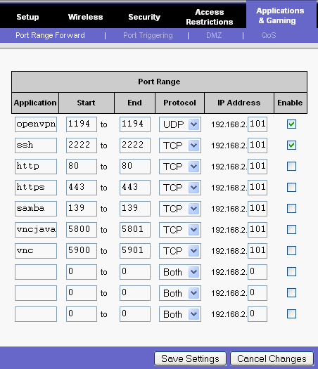

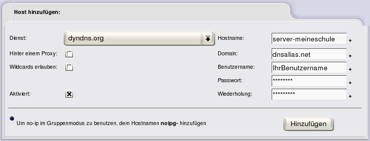

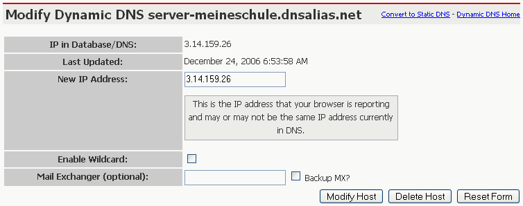

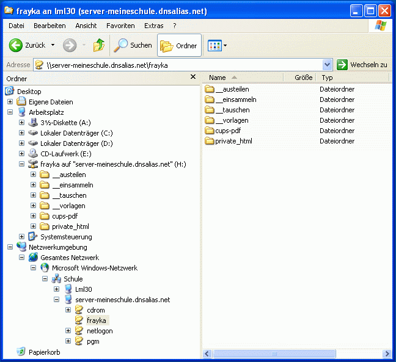

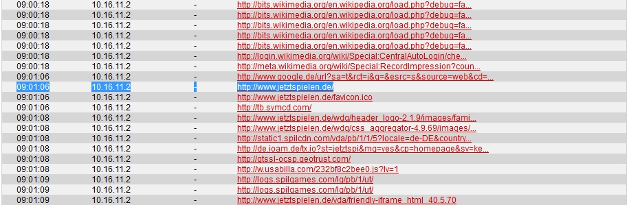

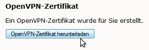

.. |1000000000000396000000A85CE98F0B_jpg| image:: media/1000000000000396000000A85CE98F0B.jpg
    :width: 14.5cm
    :height: 2.631cm

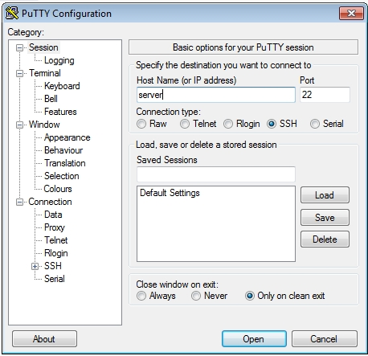

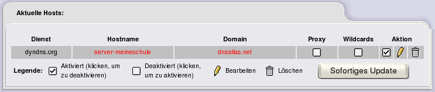

.. |100000000000030600000104CB42EF5A_gif| image:: media/100000000000030600000104CB42EF5A.gif
    :width: 12.001cm
    :height: 4.021cm

.. |10000000000002AA0000008C22E0F192_jpg| image:: media/10000000000002AA0000008C22E0F192.jpg
    :width: 12.001cm
    :height: 2.451cm

.. |1000000000000129000000B42200A39D_jpg| image:: media/1000000000000129000000B42200A39D.jpg
    :width: 8cm
    :height: 4.841cm

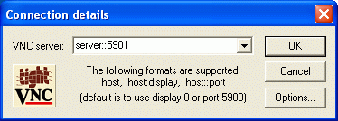

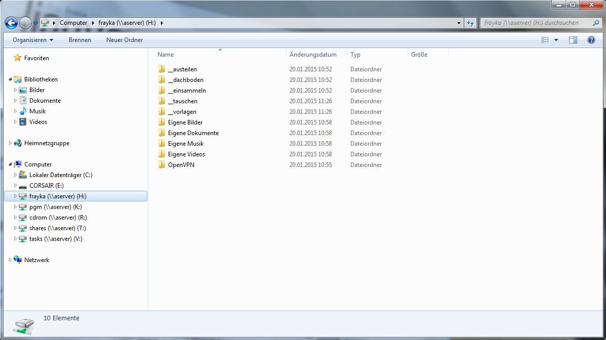

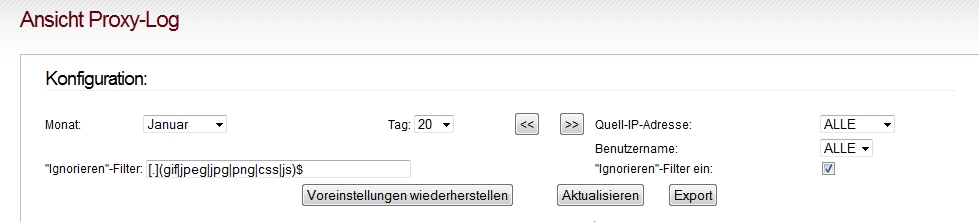

.. |100000000000030400000193F3B86D83_gif| image:: media/100000000000030400000193F3B86D83.gif
    :width: 14.499cm
    :height: 7.569cm

.. |10000000000001DE00000082822B63C9_jpg| image:: media/10000000000001DE00000082822B63C9.jpg
    :width: 12.001cm
    :height: 3.26cm

.. |1000000000000391000000528E6CD30E_jpg| image:: media/1000000000000391000000528E6CD30E.jpg
    :width: 12.001cm
    :height: 1.061cm

.. |10000000000002E500000109DDDB3D94_gif| image:: media/10000000000002E500000109DDDB3D94.gif
    :width: 12.001cm
    :height: 4.271cm

.. |10000000000003AE000000D4CE42221A_jpg| image:: media/10000000000003AE000000D4CE42221A.jpg
    :width: 12.001cm
    :height: 2.691cm

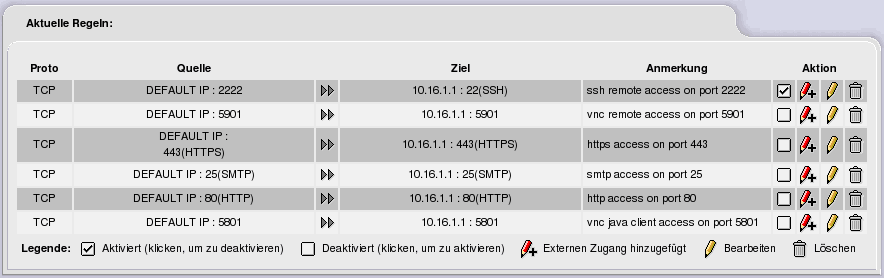

.. |Sicherheit_IPCop_Willkommen_gif| image:: media/Sicherheit_IPCop_Willkommen.gif
    :width: 11.381cm
    :height: 5.997cm

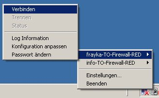

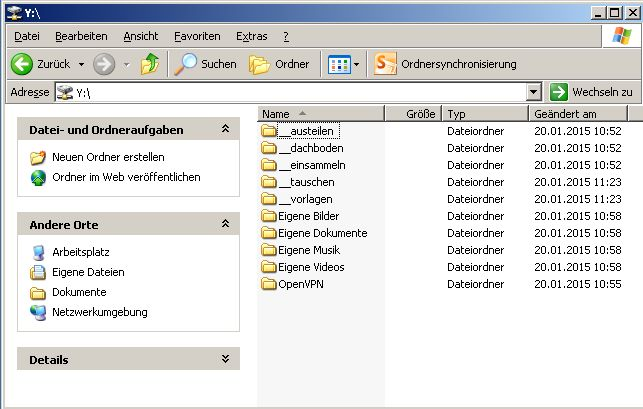

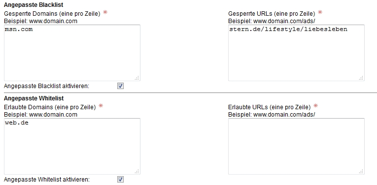

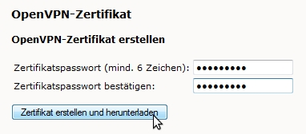

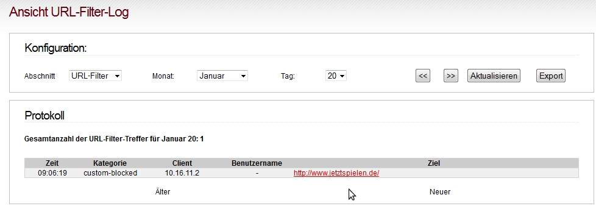

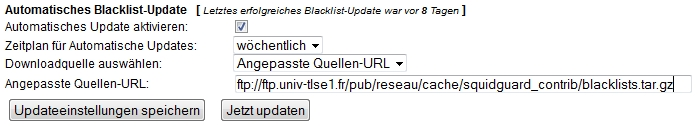

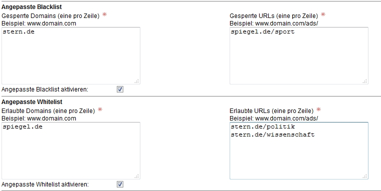

.. |1000000000000260000000415DC8D6B3_jpg| image:: media/1000000000000260000000415DC8D6B3.jpg
    :width: 12.501cm
    :height: 1.281cm

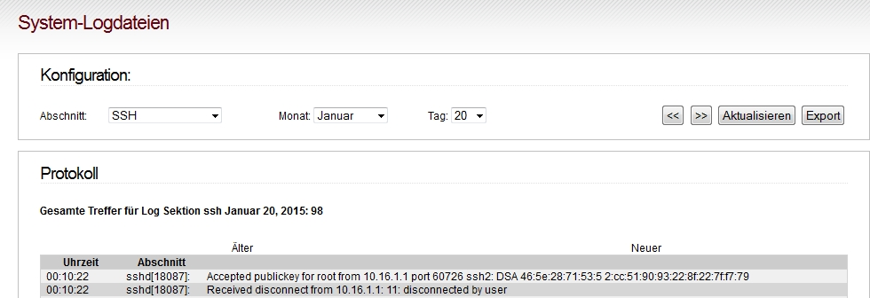

