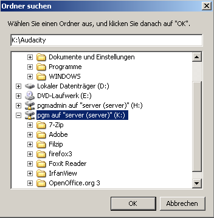
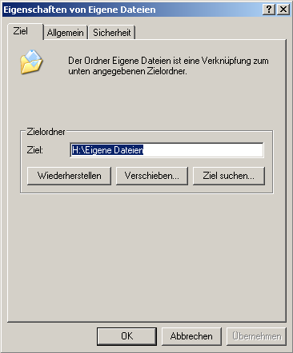
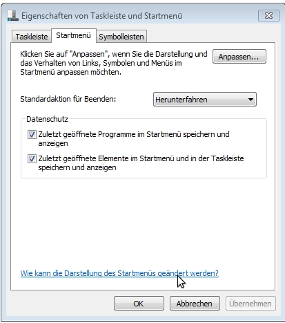
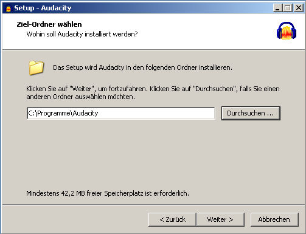
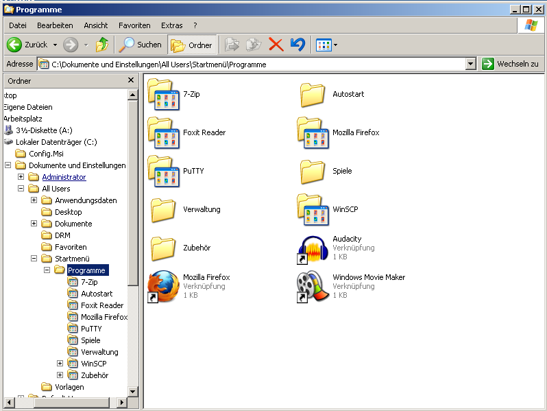
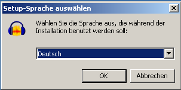
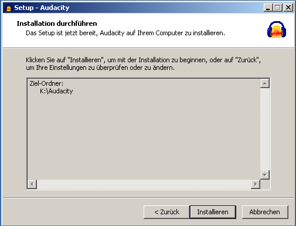
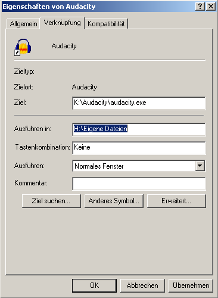
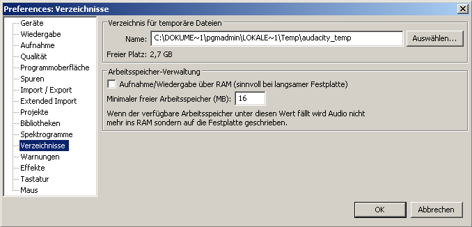
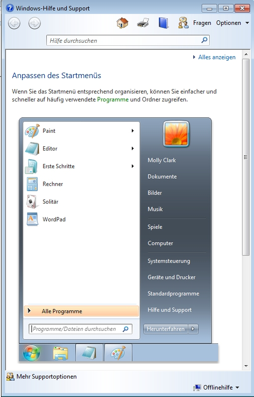

Software im Netz
================

In diesem Kapitel geht es um die verschiedenen Arten der Softwareinstallation im Netz. Es werden Vor- und Nachteile aufgezeigt. Schließlich wird anhand von typischen Beispielen die Softwareinstallation geübt.

**Die Varianten der Softwareinstallation**

In diesem Abschnitt wird eine vollständig lokale Installation auf der Arbeitsstation der serverbasierten Installation gegenübergestellt.

**Beispiele und Übungen zur Softwareinstallation**

Anhand der Softwarepakete
*Acrobat-Reader*
,
*Mozilla-Firefox*
und
*OpenOffice 2.x*
werden die unterschiedlichen Varianten der Softwareinstallation beispielhaft vorgestellt.

Die Varianten der Softwareinstallation
--------------------------------------

Eine zentrale Aufgabe eines Servers in einem Computernetz ist es, Anwendungsprogramme für die Arbeitsstationen zur Verfügung zu stellen. Da leider viele Softwarepakete überhaupt nicht oder nur eingeschränkt für die Verwendung in Netzwerken konzipiert wurden, ist die zentrale Softwareinstallation zum Teil nur mit erheblichem Aufwand oder gar nicht möglich. Prinzipiell gibt es für die Softwareinstallation zwei Möglichkeiten:

Installation auf den Arbeitsstationen:
~~~~~~~~~~~~~~~~~~~~~~~~~~~~~~~~~~~~~~~

Die Software ist komplett auf den Arbeitsstationen installiert. Diese Art der Installation ist für die meisten Softwarepakete am einfachsten durchführbar, weil sie der Installation auf einem Einzelplatzrechner entspricht. Große Softwarepakete wie z.B.
*MS-Office*
benötigen allerdings sehr viel Platz auf der Festplatte. Das ist zwar bei den heutigen Festplattengrößen von vielen GBytes kein Problem mehr, aber durch jede lokal installierte Software wird das Festplattenimage (siehe Kapitel
) größer und damit die Zeiten für die Image-Erstellung und das Zurückspielen auf die Arbeitsstationen länger.

Serverbasierte Installation:
~~~~~~~~~~~~~~~~~~~~~~~~~~~~

Möglichst viele oder sogar alle Dateien der Software liegen auf dem Server. Diese Art der Installation bietet viele Vorteile und kaum Nachteile.

Vorteile:

*   Die Festplattenimages können sehr klein gehalten werden; der Speicherplatz wird nur einmal, nämlich auf dem Server, benötigt.

*   Im optimalen Fall, wenn bei der Installation keine einzige Datei auf den Arbeitsstationen abgelegt wird, muss nur die Verknüpfung im Startmenü zum Programmstart erzeugt werden, was viel Zeit spart.

*   Zum Einspielen einer neuen Version der Software („Softwareupdate“) müssen im Idealfall nur die Dateien auf dem Server erneuert werden.

Nachteile:

*   Bei einem Ausfall des Servers ist die Software auf den Arbeitsstationen nicht mehr benutzbar.

*   Das Starten der Software über das Netz geht evtl. etwas länger als das Starten von der lokalen Festplatte. Dies dürfte aber bei einem modernen vollgeswitchten 1Gbit-Netz kein Problem sein.

*   Je nach Software kann die Installation komplizierter sein.

Die Installation von Software, die ihre Dateien komplett auf dem Server installieren lässt, bereitet normalerweise keine Probleme. Aufwändiger wird es bei Software, die neben ihrer Installation auf ein Netzlaufwerk, auch eine lokale Installation an der Arbeitsstation oder zumindest einige lokal gespeicherte Komponenten erfordert. Bei der lokalen Installation werden erforderliche Programmdateien und DLLs auf die Arbeitsstation kopiert, Registry-Einträge vorgenommen und evtl. INI-Dateien erzeugt. Ohne diese lokalen Komponenten sind diese Anwendungen nicht oder nur begrenzt einsatzfähig.

Zudem gibt es Software, für die eine Netzwerkinstallation zwar vorgesehen ist, diese mit den Standardeinstellungen jedoch wenig Sinn macht, z.B. installiert das Setup-Programm von
*MS-Office*
bei der „Serverinstallation“ etwa 190 MByte auf die lokale Platte der Arbeitsstation!

Schwierig ist auch die häufig gewünschte Installation bestimmter Multimedia-CDs im Netz. Diese Programme sind eigentlich nur für den Start von CD-ROM gedacht. Oft gibt es aber Möglichkeiten, die CD auf den Server zu kopieren und über das Netz lauffähig zu machen.

Eine wichtige und hilfreiche Adresse für Fragen zur Softwareinstallation im Netz ist die Seite der Arbeitsgruppe Software im Netz (
*SON*
-Gruppe) im
*Landesmedienzentrum*
. Dort finden Sie Anleitungen und Hilfen zur Softwareinstallation vieler gängiger Anwendungsprogramme. Diese Seiten sollten Sie vor einer Softwareinstallation oder -bestellung grundsätzlich konsultieren. Sollten Sie dort ein von Ihnen gewünschtes Anwendungsprogramm nicht finden und es in Ihrem Netzwerk erfolgreich installiert haben, werden Sie ausdrücklich gebeten, Ihre Installationsunterlagen zur Verfügung zu stellen. Informationen zu Medienpädagogik und Medienkultur, sowie zum pädagogischen Nutzen von Software, finden Sie auf den Seiten von Media-Culture, einem Teilprojekt der Medienoffensive II des Landes Baden-Württemberg
.

Nicht zuletzt ist die Möglichkeit der serverbasierten Installation von Anwendungsprogrammen eng verknüpft mit deren Mehrbenutzertauglichkeit. Damit Programme serverbasiert installiert werden können, müssen sie eine saubere Trennung von Programm- und Datenbereich ermöglichen. Führen Programme Schreibaktionen in Dateien im Programmverzeichnis aus, so macht es keinen Sinn, sie im vorgesehenen Programmlaufwerk auf dem Server zu installieren, weil dort normale Benutzer nur Leserecht haben. Ebenfalls sehr problematisch sind Programme, die eine eigene Benutzerverwaltung mitbringen, etwa um Lernfortschritte abzuspeichern. Solche Programme sind nur unter bestimmten Umständen (notwendig ist z.B., dass alle Pfade frei wählbar sind) sinnvoll in einem Schulnetz zu installieren.

Die Möglichkeit, ein Programm serverbasiert und damit meist auch mehrbenutzerfähig auf dem Server installieren zu können, sollte ein wichtiges Kriterium bei der Anschaffung von Software sein. Auf den Support-Seiten des Landesmedienzentrums finden Sie ein ausführliches Dokument mit Empfehlungen für schulnetzgeeignete Software
.

Beachten Sie bitte unbedingt vor der Installation von Software die Lizenzbedingungen.
Als Netzwerkberater sind Sie für die Einhaltung der
lizenzrechtlichen
Bestimmungen mit verantwortlich!

Viele Lizenzen gelten nur für die Installation auf einem Einzelplatzrechner. Für Software im schulischen Einsatz gibt es eine ganze Reihe von Lizenzierungsmodellen:

*   Einzelplatzlizenzen
    speziell für Schulen (meist verbilligt)

*   so genannte Klassenraum-Lizenzen für eine bestimmte Anzahl von Arbeitsstationen (meist auf einen Raum beschränkt)

*   Schullizenzen, die es erlauben, auf allen Rechnern der Schule zu installieren

*   erweiterte Schullizenzen, die sowohl die Installation auf allen Schulrechnern als auch auf den privaten Rechnern der Lehrkräfte der Schule erlauben; evtl. sogar auf den privaten Rechnern aller Schüler/innen

Softwareinstallation unter Windows XP
-------------------------------------

Die Installation von Programmen muss bei
*Windows*
-Software normalerweise von einer Arbeitsstation aus vorgenommen werden, da das Installationsprogramm nur unter
*Windows*
läuft. Normalerweise führt an einer Arbeitsstation mit
*Windows XP*

der Administrator die Installation von Software durch.
In der
*linuxmuster.net*
ist ein spezieller Benutzer
pgmadmin

(für Programmadministrator) mit besonderen Rechten eingerichtet. Man sollte Programme ausschließlich unter diesem Benutzernamen installieren, denn nur dann ist gewährleistet, dass die Installation korrekt ausgeführt werden kann und alle Benutzer das Programm nutzen können.

Ein wichtiger Punkt sind die persönlichen Einstellungen für die Benutzer.
*Windows XP*
legt für jeden Benutzer ein Profil an, in dem verschiedene Einstellungen gespeichert werden. So werden z.B. für alle Benutzer die Desktop-Einstellungen (Hintergrundbilder usw.) abgespeichert. Diese individuellen Einstellungen des Desktops sowie individuelle Einstellungen bei Programmen (angepasste Menüleisten, Optionen usw.) sind oft unerwünscht, denn für das Arbeiten mit einer Lerngruppe ist es sehr hilfreich, oft sogar notwendig, zu wissen, welche Einstellungen die Benutzer vorfinden.

Des Weiteren werden bei vielen Programmen während der Installation Informationen in das Profil des installierenden Benutzers geschrieben, die für das Funktionieren des Programms notwendig sind. In einem Schulnetz sollten natürlich alle Benutzer diese notwendigen Einträge in ihrem Profil haben.

Aus den genannten Gründen ist es also sinnvoll, allen Benutzern bei der Anmeldung an der Arbeitsstation die selben Einstellungen verpflichtend zuzuordnen. Dies wird dadurch erreicht, dass man das Profil des Benutzers
pgmadmin
als
„Muster-Profil“ benutzt und jedem Benutzer bei der Anmeldung dieses Profil zuweist. Nach einer Programminstallation oder Veränderung von Einstellungen müssen Sie das Benutzerprofil des Benutzers
pgmadmin
auf die anderen Benutzer kopieren. Wie man das macht wird im Laufe der nächsten Abschnitte

erklärt.

Besondere Einstellungen bei Windows XP
~~~~~~~~~~~~~~~~~~~~~~~~~~~~~~~~~~~~~~

*Windows XP*
lässt sich in vielen Punkten eigenen Bedürfnissen und Gewohnheiten anpassen, die hier aber nicht alle aufgelistet werden können. Einige wichtige Beispiele sollen aber genannt werden. Nehmen Sie die Einstellungen bitte als Benutzer
pgmadmin
vor:

#.  Das Standard-Benutzerverzeichnis
    *Eigene Dateien*
    darf nicht auf die lokale Festplatte (
    C:\Dokumente und Einstellungen\<Benutzername>\Eigene Dateien
    ), sondern muss auf einen Ordner
    *Eigene Dateien*
    im Heimat-Verzeichnis im Netzwerk H: verweisen, damit Benutzerdaten eine Restauration des Rechners überdauern und im Netzwerk auf allen Arbeitsstationen zur Verfügung stehen (siehe Abschnitt
    ).

#.  Optionen für den Arbeitsplatz bzw. den
    *Windows-Explorer*
    einstellen: Sollen die Ordner als Symbole dargestellt werden? Sollen Dateiendungen angezeigt werden? ...

#.  Evtl. zusätzliche Sprachen einrichten.

#.  Desktop einstellen:
    Desktop rechter Mausklick oder
    *Start*
    |
    * Einstellungen*
    |
    * Systemsteuerung*
    |
    * Anzeige*
    : Bildschirmauflösung, Farben, Hintergrund und Bildschirmschoner festlegen.
    Rubrik
    *Desktop*
    |
    * Desktop anpassen*
    :
    *Internet Explorer,*

    *Netzwerkumgebung*
    nicht anzeigen,
    *Desktopbereinigung*
    ausschalten.
    Rubrik
    *Darstellung*
    : Effekte einstellen.

#.  Startmenü einstellen:
    Rechter Mausklick auf Start, dann:
    *Eigenschaften*
    |
    * klassisches Startmenü*
    |
    * Anpassen*
    :
    *Abmelden*
    anzeigen, keine
    *persönlich angepassten Menüs*
    verwenden,
    *Verwaltung*
    ausschalten.

#.  Offline-Dateien ausschalten:
    *Systemsteuerung*
    |
    *Ordneroptionen*
    |
    * OfflineDateien*
    Falls bereits vorhanden: Ordner
    c:\windows\csc
    löschen

#.  Dienste deaktivieren:
    *Systemsteuerung*
    |
    *Verwaltung*
    |
    * Dienste*
    :
    *Nachrichten*
    -,
    *Server*
    - und
    *Webclientdienste*
    deaktivieren.

#.  Systemwiederherstellung und automatische Updates ausschalten (macht bei Verwendung von SheilA keinen Sinn):
    Rechter Mausklick auf
    *Arbeitsplatz*
    , dann
    *Eigenschaften*
    |
    * automatische Updates*
    bzw.
    *Systemwiederherstellung*
    .

Weitere Hinweise finden sie hier

Nach Abschluss der Einstellungen sollte das Profil des Benutzers
pgmadmin
für alle anderen Benutzer zur Verfügung gestellt werden, was im nächsten Abschnitt ab Punkt 3 dargestellt wird.

Vorgehen bei der Softwareinstallation
~~~~~~~~~~~~~~~~~~~~~~~~~~~~~~~~~~~~~

Die folgenden Schritte beschreiben das grundsätzliche Vorgehen bei der Softwareinstallation:

#.  Starten und Restaurieren der Musterarbeitsstation (Arbeitsstation von der später ein Festplattenimage erstellt wird) mit Hilfe von
    *LINBO*
    .

    Die Restauration der Arbeitsstation ist notwendig, um vor der Image-Erstellung eine „saubere“ Arbeitsstation zu haben.

    **Hinweis:**
    Solange man als
    pgmadmin
    angemeldet ist, sollte man jede unnötige Aktion (wie z.B. Internetzugang oder E-Mail) vermeiden, weil alle Aktivitäten im Profil gespeichert werden. Falls Sie für die Installation Dateien herunter laden müssen, tun Sie das an einer anderen Arbeitsstation oder bevor Sie den Rechner für die Installation restaurieren. Der richtige Ort für diese Downloads ist das Homeverzeichnis
    H:\
    des
    pgmadmin
    .

#.  Arbeiten an der Arbeitsstation als Benutzer
    pgmadmin
    .

    In diesem Schritt nehmen Sie die eigentliche Softwareinstallation vor (zunächst für den Benutzer
    pgmadmin
    ):

#.  
    *   Als
        pgmadmin
        anmelden. (Das Kennwort wird bei der Installation vergeben und lautet in der Schulungsumgebung „
        muster
        “.)

    *   Programm installieren.

    *   Programminstallationen in einem Netzwerk müssen sorgfältig durchgeführt werden und sind von Programm zu Programm unterschiedlich. Viele Standardprogramme liegen auf dem ftp-Server der SON-Gruppe
        als MSI-Pakete vor, die per „one-click“ installiert werden können. Für jedes Paket existiert eine Installationsanleitung, die Hinweise enthält, wie und wo das Programm zu installieren ist. Im Downloadbereich finden sich auch die alten Anleitungen vor der Bereitstellung der MSI-Pakete. Um dieses Angebot zu nutzen müssen Sie registrierter Kunde beim LMZ (Landesmedienzentrum) sein
        .

    *   Die Arbeitsstation ohne Restaurierung (!) neu starten und wieder als
        pgmadmin
        anmelden. Alle installierten Programme mindestens ein Mal starten, um z.B. die Windows-Installer-Aktivitäten abzuschließen.

    *   Das Programm testen: wohin zeigt z.B. die Standardpfadvorgabe für zu speichernde Dateien? Diese sollte, soweit möglich, immer auf
        H:\
        , also das Homeverzeichnis des jeweiligen Nutzers zeigen.

        Sehr oft findet man diese Einstellungen über die Menuleiste unter
        *Bearbeiten – Einstellungen*
        oder unter
        *Extras – Optionen o.ä.*

    *   pgmadmin
        abmelden.

#.  Arbeiten an der Arbeitsstation als lokaler Administrator.

    In diesem Schritt machen Sie das Profil des Benutzers
    pgmadmin
    zum Standardprofil für alle Benutzer, indem Sie dessen Profil als lokaler Administrator auf das Standardprofil für alle Benutzer (
    *Default User*
    ) kopieren:

#.  
    *   Am Musterclient als lokaler Administrator anmelden.

    *   Unter
        *Arbeitsplatz*
        |
        * Eigenschaften*
        |
        * Erweitert *
        |
        * Benutzerprofile*

        alle Profile außer
        Administrator (lokal)
        und
        pgmadmin
        löschen.

    *   |10000000000001D600000202FD96CEF6_jpg|
        |100002010000018D000000F03BC72959_png|
        Danach wird das Profil des
        pgmadmin
        ausgewählt und nach
        *Default User*
        kopiert. Klicken Sie dazu auf
        *Kopieren nach*
        und wählen Sie den Ordner
        C:\Dokumente und Einstellungen\Default User

    *   Lokalen
        Administrator
        abmelden.

        Mit diesem Verfahren wird folgendes erreicht: Meldet sich ein Benutzer zum ersten Mal an einem Rechner an, erhält er die Einstellungen des
        *Default Users*
        .
        Sollte er nun Einstellungen während der Sitzung ändern, bleiben diese nur so lange erhalten, bis der Rechner neu synchronisiert wird.

    *   Neues Image erstellen. Denken Sie dabei an die unterschiedlichen Hardwareklassen (siehe Kapitel
        ).

    *   Neustart der Arbeitsstation.

**Hinweis:**
Führen Sie einen Test der installierten Programme unbedingt als Lehrer
**und**
als Schüler durch, weil einige Programme versuchen, im Programmverzeichnis (auf K:) zu schreiben, was für normale Benutzer nicht erlaubt ist.

Wegen der besonderen Rechte, die
pgmadmin
hat, sollten Sie sich nur für Softwareinstallationen oder Änderung von Grundeinstellungen als
pgmadmin
anmelden.

Beispiele und Übungen
~~~~~~~~~~~~~~~~~~~~~

In den folgenden Übungen prüfen Sie zunächst ob der Ordner
*Eigene Dateien*
auf
Laufwerk
H:\
vorhanden ist. Als nächstes installieren Sie die Anwendungssoftware
*FoxIt-Reader*
lokal mit einem Installationspaket, das Sie aus dem Internet herunterladen. Danach installieren Sie das Programm Xmind mit Hilfe eines SON Paketes. Als weitere Übung können Sie die bekannteste Audiosoftware aus dem Opensource Bereich,
*Audacity*
, netzwerkbasiert installieren. Welche Anpassungen sie vornehmen müssen, damit das Programm problemlos läuft können Sie in Übung 4 Schritt für Schritt nachvollziehen.

#.  Prüfen
    von
    *Eigene Dateien*
    auf
    H:\

    *   Melden Sie sich als Benutzer
        pgmadmin
        an einer Arbeitsstation an. Das Profil dieses Benutzers wird später zum Standardprofil für alle Benutzer. Deshalb nehmen wir die entsprechenden Anpassungen unter dieser Benutzerkennung vor.

    *   Prüfen Sie mit dem
        *Windows Explorer*

        ob der Ordner
        *Eigene Dateien*
        auf Laufwerk
        H:\
        existiert. (In der Fortbildungsumgebung wird der Ordner
        H:\Eigene Dateien
        bei jedem Benutzer bei der ersten Anmeldung eingerichtet, bzw. wenn der Benutzer sich anmeldet geprüft, ob der Ordner vorhanden ist und bei Bedarf wieder hergestellt. Ein sogenanntes Login-Skript, das bei jeder Benutzeranmeldung abläuft, erledigt das für uns automatisch.)

    *   Öffnen Sie auf dem Desktop mit Rechtsklick auf
        *Eigene Dateien*
        das Kontextmenü, wählen Sie dann
        *Eigenschaften*
        . Im Eingabefeld
        *Ziel:*
        muss der Pfad
        H:\Eigene Dateien
        eingetragen sein. Bestätigen Sie mit
        *OK*
        . Bestätigen Sie die darauf folgende Abfrage ebenso mit
        *OK*
        .

        |100000000000016E000001BA52553E9A_png|

#.  Installation des Foxit-Reader

    *   Laden Sie das kostenlose Programm
        *Foxit-Reader*
        aus dem Internet herunter und speichern Sie die Installationsdatei im Heimatverzeichnis des Benutzers
        pgmadmin
        (Laufwerk
        H:
        ).

    *   Starten Sie eine Arbeitsstation „sauber“ durch Restaurierung des Festplattenimages und melden sich als Benutzer
        pgmadmin
        an.

    *   Installieren Sie das Programm lokal (Festplatte
        C:
        bzw. angebotener Pfad) auf Ihrer Musterarbeitsstation und testen Sie die ordnungsgemäße Funktion.

    *   Melden Sie sich als lokaler Administrator an und kopieren Sie das Profil des Benutzers
        pgmadmin
        nach
        *Default User.*

    *   Erstellen Sie von der Musterarbeitsstation ein Festplattenimage und spielen Sie es auf die andere Arbeitsstation zurück.

    *   Testen Sie, ob der
        *Foxit*
        -Reader
        auch bei Lehrern und Schülern korrekt funktioniert.

#.  Installation mit Hilfe eines SON Paketes

    *   Für diese Übung benötigen Sie das SON Paket
        Xmind
        . Sie erhalten es zusammen mit einer Kurzanleitung in pdf Form von Ihrem Fortbildungsleiter. Beachten Sie auch die Kurzanleitung.

    *   Melden Sie sich als
        pgmadmin
        an Ihrer Musterarbeitsstation an.

    *   Kopieren Sie die Datei
        xmind.zip
        in das Heimatverzeichnis des Benutzers
        pgmadmin
        (Laufwerk
        H:
        ).

    *   Entpacken Sie die Datei
        xmind.zip
        über das Kontextmenü mit Hilfe des Programms
        *7zip-Extract files*
        nach
        K:\XMind.

    *   Wechseln Sie im
        *Windows Explorer*
        nach
        K:\XMind\_pack
        .

    *   Starten Sie dort mit Doppelklick die Datei
        Xmind.cmd.

    *   Die Installation des Programmes läuft vollautomatisch ab. Im Verlauf erscheinen kurz zwei Fenster.

    *   Sie finden das Programm
        *XMind*
        nun auf Ihrer Musterarbeitsstation unter
        *Start – Programme – Webdesign – Xmind.*
        Starten Sie das Programm einmalig als
        pgmadmin.

    *   Nach dem Start erscheint ein Fenster
        *Anmelden an Xmind.net*
        das Sie einfach schließen können.

    *   Melden Sie sich als lokaler Administrator an und kopieren Sie das Profil des Benutzers
        pgmadmin
        nach
        *Default User.*

    *   Erstellen Sie von der Musterarbeitsstation ein Festplattenimage und spielen Sie es auf die andere Arbeitsstation zurück.

    *   Testen Sie, ob
        *XMind*
        auch bei Lehrern und Schülern korrekt funktioniert.

#.  Netzwerkbasierte Installation von
    *Audacity*

    *   Laden Sie das kostenlose Programm
        Audacity
        aus dem Internet herunter und speichern Sie die Installationsdatei im Heimatverzeichnis des Benutzers
        pgmadmin
        (Laufwerk
        H:
        ).

    *   Starten Sie eine Arbeitsstation „sauber“ durch Restaurierung des Festplattenimages und melden sich wieder als Benutzer
        pgmadmin
        an.

    *   Starten Sie die Installation von
        Audacity
        durch Doppelklick auf die heruntergeladene exe Datei (zum Stand der Veröffentlichung:
        audacity-win-2.0.exe
        ).

    *   Wählen Sie als Sprache
        *deutsch .*

    *   |100000000000012F000000981A038D65_png|
        Wählen Sie im nächsten Fenster
        *Weiter.*

    *   Bestätigen Sie die Lizenzabfrage ebenfalls mit
        *Weiter.*

    *   Wählen Sie
        *Durchsuchen .*

        |10000000000001F7000001817F574302_png|

    *   Wählen Sie den Eintrag
        *pgm auf ''server (server)'' (K:)*
        , und
        *Ok .*

        |100000000000016000000168FFC2924F_png|

        und bestätigen Sie mit
        *Weiter*
        im nächsten Fenster den Pfad
        K:\Audacity
        .

    *   |10000000000001F600000181B2DEA136_png|
        Entfernen Sie den Haken bei
        *Create a Deskop Icon*
        und klicken Sie
        *Weiter.*

    *   Im nächsten Fenster wählen Sie
        *Installieren*
        .

        und bestätigen das folgende Fenster mit
        *Weiter .*

    *   im letzten Fenster entfernen Sie den Haken bei
        *Launch Audacity*

        und schliessen die Installation mit
        *Fertigstellen*
        ab.

        In den nun folgenden Schritten passen Sie, immer noch als
        pgmadmin
        angemeldet, die Installation an die Befürfnisse der Nutzer an.

    *   |10000000000001F9000001816CE6E4AB_png|
        Klicken Sie mit der rechten Maustaste auf Start und wählen Sie Eigenschaften.

    *   |10000000000000FE0000005C0140D9C7_jpg|
        Wählen Sie
        *Anpassen*
        und im folgenden Fenster
        *Erweitert*
        .

|100000000000019D000001D3CB99206F_jpg|
|10000000000001FE0000031E77C575A7_jpg|

#.  
    *   Wandern Sie zum Verzeichnis
        C:\Dokumente und Einstellungen\All Users\Startmenü\Programme

    *   |100000000000031E0000025773941917_png|
        Öffnen Sie mittels der rechten Maustaste das Kontextmenü von
        *Audacity Verknüpfung*
        und wählen Sie dort
        *Eigenschaften.*

    *   Ändern Sie im Feld
        *Ausführen in:*
        den Eintrag
        K:\Audacity
        in
        H:\Eigene Dateien

        |100000000000016E000001F40256A24E_png|

        und bestätigen Sie mit
        *OK*
        . Schliessen Sie die offenen Fenster bzw. beenden Sie die offenen Dialoge mit
        *OK*
        .

    *   Starten Sie nun
        *Audacity*
        . Ein Fenster zeigt kurz die Initialisierung der Plugins.

    *   |1000000000000133000000AD8D466214_png|
        Setzen Sie das Häkchen bei
        *Diesen Dialog nicht mehr anzeigen*
        und
        * *
        bestätigen Sie mit
        *OK*
        .

    *   Wählen Sie im Menü
        *Bearbeiten | Einstellungen*
        und im Fenster
        *Preferences*
        die Option
        *Verzeichnisse*

    *   |10000000000002A6000001465779B3FB_png|
        Ändern Sie den Eintrag
        C:\DOKUMEN
        ...... in
        C:\windows\temp

    *   Bestätigen Sie den Hinweis mit
        *OK*
        .

    *   Schließen Sie Audacity und prüfen Sie nach einem Neustart des Programms, ob alle vorgenommenen Einstellungen übernommen wurden.

    *   Melden Sie sich als lokaler Administrator an und kopieren Sie das Profil des Benutzers
        pgmadmin
        nach
        *Default User.*

    *   Erstellen Sie von der Musterarbeitsstation ein Festplattenimage und spielen Sie es auf die andere Arbeitsstation zurück.

    *   Testen Sie, ob Audacity auch bei Lehrern und Schülern funktioniert.

.. |10000000000000FE0000005C0140D9C7_jpg| image:: media/10000000000000FE0000005C0140D9C7.jpg
    :width: 8cm
    :height: 2.901cm

.. |1000000000000133000000AD8D466214_png| image:: media/1000000000000133000000AD8D466214.png
    :width: 8.501cm
    :height: 4.791cm

.. |100002010000018D000000F03BC72959_png| image:: media/100002010000018D000000F03BC72959.png
    :width: 9.501cm
    :height: 3.83cm

.. |10000000000001F600000181B2DEA136_png| image:: media/10000000000001F600000181B2DEA136.png
    :width: 12.001cm
    :height: 9.18cm

.. |10000000000001D600000202FD96CEF6_jpg| image:: media/10000000000001D600000202FD96CEF6.jpg
    :width: 12.001cm
    :height: 13.121cm

