Benutzerverwaltung in der linuxmuster.net
=========================================

In diesem Kapitel erfahren Sie, wie in der
*linuxmuster.net*
Benutzer verwaltet werden:

**Allgemeines zur Organisation der Benutzerverwaltung**

erläutert allgemein, was eine Benutzerverwaltung leisten muss.

**Die Benutzergruppen in der**
*linuxmuster.net*

stellt die Benutzergruppen mit ihren unterschiedlichen Eigenschaften vor.

**Grundkonfiguration der Benutzerverwaltung**

erläutert die Konfigurationsparameter, die vor dem ersten Aufruf zu setzen sind.

**Anlegen, Versetzen und Löschen von Benutzern**

zeigt, wie Benutzer neu angelegt, versetzt und gelöscht werden.

**Benutzer reaktivieren**

erklärt das Verfahren, um Benutzer, die noch nicht vollständig entfernt wurden, wieder ins System zurück zu holen.

**Passwörter verwalten**

erklärt, wie man Passwörter setzt, ändert oder Passwort-Listen ausdruckt.

**Festplattenplatz beschränken (Quotas)**

geht darauf ein, wie man den Benutzern den nur begrenzt zur Verfügung stehenden Festplattenplatz beschränken kann.

**Weiterführendes zur Benutzerverwaltung mit**
*Sophomorix*

erläutert die einzelnen Module und Status-Werte, in denen sich Benutzer befinden können.

Allgemeines zur Organisation der Benutzerverwaltung
---------------------------------------------------

In jedem Netzwerk müssen die Benutzer vom Netzwerkbetreuer verwaltet werden. Es müssen Benutzer neu angelegt oder gelöscht, Benutzerdaten korrigiert oder Benutzer den Benutzergruppen zugewiesen werden. In den meisten Fällen ist es außerdem im schulischen Umfeld angebracht, den zur Verfügung stehenden Plattenplatz zu begrenzen und sog. Quotas anzulegen. In der
*linuxmuster.net*
wird für alle diese Aufgaben das Programm
*Sophomorix*
verwendet.

Für die tägliche Arbeit steht dem Netzwerkbetreuer die
*Schulkonsole*
des Benutzers
administrator
zur Verfügung. Dort werden grundlegende Einstellungen vorgenommen, die Benutzerlisten gepflegt und geprüft sowie Benutzer angelegt, versetzt und gelöscht, außerdem die Passwörter und der Plattenplatz (Quotas) für alle Benutzer und Gruppen verwaltet. Nur Passwörter von Schülern/innen sowie Projekte können auch von Personen mit normalen Lehrer-Rechten
verwaltet werden.

Sehr hilfreich sind in der
*Schulkonsole*
die Hilfen und Erläuterungen in der rechten Spalte unten, sowie die Status- bzw. Fehlermeldungen, die rechts oberhalb der Erläuterungen grün bzw. rot unterlegt angezeigt werden.

Aufgerufen wird die
*Schulkonsole*
durch Eingabe von
https://<servername>:242
. Es erscheint eine Anmeldeseite auf der man sich als Schüler, Lehrer oder Administrator anmelden kann und je nach Status unterschiedliche Menüs zur Verfügung gestellt bekommt.

Die Benutzergruppen in der linuxmuster.net
------------------------------------------

Wenn man auf Dateien des Servers zugreifen möchte, muss man sich mit einem Benutzernamen (Loginname) und einem Kennwort (Passwort) am Server anmelden (authentifizieren). Dabei sollen nicht alle Benutzer am System auf die gleichen Dateien und Drucker zugreifen oder an Dateien die selben Rechte haben können.

Es ist üblich, Benutzer, die gleiche Rechte haben sollen, zu Benutzergruppen zusammenzufassen. In der
*linuxmuster.net*
gibt es, angepasst auf Schulbedürfnisse, die folgenden Hauptbenutzergruppen:

+--------------------------------------+-------------------------------------------------------------------------------------------------------------------------------------------------------------------------------------------------------------------------------------------------------------------------------------------------------------+
| **Benutzergruppe**                   | **Kennzeichen**                                                                                                                                                                                                                                                                                             |
|                                      |                                                                                                                                                                                                                                                                                                             |
+--------------------------------------+-------------------------------------------------------------------------------------------------------------------------------------------------------------------------------------------------------------------------------------------------------------------------------------------------------------+
| <klassengruppen> (z.B. 10a, 5a usw.) | Schüler-Benutzer mit privatem Datenbereich. Es dürfen keinerlei Systemdateien modifiziert werden.                                                                                                                                                                                                           |
|                                      |                                                                                                                                                                                                                                                                                                             |
+--------------------------------------+-------------------------------------------------------------------------------------------------------------------------------------------------------------------------------------------------------------------------------------------------------------------------------------------------------------+
| teachers                             | Lehrer-Benutzer mit privatem Datenbereich. Es dürfen keine Systemdateien modifiziert werden.                                                                                                                                                                                                                |
|                                      | Zusätzlich hat der Lehrer Zugriff auf alle Klassentauschverzeichnisse und lesenden Zugriff auf die Schüler-Homeverzeichnisse. Alle Lehrer können über die Schulkonsole pädagogisch notwendige Aufgaben auf dem Server ausführen (z. B. Dateien austeilen, Internetzugang abschalten, ... siehe auch Kapitel |
|                                      | .                                                                                                                                                                                                                                                                                                           |
|                                      |                                                                                                                                                                                                                                                                                                             |
+--------------------------------------+-------------------------------------------------------------------------------------------------------------------------------------------------------------------------------------------------------------------------------------------------------------------------------------------------------------+
| domadmins                            | Darf alle für den reinen Schulbetrieb wichtigen Aufgaben am Server durchführen.                                                                                                                                                                                                                             |
|                                      |                                                                                                                                                                                                                                                                                                             |
+--------------------------------------+-------------------------------------------------------------------------------------------------------------------------------------------------------------------------------------------------------------------------------------------------------------------------------------------------------------+
| root                                 | Darf ohne Einschränkung alle Aufgaben am Server durchführen. (u.a. alle Dateien, auch Passwortdateien, einsehen/verändern/löschen)                                                                                                                                                                          |
|                                      |                                                                                                                                                                                                                                                                                                             |
+--------------------------------------+-------------------------------------------------------------------------------------------------------------------------------------------------------------------------------------------------------------------------------------------------------------------------------------------------------------+

Während der Installation der
*linuxmuster.net*
werden die Benutzer
root
und alle Administratoren angelegt. Für ganz bestimmte Aufgaben gibt es noch weitere Administratoren und Administratorengruppen. Eine Übersicht finden Sie unter Abschnitt
.
Die Administratoren werden bei der Installation des Servers angelegt, alle Benutzer der Klassen-Gruppen und der Gruppe
teachers
müssen vom Netzwerkbetreuer nachträglich angelegt werden.

Grundkonfiguration der Benutzerverwaltung
-----------------------------------------

Einstellungen in der Datei sophomorix.conf vor dem ersten Anlegen von Benutzern
~~~~~~~~~~~~~~~~~~~~~~~~~~~~~~~~~~~~~~~~~~~~~~~~~~~~~~~~~~~~~~~~~~~~~~~~~~~~~~~

Nach Installation des Servers muss die Hauptkonfigurationsdatei
*sophomorix.conf*
,
die man unter
/etc/sophomorix/user/
findet, angepasst werden
(Anmerkung: die Datei muss ggf. hinsichtlich des Alters der Schüler angepasst werden)
. Dazu muss die Datei vom Benutzer
root
editiert werden. Dies können Sie direkt am Server machen, oder Sie gehen von einem Client des Netzwerks aus mittels
*putty*
auf den Server.

*Putty*
ist ein Freewareprogramm, das Sie sich herunterladen und dann starten können. Nach dem Aufruf geben Sie den Namen des Servers an und stellen auf
*ssh*
mit Port 22 um. Dann können Sie sich als
root
anmelden und die Datei in einem Editor
(z.B.
mcedit
oder
vim
)
aufrufen. (Weitere Möglichkeiten um von außen auf den Server zuzugreifen finden Sie in Kapitel
)

Die einzelnen Angaben sind sehr gut kommentiert und mit Beispielen versehen. Zeilen, die mit einem # beginnen, sind Kommentarzeilen.

Alle Festlegungen, die mit einem Sternchen versehen sind, können auch vom Benutzer
administrator
in der
*Schulkonsole*
gemacht werden.

Im Einzelnen werden in der
*sophomorix.conf*

folgende Dinge festgelegt:

*   der Schulname (Vorgabe: Schule), wird z.B. bei Passwortlisten benutzt

*   die zulässigen Geburtsjahreszahlen für Schüler*

*   Mindest- und Maximalschüleranzahl pro Klasse

*   Anlegen von Schülern zukünftiger Klassen (Sternchenklassen)*

*   Anzahl von Zeichen für Schüler/Lehrer Loginnamen

*   Zufallspasswörter verwenden (getrennt für Lehrer und Schüler)*

*   Länge der Zufallspasswörter (getrennt für Lehrer und Schüler)*

*   Einloggen per
    *ssh*
    (getrennt für Lehrer und Schüler)*,
    entspricht „Shell aktivieren“ in der Schulkonsole, (siehe auch Kapitel
    ).

*   Erstpasswort ändern müssen beim ersten Anmelden unter Windows
    (getrennt für Lehrer und Schüler)*

*   Duldungs- und Deaktivierungszeitraum vor dem Löschen von Benutzern*

*   Zusammensetzung der E-Mailadressen

*   Warnung bei Plattenplatzmangel für E-Mails

*   Festlegung des Log-Levels

*   Einschalten der Quotas*

Grundeinstellungen in der Schulkonsole
~~~~~~~~~~~~~~~~~~~~~~~~~~~~~~~~~~~~~~

Aufgerufen wird die
*Schulkonsole*
mittels
https://<servername>:242
in einem Webbrowser. Nach Anmeldung als
administrator
findet man im Hauptmenü die Rubrik
*Einstellungen*
.

In der Rubrik
*Einstellungen*
gibt es verschiedene Sektoren, die wir hier kurz vorstellen:

+-----------------------------------+---------------------------------------------------------------------------------------------------------------------------------------------------------------------------------------+
| **Sektor Global**                 | **Erläuterungen**                                                                                                                                                                     |
|                                   |                                                                                                                                                                                       |
+-----------------------------------+---------------------------------------------------------------------------------------------------------------------------------------------------------------------------------------+
| *Geburtsjahreszahl *              | Mit diesen Angaben werden die Geburtsdaten aus der Schulverwaltung auf Gültigkeit geprüft.                                                                                            |
| *für Schüler*                     |                                                                                                                                                                                       |
|                                   |                                                                                                                                                                                       |
+-----------------------------------+---------------------------------------------------------------------------------------------------------------------------------------------------------------------------------------+
| *Sternchenklassen *               | Im Schulverwaltungsprogramm                                                                                                                                                           |
| *filtern*                         | *Splan*                                                                                                                                                                               |
|                                   | werden vor die neuen Eingangsklassen für das nächste Schuljahr Sternchen gemacht. Diese Schüler können heraus gefiltert werden, damit sie in den anderen Report-Dateien nicht stören. |
|                                   |                                                                                                                                                                                       |
+-----------------------------------+---------------------------------------------------------------------------------------------------------------------------------------------------------------------------------------+
| *Quota aktivieren*                | Hier können Sie angeben, ob die Benutzer nur begrenzten Plattenplatz zur Verfügung gestellt bekommen sollen.                                                                          |
|                                   |                                                                                                                                                                                       |
+-----------------------------------+---------------------------------------------------------------------------------------------------------------------------------------------------------------------------------------+
| *Standardquota *                  | Die Werte müssen für die einzelnen Partitionen getrennt eingegeben werden. Wie viele das sind hängt von der Partitionierung ihrer Serverplatte ab.                                    |
| *Lehrer / Schüler*                |                                                                                                                                                                                       |
|                                   |                                                                                                                                                                                       |
+-----------------------------------+---------------------------------------------------------------------------------------------------------------------------------------------------------------------------------------+
| *Schulweites Tauschen aktivieren* | Damit stellen Sie ein, ob allen Benutzer der Ordner                                                                                                                                   |
|                                   | H:\__tauschen\tausch-Schule                                                                                                                                                           |
|                                   | zur Verfügung steht.                                                                                                                                                                  |
|                                   |                                                                                                                                                                                       |
+-----------------------------------+---------------------------------------------------------------------------------------------------------------------------------------------------------------------------------------+

|100000000000030A00000154CA74200E_jpg|

+--------------------------+--------------------------------------------------------------------------------------------------------------------------------------------------------------------------------------+
| **Sektor Login**         | **Erläuterungen**                                                                                                                                                                    |
|                          |                                                                                                                                                                                      |
+--------------------------+--------------------------------------------------------------------------------------------------------------------------------------------------------------------------------------+
| *Zufallspasswort*        | Mit einem Haken an dieser Stelle wird für jeden neu angelegten Benutzer ein Zufallspasswort generiert. Andernfalls wird jedem neuen Benutzer das Passwort                            |
|                          | *linux*                                                                                                                                                                              |
|                          | vergeben, was eine Sicherheitslücke darstellt, wenn die Benutzer ihr Passwort nicht ändern. Die Loginkärtchen der neu angelegten Schüler können von jedem Lehrer ausgedruckt werden. |
|                          |                                                                                                                                                                                      |
+--------------------------+--------------------------------------------------------------------------------------------------------------------------------------------------------------------------------------+
| *Zufallspasswortzeichen* | Bestimmt die Länge der Zufallspasswörter                                                                                                                                             |
|                          |                                                                                                                                                                                      |
+--------------------------+--------------------------------------------------------------------------------------------------------------------------------------------------------------------------------------+
| *Shell aktivieren*       | Der Benutzer benötigt eine Shell, wenn er sich auf einem Linux-System mit                                                                                                            |
|                          | *gnome-*                                                                                                                                                                             |
|                          | Oberfläche anmelden will.                                                                                                                                                            |
|                          |                                                                                                                                                                                      |
+--------------------------+--------------------------------------------------------------------------------------------------------------------------------------------------------------------------------------+

|100000000000026700000130F71F5AA6_jpg|

+---------------------------+---------------------------------------------------------------------------------------------------------------------------------------------------------------------------------------+
| **Sektor Löschen**        | **Erläuterungen**                                                                                                                                                                     |
|                           |                                                                                                                                                                                       |
+---------------------------+---------------------------------------------------------------------------------------------------------------------------------------------------------------------------------------+
| *Duldungszeitraum*        | Das ist der Zeitraum, in dem sich ein Benutzer nach Löschung in der Schulverwaltung noch am System anmelden kann, dann aber keinen Zugriff mehr auf das Klassentauschverzeichnis hat. |
|                           |                                                                                                                                                                                       |
+---------------------------+---------------------------------------------------------------------------------------------------------------------------------------------------------------------------------------+
| *Deaktivierungs­zeitraum* | In dieser Zeit ist keine Anmeldung mehr möglich, allerdings kann der Netzwerkbetreuer den Benutzer mit all seinen Daten wieder aktivieren und ins System zurückholen.                 |
|                           |                                                                                                                                                                                       |
+---------------------------+---------------------------------------------------------------------------------------------------------------------------------------------------------------------------------------+

Der letzte Sektor
*Backup*
ist im Kapitel
näher behandelt.

|1000000000000250000000CD317B6ACC_jpg|
Alle Änderungen werden erst in die Datei
*sophomorix.conf*

geschrieben und damit beim nächsten Durchlauf wirksam, wenn ganz unten auf

geklickt wird.

|10000000000000980000002638E22C82_jpg|

Anlegen, Versetzen und Löschen von Benutzern
--------------------------------------------

Normalerweise werden an einem Linux-Server die Benutzer durch Aufruf eines Programms angelegt, dem man den Benutzernamen des anzulegenden Benutzers und die Gruppe mitteilt, in welche der Benutzer zugeordnet werden soll.

Für eine Schule ist dieses Vorgehen nicht praktikabel, da meist mehrere hundert bis einige tausend Schüler als Benutzer angelegt werden müssen. Deshalb übernimmt bei der
*linuxmuster.net*
das Programm
*Sophomorix*
diese Aufgabe.

*Sophomorix*
liest alle Schüler aus einer Text-Datei ein, die aus dem Schulverwaltungsprogramm der Schule bezogen oder von Hand mit Hilfe eines Editors erstellt wurde. Anschließend werden alle Schüler dieser Liste, die im System noch nicht vorhanden sind, angelegt, solche mit einer neuen Klasse versetzt und nicht mehr aufgeführte Schüler im System gelöscht.

Mit der *Schulkonsole* gibt es für den Netzwerkbetreuer ein
webbasiertes Werkzeug, das ihm die Bedienung von *Sophomorix* sehr
erleichtert. Die einzelnen Schritte werden im Folgenden erläutert. Der
Netzwerkbetreuer muss nur noch in Ausnahmefällen mit der Kommandozeile
arbeiten.

Um Benutzer neu aufzunehmen, zu versetzen oder zu löschen müssen die folgenden Schritte nacheinander ausgeführt werden:

*   Schüler und Lehrerliste aus dem Schulverwaltungsprogramm exportieren.

*   Die Benutzerlisten auf dem Server aktualisieren. Dazu gehört im Einzelnen:

    *   die Schülerliste in das System übertragen,

    *   die Änderungen bei den Lehrern einzeln eingeben,

    *   evtl. eine Extraliste für Gast- und Kooperationsschüler, die nicht in das Schulverwaltungsprogramm aufgenommen werden, pflegen,

    *   evtl. eine Extraliste für Kurse mit schulfremden Teilnehmern pflegen.

*   Alle Benutzerlisten auf Fehleingaben, oder Ähnlichkeiten mit vorhandenen Benutzern prüfen.

*   Danach evtl. die Benutzerlisten entsprechend korrigieren.

*   Benutzerdaten übernehmen, d.h. Benutzer jetzt tatsächlich anlegen, versetzen oder löschen

*   Passwortlisten bzw. Anmeldekärtchen ausdrucken

Sind Sie an der
*Schulkonsole*
als
administrator
angemeldet, erhalten Sie unter der Rubrik
*Benutzer*
die folgende Übersicht mit einer kurzen Beschreibung der Vorgehensweise zum Anlegen, Versetzen und Löschen von Benutzern:

|10000000000002FD0000012F6776C459_jpg|
Diese Vorgänge zum Aufnehmen, Versetzen und Löschen von Benutzern können beliebig oft im Verlauf eines Schuljahres durchgeführt werden.

Export von Schüler- und Lehrerliste aus dem Schulverwaltungsprogramm
~~~~~~~~~~~~~~~~~~~~~~~~~~~~~~~~~~~~~~~~~~~~~~~~~~~~~~~~~~~~~~~~~~~~

Die meisten Schulverwaltungsprogramme bieten die Möglichkeit, eine Schüler- und eine Lehrerliste für die
*linuxmuster.net*
zu exportieren. Dabei werden die Daten mit dem benötigten Datensatzformat untereinander in eine Textdatei geschrieben. Für die Schülerliste gilt folgendes Format:

Klasse;Nachname;Vorname;Geburtsdatum;

Auch wenn Ihr Schulverwaltungsprogramm keine direkte Ausgabe für die Musterlösung vorsieht, können die Daten meist unter Angabe der benötigten Felder und mit dem Semikolon als Trennzeichen exportiert werden.

Pflege der Schülerdatei
~~~~~~~~~~~~~~~~~~~~~~~

|10000000000002DF000001D8766F1EAA_jpg|
Die Datei aus dem Schulverwaltungsprogramm können Sie mittels
*Durchsuchen*
auswählen und dann mittels
*Hochladen*
auf den Server kopieren. Sie wird automatisch umbenannt und liegt dann als Datei
schueler.txt
im Verzeichnis
/etc/sophomorix/user
. Dort befinden sich alle Benutzer- und
Konfigurationsdateien von
*Sophomorix.*

Im Abschnitt
*Editieren*
können Sie zwar die Datei
schueler.txt
editieren und anschließend
*Änderungen übernehmen*
anklicken, davon sollten Sie jedoch nur in Ausnahmefällen Gebrauch machen, da mit dem Einspielen einer neuen Datei aus dem Schulverwaltungsprogramm Ihre Änderungen wieder überschrieben werden.

Wenn Daten korrigiert werden müssen, geben Sie Rückmeldung an das Sekretariat z.B. mit Hilfe des
*Report für das Sekretariat*
(siehe Abschnitt
), damit die Daten dort korrigiert werden. Spielen Sie die geänderte Datei dann neu ein.

Wollen Sie zusätzliche Schüler eingeben, die nicht in das Schulverwaltungsprogramm aufgenommen werden, so verwenden Sie dazu die Datei
extraschueler.txt
, die Sie über
*Extralisten pflegen*
editieren können.

Pflege der Lehrerdatei
~~~~~~~~~~~~~~~~~~~~~~

Für die Lehrer besteht die Möglichkeit einen Wunsch-Login-Namen anzugeben. Der Datensatz aus dem Schulverwaltungsprogramm wird also um ein Feld ergänzt. Der Klassenname ist für alle Lehrer
*lehrer*
:

lehrer;Nachname;Vorname;Geburtsdatum;Wunschlogin;

Außerdem werden von
*Sophomorix*
noch die für einzelne Lehrer gesondert eingegebenen Quotas hinten angehängt.

Aus diesem Grund macht es keinen Sinn, eine vorhandene Lehrerdatei mit derjenigen aus dem Schulverwaltungsprogramm zu überspielen, da Sie dann für alle Lehrer
*Wunschlogin*
und
*Sonderquota*
wieder neu eingeben müssten.

|100000000000025C0000009AA2E32A98_jpg|
Sie erhalten deshalb in der Schulkonsole nur dann die Gelegenheit eine Datei auf den Server zu spielen, wenn noch keine Datei
lehrer.txt
vorhanden ist:Ist bereits eine Datei
lehrer.txt
im System vorhanden, entfällt der Abschnitt
*Datei importieren*
und Sie haben nur
die Möglichkeit, die vorhandenen Lehrer zu editieren, wobei Sie den Loginnamen, der unter Kürzel steht, nicht ändern können:

|10000000000002550000015DF12CDFBD_jpg|
Nach gemachten Änderungen müssen Sie
*Änderungen übernehmen*
anklicken, damit die geänderten Daten in die Datei
lehrer.txt
übernommen werden.

**Hinweis:**
Damit ist jetzt die Datei
lehrer.txt
geändert, aber die Daten sind noch nicht geprüft oder gar in das System übernommen.

Unterhalb des Abschnitts
*Editieren*
finden Sie noch zwei weitere Abschnitte, um Lehrer hinzuzufügen oder zu entfernen:

|100000000000028E0000015893A412DD_jpg|
Auch hier gilt wieder:
*Änderungen übernehmen*
schreibt die Änderungen in die
lehrer.txt
, vollzieht sie aber noch nicht im System.

Pflege der Extraschüler und Extrakurse
~~~~~~~~~~~~~~~~~~~~~~~~~~~~~~~~~~~~~~

Zur Verwaltung von Schülern, die nicht im Schulverwaltungsprogramm aufgenommen sind, gibt es für den
administrator
in der
*Schulkonsole*
unter der Rubrik
*Benutzer*
den Unterpunkt
*Extralisten pflegen*
:

Im Bereich
*Extraschüler editieren*
können Schüler von Kooperationsschulen oder Austausch- bzw. Gastschüler eingegeben werden. Die Syntax ist oben im Editierfenster erläutert und dieselbe wie bei der Schülerdatei, ergänzt um ein Feld für einen
Wunschanmeldenamen:

Klasse;Nachname;Vorname;Geburtsdatum;Wunschlogin;

Der Name für die Klasse ist frei wählbar, z.B:
*koop*
(für Kooperation) oder
*at*
(für Austausch). Es können aber, gerade auch bei Kooperationsschülern, die bestehenden Klassennamen verwendet werden. Dies ist wichtig, falls der Zugriff auf das Klassentauschverzeichnis
der Klasse ermöglicht werden soll. Bei neuen Gruppennamen, wird auch ein neues Klassentauschverzeichnis angelegt.

|10000000000002E0000001AFF7DA6DCA_jpg|
Hier wurden einige Schüler ohne Wunschloginnamen aufgenommen, teils in die Jahrgangsstufe 12 (
*ros12*
), teils in eine Extragruppe
*at*
(Austauschschüler), die damit ein eigenes Tauschverzeichnis haben. Durch Anklicken von

|10000000000000980000002638E22C82_jpg|

werden die geänderten Daten in die Datei

/etc/sophomorix/user/extraschueler.txt

übernommen.

Unterhalb von
*Extraschüler editieren*
befindet sich
*Extrakurse editieren.*

Für VHS-Kurse oder Lehrerfortbildungen mit schulfremden Lehrern können hier zeitlich befristete Gastkonten für einen gesamten Kurs mit einheitlichem Passwort generiert werden. Die Syntax ergibt sich aus der Beschreibung oben im Editierfenster:

|100000000000022700000186B322AC64_jpg|

Hier wurden am 6.6.2007 die Benutzer
*turnen01*
bis
*turnen16*
mit dem allgemeinen Passwort
*geheim*
eingerichtet. Der Kurs gehört zur Gruppe
*Sport*
und wird von der Kollegin Schmitz geleitet. Am 31.12.2007 werden die Kursbenutzer wieder gelöscht.

Mit
*Änderungen übernehmen*
werden die geänderten Daten in die Datei

/etc/sophomorix/user/extrakurse.txt

geschrieben.

Benutzerlisten prüfen
~~~~~~~~~~~~~~~~~~~~~

Über den Schaltknopf
*Benutzerlisten überprüfen*
im Unterpunkt
*Benutzerlisten prüfen*
werden alle Dateien (
schueler.txt, lehrer.txt, extraschueler.txt
und
extrakurse.txt
) von sophomorix-check daraufhin überprüft,

*   ob die Geburtsdaten im Rahmen der Vorgaben liegen,

*   ob die Benutzer schon im System vorhanden sind,

*   ob abgegangene Schüler gelöscht werden sollen, oder

*   ob Benutzer ähnlichen Namens zum Entfernen vorgesehen sind.

|10000000000002400000010107F03BDB_jpg|
Nach erfolgtem Check wird ein Protokoll ausgegeben, aus dem man weitergehende Informationen entnehmen kann. Außerdem kann man im Erfolgsfall mit dem dann neu ausgewiesenen Link
*Benutzerdaten übernehmen*
gleich weitergehen:

|100000000000023B000002D546A23BCE_jpg|
Beim Überprüfen der Benutzerlisten werden intern alle Datensätze aus den vier Dateien sortiert in Benutzer,

*   die neu angelegt werden sollen,

*   die unverändert bleiben sollen,

*   die in eine andere Klasse versetzt werden sollen,

*   die entfernt werden sollen und solche,

*   die daraufhin überprüft werden sollen, ob sie mit kleinen Abweichungen anderen entsprechen, die aus dem System gelöscht werden sollen.

Benutzerdaten übernehmen
~~~~~~~~~~~~~~~~~~~~~~~~

Hat man den Punkt
*Benutzerlisten prüfen*
erfolgreich durchlaufen, können die Daten jetzt in das System übernommen werden, d.h. die neuen Benutzer angelegt (
sophomorix-add
), die zu versetzenden versetzt (
sophomorix-move
) und die zu löschenden gelöscht (
sophomorix-kill
) werden. Unter dem Unterpunkt
*Benutzerdaten übernehmen*
bekommt man die Benutzer angezeigt, die zum Anlegen, Versetzen und Löschen vorgesehen sind:

|100000000000025A000001E8BCA42563_jpg|
Im Normalfall wird man alle drei Aktionen direkt nacheinander ablaufen lassen durch einen Klick auf die Schaltfläche
*Benutzer anlegen/versetzen/löschen.*
Man kann jedoch auch die Operationen einzeln ausführen lassen.

In obigem Beispiel würden zwei Benutzer neu angelegt, drei versetzt und einer gelöscht.

Benutzer anlegen
^^^^^^^^^^^^^^^^

Beim Anlegen wird jedem neuen Benutzer ein Benutzername (Loginname) und eine Gruppe, zu der er gehört und deren Rechte er hat, zugewiesen.

Der Benutzername wird bei Schülern aus Vor- und Nachnamen standardmäßig in der Form ”sechs Buchstaben des Nachnamens plus zwei Buchstaben des Vornamens” gebildet (bei kürzerem Nachnamen entsprechend weniger Buchstaben). Beim Anlegen der Benutzer werden Sonderzeichen umgeschrieben, d.h. ä, ö, ü und ß wird zu ae, oe, ue und ss. Bei Lehrern wird der Wunschloginname schon in der Datei
lehrer.txt
festgelegt. Das Geburtsdatum dient zur Unterscheidung bei gleichnamigen Benutzern. Ist der Benutzername bereits vorhanden, wird an den zweiten sonst gleichen Benutzernamen eine 1 angehängt.

In der
*linuxmuster.net*
wird jedem Schüler als Gruppe seine Klasse zugewiesen. Der Klassenbezeichner ist beliebig aber auf 8 Zeichen begrenzt. Dieser Bezeichner wird als primäre Gruppe verwendet.
Alle Lehrer gehören der Gruppe
teachers
an.

Jeder neue Benutzer bekommt ein Passwort zugewiesen und erhält die angegebenen Standardquota.

Dies alles wird von
sophomorix-add
erledigt.

Benutzer versetzen
^^^^^^^^^^^^^^^^^^

Zum neuen Schuljahr sind bei den Schülerdaten aus dem Schulverwaltungsprogramm die neuen Klassen angegeben.
sophomorix-move

versetzt diese Schüler automatisch in die neuen Klassen.

Beim Versetzen bzw. Löschen ist folgende Besonderheit zu beachten:

Ist der Datensatz eines Benutzers nicht mehr in der zugehörigen Textdatei (z.B. bei Schülern in der
schueler.txt)
vorhanden, wird er nicht sofort gelöscht, sondern er wird auf den Dachboden (Gruppe
attic
) geschoben und bekommt den Status
T
(tolerated). Ab sofort wird der Benutzer nur noch geduldet, d.h. er kann sich noch anmelden, hat aber keinen Zugriff mehr auf sein Klassentauschverzeichnis.

Ist der
*Duldungszeitraum*
abgelaufen, bekommt er nach dem nächsten Überprüfen der Benutzerdaten den Status
D
(disabled). Jetzt beginnt der
*Reaktivierungszeitraum*
, der Benutzer kann sich jetzt nicht mehr anmelden. Seine Daten werden aber noch nicht gelöscht und befinden sich weiterhin auf dem Dachboden (attic). Ist der Reaktivierungszeitraum beendet, wird der Benutzer mit dem nächsten
*Benutzerdaten überprüfen*

durch Vergabe des Status
R
(removable) zum Löschen freigegeben und beim nächsten Aufruf von
*Löschen*
(
sophomorix-kill)
tatsächlich gelöscht.

Benutzer löschen
^^^^^^^^^^^^^^^^

Durch Auswahl von
*Benutzer löschen*
werden zum Löschen markierte Benutzer mitsamt ihren Daten aus dem System entfernt und können nicht wieder zurückgeholt werden.

Berichte
~~~~~~~~

Im Unterpunkt
*Berichte*
finden Sie unter
*Administrator-Report*
ein Protokoll des letzten Durchlaufs zu
*anlegen/versetzen und löschen*
evtl. versehen mit dem Hinweis
*Teach-in*
aufzurufen, was
über
*Benutzerlisten prüfen*
gemacht werden kann.

Unter
*Protokoll für das Sekretariat*
finden Sie Angaben zu Datensätzen, die nicht den Vorgaben von
*Sophomorix*
entsprechen:

|100000000000024B000001BC5A1E2151_jpg|
Beispiele für typische Eingabefehler sehen Sie oben. Diese Fehler sollten im Schulverwaltungsprogramm korrigiert werden, dann die Datei neu exportiert und wieder ins System übernommen werden. (Nicht von Hand editieren unter
*Schülerliste pflegen*
!)

Sollte sich hier herausstellen, dass die Umlaute und Sonderzeichen, wie z.B. é, nicht richtig übernommen wurden, liegt das wahrscheinlich an unterschiedlich eingestellten Zeichensätzen der beteiligten PCs. Dann kann z.B. mittels Aufruf der Datei
schueler.txt
als
*csv*
-Datei in
*LibreOffice*
der Zeichensatz geändert werden (z.B. auf
*International 850*
). Danach sollte dann die Übertragung problemlos möglich sein.

Benutzer reaktivieren
---------------------

Sind Schüler oder Lehrer, die bereits einen Benutzernamen haben, nicht mehr in den Benutzerlisten aufgeführt, so werden sie auf den Dachboden verschoben.

War das Entfernen aus den Benutzerlisten ein Versehen, können Benutzer vom Dachboden wieder vollwertig in das System zurückgeholt (reaktiviert) werden, indem man folgende Schritte nacheinander ausführt.

*   Die Benutzer werden wieder in die Benutzerlisten eingetragen,

*   *Benutzer | Benutzerlisten prüfen | Benutzerlisten überprüfen*
    ,

*   *Benutzer | Benutzerdaten übernehmen | Benutzer versetzen.*

Danach können sich die Benutzer wieder anmelden und haben wieder alle ihre Daten im
*Home-*
und den
*Tausch-Verzeichnissen*
zur Verfügung.

Passwörter verwalten
--------------------

Nach der Neuanlage von Benutzern können Passwörter und Anmeldekärtchen für die Lehrer vom
administrator
und für die Schüler von jedem Lehrer ausgedruckt und verwaltet werden.

Jeder Benutzer kann sein Passwort selbst ausschließlich über die Startseite der
*Schulkonsole*
ändern.

Zur Änderung muss einmal das alte und zweimal das neue Passwort eingegeben werden, um Tippfehler auszuschließen. (Zur Wahl eines sicheren Passworts siehe Kapitel
.)

Verwaltung der Schülerpasswörter durch die Lehrer
~~~~~~~~~~~~~~~~~~~~~~~~~~~~~~~~~~~~~~~~~~~~~~~~~

Wenn ein Lehrer in der
*Schulkonsole *
eine Klasse ausgewählt hat, kann er über den Unterpunkt
*Passwörter*
die Passwörter der Klasse verwalten:

|1000000000000306000001A2C19B7B6E_jpg|
Die kompletten Anmeldekärtchen der Klasse können als
*PDF*
-Datei ausgedruckt oder als
*CSV*
-Datei heruntergeladen und mit einem Tabellenkalkulationsprogramm weiterverarbeitet werden.

Außerdem kann das Passwort ausgewählter Schüler auf das Erstpasswort zurückgesetzt und mit
*Zufallspasswort setzen*
oder
*Passwort setzen*
ein neues Erstpasswort vergeben werden.

Die Bezeichnung Erstpasswort bezieht sich dabei immer auf das zeitlich neueste über die Schulkonsole vergebene Passwort, also entweder das vergebene Passwort beim Anlegen des Schülers durch den Administrator oder das aktuellste Passwort, das eine Lehrperson über die Schulkonsole vergeben hat.

Lehrkräfte können niemals ein vom Schüler geändertes Passwort einsehen oder ausdrucken.

Verwaltung der Lehrerpasswörter durch den Administrator
~~~~~~~~~~~~~~~~~~~~~~~~~~~~~~~~~~~~~~~~~~~~~~~~~~~~~~~

Der Administrator hat in der
*Schulkonsole*
unter
*Benutzer | Lehrerpasswörter*
die gleichen Möglichkeiten für die Passwörter der Lehrer, wie die Lehrer für die Passwörter der Schüler.

Er kann die komplette Passwortliste als PDF ausdrucken oder als CSV-Datei weiter verarbeiten. Außerdem ist es möglich ein neues Erstpasswort zu setzen oder es sich für einzelne Lehrer anzuschauen.

Der Administrator kann vom Lehrer geänderte Passwörter nicht einsehen.

|100000000000031700000242BB174931_jpg|

#.  Übungen zur Benutzerverwaltung

    *   Der Lehrer Werner Maier wünscht sich den Loginnamen
        *maier*
        . Legen Sie ihn entsprechend an.

    *   Peter Waldburg möchte sich mit dem Lehrerkürzel
        *wb*
        einloggen. Legen Sie ihn an.

    *   Legen Sie folgende Klassen und Schüler an und überlegen Sie, welche Loginnamen die ersten beiden Schüler der Klasse BVJ1 erhalten werden:
        1. Klasse BVJ1
        Peter Waldenbuch, der am 13.01.1987 geboren ist
        Peter Waldenberg, der ebenfalls am 13.01.1987 geboren ist
        Günther Herrenberg, der am 13.01.1985 geboren ist
        Daniela Berlin, die am 13.01.1986 geboren ist
        2. Klasse TG 12

    *   Peter Esslinger, der am 13.08.1986 geboren ist
        Peter Waldenbürger, der am 17.02.1987 geboren ist
        Ursula Herrenberg, die am 01.09.1985 geboren ist
        Maren Berlin, die am 23.04.1987 geboren ist

    *   Legen Sie den Lehrer Heinz Darmstadt an, der sich als
        *rüdi*
        einloggen will, sowie den Lehrer Holger Konstanz, der sich als
        *hoko*
        einloggen will. Sorgen Sie ab jetzt dafür, dass für neu angelegte Lehrer Zufallspasswörter vergeben werden!

    *   Legen Sie den in die Klasse TG 12 nachgerückten Schüler Karl Waiblinger an. Er ist am 24.11.1984 geboren.

    *   Der Schüler Günther Herrenberg, den Sie schon vorher angelegt haben, wechselt aus der Klasse BVJ1 nach TG 12. Versetzen Sie ihn in die andere Klasse.

    *   Drucken Sie nun die Kennwort-Liste der Klasse BVJ1 aus.

    *   Der Lehrer Werner Maier verlässt die Schule. Entfernen Sie ihn als Benutzer.

    *   Herr Maier ist der Schule überraschend doch wieder zugewiesen worden, reaktivieren Sie ihn.

    *   Besorgen Sie sich das Erstpasswort von Peter Esslinger und loggen Sie sich als Peter Esslinger auf der Windows-Arbeitsstation ein. Erzeugen Sie ein paar Verzeichnisse und Dateien im Homeverzeichnis (
        H:
        ). Merken Sie sich die Namen der erzeugten Dateien und Verzeichnisse und seinen Benutzernamen.
        Das Sekretariat korrigiert den Namen von Peter Esslinger zu Pete Essig. Vollziehen Sie die Änderung nach und sorgen Sie dafür, dass sich Pete Essig weiterhin mit seinem alten Benutzernamen im System anmelden kann und seine Daten erhalten bleiben.

Festplattenplatz beschränken (Quota)
------------------------------------

Alle Benutzer im System dürfen Daten auf dem Server abspeichern. Es kann also vorkommen, dass Schüler und Lehrer so viele Daten abspeichern, dass der Festplattenplatz des Servers erschöpft ist, was bis zur Einstellung des Betriebes führen kann. Außerdem kann das „Vollmüllen“ des Servers auch vom Internet aus z.B. durch E-Mail-Bombing erfolgen.

Einziger Ausweg: Sie beschränken den Festplattenplatz eines jeden Benutzers und achten darauf, dass die Summe der vergebenen „Quota” nicht die Kapazität der Festplatten des Servers übersteigt.

Quota-Unterstützung ist auf dem Musterlösungsserver schon vorinstalliert. Die Zuteilung der Quota auf die einzelnen Benutzer wird von
*Sophomorix*
verwaltet.

Die Standardeinstellungen für Lehrer und Schüler kann der Benutzer
administrator
in der Schulkonsole im Unterpunkt
*Benutzer Einstellungen*
festlegen. Sie werden in der Datei
quota.txt
in
/etc/sophomorix/user
gespeichert.

Wirksam sind die geänderten Werte erst nach einem Durchlauf zum
*Anlegen/Versetzen/Löschen*
von Benutzern.

Der Benutzer
administrator
kann sich auf der Kommandozeile mittels des Befehls
quota <Benutzername>
die Übersicht für einen einzelnen Benutzer anzeigen lassen.

Anzeigen des eigenen Plattenplatzes
~~~~~~~~~~~~~~~~~~~~~~~~~~~~~~~~~~~

Jeder Benutzer kann sich auf der Startseite der
*Schulkonsole*
über seinen verbrauchten Plattenplatz und seine Quota informieren. Um genauere Angaben zu bekommen, genügt es, mit dem Mauszeiger auf die entsprechende Leiste zu gehen:

|100000000000030C000000D5981B74D5_jpg|
In diesem Beispiel sind 1.136 kB von 400.000 kB = 0,3 % belegt. Eigentlich ist aber eine Quota von 500.000 kB vergeben.

Das liegt daran, dass unter Linux zwischen einem sogenannten „soft limit“ und einem „hard limit“ unterschieden wird. Die vom
administrator
eingestellten Werte (s. u.) werden als „hard limit“ gesetzt. Das „soft limit“ wird automatisch mit einem um 20% kleineren Wert gesetzt. Das „soft limit“ ist das Limit, das
*Windows*
anzeigt. Überschreitet das Datenvolumen diese Grenze, wird ein Warnhinweis ausgegeben, die Dateien werden aber noch bis zum Erreichen des „hard limit“ abgespeichert.

Bei Erreichen des „hard limit“ geht dann für diesen Benutzer wirklich nichts mehr, bis er wieder so viel Platz geschaffen hat, dass er unter das „soft-limit” rutscht.

Da wir uns auf einem Linux-Server befinden, wird auch die Anzahl der Dateien begrenzt. In diesem Fall sind 14 von 40.000 Dateien „verbraucht”.

Beachten Sie auch, dass das gesetzte Quota immer für eine ganze Festplattenpartition auf dem Linux-Server gilt. Befindet sich z.B. das Klassentauschverzeichnis eines Schülers auf der selben Serverpartition wie das Heimatverzeichnis
H:
, werden die Daten auf dem Tauschverzeichnis zum verbrauchten Plattenplatz hinzugerechnet. Befinden sich alle Netzlaufwerke auf der selben Serverpartition, kann der Schüler also auf allen Netzlaufwerken zusammen nicht mehr als das voreingestellte Quota belegen.

Ändern von einzelnen Lehrerquota
~~~~~~~~~~~~~~~~~~~~~~~~~~~~~~~~

Benötigt ein Kollege mehr Platz, können Sie dessen Quota leicht über die
*Schulkonsole*
unter
*Quota / Lehrer*
ändern:

|10000000000001700000016DF0836D7E_jpg|
Sind die Felder leer, gelten die Standardwerte. Mit einem Klick auf die Schaltfläche
*Änderungen übernehmen*
werden die geänderten Werte in die Datei
lehrer.txt
übernommen und auch gleich gesetzt.

Ändern von Klassen- und Projektquota
~~~~~~~~~~~~~~~~~~~~~~~~~~~~~~~~~~~~

Unter
*Quota / Klassen*
kann der Benutzer
administrator
in der
*Schulkonsole*
die Quota für alle Schüler einer Klasse ändern:

|1000000000000169000000B4C3D2DFBD_jpg|
Unter
*Quota / Projekte*
kann er zusätzliche Quota für alle Schüler eines Projektes vergeben:

Mit
*Änderungen übernehmen*
werden die geänderten Quotas in diesen beiden Fällen nicht in einer Datei abgelegt, sondern gleich in die
*Sophomorix*
-Datenbank geschrieben und sind damit sofort gültig.

Sonderquota: Quota für Administratoren und einzelne Schüler
~~~~~~~~~~~~~~~~~~~~~~~~~~~~~~~~~~~~~~~~~~~~~~~~~~~~~~~~~~~

|100000000000016F0000007C03B86288_jpg|
Mittels
*Quota / Sonderquota*
in der
*Schulkonsole*
kann der
administrator
Quota für

*   einzelne Schüler,

*   Administratoren und

*   den max. für Homepages zur Verfügung stehenden Platz (Webspace)

festlegen.

|1000000000000261000001C044D7445E_jpg|
Für den
*Webspace*
und die
*Administratoren *
können einfach die Werte überschrieben werden und dann mittels
*Änderungen übernehmen*
gesetzt werden.

Für einzelne Schüler müssen Sonderquota erst neu angelegt werden, indem der Login-Name und die gewünschten Quota eingegeben werden.

Nach einem Klick auf
*Änderungen übernehmen*
ist dann der Schüler in einer Schülerliste unterhalb des Abschnitts für die Administratoren aufgeführt.

|100000000000023C00000060E0C3BA9E_jpg|

|10000000000000940000001558B38310_jpg|

Für bereits dort vorhandene Schüler können Sie einfach die Quotawerte überschreiben und dann mittels
*Änderungen übernehmen*
setzten.

#.  Übungen zu Quotas

    *   Stellen Sie die Quotas auf folgende Werte ein:

        *   administrator soll 3 Gigabyte benutzen können.

        *   alle Lehrer sollen 200 Megabyte Plattenplatz bekommen

        *   alle Schüler sollen 15 Megabyte Plattenplatz bekommen

    *   Loggen Sie sich als ein Schüler ein. Kopieren Sie wahllos System-Dateien von der Festplatte C: in ihr Homeverzeichnis H: .
        Welche Fehlermeldung erscheint, sobald der Quotawert überschritten wird?

Weiterführendes zur Benutzerverwaltung mit Sophomorix
-----------------------------------------------------

In der
*linuxmuster.net*
wird die Benutzerverwaltung mit Hilfe des Programms
*Sophomorix*

durchgeführt. Alle Schüler und Lehrer einer Schule, die als Benutzer im System vorhanden sein sollen, sind in vier Benutzerlisten (
schueler.txt, lehrer.txt, extraschueler.txt
und
extrakurse.txt
)
aufgeführt.

Zur Verwaltung der Benutzer wird folgendermaßen verfahren:

*   Alle Datensätze aus den Benutzerlisten werden geprüft und vorsortiert.

*   Bestehende Benutzer, die nicht mehr in den Listen aufgeführt sind, werden zum Verschieben auf dem
    *Dachboden*
    (
    *attic*
    ) vorgesehen.

*   Ähnelt ein Datensatz (z.B. nach Namenskorrekturen im Sekretariat) einem, der zum Verschieben auf dem
    *Dachboden*
    vorgesehen wurde, wird er
    - evtl. nach Rückfrage -
    mit
    dem bestehenden Benutzernamen verbunden und somit der Benutzer nicht auf den
    *Dachboden*
    verschoben. In diesem Fall behält der Benutzer seinen alten Login-Namen.

*   Neue Datensätze werden als Benutzer neu angelegt (Status
    U
    ) und bekommen Benutzername und Passwort zugewiesen.

*   Bestehende Benutzer werden evtl. in neue Klassen versetzt.

*   Bestehende Benutzer, die nicht mehr in den Benutzerlisten vorhanden sind, werden auf den
    *Dachboden*
    verschoben (Status
    T
    ). Sie können sich dann während eines
    *Duldungszeitraumes*
    zwar noch anmelden, haben aber keinen Zugriff mehr auf die Tauschverzeichnisse.

*   Benutzer, deren
    *Duldungszeitraum*
    auf dem
    *Dachboden*
    abgelaufen ist, können sich nicht mehr anmelden, aber ihre Daten verbleiben während eines
    *Reaktivierungszeitraumes*
    noch auf dem
    *Dachboden*
    (Status
    D
    ).

*   Benutzer, deren
    *Reaktivierungszeitraum*
    abgelaufen ist, werden zum Löschen vorgesehen (Status
    R
    ).

*   Benutzer auf dem
    *Dachboden*
    , die wieder in den Benutzerlisten aufgeführt sind, werden aus dem
    *Dachboden*
    wieder zurückgeholt (reaktiviert) und bekommen den Status
    E
    .

*   Benutzer, die zum Löschen markiert sind, werden mit ihren Daten endgültig gelöscht.

Weitere Hinweise, zu
Sophomorix
finden Sie im Anhang.

.. |100000000000025C0000009AA2E32A98_jpg| image:: media/100000000000025C0000009AA2E32A98.jpg
    :width: 12.001cm
    :height: 3.684cm

.. |100000000000023C00000060E0C3BA9E_jpg| image:: media/100000000000023C00000060E0C3BA9E.jpg
    :width: 9.136cm
    :height: 1.696cm

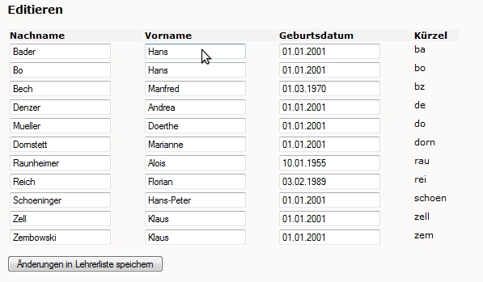

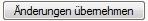

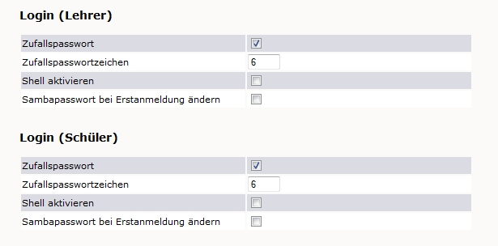

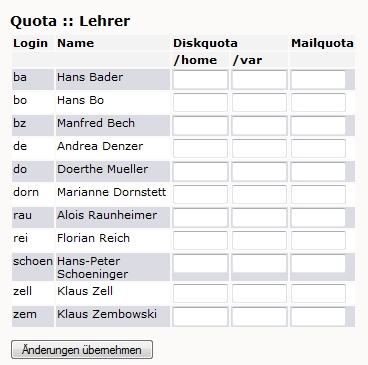

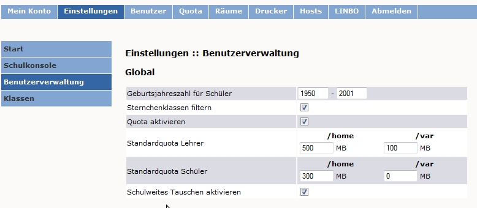

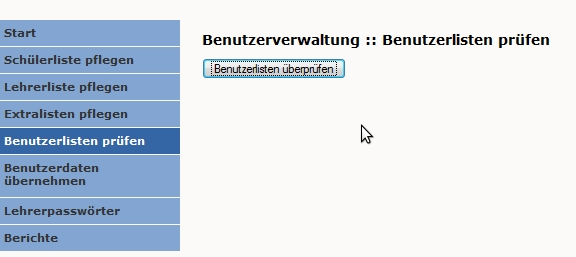

.. |10000000000002DF000001D8766F1EAA_jpg| image:: media/10000000000002DF000001D8766F1EAA.jpg
    :width: 12.001cm
    :height: 7.868cm

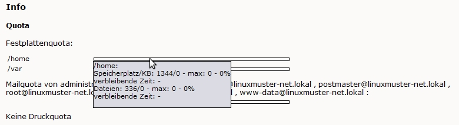

.. |100000000000024B000001BC5A1E2151_jpg| image:: media/100000000000024B000001BC5A1E2151.jpg
    :width: 12.001cm
    :height: 7.801cm

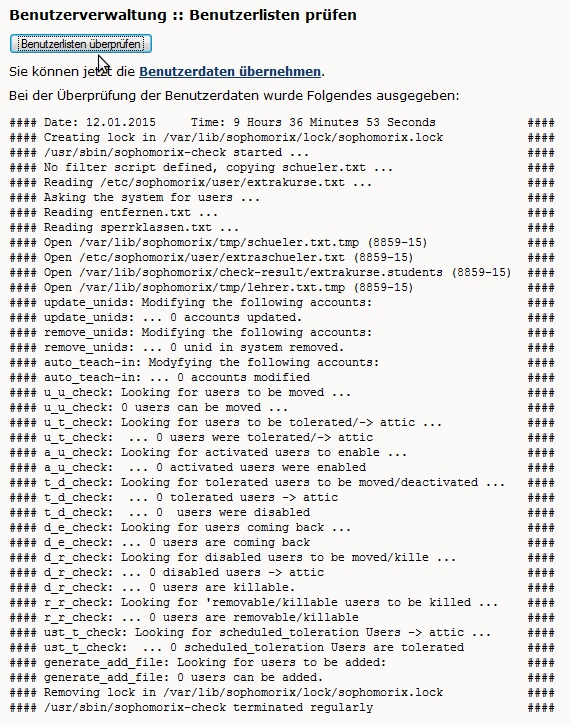

.. |10000000000002E0000001AFF7DA6DCA_jpg| image:: media/10000000000002E0000001AFF7DA6DCA.jpg
    :width: 12.001cm
    :height: 7.42cm

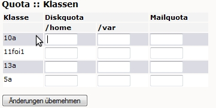

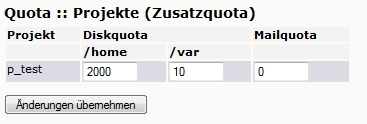

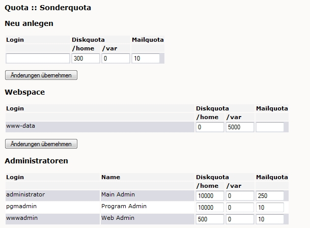

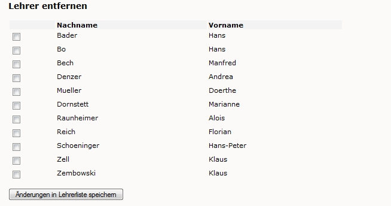

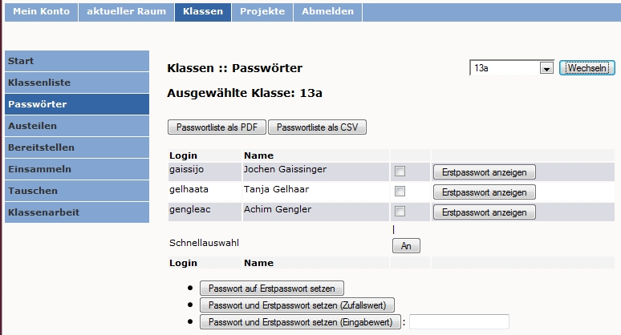

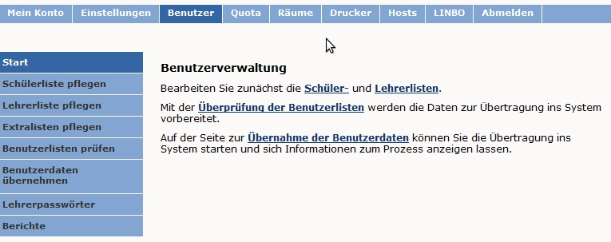

.. |100000000000022700000186B322AC64_jpg| image:: media/100000000000022700000186B322AC64.jpg
    :width: 12.001cm
    :height: 6.682cm

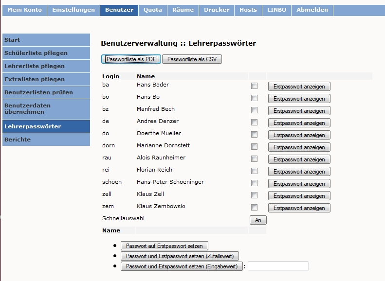

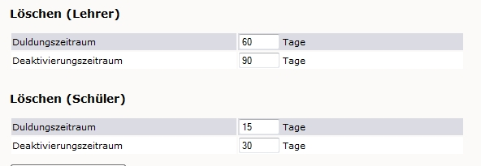

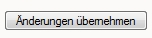

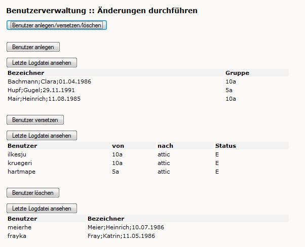

