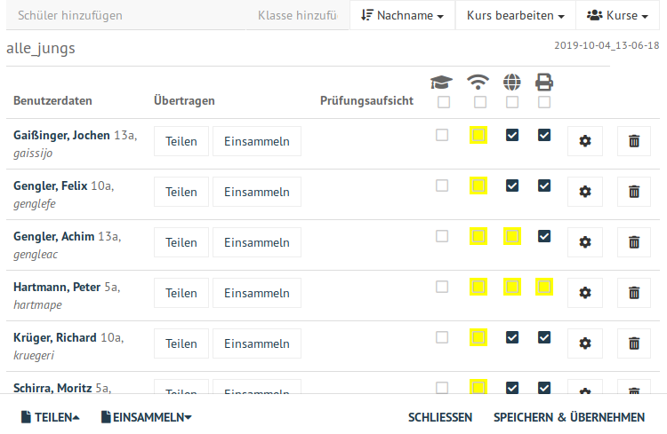

.. _classroom-access-control-label:

===============================================
 Zugriff auf WLAN, Internet und Drucker regeln
===============================================

In einem Kurs kann einzelnen Personen oder dem gesamten Kurs die
Berechtigung zu Drucken oder der Zugriff auf WLAN und Internet gegeben
oder genommen werden. Voraussetzung für diese Funktionen ist die
:ref:`Aufnahme des Schülers <session-setup-label>` in einen Kurs.

Öffne in der Schulkonsole unter ``KLASSENZIMMER/Unterricht`` den
angelegten Kurs.

.. figure:: ../user-management/media/webui-teacher-sessions-overview.png

Die Liste mit Schülern des Kurses wird angezeigt. Es gibt
Auswahlfelder bei den Schülern und oberhalb des ersten Schülers für
alle Schüler für

- den Prüfungsmodus (siehe :ref:`nächstes Kapitel<exam-and-transfer-label>`)
- WLAN-Zugang
- Internetzugang
- Druckerzugriff

Änderungen werden gelb hinterlegt bis sie mit `SPEICHERN & ÜBERNEHMEN`
übernommen werden.
