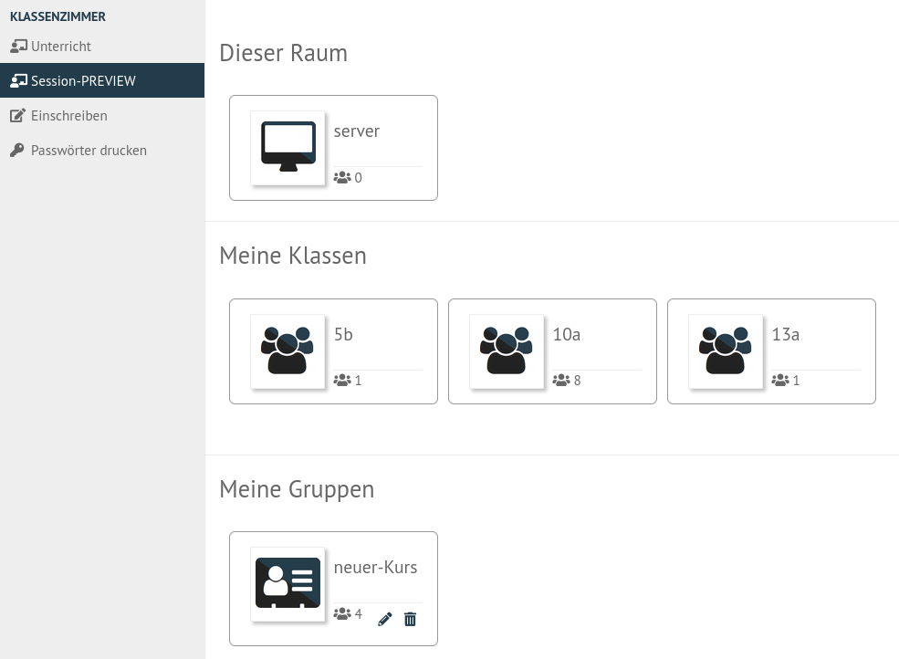
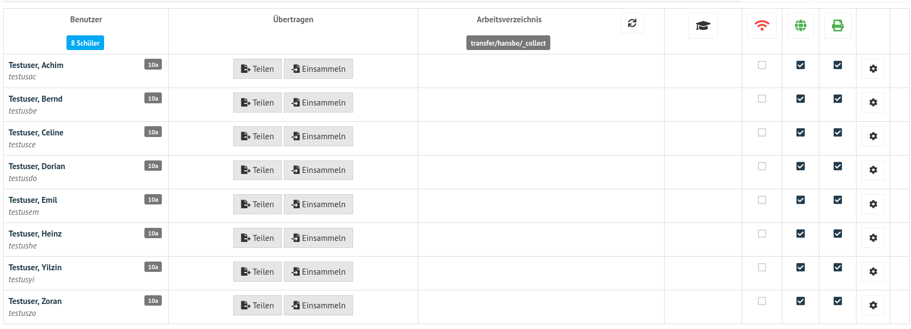
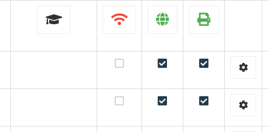
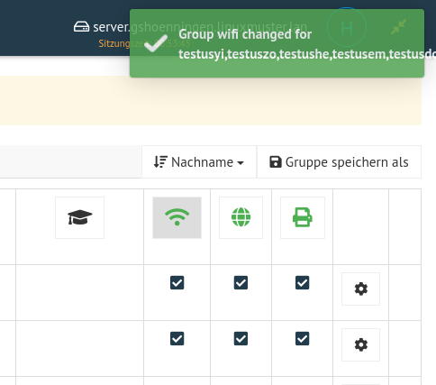

.. _classroom-access-control-label:

===============================================
 Zugriff auf WLAN, Internet und Drucker regeln
===============================================

In einer Klasse und einem Kurs kann einzelnen Personen oder dem gesamten Kurs / der Klasse die Berechtigung zu Drucken oder der Zugriff auf WLAN und Internet gegeben oder genommen werden. Voraussetzung für diese Funktionen ist die :ref:`Aufnahme des Schülers <session-setup-label>` in einen Kurs.

Öffne in der Schulkonsole unter ``KLASSENZIMMER -> Session-PREVIEW`` wähle die geünschte Klasse oder den gewünschten Kurs.

   
   Starte die Session für die Klasse

Es wird Liste mit Schülern des Kurses bzw. der Klasse angezeigt. 

   
   Liste aller Schüler der Klasse / des Kurses

Für jeden einzelnen und für alle Schüler können folgende Funktionen aktiviert oder deaktiviert werden:

- den Prüfungsmodus (siehe :ref:`Prüfungsmodus<exam-and-transfer-label>`)
- WLAN-Zugang
- Internetzugang
- Druckerzugriff

   
   Spalten mit den zu-/abschaltbaren Funktionen pro Schüler
   
Soll eine Funktion für alle Schüler aktiviert werden, klickst Du nur auf das Symbol des Spaltenkopfen (z.B. WLAN).

   
   WLAN für alle Schüler aktivieren

Die Änderungen werden direkt angewendet.

