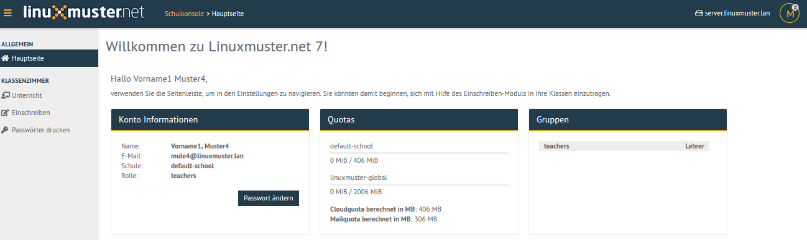
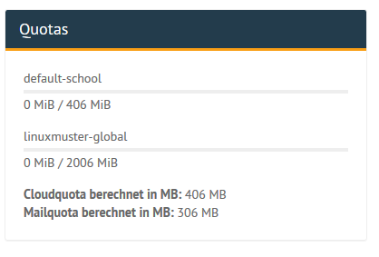

===================================
Anzeigen des eigenen Plattenplatzes
===================================

.. sectionauthor:: `@cweikl <https://ask.linuxmuster.net/u/cweikl>`_

Jeder Benutzer kann sich auf der Startseite der *Schulkonsole* über den verbrauchten Speicherplatz und die ihnen zugewiesenen Speicherplatzbegrenzungen (Quota) informieren. 

**Lehrer: Prüfen der eigenen Quota**

Melde Dich als Lehrer in der Schulkonsole an. Es erscheint zunächst die Hauptseite mit den Konto-Informationen, den Quotas 
und denjenigen Gruppen, denen Sie zugeordnet sind.

   
   Schulkonsole Übersicht

Es sind verschiedene Quotas voneinander abzugrenzen:

   
   Verschiedene Quota des Benutzers

Wie in obiger Abbildung dargestellt, sind folgende Quota zu unterscheiden:

1.  **default-school**: Dieser Plattenplatz in MiB wird auf dem Server auf dem share ``/srv/samba/schools/default-school`` geprüft. Diese Freigabe (share DFLT) ist für alle Benutzer der zugeordneten Schule relevant. In der eigenen Schule - hier ``default-school`` - können Daten bis zur definierten Obergrenze auf dieser Freigabe gespeichert werden.

2.  **linuxmuster-global**: Dieser Plattenplatz in MiB wird auf dem Server auf dem share ``/srv/samba/global`` geprüft. Diese Freigabe (share GLOBAL) ist für alle Benutzer der beteiligten Schulen (Mehr-Schulbetrieb) relevant, um schulübergreifend Dateien zu tauschen (linuxmuster-global).

3.  **Cloudquota**: Bezeichnet die Quota der eigenen Schule - ein anderer Name für die unter 1.) dargestellte Quota für default-school.

4.  **Mailquota**: Zeigt den verfügbaren Plattenplatz zur Ablage von E-Mails an. 

Beachte auch, dass die gesetzte Quota immer für eine ganze Festplattenpartition auf dem Linux-Server gilt. Dies bedeutet, dass auch Dateien auf den Tauschverzeichnissen zum verbrauchten Speicherplatz oder ausgeteilte Dateien für Prüfungen, die nicht wieder gelöscht wurden, diesen Plattenplatz belegen.

