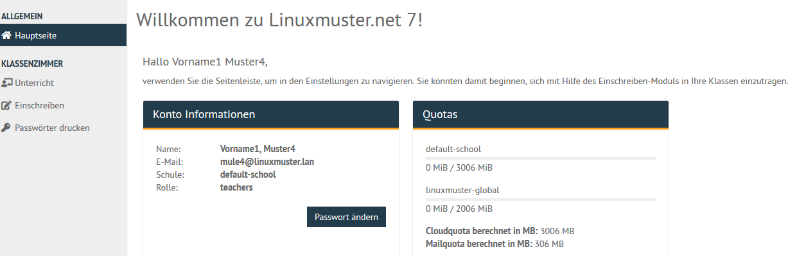
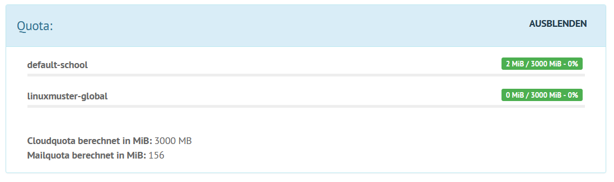

===================================
Anzeigen des eigenen Plattenplatzes
===================================

.. sectionauthor:: `@cweikl <https://ask.linuxmuster.net/u/cweikl>`_

Jeder Benutzer kann sich auf der Startseite der *Schulkonsole* über
ihren verbrauchten Speicherplatz und die ihnen zugewiesenen 
Speicherplatzbegrenzungen (Quotas) informieren. 

Lehrer: Prüfen der eigenen Quota
--------------------------------

Melden Sie sich z.B. als Lehrer in der Schulkonsole an. 
Es erscheint zunächst die Hauptseite mit den Konto-Informationen, den Quotas 
und denjenigen Gruppen, denen Sie zugeordnet sind.

.. figure:: media/01-teacher-dashboard-check-quota.png
   :align: center
   :alt: Quota-Übersicht als Lehrer

Es sind verschiedene Quotas voneinander abzugrenzen:

.. figure:: media/02-quota-information-teacher.png
   :align: center
   :alt: Verschieden Quotas des Benutzers

Wie in obiger Abbildung dargestellt, sind folgende Quotas zu unterscheiden:

1.  **default-school**: Dieser Plattenplatz in MiB wird auf dem Server auf dem share 
``/srv/samba/schools/default-school`` geprüft. Diese Freigabe (share DFLT) ist für alle Benutzer 
der zugeordneten Schule relevant. In der eigenen Schule - hier ``default-school`` - können 
Daten bis zur definierten Obergrenze auf dieser Freigabe gespeichert werden.

2.  **linuxmuster-global**: Dieser Plattenplatz in MiB wird auf dem Server auf dem share 
``/srv/samba/global`` geprüft. Diese Freigabe (share GLOBAL) ist für alle Benutzer der beteiligten 
Schulen (Mehr-Schulbetrieb) relevant, um schulübergreifend Dateien zu tauschen (linuxmuster-global).

3.  **Cloudquota**: Bezeichnet die Quota der eigenen Schule - ein anderer Name für die unter 1.) 
dargestellte Quota für default-school.

4.  **Mailquota**: Zeigt den verfügbaren Plattenplatz zur Ablage von E-Mails an. 

Beachte auch, dass die gesetzte Quota immer für eine ganze
Festplattenpartition auf dem Linux-Server gilt, d.h. in den meisten
Fällen zählen auch Dateien auf den Tauschverzeichnissen zum
verbrauchten Speicherplatz.

Sollte der Netzwerkbetreuer dir eine neue Quota eingerichtet haben, so erkennst du dies in deiner
Übersicht nach der Anmeldung wie in nachstehender Abbildung dargestellt:

Lehrer: Prüfen der Schüler-Quota
--------------------------------

Um in der unterrichteten Klasse zu prüfen, welche Schülerinnen und Schüler ihren zugewiesenen Speicherplatz ausgeschöpft haben, rufe in der Schulkonsole "Unterricht" auf. Wähle eine Klasse oder Kurs aus. Klicke auf das Zahnrad-Symbol in der Zeile eines Schülers und wähle "Benutzerinformation".
Ganz unten wird die Quota des Schülers angezeigt:

   
 

