===========================
 Klassenarbeit durchführen
===========================

Im Klassenarbeitsmodus haben Sie als Lehrer die Möglichkeit, Dateien an Schüler zu verteilen und die Lösungen via Netzwerk wieder einzusammeln. Zugleich unterbindet dieser Modus den Internet-Zugriff sowie den Zugriff auf das Heimatverzeichnis der Schüler sowie auf Tauschverzeichnisse.

Um in den Klassenarbeitsmodus zu gelangen, ruft man in einem Browser die Seite 
https://10.16.1.1:242 auf. Eventuelle Warnmeldungen wegen eines selbst erstellten Zertifikates 
kann man ignorieren.

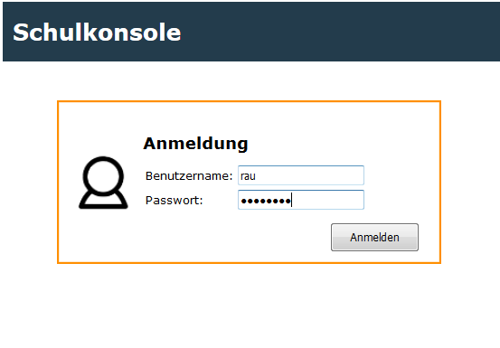

Klassenarbeit starten
=====================

Im Menü unter `aktueller Raum` beginnt man den Unterricht mit Klick auf `Unterricht beginnen`. 

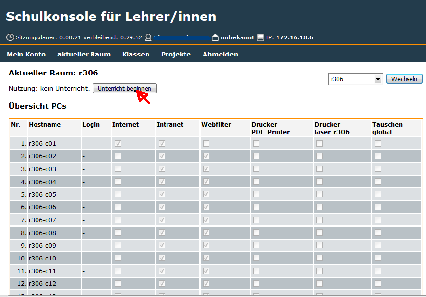

Haben Sie den Unterricht für den Raum begonnen und die korrekte Zeit
für die Klassenarbeit eingetragen, so müssen Sie das Menü für den
Klassenarbeitsmodus erneut aufrufen.

Unter `aktueller Raum` findet man den Menüpunkt `Klassenarbeit`, den man mit Klick auswählt.

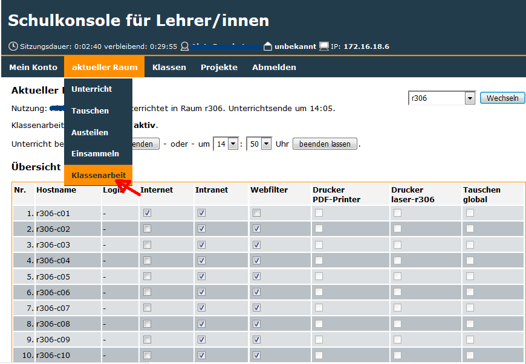

Bevor der Klassenarbeitsmodus gestartet wird, setzt man ein Workstationpasswort, welches man den Teilnehmern an der Klassenarbeit mitteilt (hier: ``frei_wählbar``).

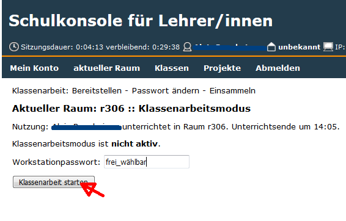

und startet mit Klick auf `Klassenarbeit starten` den Klassenarbeitsmodus.

Dateien bereitstellen und Schüler melden sich an
================================================

In der Schulkonsole bekommt man nun folgende Informationen:

- an welchem Rechner welcher Benutzer angemeldet ist
- welche Dateien zum Bereitstellen an die Schüler bereits hochgeladen wurden (hier: die Datei ``Klassenarbeit.txt``).

Schüler melden sich jetzt an den Clients mit jeweiligen PC-Namen als
Benutzernamen (hier z.B.: ``r306-c01``) und dem Workstationpasswort an
(hier: ``frei_wählbar``). Solange nicht alle an der Klassenarbeit
beteiligten Benutzer unter `Login` zu sehen sind, klickt man immer
wieder auf `Aktualisieren`.

.. note:: Unter Login dürfen nur Rechnernamen auftauchen, da man sich
          im Klassenarbeitsmodus mit den Rechnernamen
          anmeldet. 

.. image:: media/provide-files.png

Wollen Sie Aufgaben der Klassenarbeit oder eine Vorlage zur weiteren
Bearbeitung zur Verfügung stellen, so kopieren Sie die Dateien im
Dateisystem nach ``H:\bereitstellen\bereitstellen-klassenarbeit``
(Windows)
bzw. ``Home_auf_Server/_bereitstellen/bereitstellen-klassenarbeit``
(Linux) oder klicken Sie in der Schulkonsole auf den Button
`Durchsuchen`. Wählen Sie in Ihrem Dateisystem dann die gewünschten
Dateien aus und klicken Sie den Button `Daten absenden`, um die Datei
hochzuladen. Um mehrere Dateien bereitzustellen, wiederholen Sie
diesen Vorgang.

Die bereitzustellenden Dateien werden in der Dateiliste in der
Schulkonsole angezeigt (hier: ``Klassenarbeit.txt``). Um
diese Dateien nun allen angemeldeten Schülern für die Klassenarbeit
bereitzustellen, klicken Sie den Button `bereitstellen`.

Ist an jedem Platz ein Teilnehmer der Klassenarbeit angemeldet, dann
klickt man auf `bereitstellen` und stellt damit den Schülern die Daten
bereit.

Passwort neu setzen
===================

Man hat jetzt die Möglichkeit,eine ein neues Passwort (hier:
``neues_PW_setzen``) zu setzen. Dies verhindert, dass Schüler die
Computerkonten missbrauchen.

.. image:: media/set-password-second-time.png

.. note:: Das neue Passwort darf erst gesetzt werden, wenn sich alle Teilnehmer an den Rechnern angemeldet haben.

Während der Klassenarbeit
=========================

Die Schulkonsole sieht nach dem Passwort setzen so aus:

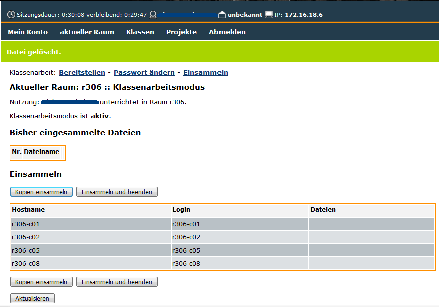

Unter der Spalte `Hostname` werden alle PCs, die aktiv angemeldet
sind, angezeigt. Zudem sehen Sie unter `Dateien`, ob und welche
Dateien jeweils im Einsammeln-Ordner abgelegt worden sind.

Der Lehrer hat dann folgende Möglichkeiten:

- Kopien einsammeln (eine sparsame Nutzung ist sinnvoll)
- Einsammeln der Schülerdateien und Beenden des Klassenarbeitsmodus'
- Es ist aber auch immer wieder möglich auf, "Passwort ändern" zu klicken, um zwischendurch ein neues Passwort zu setzen. Das kann notwendig werden, wenn z.B. ein Rechner während der Klassenarbeit abstürzt und sich ein Schüler erneut anmelden muss.

Die Schüler holen sich den Arbeitsauftrag für die Klassenarbeit im Ordner ``V:\Räume\r306\rau`` (Windows) bzw. im Ordner ``Vorlagen_auf_Server/r306/rau`` (Linux) ab.

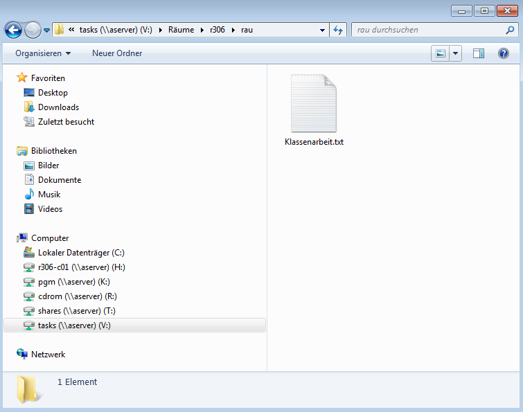

Die Schüler müssen alle ihre Ergebnisse im Ordner ``H:\__einsammeln``
(Windows) bzw. unter ``Home_auf_Server/__einsammeln`` (Linux)
speichern.

.. note:: Es ist sinnvoll, den Schülern zu raten, die Vorlagen sofort
	  dort abzulegen und dort zu bearbeiten. Es ist auch sinnvoll die Datei
	  mit dem Schülernamen zu versehen.

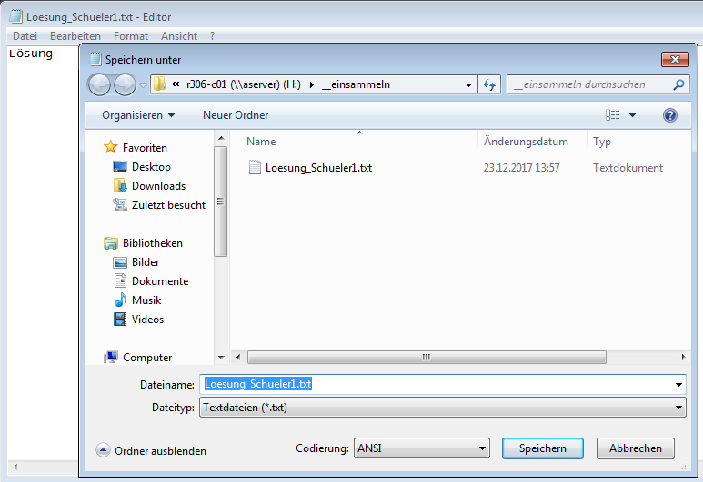

Sollten Schüler vor Beendigung des Klassenarbeitsmodus die Klassenarbeit abgeben wollen, so müssen Sie sicherstellen, dass diese ihre Arbeit unter ``__einsammeln`` abgespeichert haben. Ist dies der Fall, so können diese Schüler den PC herunterfahren. Zur Überprüfung können Sie die Ansicht mit dem Button `Aktualisieren` immer wieder auf den aktuellen Stand bringen.

Klassenarbeit beenden und Daten einsammeln
==========================================

Ist die Klassenarbeit beendet, dann klickt der Lehrer auf `Einsammeln und beenden`

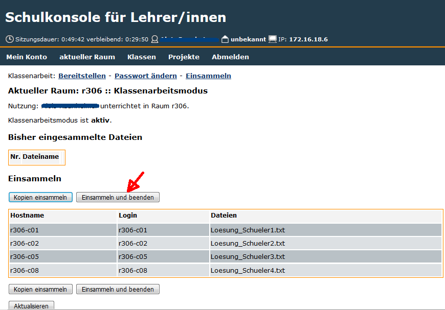

und wird im folgenden Fenster aufgefordert, das Beenden zu bestätigen.

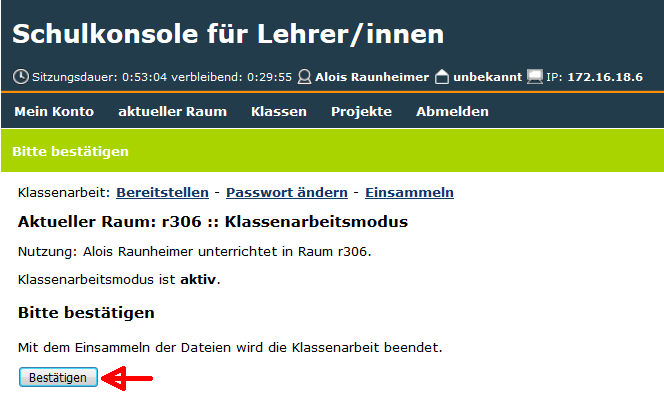

.. note:: Ehe man den Klassenarbeitsmodus beendet, fordert man die
          Schüler auf, ihre Arbeiten im Ordner `Einsammeln` letztmalig
          zu speichern. Durch Klick auf `Aktualisieren` werden in der
          Tabelle unter `Dateien` die gespeicherten Dateien sichtbar.

Der Klassenarbeitsmodus ist damit beendet und der Raum kann wieder als Computerraum benutzt werden.

Die eingesammelten Dateien findet der Lehrer nach dem Beenden des
Klassenarbeitsmodus im Unterordner von
``_eingesammelt/eingesammelt-klassenarbeit``. Beim Einsammeln werden
die Ordner mit einem Datums-Zeitstempel versehen. Hier:``EXAM_rau_2017-12-23_14-15-38_r306``.

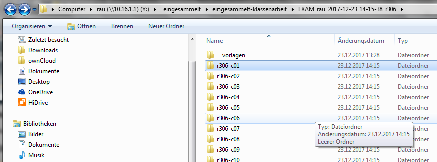
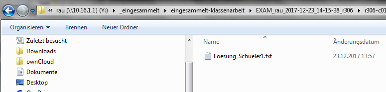

