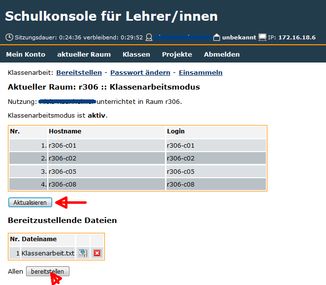
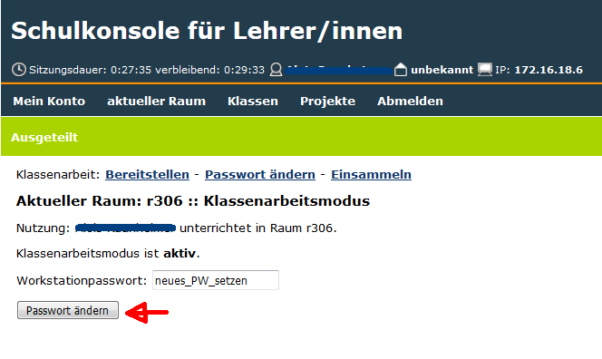
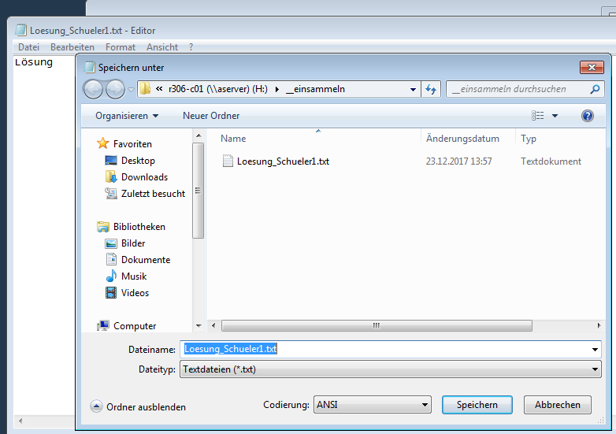
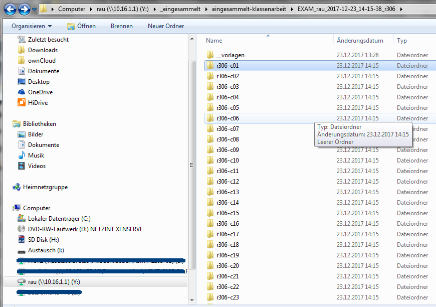

===========================
 Klassenarbeit durchführen
===========================

Um sich in der Schulkonsole einloggen zu können ruft man in einem Browser die Seite 
https://10.16.1.1:242 auf. Eventuelle Warnmeldungen wegen eines selbst erstellten Zertifikates 
kann man ignorieren.

.. image:: media/login1.png

Nach dem Login sieht man folgende Ansicht:

.. image:: media/U_Beginn1.png

und beginnt mit Klick auf "Unterricht beginnen" den Unterricht.

Unter "aktueller Raum" findet man den Menüpunkt "Klassenarbeit" den man mit Klick auswählt

.. image:: media/KA_Auswahl1.png 

Bevor der Klassenarbeitsmodus gestartet wird setzt man ein Workstationpasswort, welches man den Teilnehmern an der Klassenarbeit mitteilt. Hier:"frei_wählbar"

.. image:: media/PW_setzen_KA_starten.png

und startet mit Klick auf "Klassenarbeit starten" den Klassenarbeitsmodus

In der Schulkonsole bekommt man nun folgende Informationen:

- An welchem Rechner ist welcher Benutzer angemeldet. 
- Welche Dateien liegen unter H:\\bereitstellen\\bereitstellen-klassenarbeit. Hier: Klassenarbeit.txt

.. note:: Unter Login dürfen nur Rechnernamen auftauchen, da man sich im Klassenarbeitsmodus mit den Rechnernamen anmeldet. Hier z.B. login: r306-c01; Passwort: frei_waehlbar

.. note:: Solange nicht alle an der Klassenarbeit beteiligten Benutzer unter "Login" zu sehen sind klickt man immer wieder auf "aktualisieren"

Ist an jedem Platz ein Teilnehmer der Klassenarbeit angemeldet, dann klickt man auf "bereitstellen" und stellt damit den Schülern die Aufgabe "Klassenarbeit.txt" 
bereit. Man hat jetzt die Möglichkeit ein neues Passwort zu setzen. Hier "neues_PW_setzen"

.. note:: Das neue Passwort darf erst gesetzt werden, wenn sich alle Teilnehmer an den Rechnern angemeldet haben

Die Schulkonsole sieht nach dem Passwort setzen so aus:

.. image:: media/nach_PW_neu_setzen.png

Der Lehrer hat dann folgende Möglichkeiten:

- Kopien einsammeln (sparsam nutzen ist sinnvoll)
- Einsammeln der Schülerdateien und beenden des Klassenarbeitsmodus

Es ist aber immer wieder möglich auf "Passwort ändern" zu klicken um zwischendurch ein neues Passwort zu setzen.

.. note:: Das kann notwendig werden, wenn z.B. ein Rechner während der Klassenarbeit abstürzt und sich ein Schüler erneut anmelden muss.

Die Schüler holen sich den Arbeitsauftrag für die Klassenarbeit im Ordner V:\\Räume\\r306\\rau ab

.. note:: die Angabe des Raumes (hier: r306) und des Lehrerordners (hier: rau) können nach Schule und Lehrer variieren

.. image:: media/Schueleransicht.png

.. note:: Man sollte die Schüler auffordern die Datei sofort in den Ordner H:\\_einsammeln abzulegen und dort zu bearbeiten. Es ist auch sinnvoll die Datei mit dem Schülernamen zu versehen.

Ist die Klassenarbeit beendet, dann klickt der Lehrer auf "Einsammeln und beenden"

.. image:: media/Einsammeln_und_beenden.png

und wird im folgenden Fenster aufgefordert das Beenden zu bestätigen.

.. image:: media/Beenden_bestaetigen.png

.. note:: Ehe man den Klassenarbeitsmodus beendet fordert man die Schüler auf ihre  Arbeiten im Ordner "Einsammeln" letztmalig zu speichern. Durch Klick auf "Aktualisieren werden in der Tabelle unter "Dateien" die gespeicherten Dateien sichtbar.

Der Klassenarbeitsmodus ist damit beendet und der Raum kann wieder als Computerraum benutzt werden.

Die eingesammelten Dateien findet der Lehrer nach dem Beenden des Klassenarbeitsmodus im Ordner _eingesammelt mit einem Datums-Zeitstempel versehen.

.. image:: media/Ordner_eingesammelt_Ansicht2.png

