=================
 Projekte nutzen
=================

Projekte bilden Gruppen in der Schule ab die außerhalb von Klassen existieren. Ein Projekt kann ein Leistungskurs im Gymnasium, oder eine Neigungsgruppe in einer Gesamtschule sein.

Um ein Projekt einzurichten, wählt man nach der Anmeldung als Lehrer aus dem Menü `Projekte` das Untemenü `Mitglieder` aus.

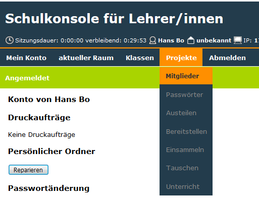

Im folgenden Fenster vergibt man einen Namen für das Projekt (Hier:``demo``). Dabei ist ``p _`` bereits vorgegeben und wird Teil des Projektnamens

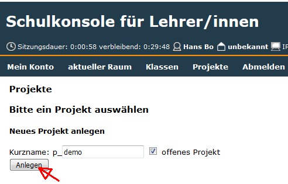

Man klickt auf den Projektnamen

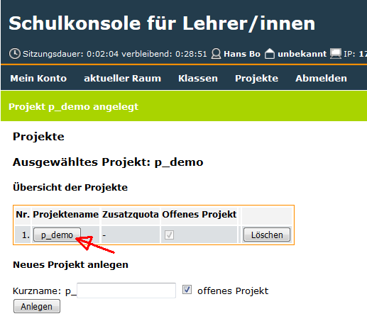

und sieht das folgende Fenster.

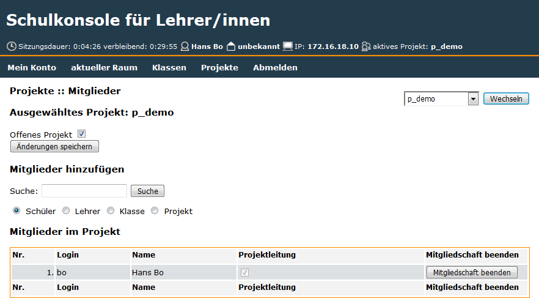

Mitglieder hinzufügen
=====================

Der Lehrer, welcher das Projekt eingerichtet hat ist schon als Mitglied und Projektleiter eingetragen.
Nun kann man dem Projekt weitere Mitglieder hinzufügen. 

Um z.B. aus der gesamten Schülerschaft Schüler für die Projektgruppe ``p_demo`` auszuwählen gibt man unter `Suche` einen ``*`` ein. Der Radiobutton ist auf `Schüler` gesetzt. Hat man diese Auswahl getroffen, klickt man auf `Suche`

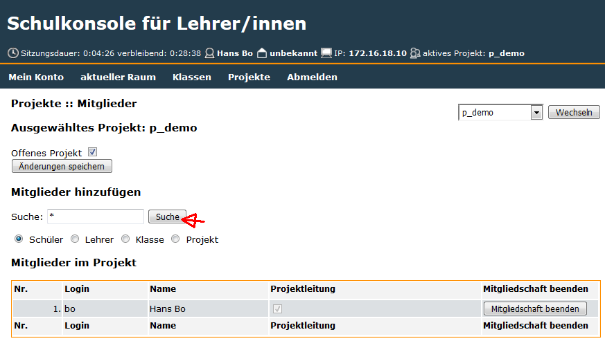

und erhält eine Liste aller Schüler der Schule:

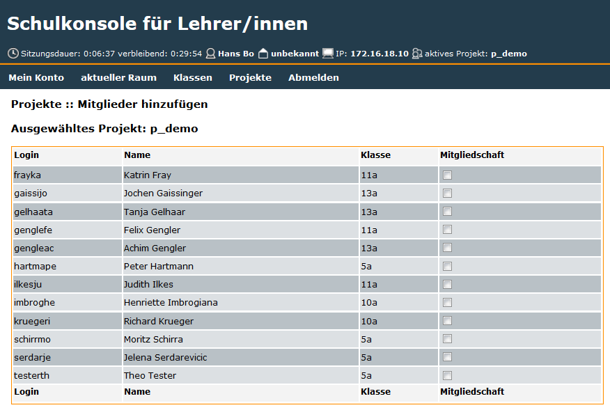

In diesem Fenster wählt man die Mitglieder der Projektgruppe aus indem man rechts neben dem Namen einen Haken setzt. 

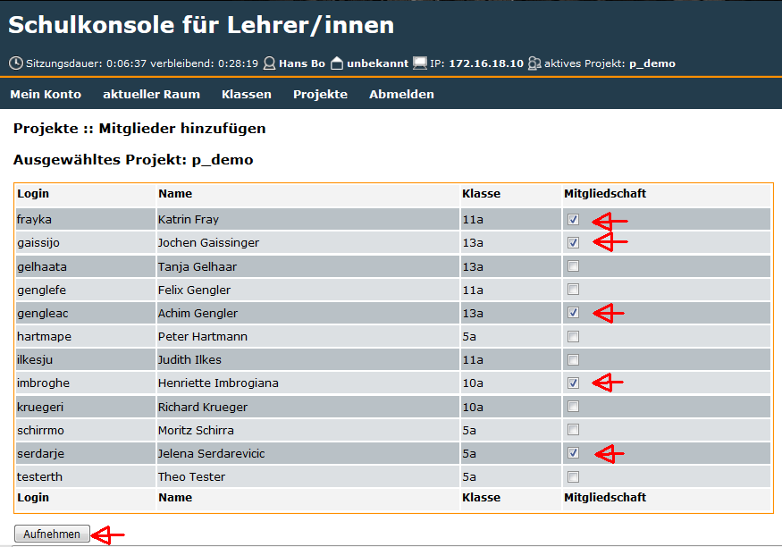

Sind alle Mitglieder ausgewählt, klickt man auf `Aufnehmen` und sieht nach einigen Sekunden das folgende Fenster:

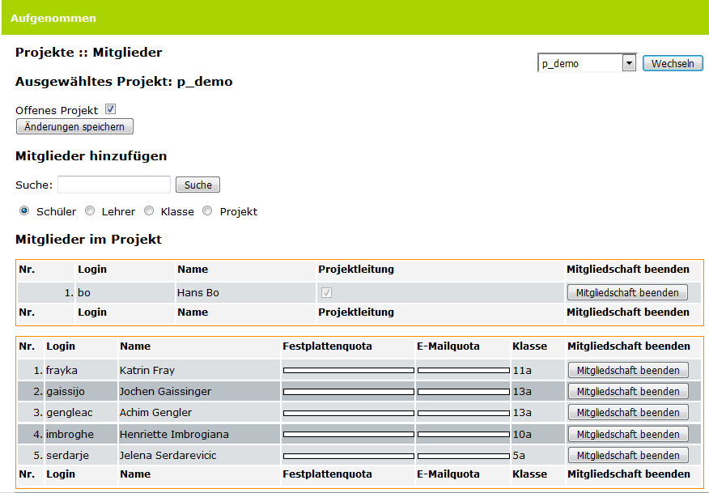

Lehrer als Projektleiter hinzufügen
===================================

Sollen Lehrer zur Gruppe hinzugefügt werden, dann setzt man den Radiobutton auf `Lehrer`, 

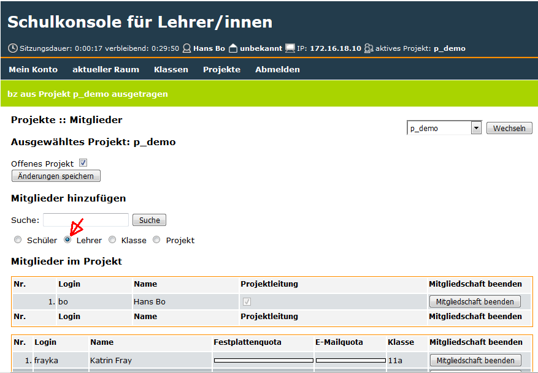

klickt auf `Suchen` und erhält eine Liste aller Lehrer der Schule.

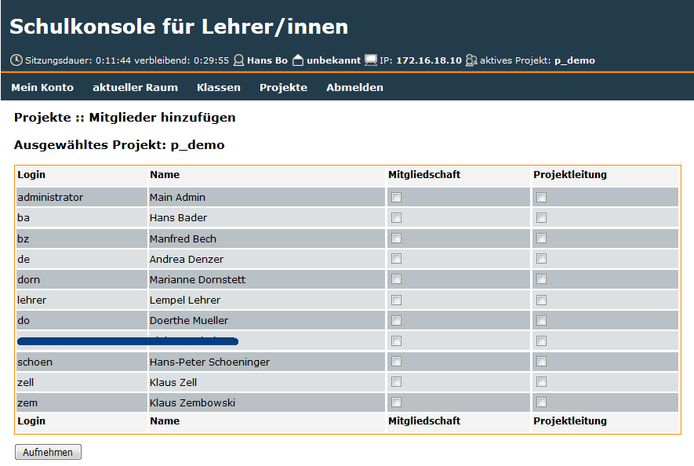

Man wählt nun die aufzunehmenden Lehrer aus und kann zusätzlich
bestimmen ob ein Lehrer zusätzlich Projektleiter wird.

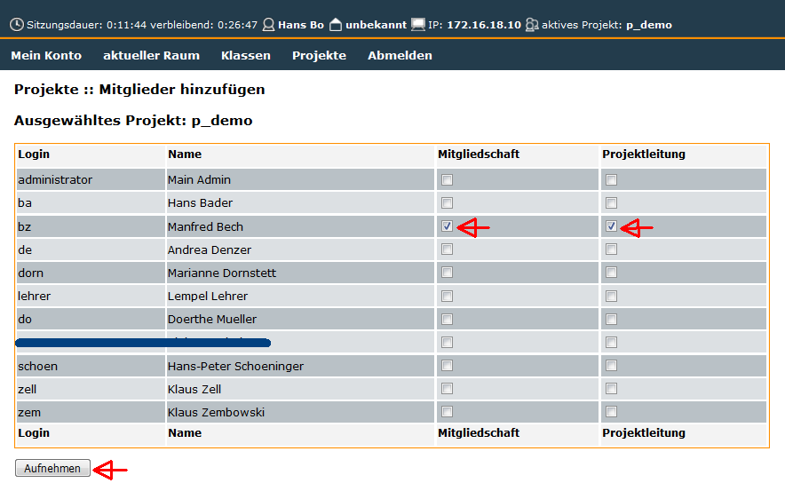

Nach Klick auf `Aufnehmen` sieht man die Gruppe mit den hinzugefügten Lehrern

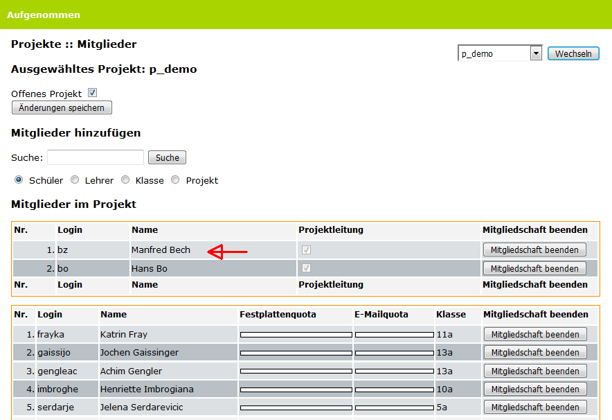

.. note:: Die Suche kann man verfeinern indem man z.B. ``schm*`` in die ``suchen Zeile`` eingibt und auf `suchen` klickt. Damit werden alle Schüler aufgelistet in deren Name die Zeichenfolge ``schm`` vor kommt. Ähnlich kann man mit den Radiobuttons `Lehrer`; `Klasse` und `Projekt` verfahren.  

