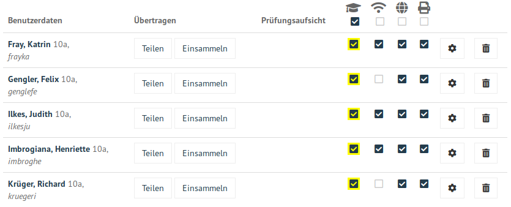
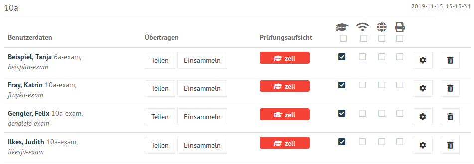

.. _exam-and-transfer-label:

=======================================================
Prüfungs-/Klassenarbeitsmodus, austeilen und einsammeln
=======================================================

In einem Kurs können Schülerkonten in den Prüfungsmodus versetzt
werden, ebenso kann man mit oder ohne Prüfungsmodus Schülern Dateien
austeilen und von dort wieder einsammeln. Voraussetzung für diese
Funktionen ist die :ref:`Aufnahme des Schülers <session-setup-label>`
in einen Kurs.

Öffne in der Schulkonsole unter ``KLASSENZIMMER/Unterricht`` den
angelegten Kurs.

.. figure:: ../user-management/media/webui-teacher-sessions-overview.png

Die Liste mit Schülern des Kurses wird angezeigt. Der Prüfungsmodus
wird aktiviert durch Anklicken in der ersten Spalte. 

Änderungen werden gelb hinterlegt bis sie mit `SPEICHERN & ÜBERNEHMEN`
übernommen werden.

Prüfungsmodus = Klassenarbeitsmodus
======================================

Während des Prüfungsmodus wird für jedes Schülerkonto ein neues Konto
angelegt mit dem bisherigen Kontonamen mit angehängter Zeichenkette
"-exam". Ebenso wird der Schüler in eine zugehörige Klasse "-exam"
gesetzt (siehe Abbildung). Das Passwort zur Anmeldung wird dabei
übernommen.

Die Prüfungsaufsicht zu diesem Konto übernimmt der Lehrer. Der
Prüfungsmodus bleibt so lange erhalten, bis der Lehrer (oder auch ein
anderer Lehrer) den Haken bei dem Schülerkonto entfernt.

Der Schüler meldet sich am Computer mit seinem Examenskonto und seinem
Passwort an. Dann hat er ein leeres Profil und keine Daten im
Home-Laufwerk (``Home_auf_Server`` bzw. ``H:\\``). Der Internetzugang, der
WLAN-Zugang und der Druckerzugriff sind standardmäßig zunächst
deaktiviert.

:fixme: Internetsperrung funktioniert momentan nicht mit der Firewall OPNsense®.

Austeilen und Einsammeln
========================

Im Home-Laufwerk aller Benutzer (``Home_auf_Server`` bzw. `H:\\`) gibt
es einen Ordner für den Transfer ``transfer``. Über diesen Ordner wird
ausgeteilt und eingesammelt. Folgende Anleitung funktioniert mit und
ohne Prüfungssituation.

Es gibt zwei Arten Daten an Schüler im aktuellen Kurs auszuteilen. Zum
einen kann man Ordner und Dateien im Ordner ``transfer`` ablegen. Zum
anderen kann man im folgenden Dialog per Drag and Drop *einzelne*
Dateien hochladen. Klickt man nun bei einzelnen Schülern oder unten
auf der Seite für alle Schüler des Kurses auf ``Teilen``, kann man im
folgenden Dialog neben dem Hochladen auch die zum Teilen gewünschten
Daten auswählen und  das Austeilen anstoßen.

.. figure:: media/webui-teacher-session-upload.png

Die ausgeteilten Daten landen nun als Kopien im Ordner
``transfer\Lehrername-Kursname`` der entsprechenden Schüler.

Die Schüler speichern ihre Daten ebenso im Ordner ``transfer\Lehrername-Kursname``.

Der Lehrer hat nun während dieser Phase die Möglichkeit die Daten
einzusammeln. Dabei gibt es die Variante, die Daten zu kopieren oder
einzusammeln (und damit auf Benutzerseite zu löschen). Die eingesammelten Daten findet man im Ordner ``transfer\collected\Zeitstempel-Kursname``.

.. figure:: media/webui-teacher-session-collect.png

Das Beenden des Prüfungsmodus sammelt automatisch die Daten von den
Schülern ein, verschiebt die Benutzer zurück auf ihre normalen
Benutzernamen und aktiviert die Internet-, WLAN- und Druckzugriffe.
Die Änderung muss ebenso durch ``SPEICHERN & ÜBERNEHMEN`` quittiert
werden.

