.. _exam-and-transfer-label:

=============
Prüfungsmodus
=============

.. sectionauthor:: `@cweikl <https://ask.linuxmuster.net/u/cweikl>`_,
                   `@MachtDochNix (pics) <https://ask.linuxmuster.net/u/MachtDochNix>`_

In einem Kurs / einer Klasse können Schülerkonten in den Prüfungsmodus versetzt werden, ebenso kann man mit oder ohne Prüfungsmodus Schülern Dateien
austeilen und von dort wieder einsammeln. Voraussetzung für diese Funktionen ist die :ref:`Aufnahme des Schülers <session-setup-label>`
in einen Kurs.

Öffne in der Schulkonsole unter ``KLASSENZIMMER -> Session-PREVIEW`` den angelegten Kurs oder die gewünschte Klasse.

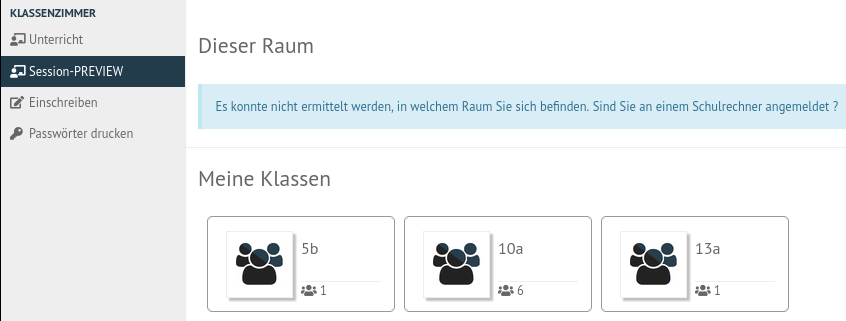
   
   Starte die Session für die Klasse

Die Liste mit Schülern des Kurses wird angezeigt. 

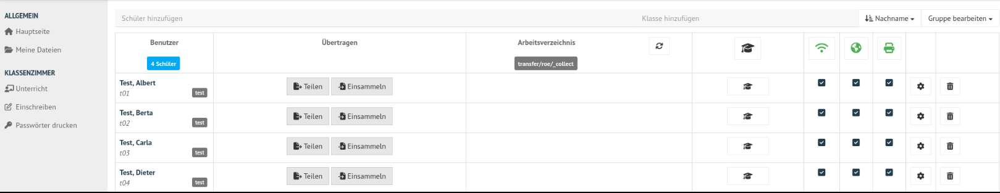
   
   Teilnehmer der ausgewählten

Der Prüfungsmodus wird aktiviert, indem Du auf das Prüfungssymbol klickst. Du erhälst in einem neuen Fesnter die Rückfrage, ob Du den Prüfungsmodus wirklich starten möchtest. Bestätige dies mit einem Klick auf ``PRÜFUNGSMODUS STARTEN``.

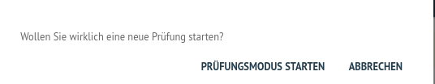
   
   Starte den Prüfungsmodus
   
Wurde der Prüfungsmodus aktiviert, so erkennst Du in der Spalte mit dem Prüfungssymbol pro Teilnehmer ein rotes Rechteck mit dem Prüfungssymbol und dem Namen des Lehrers, der für diese Teilnehmer den Prüfungsmodus aktiviert hat.

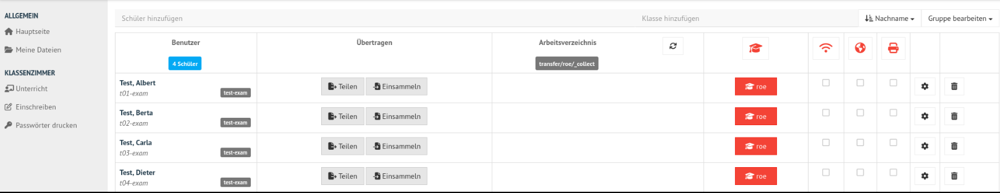
   
   Aktivierter Prüfungsmodus

Prüfungsmodus = Klassenarbeitsmodus
===================================

Bei Aktivierung des Prüfungsmodus wird für jedes Schülerkonto ein neues Konto angelegt mit dem bisherigen Kontonamen mit angehängter Zeichenkette ``-exam``. Ebenso wird der Schüler in eine zugehörige Klasse "-exam" gesetzt (siehe Abbildung). Das Passwort zur Anmeldung wird dabei übernommen.

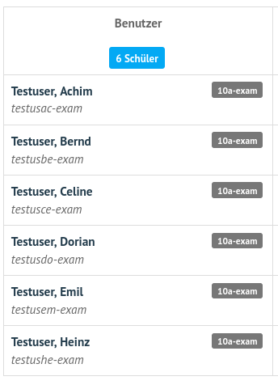
   
   Angelegte Schüleraccounts im Prüfungsmodus
   
In o.g. Abbildung müsste sich der Benutzer ``Achim Testuser`` nun mit dem Login ``testuac-exam`` und seinem bisherigen Kennwort am Client-PC anmelden. Zum Zeitpunkt des aktivierten Prüfungsmodus wurde die Klasse ``10a-exam`` angelegt.

Die Prüfungsaufsicht übernimmt der Lehrer, der den Prüfungsmodus aktiviert hat. Dies ist in den roten Rechtecken zu erkennen.

Der Prüfungsmodus bleibt so lange erhalten, bis der Lehrer (oder auch ein anderer Lehrer) den Haken bei dem Schülerkonto entfernt.

.. figure:: media/webui-teachers-session-deactivate-exam-mode.png
   :align: center
   :alt: WebUI Deactivate Exam Mode
   
   Beende den Prüfungsmodus

Klicke zum Beende des Prüfungsmodus auf der rot hinterlegte Prüfungssymbol.

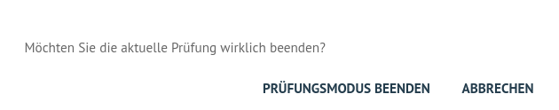
   
   Bestätige das Beendes Prüfungsmodus
   
Du erhälst ein Fenster mit der Nachfrage, ob die den Prüfungsmodus wirklich beenden möchstest. Hast Du alle gewünschten Daten der Prüflinge zuvor eingesammelt, bestätige diesen Vorgang mit ``PRÜFUNGSMODUS BEENDEN``.

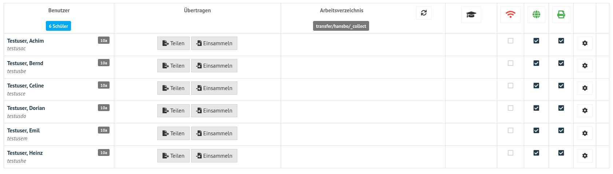
   
   Prüfungsmodus beendet
   
Nachdem der Prüfungsmodus beendet wurde, werden alle Benutzer wie zuvor dargestellt und die Nutzung des Internet sowie der Drucker automatisch aktiviert.

Ablauf der Prüfung
------------------

1. Der Lehrer meldet sich an der Schulkonsole an.
2. Der Lehrer wählt unter Session-PREVIEW die gewünschte Klasse aus.
3. Der Lehrer aktiviert mit dem Prüfungssymbol den Prüfungsmodus.
4. Der Lehrer teilt den Prüflingen im Raum mit wie diese sich am PC für die Prüfung anmelden müssen (<bisherigsLogin>+"-exam" & bisheriges Kennwort).
5. Der Lehrer teilt die Prüfungs und ggf. weitere Vorlagen an die Prüfungsteilnehmer aus.
6. Die Dateien liegen für die Prüfungsteilnehmer im Verzeichnis ``transfer/LEHRER/_collect``.
7. Schüler nutzen die bereitgestellten Daten und erstellen ihre Lösungen.
8. Schüler speichern die bearbeiteten Daten unter einem vorher vom Lehrer mitgeteilen Namen bzw. Namensschema ab und lege diese zur Abgabe in das Verzeichnis ``transfer/LEHRER/_collect``.
9. Der Lehrer sammelt zum Abschluss der Prüfung alle Abgaben mit dem Button ``von allen einsammeln`` ein.
10. Der Lehrer überprüft die eingesammelten Daten, die für diesen im Ordner ``transfer/collected/`` zu finden sind.
11. Liegen alle Daten wie gewünscht vor, beendt der Lehrer den Prüfungsmodus.

Austeilen und Einsammeln
========================

Lehrer
------

Hast Du als Lehrer, wie zuvor beschrieben, für die gewünschte Klasse den Prüfungsmodus aktiviert, siehst Du folgende Anzeige:

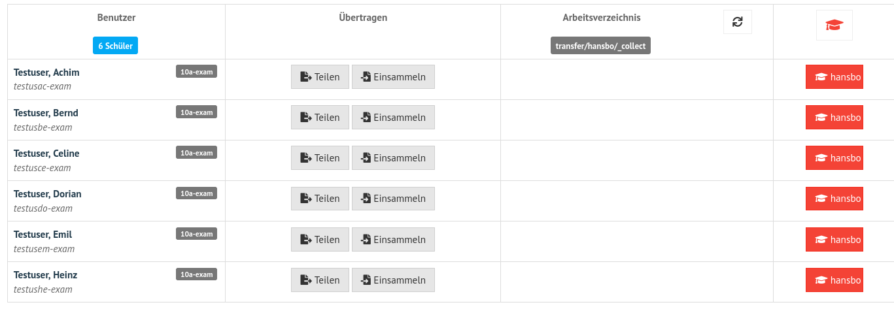
   
   Prüfungsmodus aktiviert
   
Stellen nun den Prüflingen die Prüfung bzw. Vorlagendateien bereit. Klicke hierzu unten links auf den Button ``Mit allen teilen``.

   
   Dateien bereitstellen
   
Es öffnet sich ein neues Fenster, in dem Dir der Inhalt Deines Home-Verzeichnisses dargestellt wird. 

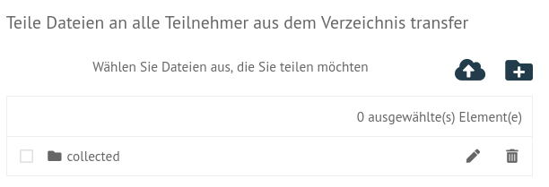
   
   Dateien bereitstellen: Verzeichnisansicht

Sollten die gewünschten Dateien noch nicht in Deinem Ordner sein, klickst Du oben rechts auf das Wolkensymbol, um Dateien von Deinem USB-Stick oder dem lokalen PC in Dein Home-Verzeichnis hochzuladen.

Die hochgeladenen Dateien werden Dir ebenfalls hier angezeigt.

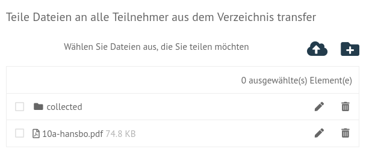
   
   Dateien bereitstellen: Auflistung der Dateien im Home-Verzeichnis

Aktiviere nun die gewünschten Dateien und /oder Verzeichniss, die Du den Prüflingen austeilen möchtest.

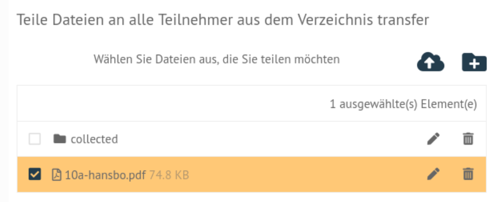
   
   Dateien bereitstellen: Aktiviere die bereitzustellenden Dateien
   
Um die Dateien auszuteilen, klickst Du nun unten rechts auf ``TEILEN``.

Bist Du als Lehrer an einem Client angemeldet, so findest Du die zu teilenden Daten unter Deinem Home-Laufwerk ``H:\`` im Unterverzeichnis ``transfer``.

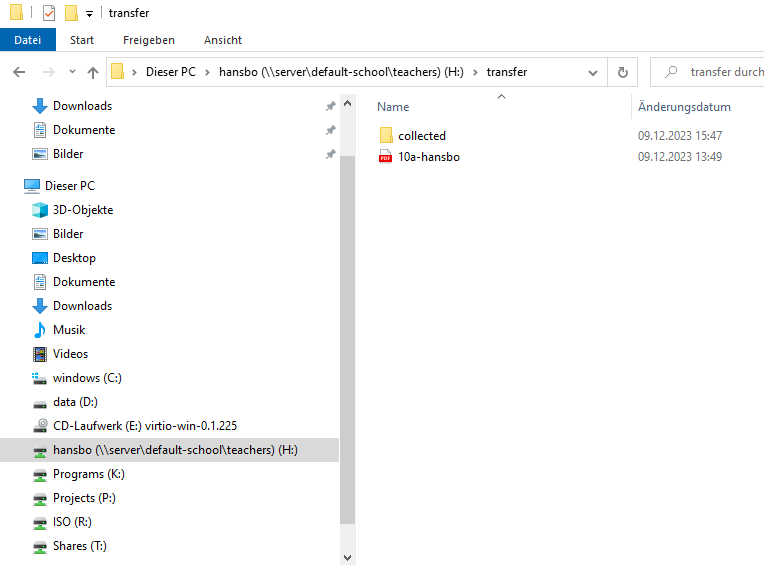
   
   Zu teilende Daten am Client
   
Prüflinge
---------

1. Nachdem der Leher den Prüflingen ihre Prüfungs-Accounts mitgeteilt hat, melden diese sich mit den Daten an.
2. Der Prüfling geht im Dateiverzeichnis in sein Home-Laufwerk (H:\) in den Transfer-Ordner, dort in den Ordner des Lehrers der Prüfung.
3. Im Ordner H:\transfer\LEHRER\ werden die bereitgestellten Dateien in ein anderes Verzeichnis übernommen, dort bearbeitet und gespeichert.
4. Bei Abschluss der Prüfung kopiet der Prüfling zur Abgabe die bearbeiteten Dateien in das Verzeichnis ``H:\transfer\LEHRER\_collect\``.
5. Der Lehrer sammelt alle abgegebene Dateien ein und schließt die Prüfung.
6. Der Prüfling meldet sich ab.

Anmeldung
^^^^^^^^^

Jeder Prüfling meldet sich an dem Client an. Hierzu ist der bisherige Login + die Erweiterung -exam und das bisherige Kennwort anzugeben.
Nachstehende Abbildungen verdeutlichen dies einmal für einen Windows-Client und für einen Ubuntu-Client:

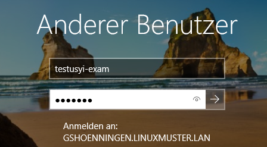
   
   Prüfungsanmeldung Windows-Client
   
Nach erfolgreicher Anmeldung am Client sieht der Prüfling die Einrichtung der Prüfungsumgebung.

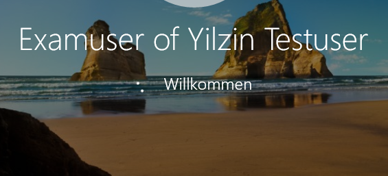
   
   Prüfungsanmeldung Windows-Client - Setup

An einem 22.04 Ubuntu-Client mit Gnome sieht die Anmeldung wie folgt aus:

.. figure:: media/webui-exam-login-ubtunu.png
   :align: center
   :alt: Exam Login Ubuntu
   
   Prüfungsanmeldung Ubuntu-Client
   
Angabe des Kennworts.

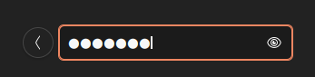
   
   Prüfungsanmeldung Ubuntu-Client - Eingabe des Kennworts
   
Hat sich der Prüfling erfolgreich am Client angemeldet und ruft den Dateimanager auf, so sieht dieser folgende Netzlaufwerke:

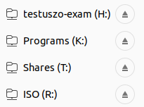
   
   Prüfungsanmeldung: Netzwerklaufwerke

Die bereitgestellten Dateien findet der Prüfling nun im Verzeichnis ``H:\transfer\LEHRER\``.

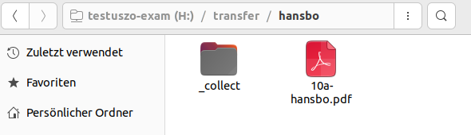
   
   Prüfung: Bereitgestellte Dateien
   
In der Prüfung bearbeitet der Prüfling die bereitgestellten Dateien und speichert seine Lösung zur Abgabe in dem Verzeichnis ``H:\transfer\LEHRER\_collect\``.

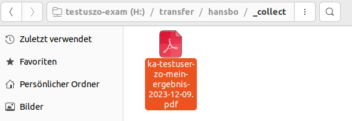
   
   Prüfung: Dateiabgabe
   
Unter Windows stellt sich dies für den Prüfling wie folgt dar:

Netzwerkfreigaben
   
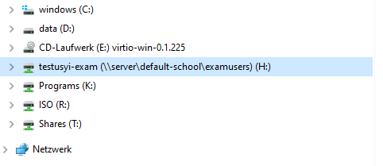
   
   Prüfung: Netzwerkfreigaben unter Windows
   
Bereitgestellte Dateien   

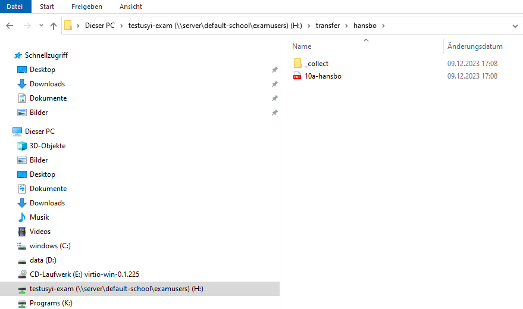
   
   Prüfung: Bereitgestellte Dateien unter Windows
   
Abgabe unter ``H:\transfer\LEHRER\_collect\``

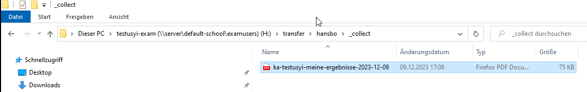
   
   Prüfung: Dateiabgabe unter Windows
   
   
Abgaben einsammeln
^^^^^^^^^^^^^^^^^^

Der Lehrer sieht in der Schulkonsole die abgegebenen Dateien.

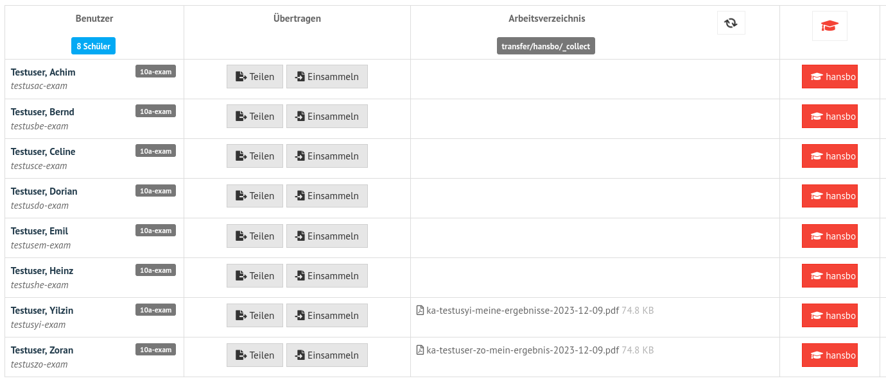
   
   Prüfung: abgegebene Dateien einsehen
   
Um vor Abschluss der Prüfung alle Abgaben einzusammeln, klickst Du unten links auf ``Von allen einsammeln``.
Klicke nun auf ``Move _collect cirectory from all members``. Es werden nun alle Abgaben in das Verzeichnis des Lehrers zum Einsammeln der Dateien verschoben.

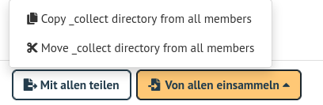
   
   Prüfung: Alle Dateien einsammeln
   
Prüfung beenden
^^^^^^^^^^^^^^^

Nachdem alle Dateien eingsammelt wurden, beendet der Lehrer den Prüfungsmodus.

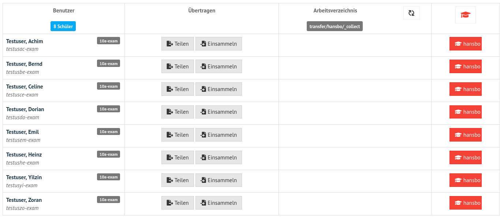
   
   Prüfung: beenden
   
Hierzu klickst Du auf das rot hinterlegte Prüfungssymbol.

Abgaben einsehen
^^^^^^^^^^^^^^^^

Hast Du als Lehrer die Prüfung beendet, kannst Du nun in der Schulkonsole unter ``Allgemein -> Meine Dateien`` im Ordner ``transfer`` alle bislang eingesammelten Dateien finden.

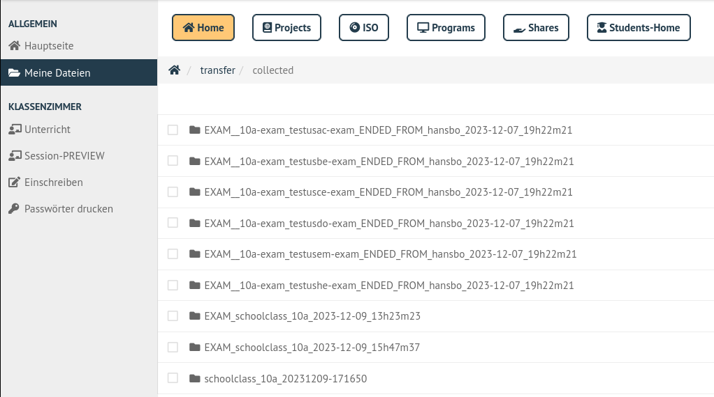
   
   Prüfung: Prüfe Dateiabgaben
   
Für die durchgeführte Prüfung gehst Du in den Ordner ``schoolclass_10a_20231209-171650`` - also immer der Ordner mit dem aktuellen Prüfungsdatum.

Dort findest Du pro Prüfling einen Ordner, in dem sich die abgegebenen Dateien befinden.

Die Abgaben kannst Du markieren und herunterladen.

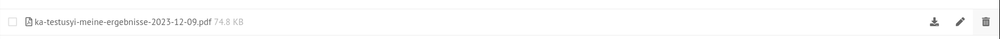
   
   Prüfung: Dateiabgaben herunterladen
   

