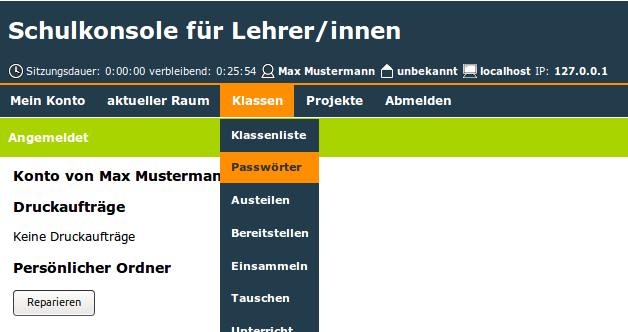

=====================================
(v6.2) Drucken der Erstpasswortlisten
=====================================

Jede Lehrkraft kann z.B. zum Schuljahresanfang die Erstpasswortlisten ihrer Schülerinnen und Schüler ausdrucken.

.. note::
  Sobald ein Schüler sein Erstpasswort geändert hat, funktioniert das Erstpasswort nicht mehr.

Dazu melden Sie sich an der Schulkonsole an und wählen unter „Klassen” den Menüpunkt „Passwörter“.

Wälen Sie nun Ihre Klasse aus indem Sie auf die Klassenbezeichnung klicken.

.. note:: Falls Ihre Klasse nicht in der oberen Liste auftaucht, müssen Sie sich zunäst in die Klasse eintragen. Wählen Sie dazu im Dropdown-Menü die Klasse aus und klicken anschließend auf eintragen.

.. image:: media/02.png

Laden Sie sich die Liste durch klicken auf „Passwortliste als PDF“ herunter.

.. image:: media/03.png

Abschließend drucken Sie die Datei aus.
