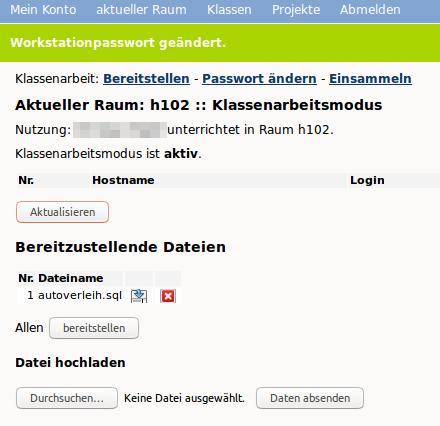
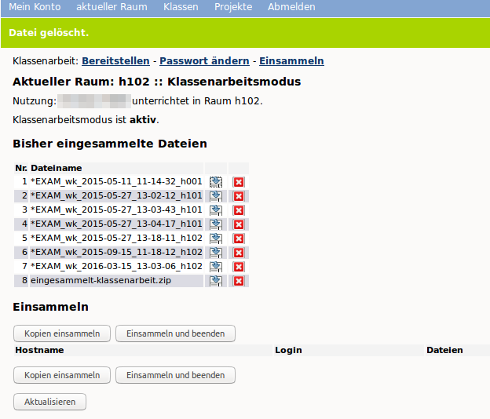
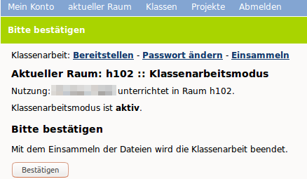

Austeilen von Dateien und weitere Funktionen
============================================

Mithilfe der Schulkonsole können Sie in Ihrem Unterricht folgende Funktionen nutzen:

* Austeilen
* Einsammeln
* Klassenarbeit

Wollen Sie die Funktionen unmittelbar in dem Raum nutzen, in dem Sie unterrichten, wählen Sie diese Funktionen im Menü `aktueller Raum`.

Möchten Sie vorbereitend diese Funktionen für eine Ihrer Klassen verwenden, wählen Sie die gewünschte Funktion aus dem Menü `Klassen` aus.

Austeilen
---------

Nachdem Sie sich an der Schulkonsole als Lehrer angemeldet haben, gehen Sie zu dem Menüpunkt `Klassen` und dort zum Unterpunkt `Auteilen`.

Sie sehen dann die Übersicht der auszuteilenden Dateien für eine Klasse.

.. image:: media/send-file.png

Wählen Sie nun oben rechts die gewünschte Klasse im Drop-don Menü aus. Danach klicken Sie auf den Button Durchsuchen`, um eine auszuteilende Datei hochzuladen. Es erscheint Ihr Dateimanager. Hier wählen Sie aus dem geeigenten Verzeichnis die gewünschte Datei aus. Danach erscheint der Dateiname in der Liste der auszuteilenden Dateien. Um diese noch für das Austeilen zur Verfügung zu stellen, klicken Sie auf den Button `Daten absenden`.

Alle zu verteilende Dateien erscheinen in der darüber angezeigten Dateiliste. Wollen Sie weitere Dateien hinzufügen, so ist o.g. Vorgang entsprechend zu wiederholen.

.. image:: media/copy-files-class.png

Um die so bereitgestellten Dateien nun zu verteilen, wählen Sie die Schüler der Klasse aus, denen Sie die Dateien zur Verfügung stellen wollen. Hierzu klicken Sie pro Schüler in der Spalte `Auswahl` auf die Auswahlbox. Sollen alle Schüler der Klasse die Dateien erhalten, so können Sie hierzu die Auswahlbox unterhalb der Spalte nutzen. Danach klicken Sie auf den Button `austeilen`.
Auszuteilende Dateien liegen dann in Ihrem Heimatverzeichnis unter `_auszuteilen -> auszuteilen-Klasse`.

.. image:: media/choose-user.png

Die auszuteilenden Dateien liegen nun in den Heimatverzeichnissen der Schüler/innen in dem Ordner `__austeilen -> austeilen-Klasse`.

Einsammeln
----------

Haben Schüler Dateien erstellt, die Sie als Lehrkraft einsammeln möchten, so müssen Sie Schüler die Dateien in ihrem Heimatverzeichnis im Ordner `__einsammeln` ablgen. Es kann auch in diesem Ordner ein Verzeichnis angelegt werden, in das mehrere Dateien abgelegt werden. Beim Einsammlen würden dann pro Schüler das Verzeichnis mit allen enthaltenden Dateien eingesammelt werden.

Haben die Schüler ihre Dateien entsprechend kopiert, rufen Sie in der Schulkonsole das Menü `Klassen` und dort das Untermenü `Einsammeln` auf.

.. image:: media/get-files-class.png

Sie sehen hinter jedem Schüler, ob und welche Dateien bereitgestellt wurden.
Wählen Sie aus, ob die einzusammelnden Dateien erhalten bleiben oder gelöscht werden sollen.
Wählen Sie die Schüler/innen, von denen Sie einsammeln wollen, oder die ganze Klasse aus.

Sie finden die eingesammelten Arbeiten in Ihrem Heimatverzeichnis unter „_eingesammelt -> eingesammelt-Klasse“.

Klassenarbeit
-------------

Im Klassenarbeitsmodus haben Sie als Lehrer die Möglichkeit, Dateien an Schüler zu verteilen und die Lösungen via Netzwerk wieder einzusammeln. Zugleich unterbindet dieser Modus den Internet-Zugriff sowie den Zugriff auf das Heimatverzeichnis der Schüler sowie auf Tauschverzeichnisse.

Um in den Klassenarbeitsmodus zu gelangen, rufen Sie in der Schulkonsole als Lehrer den Menüpunkt `aktueller Raum` und dort das Untermenü `Klassenarbeitmodus` auf.

Sollten Sie im Raum noch keinen Unterricht begonnen haben, so gelangen Sie zum Menü des aktuellen Raums, um den Unterricht zuerst zu beginnen.

.. image:: media/room-start.png

Haben Sie den Unterricht für den Raum begonnen und die korrekte Zeit für die Klassenarbeit eingetragen, so müssen Sie das Menü für den Klassenarbeitsmodus erneut aufrufen.

Sie gelangen dann zur Festlegung des sog. Workstationspasswort. Dieses legen Sie hier fest und teilen es, nach der Aktivierung des Modus den Schülern mit. Diese müssen sich nach Start der Clients mit dem Namen des des als Benutzername und dem hier festgelegten Kennwort an.

.. image:: media/room-test-activation.png

Klicken Sie zum Abschluss auf den Button `Klassenarbeit starten`.

Danach gelangen zur Übersicht im Klassenarbeitsmodus. Haben Sie den Schülern migeteilt, dass Sie sich mit dem Namen des PC (z.B. musterraum01) und dem festgelegten Kennwort (z.B. linuxmuster) am PC anmelden, warten Sie, bis alle Schüler dies durchgeführt haben.

Danach klicken Sie den Button `Aktualisieren`. Es müssten dann alle PCs in der Übersicht erscheinen, an den sich Nutzer angemeldet hat.

Wollen Sie Aufgaben der Klassenarbeit oder eine Vorlage zur weiteren Bearbeitung zur Verfügung stellen, so
klicken Sie auf den Button `Durchsuchen`. Wählen Sie in Ihrem Dateisystem dann die gewünschten Dateien aus und klicken Sie den Button `Daten absenden`, um die Datei hochzuladen. Um mehrere Dateien bereitzustellen, wiederholen Sie diesen Vorgang.

Die bereitzustellenden Dateien werden in einer Dateiliste angezeigt. Um diese Dateien nun allen angemeldeten Schülern für die Klassenarbeit bereitzustellen, klicken Sie den Button `bereitstellen`.

Die Schüler finden diese Vorlagen in ihrem Heimatverzeichnis im Unterordner `tasks -> Raumnummer -> Lehrerlogin`.

Danach werden Sie aufgefordert, das Passwort für die Workstations neu zu setzen.

.. image:: media/room-test-activation.png

Klicken Sie nun den Button `Passwort ändern`, um die Klassenarbeit zu beginnen. Sie gelangen zur Übersicht im Klassenarbeitsmodus.

Unter der Spalte `Hostname` werden alle PCs, die aktiv angemldet sind, angezeigt. Zudem sehen Sie unter `Dateien`, ob und welche Dateien jeweils im Ordner `einsammeln` abgelegt sind.

Sollten Schüler vor Beendigung des Klassenarbeitsmodus die Klassenarbeit abgeben wollen, so müssen Sie sicherstellen, dass diese ihre Arbeit unter `__einsammeln` abgespeichert haben. Ist dies der Fall, so können diese den PC herunterfahren. Zur Überprüfung können Sie die Ansicht mit dem Button `Aktualisieren` immer wieder auf den aktuellen Stand bringen.

Um die Klassenarbeit zu beenden und gleichzeitig alle Schülerarbeiten einzusammeln, klicken Sie auf den Button `Einsammeln und beenden`.

Bestätigen Sie das Beenden der Klassenarbeit. Die eingesammelten Ergebnisse finden Sie danach in Ihrem Heimatverzeichnis unter „_eingesammelt -> eingesammelt-klassenarbeit“.

Falls Sie doch noch nicht beenden wollen, können Sie über den Link „Einsammeln“ wieder zur vorigen Seite zurückkehren.
