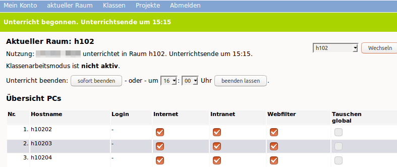

Internetrecherche
=================

Um im Unterricht den Schülern eine Internet-Recherche zu ermöglichen, müssen Sie sich zunächst an der Schulkonsole als Lehrer anmelden, danach den Raum auswählen, in dem Sie unterrichten, im Raum den Unterricht beginnen und ggf. den Internet-Zugriff für die gewünschten PCs freischalten.

Raum auswählen
--------------

Nachdem Sie sich an der Schulkonsole als Lehrer angemeldet haben, gehen Sie zu dem Menüpunkt `Aktueller Raum` und dort zum Unterpunkt `Unterricht`.

Wählen Sie hier den richtigen Raum über das Drop-down Menü aus, sofern dieser noch nicht korrekt eingestellt ist.

.. image:: media/current-room.png

Wählen Sie hierzu den Raumnamen aus der Liste aus und klicken dann den Button `wechseln`.

Danach sehen Sie die Einträge zu den PCs des Raumes, in dem Sie unterrichten.

.. image:: media/room-selected.png

Unterricht beginnen
-------------------

Haben Sie den Raum erfolgreich ausgewählt, müssen Sie nun Ihren Unterricht in dem Raum beginnen.

Klicken Sie hierzu auf den Button `Unterricht beginnen`, der sich ganz oben auf der Seite der Raumübersicht befindet.

Haben Sie den Unterricht erfolgreich begonnen, so sehen Sie wie in nachstehender Abbildung, wann der Unterricht automatisch im System beendet wird und wer in dem Raum unterrichtet.

Hier können Sie ggf. auch die benötigte Unterrichtszeit auf Ihren Unterricht anpassen, indem Sie die gewünschte Uhrzeit auswählen und auf den Button `beenden lassen` klicken.

Internet an- und ausschalten
----------------------------

Um den Schülern nun an den PCs den Zugriff auf das Internet zu ermöglichen, wählen Sie in o.g. Ansicht alle PCs des Raumes aus, die Zugriff haben sollen. Abschließend aktivieren Sie diese Einstelung mit einem Klick auf den Button `Änderungen übernehmen`, der sich am Ende der PC-Übersicht befindet.

Um den Zugriff für alle PCs zu aktivieren oder zu deaktivieren, können Sie einfach das Aktivierungskästchen unterhalb der jeweiligen Funktionsspalte anklicken.

Unterricht beenden
------------------

Nach Ablauf der eingestellten Zeit wird der Unterricht im Raum von der Lehrperson automatisch beendet.
Eine vorzeitige Beendigung des Unterrichts ist ebenfalls jederzeit möglich, indem Sie auf der Raumübersicht oben den Button `sofort beenden` klicken.

.. image:: media/close-directly.png
