=============================
Unterricht: WLAN freischalten
=============================

WLAN für eine Klasse freischalten
=================================

Mit Linuxmuster.net kann man bei vorhandenem WLAN temporär Klassen oder Projekten das WLAN frei schalten. Diese Anleitung zeigt wie es funktioniert.

.. important:: Das Schalten des WLAN ist nur möglich, wenn es nicht bereits durch den Administrator in der Administrator Schulkonsole frei geschaltet wurde.

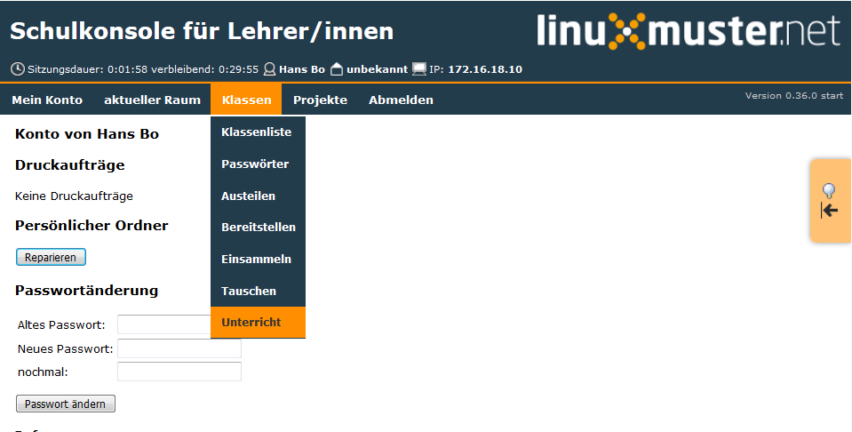

Nach dem Anmelden als Lehrer wählt man zunächst die Klasse aus (hier 10a)

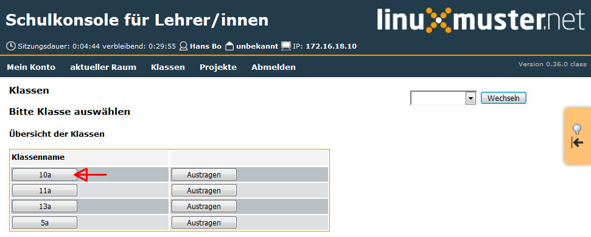

um danach im Menü `Klassen` im Untemenü `Unterricht` auf `Unterricht beginnen` zu klicken

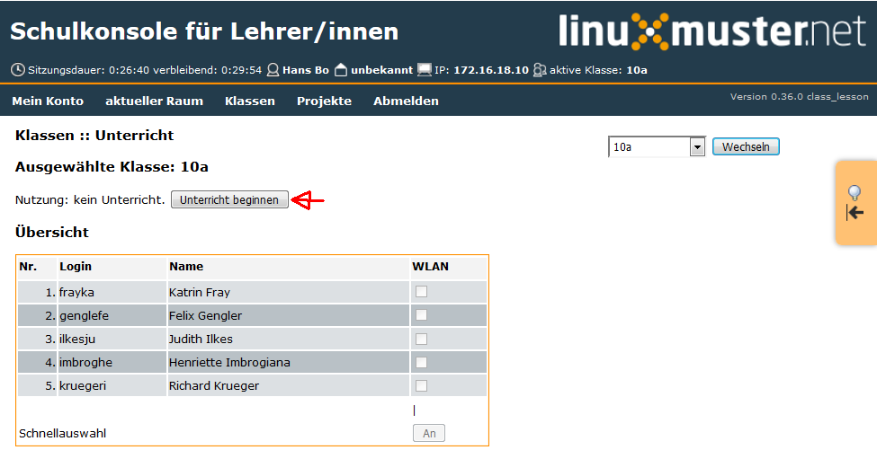

Bei Bedarf stellt man das Unterrichtsende im Drop-Down Menü auf eine gewünschte Zeit (hier 15.00 Uhr) und klickt auf `beenden lassen`

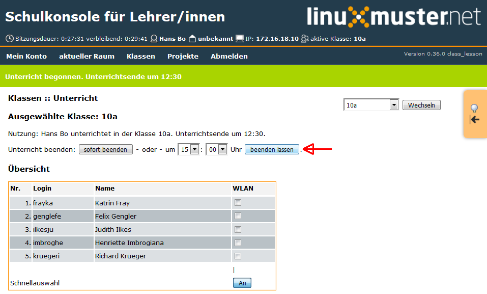

Im gleichen Fenster kann man mittels der Schnellauswahl die Haken hinter den Schülernamen setzen

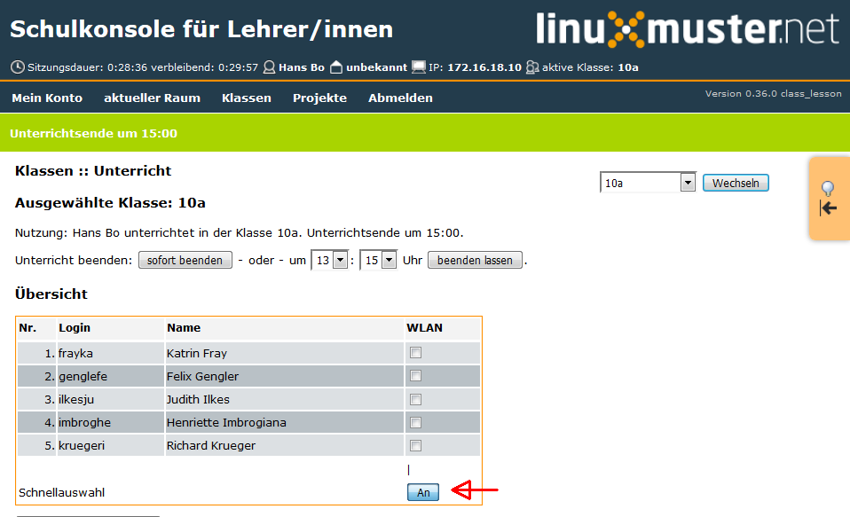

und dann auf `Änderungen übenehmen` klicken. Damit ist das WLAN bis 15 Uhr für die ausgewählten Schüler eingeschaltet. Beendet man den Unterricht vor 15 Uhr, dann kann man mit Klick auf `sofort beenden` das WLAN für die Schüler ausschalten

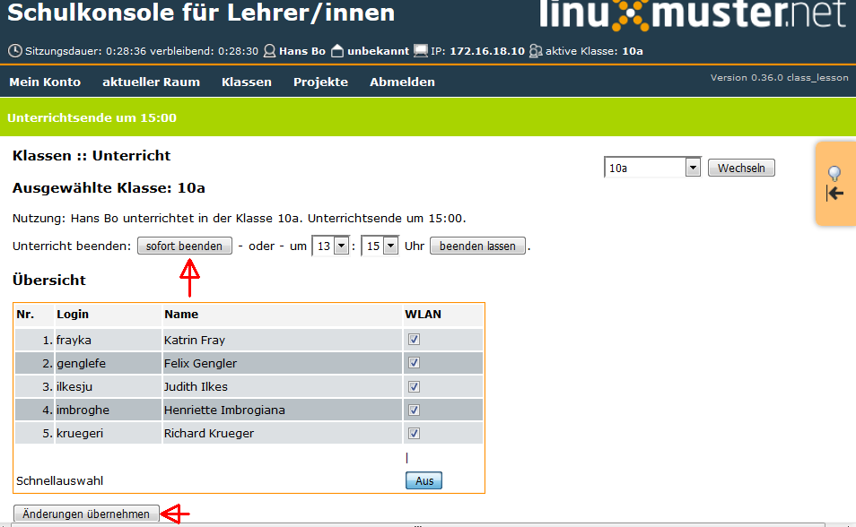

WLAN für ein Projekt freischalten
==================================

Mit Linuxmuster.net kann man bei vorhandenem WLAN temporär Klassen oder Projekten das WLAN frei schalten. Diese Anleitung zeigt wie es funktioniert.

.. important:: Das Schalten des WLAN ist nur möglich, wenn es nicht bereits durch den Administrator in der Administrator Schulkonsole frei geschaltet wurde.

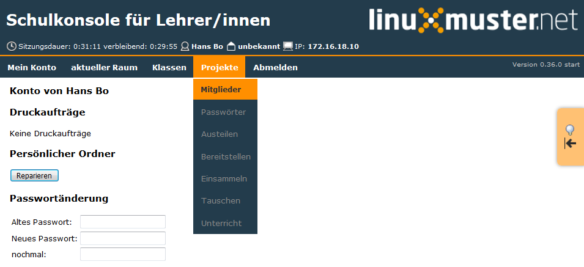

Nach dem Anmelden als Lehrer wählt man im Menü `Projekte` das Untermenü `Mitglieder` und klickt dort auf das gewünschte Projekt

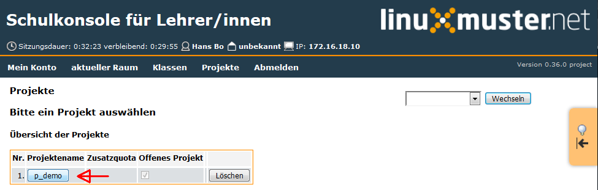

Hier p_demo

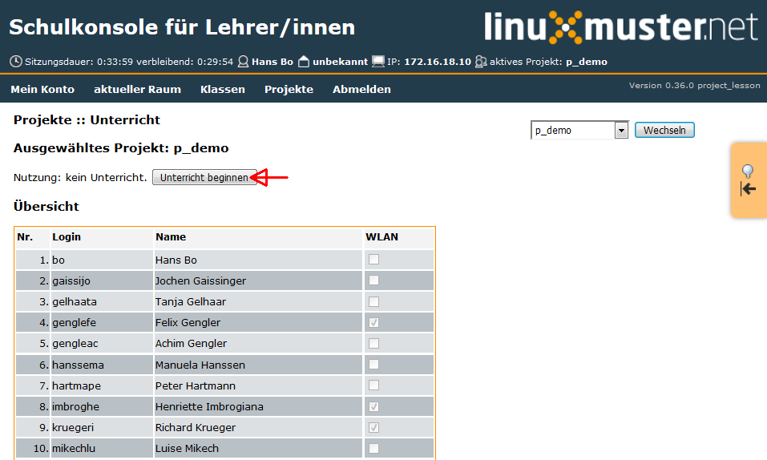

Im folgenden Fenster klickt man auf `Unterricht beginnen` 

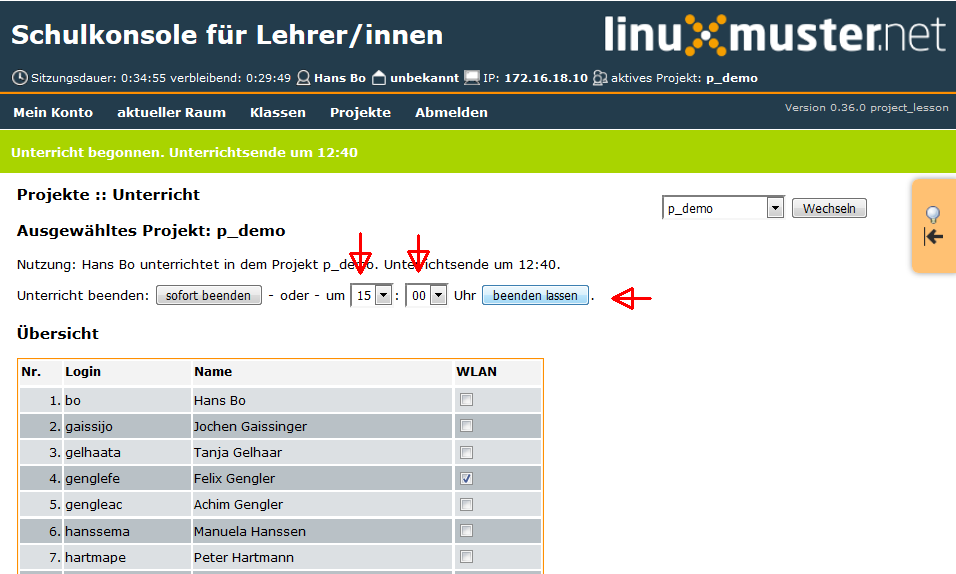

und hat die Option die Unterrichtszeit über das Drop-Down-Menü auf einen gewünschten Zeitpunkt zu setzen (hier: 15:00 Uhr). Mit Klick auf `beenden lassen` wird die gewählte Uhrzeit für das Unterrichtende eingestellt.

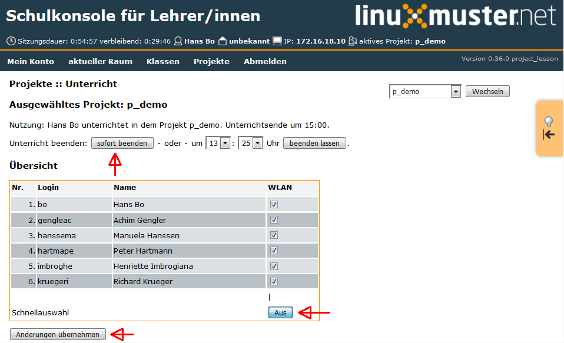

Mit dem Button `Schnellauswahl` setzt man die Haken für alle Schüler und klickt auf `Änderungen übernehmen`. Damit ist das Wlan für die Projektgruppe frei geschaltet.

Sollte der Unterricht vorzeitig enden, dann kann man mit klick auf `sofort beenden` das Wlan für die Projektgruppe ausschalten.

