.. _webui-basics-label:

========================
Schulkonsole des Lehrers
========================

.. sectionauthor:: `@Maurice <https://ask.linuxmuster.net/u/Maurice>`_, `@cweikl <https://ask.linuxmuster.net/u/cweikl>`_,
            `@MachtDochNix (pics) <https://ask.linuxmuster.net/u/MachtDochNix>`_

Haben Sie in linuxmuster.net v7 einen Lehrer-Account, so können Sie die Steuerung des Unterrichts web-basiert mithilfe der 
Schulkonsole in einem Browser vornehmen.

.. figure:: media/01_webui-basics_welcome.png
   :align: center
   :alt: WebUI Welcome

Allgemeine Bedienung
====================

Die Schulkonsole wird im Browser über ``https://10.0.0.1`` aufgerufen. Je nachdem welcher Benutzer angemeldet ist, erscheinen
zugehörige Menüpunkte.

.. figure:: media/02_webui-basics_user-overview.png
   :align: center
   :alt: WebUI Welcome

Die Icons haben folgende Bedeutung:

* Menü ein- und ausklappen

.. figure:: media/03_webui-basics_extend-menue.png
   :align: center
   :alt: WebUI Extend Menue

* Benutzericon

.. figure:: media/04_webui-basics_user-icon.png
   :align: center
   :alt: WebUI User Icon

* angemeldeter Benutzername

* eigenes Passwort ändern

.. figure:: media/06_webui-basics_change-password.png
   :align: center
   :alt: WebUI Change Password

* Abmelden

.. figure:: media/07_webui-basics_logout.png
   :align: center
   :alt: WebUI Logout

* Seitenverhältnis skalieren

.. figure:: media/08_webui-basics_scale-page-ratio.png
   :align: center
   :alt: WebUI Scale Page Ratio

Das Menü können Sie durch Anklicken der drei Striche links neben dem linuxmuster.net-Symbol ein- und ausblenden.

.. hint:: 
   Bei Namenvergaben, beispielsweise von Kursen oder Projekten, sollte auf Umlaute und ß verzichtet werden.

Die Schulkonsole des Lehrers teilt sich auf einen ``Übersichtsbereich Allgemein`` sowie auf ``pädagogische Funktionen`` 
im Bereich Klassenzimmer auf.

Allgemein
=========

Hauptseite
----------

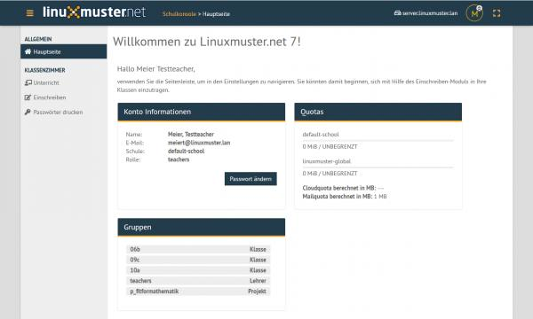

Eine generelle Übersicht über Account- & Speicherinformationen des angemeldeten Benutzer. Möglichkeit zur Änderung des
eigenen Passworts über ``Passwort ändern``-Funktion.

Klassenzimmer
-------------

Unterricht
----------

Kurse, in denen Sie Mitglied sind, werden hier aufgelistet.

.. figure:: media/10_webui-basics_my-classes.png
   :align: center
   :alt: WebUI My Classes

Der Kurs "Dieser Raum" wird dynamisch zusammengestellt mit angemeldeten Nutzern in einem Raum. Nur der Button zum neu starten der Sitzung ist auswählbar.

Bei Kursen unter "Meine Klassen" kann unter 2 Button gewählt werden:

* Sitzung unverändert starten

Die Sitzung wird wie vorgefunden gestartet. Es kann also sein, dass hier Schüler, die nicht mehr in diese Klasse gehören, noch angezeigt werden oder hinzugekommene fehlen. Man kann Schüler aus anderen Klassen hinzufügen und entfernen. Das bleibt dann solange, bis die Sitzung neu erstellt wird.

* Sitzung neu erstellen

Es handelt sich hier um den aktuellen Stand der Schüler wie er im AD zu finden ist. Das erstellen dauert einen Moment länger.

Unterhalb von "Meine Kurse" finden Sie ihre selbst erstellten Kurse.

Kurse erstellen
---------------

Unter Kurse können Sie über die Funktion oben rechts ``Neuer Kurs`` einen neuen Kurs anlegen. Geben Sie dazu den
Kursnamen ein und bestätigen mit OK.

.. figure:: media/11_webui-basics_new-class.png
   :align: center
   :alt: WebUI New Class

Schüler einem Kurs hinzufügen
-----------------------------

Um Schüler einem Kurs hinzuzufügen, den jeweiligen Kurs auswählen. In den oberen Zeilen gibt es nun die
Möglichkeit über ``Schüler hinzufügen`` einzelne Schüler hinzuzufügen oder über ``Klasse hinzufügen`` eine ganze Schulklasse.
Um die Übernahme der ausgewählten Benutzer in den Kurs anzuwenden, unten rechts mit ``Speichern & Übernehmen`` bestätigen.

.. figure:: media/12_webui-basics_add-class-members.png
   :align: center
   :alt: WebUI Add Class Members

Wählen Sie nun einen bestimmten Kurs aus, finden Sie eine Ansicht nach folgendem Schema vor.

.. figure:: media/13_webui-basics_class-overview.png
   :align: center
   :alt: WebUI Class Overview

In dieser Übersicht können die pädagogischen Funktionen WLAN-, Internet- & Drucker-Freigabe, Dateien-Übertragungs-
Funktion und Prüfungsmodus genutzt werden.

WLAN-, Internet-Freigabe & Drucker-Freigabe
-------------------------------------------

* WLAN-Freigabe

.. figure:: media/14_webui-basics_wlan-icon.png
   :align: center
   :alt: WebUI Wlan Icon

* Internet-Freigabe

.. figure:: media/15_webui-basics_internet-icon.png
   :align: center
   :alt: WebUI Internet Icon

* Drucker-Freigabe

.. figure:: media/16_webui-basics_printer-icon.png
   :align: center
   :alt: WebUI Printer Icon

Freigaben zu den jeweiligen Diensten können über ``Haken setzen oder entfernen`` für jeweilige Benutzer freigegeben oder 
gesperrt werden. Über das Kästchen direkt unter einem Dienstsymbol kann die Freigabe zu dem jeweiligen Dienst mit 
``Speichern & Übernehmen`` auf alle Benutzerangewendet werden. Beispielsweise wurde hier mit einem Klick unter das 
WLAN-Symbol für jeden Benutzer des aktuellen Kurses der WLAN-Zugang gesperrt.

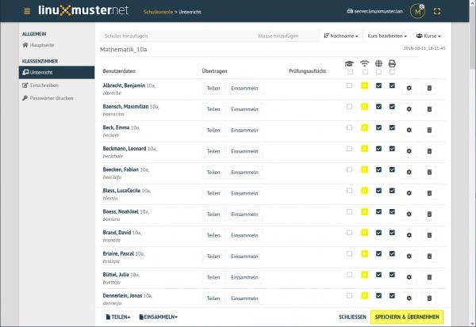

* Einstellungen (Zahnrad)

.. figure:: media/45_webui-basics_gearwheel-button.png
   :align: center
   :alt: Settings Button

Unter Einstellungen sind verschiedene Optionen zum Passwort des Benutzers zu finden.

* Löschen (Mülleimer)

.. figure:: media/46_webui-basics_trash-button.png
   :align: center
   :alt: Trash Button

Mit Hilfe des Löschen Button können einzelne Schüler aus dem Kurs entfernt werden. Dies gilt, bis die Sitzung neu erstellt wird.

Sämtliche Änderungen müssen mit ``Speichern & Übernehmen`` übernommen werden!

Dateien-Übertragungs-Funktion
-----------------------------

Eine nützliche Funktion für Unterrichtsarbeit mit Dateien bietet linuxmuster.net mit der ``Aus- & Einsammeln-Funktion``.
Auf der Kursseite finden Sie im unteren Bereich die ``Teilen`` und ``Einsammeln`` Funktionen, welche sich auf alle
Kursteilnehmer beziehen. Neben jedem Benutzer selbst gibt es ``Teilen`` und ``Einsammeln`` Funktionen, welche auf
einzelne Benutzer angewendet werden. 

TEILEN
------

Dateien auf ganzen Kurs übertragen: per Drag & Drop können Datei(en) eingefügt werden, welche auf die PCs
der Kursteilnehmer kopiert werden.

.. hint::

   **Teilen zu bestimmtem Benutzer**: per Drag & Drop können Datei(en) eingefügt werden, welche auf den PC des 
   ausgewählten Benutzers kopiert werden.

EINSAMMELN
----------

Kopiere Übertragung des ganzen Kurses: Sammelt die bearbeitete Datei/en des Kursteilnehmers wieder ein,
ohne Sie vom Benutzer zu löschen.
Sammle Übertragung des ganzen Kurses ein Sammelt die bearbeitete Datei/en des ausgewählten Benutzers
wieder ein und löscht Sie vom PC der Kursteilnehmer.

**Einsammeln zu bestimmtem Benutzer**: Dateien kopieren: Sammelt die bearbeitete Datei/en des 
ausgewählten Benutzers wieder ein ohne Sie vom Benutzer zu löschen. 

**Dateienen einsammeln**: Sammelt die bearbeitete Datei/en des ausgewählten Benutzers wieder ein und löscht 
   Sie vom PC des Benutzers.

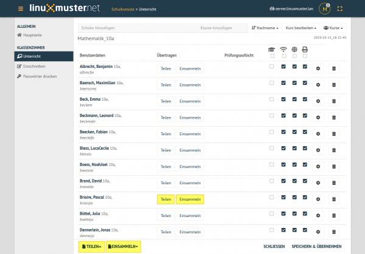

Prüfungsmodus
-------------

Das Absolventenkappen-Symbol

stellt den Prüfungsmodus dar. Ausgewählte Schüler können dadurch in diesen Modus gesetzt werden 
(nach Speichern & Übernehmen unten rechts). Im aktivierten Prüfungsmodus wird die Seite in folgendem Schema angezeigt.

.. figure:: media/22_webui-basics_active-exam-modus.png
   :align: center
   :alt: WebUIActive Exam Modus

Schülern im Prüfungsmodus ist automatisch die WLAN-, Internet- & Drucker-Freigabe gesperrt. Dies kann jedoch
angepasst werden. Um den Prüfungsmodus zu terminieren, den Haken bei jedem Kursmitglied entfernen und ``Speichern & Übernehmen`` 
ausführen.

Einschreiben
------------

Dieser Abschnitt dient Lehrern dazu sich in Schulklassen, Projekte oder zu Druckern einzuschreiben. Lehrer ordnen sich hier
beispielsweise zu Beginn des Schuljahres den jeweiligen Klassen zuordnen.

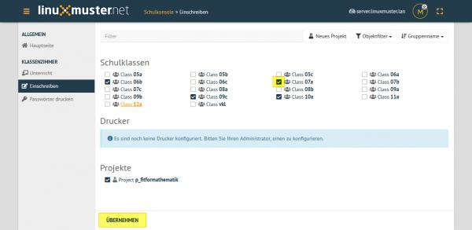

Ein jeweiliges Objekt zum Einschreiben auswählen oder den Haken entfernen um daraus auszutreten. Geänderte
Einstellungen werden gelb angezeigt. Um die Änderungen anzuwenden, auf Übernehmen klicken. In diesem Abschnitt
finden Sie eine übersichtliche Darstellung zu zugehörigen Schulklassen, Druckern und Projekten. Für detaillierte
Informationen zu einem Objekt, dieses anklicken.

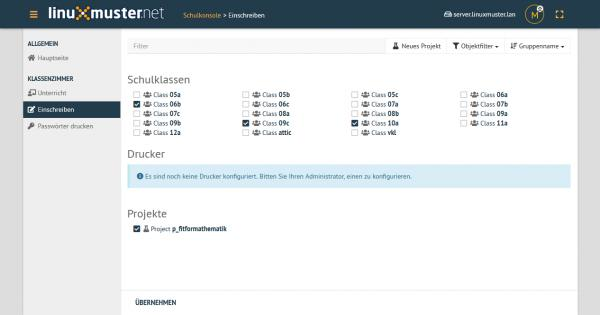

**Objekt beitreten**: Das jeweilige Objekt durch Anhaken auswählen und anschließend mit der Übernehmen-Taste
unten links bestätigen.

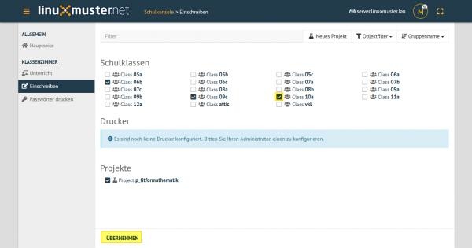

**Aus Objekt austreten**: Den Haken des jeweiligen Objektes entfernen und anschließend mit der ``Übernhemen-Taste`` 
unten links bestätigen.

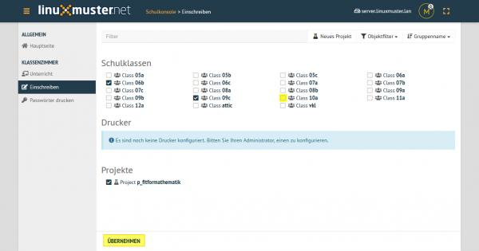

Schulklassen
------------

Hier werden alle Schulklassen aufgelistet. Durch Anklicken werden weitere Informationen angezeigt, wie etwa die
dazugehörigen Schüler.

Drucker
-------

Hier werden alle Drucker aufgelistet. Durch Anklicken werden weitere Informationen angezeigt. Ein Auswählen ist nur erforderlich, wenn man den Drucker auch außerhalb des zugehörigen Raumes nutzen möchte.

Projekte
--------

Hier werden alle Projekte aufgelistet. Projekte unterscheiden sich von Kursen: 

* Mehrere Lehrer können in eine Projektgruppe aufgenommen werden. 
* Projekte verfügen über eigene Tauschverzeichnisse
* Projekte können wiederverwendet werden.
* Unterrichtssteuerung (Passwörter ändern, Internet sprerren, etc.) ist nicht möglich

**Projekt anlegen**: Über

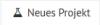

mit ``OK`` erstellen.

Im rechten oberen Bereich, können Sie ein neues Projekt benennen und
mit ``OK`` erstellen.

.. figure:: media/28_webui-basics_new-project-name.png
   :align: center
   :alt: WebUI New Project Name

**Projektmitglieder verwalten**: Durch Anklicken eines bestimmten Projektes, werden weitere Informationen
angezeigt, wie etwa die dazugehörigen Mitglieder und Administratoren:
Über die Funktion ``Beitretbar`` kann die Beitrittmöglichkeit und über die Funktion ``Nicht anzeigen`` die
Sichtbarkeit eingestellt werde. Mitglieder können hier über die Mitglieder ``bearbeiten``-Funktion gleichzeitig
auch hinzugefügt oder entfernt werden.

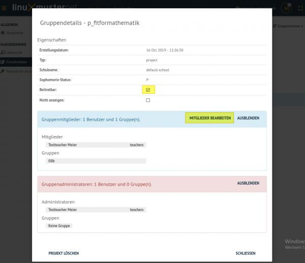

eine Übersicht aller Klassen-Benutzer, die hinzugefügt werden können, erscheint.

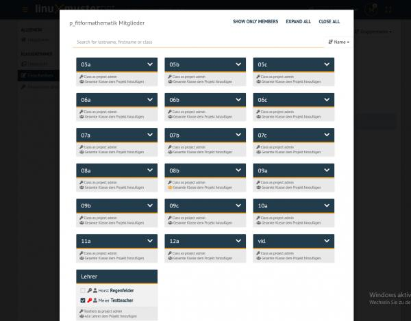

Um bestimmte Benutzer besser finden zu können, gibt es eine Filterfunktion. Ebenso ist es möglich eine
ganze Klasse als Projektadmin zu ernennen oder alle Mitglieder einer Klasse auf einmal auszuwählen. Dafür
einfach das Symbol links neben „Class as project admin“ oder das Symbol links neben „Gesamte Klasse dem
Projekt hinzufügen“ unter derjenigen Klasse klicken:

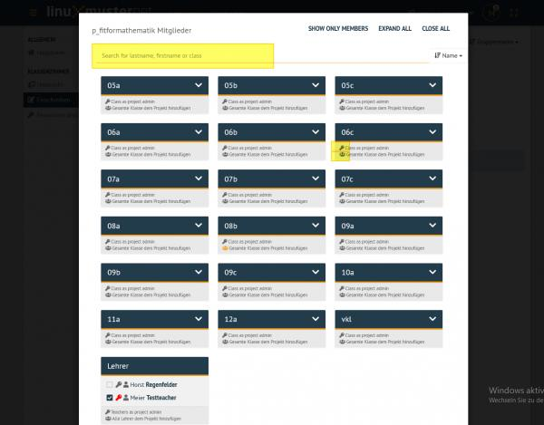

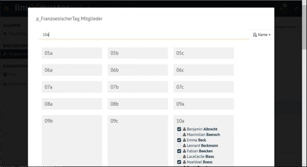

Haben Sie alle Projektschüler aus- oder abgewählt, unten über Speichern die Auswahl übernehmen.

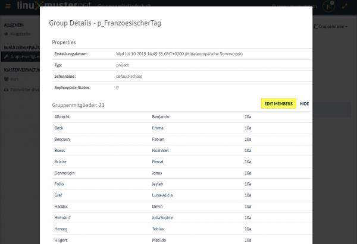

**Projekt löschen**: klicken Sie das jeweilige Projekt an und wählen unten links Projekt löschen und bestätigen mit
Löschen.

**Projektansicht**: Für eine übersichtlichere Ansicht, gibt es die Möglichkeit, über den Objektfilter die
Objektekategorie auszuwählen, welche angezeigt werden soll. Daneben können Sie die Sortierweise auf
Gruppenname oder Mitgliedschaft anwenden (bei nochmaligem Auswählen der selben Kategorie ändert sich die
Auflistungsrichtung).

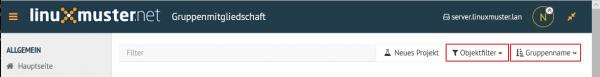

Passwörter drucken
------------------

Hier gibt es die Möglichkeit, eine übersichtliche Liste von Benutzer- & Passwortinformationen per PDF oder CSV-Format
ausdrucken zu lassen.

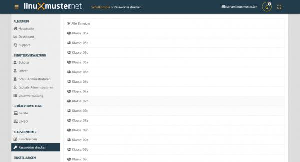

Dies kann über Anklicken der jeweiligen Klasse klassenspezifisch, über Klasse: teachers auf alle Lehrer oder über die
Option ``Alle Benutzer`` auf alle Benutzer der Schule angewendet werden. Als PDF werden die Benutzer neben dem
zugehörigen Passwort in Kästchen angezeigt, wie in diesem Beispiel:

.. figure:: media/42_webui-basics_class-users-export.png
   :align: center
   :alt: WebUI class Users Export

Um nicht jedes Kästchen einzeln ausschneiden zu müssen, gibt es vor dem Drucken die Option One per page, um pro Seite
nur eine Benutzerinformation auszugeben. Um zu Drucken Ausdrucken wählen.

