.. _webui-basics-label:

========================
Schulkonsole des Lehrers
========================

.. sectionauthor:: `@cweikl <https://ask.linuxmuster.net/u/cweikl>`_,
                   `@MachtDochNix (pics) <https://ask.linuxmuster.net/u/MachtDochNix>`_

Hast Du auf dem Server einen Lehrer-Account, so kannst Du die Steuerung des Unterrichts web-basiert mithilfe der Schulkonsole in einem Browser vornehmen.

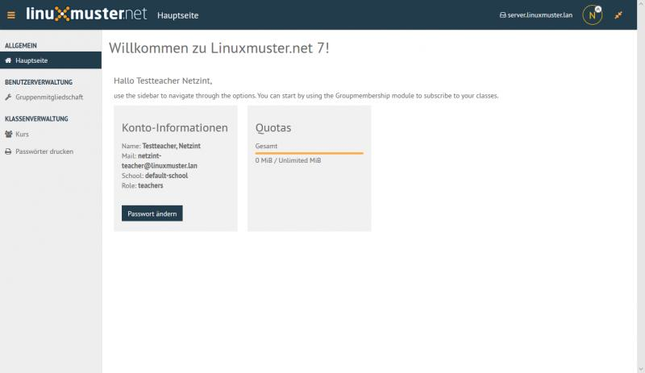
       
   Schulkonsole als Lehrer nach der Anmeldung

Die Schulkonsole wird im Browser über ``https://10.0.0.1`` aufgerufen. Je nachdem welcher Benutzer angemeldet ist, erscheinen
zugehörige Menüpunkte.

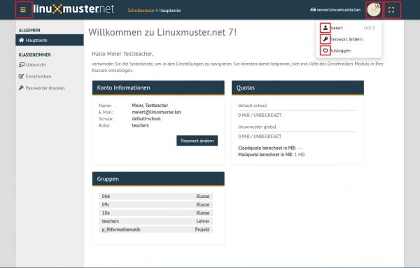
   
   Profil nach erfolgter Anmeldung

Die Icons haben folgende Bedeutung:

Das Menü kannst Du durch Anklicken der drei Striche links neben dem linuxmuster.net-Symbol ein- und ausblenden.

.. figure:: media/03_webui-basics_extend-menue.png
   :align: center
   :alt: WebUI Extend Menue
   
   oben links: Menü ein- und ausklappen
   

   
   angemeldeter Benutzer

   Kennwort ändern

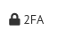

   Aktiviere die Zwei-Faktor-Authentifizierung

   
   Abmelden

   Seitenverhältnis skalieren
   
.. hint:: 
  
   Bei Vergabe von Kurs- oder Projektnamen solltest Du auf Umlaute und ß verzichten.

Das Menü der Schulkonsole des Lehrers teilt sich in die Bereiche ``Allgemein`` und ``Klassenzimmer`` auf.

Allgemein
=========

Hauptseite
----------

   
   Hauptseite als angemeldeter Lehrer

Hier findest Du Informationen zu Deinem Konto, Deinen zugeordneten Benutzergruppen sowie dem Verbrauch Deines Festplattenkontingents (Quota).

Meine Dateien
-------------

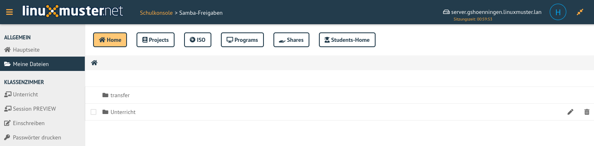
   
   Meine Dateien als angemeldeter Lehrer

Hier findest Du die Ordner und Dateien, die z.B. im Unterverzeichnis **Unterricht** abgelegt hast und im Unterricht an die Schüler der Klassen verteilen kannst. Das Verzeichnis ``transfer`` wird u.a. für den Klassenarbeitsmodus benötigt, um Dateien für Klassenarbeiten auszuteilen und die Ergebnisse auch wieder einzusammeln.

Klassenzimmer
=============

Unterricht
----------

Klassen / Kurse, in denen Du Mitglied bist, werden hier aufgelistet.

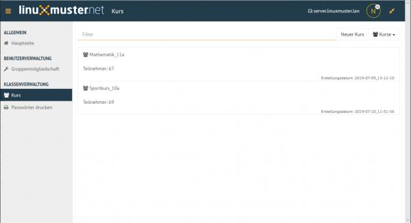

   Unterricht nach der Erstanmeldung als Lehrer

Zu Beginn bist Du noch in keinen Klassen / Kursen oder Projekten eingeschrieben. Schreibe Dich als Lehrer zuerst in den gewünschten Klassen / Kursen ein.  Hierzu klickst Du links im Menü auf ``Einschreiben`` -> ``Schulklassen``. Bei den angezeigten Schulklassen setzt Du für diejenigen Klassen einen Haken, in denen Du Dich einschreiben möchtest.

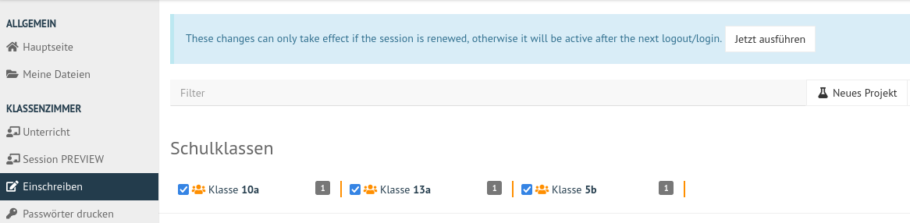
   
   Einschreibung in Klassen

Oben erscheint ein blau hinterlegter Hinweis. Um die Die Einschreibung abzuschließen, musst Du auf ``Jetzt ausführen`` in dem blauen Hinweisfeld klicken.
Verlief die Einschreibung erfolgreich, siehst Du nun im Menüpunkt ``Unterricht`` Deine Dir zugewiesenen Klassen / Kurse.

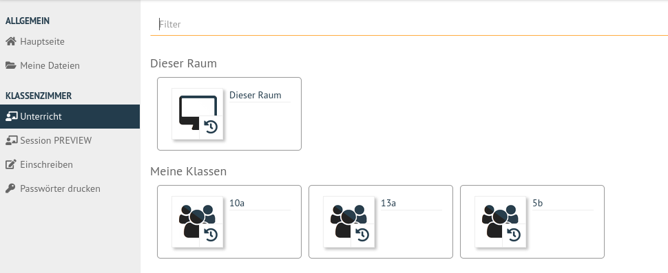
   
   Eingeschriebene Klassen

Klickst Du nun auf eine Klasse, so wird diese mit den eingetragenen Benutzern zusammengestellt. Es werden alle Benutzer der Klasse dargestellt.

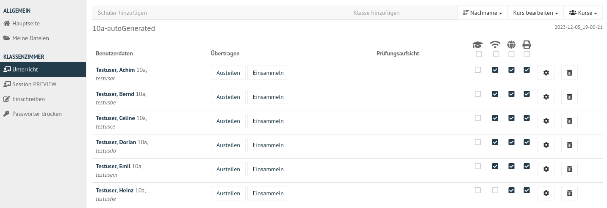

   Ausgewählte Klassen und deren Benutzer

Kurse erstellen
^^^^^^^^^^^^^^^

Du kannst über die Funktion oben rechts ``Neuer Kurs`` einen neuen Kurs anlegen. 

.. figure:: media/11_webui-basics_new-class-button.png
   :align: center
   :alt: WebUI New Class Button
   
   Wähle den Eintrag Neuer Kurs

Gib in dem sich öffnenden Fenster den neuen Kursnamen ein und bestätige diesen mit ``OK``.

.. figure:: media/11_webui-basics_new-class.png
   :align: center
   :alt: WebUI New Class
   
   Neuen Kurs erstellen

Der neu angelegte Kurs erscheint im Menü ``Unterricht`` -> unter der Rubrik ``Meine Kurse``.

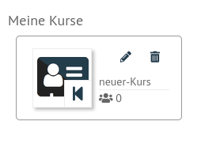
   
   Meine Kurse

In obiger Abbildung siehst Du, dass in dem neu angelegten Kurs noch keine Schüler zugewiesen wurden.

Schüler einem Kurs hinzufügen
^^^^^^^^^^^^^^^^^^^^^^^^^^^^^

Um Schüler einem Kurs hinzuzufügen, wählst Du den gewünschten Kurse via Klick auf das Icon des Kurses aus.

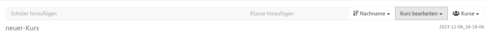
   
   Ausgwählter Kurs

In den oberen Zeilen gibt es nun die Möglichkeit über ``Schüler hinzufügen`` einzelne Schüler hinzuzufügen oder über ``Klasse hinzufügen`` eine ganze Schulklasse dem Kurs hinzuzufügen. Klickst Du in das Feld ``Schüler hinzufügen`` und gibst dort die **ersten beiden Buchstaben des Schülernamens** ein, erscheint eine Liste mit Schülern, deren Nachnamen mit diesen Buchstaben beginnen.

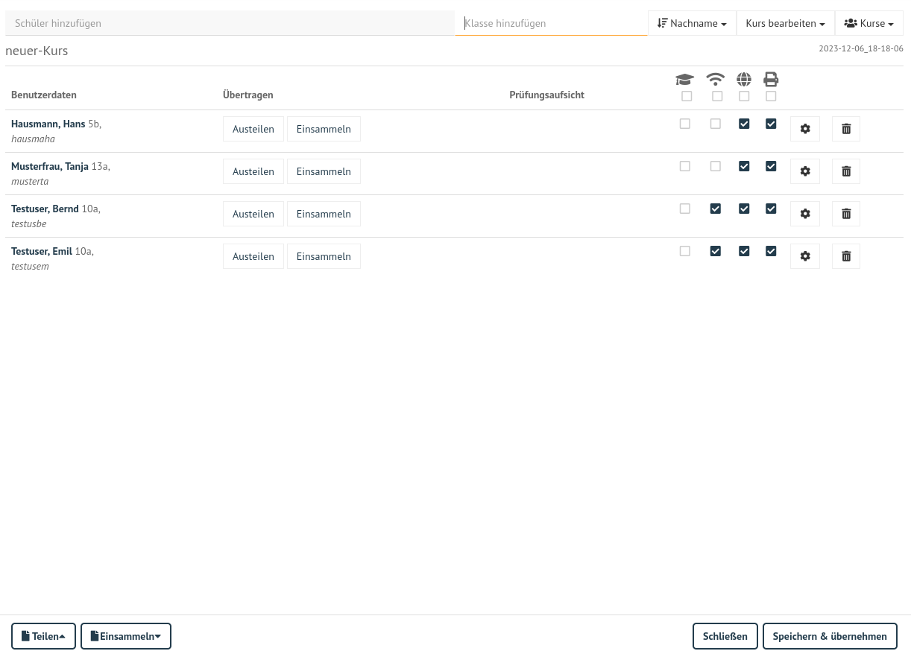
   
   Ausgwählter Kurs: Schüler hinzufügen

Hast Du alle gewünschten Schüler nacheinander ausgewählt, siehst Du eine Liste mit allen Schülern des Kurses. Um diese in den Kurs zu übernehmen, klickst Du abschließend unten rechts auf ``Speichern & übernehmen``.

Wählst Du einen bestimmten Kurs oder eine bestimmte Klasse aus, findest Du folgende Ansicht vor.

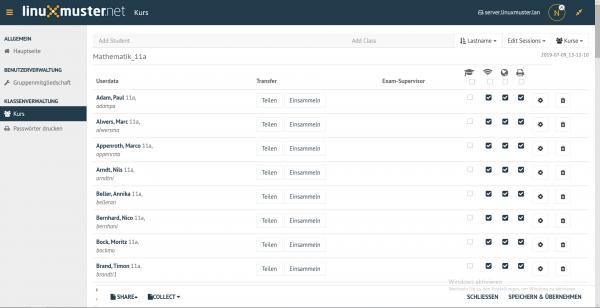
   
   Übersicht der Kursteilnehmer

In dieser Übersicht können die pädagogischen Funktionen WLAN-, Internet- & Drucker-Freigabe, Dateien-Übertragungs-Funktion und Prüfungsmodus genutzt werden.

WLAN-, Internet-Freigabe & Drucker-Freigabe
^^^^^^^^^^^^^^^^^^^^^^^^^^^^^^^^^^^^^^^^^^^

* WLAN-Freigabe

.. figure:: media/14_webui-basics_wlan-icon.png
   :align: center
   :alt: WebUI WLAN Icon

   WLAN Icon

* Internet-Freigabe

   Internet Icon

* Drucker-Freigabe

   
   Drucker Icon
   
* Prüfungsmodus

   
   Prüfungs Icon

Freigaben zu den jeweiligen Diensten können über ``Haken setzen oder entfernen`` für die jeweiligen Benutzer freigegeben oder gesperrt werden. Über das Kästchen direkt unter einem Dienstsymbol kann die Freigabe oder Sperrung zu dem jeweiligen Dienst auf alle Benutzer angewendet werden. 

Beispielsweise wurde hier mit einem Klick unter das WLAN-Symbol für jeden Benutzer des aktuellen Kurses der WLAN-Zugang freigegeben. Dieses muss nur noch unten rechts mit ``Speichern & übernehmen`` angewendet werden.

.. figure:: media/17_webui-basics_example-wlan-access-for-all.png
   :align: center
   :alt: WebUI Allow WLAN Access
   
   WLAN Zugang für alle Kursteilnehmer freigeben

* Einstellungen (Zahnrad)

   
   Einstellungen

Unter Einstellungen sind verschiedene Optionen zum Passwort des Benutzers zu finden.

* Löschen (Mülleimer)

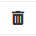
   
   Mülleimer

Mit Hilfe des Mülleiners können einzelne Schüler aus dem Kurs entfernt werden. Dies gilt, bis die Sitzung neu erstellt wird.

Sämtliche Änderungen müssen mit ``Speichern & Übernehmen`` angewendet werden.

Dateien austeilen & einsammeln
^^^^^^^^^^^^^^^^^^^^^^^^^^^^^^

Dateien können für die Unterrichtsarbeit mithilfe der Funktion ``Teilen & Einsammeln`` an Schüler ausgeteilt und wieder eingesammelt werden. 

Auf der Kursseite findest Du im unteren Bereich die Buttons ``Teilen`` und ``Einsammeln``, welche sich auf alle Kursteilnehmer beziehen. 

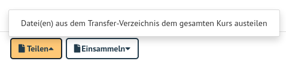
   
   Teilen

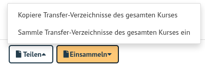
   
   Einsammeln

Neben jedem Benutzer selbst gibt es ``Austeilen`` und ``Einsammeln`` Funktionen, welche nur auf die einzelnen Benutzer angewendet werden.

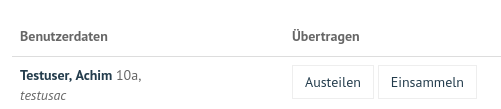
   
   Einsammeln

Weitere Erläuterungen hierzu findest Du im Abschnitt :ref:`exam-and-transfer-label`.

Prüfungsmodus
^^^^^^^^^^^^^

Das Absolventenkappen-Symbol

   Prüfungsmodus

stellt den Prüfungsmodus dar. Ausgewählte Schüler oder alle Schüler einer Klasse eines Kurses können dadurch in diesen Modus gesetzt werden (nach Klick auf ``Speichern & Übernehmen`` unten rechts). Im aktivierten Prüfungsmodus wird die Seite wie folgt angezeigt:

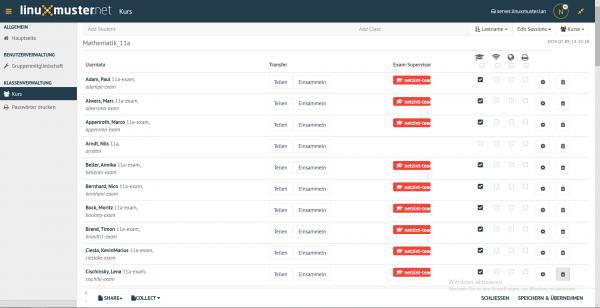
   
   Aktiver Prüfungsmodus

Bei allen Schülern, die im Prüfungsmodus sind, wird unter Prüfungsaufsicht der Name des Lehrers, die den Modus aktiviert hat, mit rotem Hintergrund dargestellt. Schülern im Prüfungsmodus ist automatisch die WLAN-, Internet- & Drucker-Freigabe gesperrt. Dies kann jedoch individuell angepasst werden. 

Um den Prüfungsmodus zu beenden, entfernst Du den Haken bei jedem Kursmitglied (Klick unter das Prüfungsmodus-Icon) und übernimmst die Einstellungen mit ``Speichern & Übernehmen``.

Ausführliche Hinweise zum Prüfungsmodus findest Du im Abschnitt :ref:`exam-and-transfer-label`.

Einschreiben
------------

Im Menü ``Einschreiben`` findest Du nachstehende drei Rubriken.

Schulklassen
^^^^^^^^^^^^

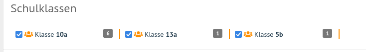
   
   Schulklassen
   
Hier werden alle Schulklassen der Schule aufgelistet. Durch Klick auf den Klassennamen werden Dir weitere Informationen angezeigt, wie etwa alle Schüler der Klasse.

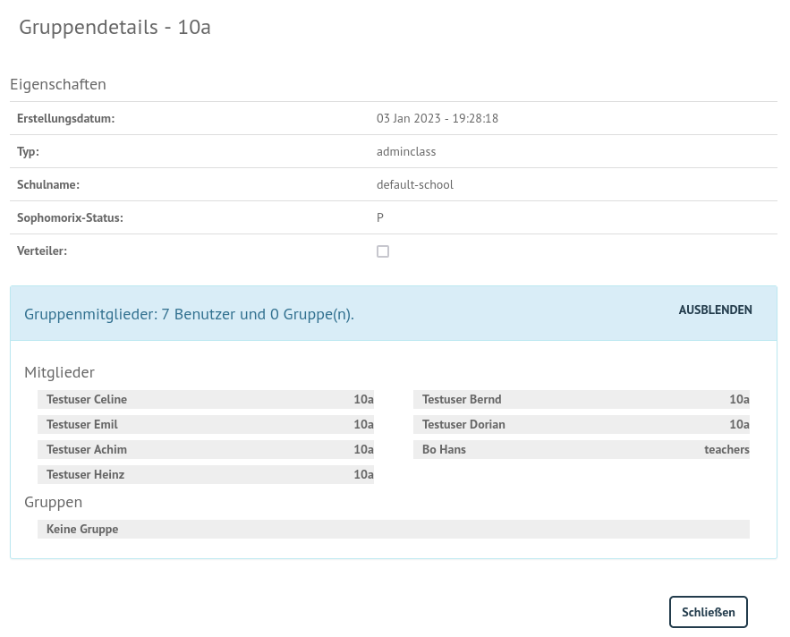
   
   Details der Schulklassen

Drucker
^^^^^^^

Hier werden alle Drucker aufgelistet. Durch Anklicken werden weitere Informationen angezeigt. 

Ein Auswählen ist nur erforderlich, wenn man den Drucker auch außerhalb des zugehörigen Raumes nutzen möchte.

Projekte
^^^^^^^^

Hier werden alle Projekte aufgelistet. Zu Beginn ist die Liste leer. Du musst zuest Projekte anlegen und diesen beitreten.

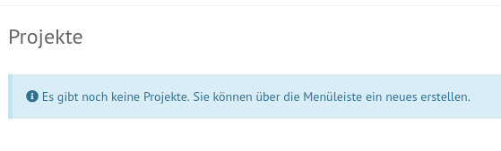
   
   Projekte

Projekte unterscheiden sich von Kursen: 

* Mehrere Lehrer können in eine Projektgruppe aufgenommen werden. 
* Projekte verfügen über eigene Tauschverzeichnisse
* Projekte können wiederverwendet werden.
* Unterrichtssteuerung (Passwörter ändern, Internet sprerren, etc.) ist **nicht** möglich.

**Projekt anlegen**

Um ein Projket anzulegen klickst Du im Menü ``Klassenzimmmer -> Einschreiben -> Neues Projekt``.

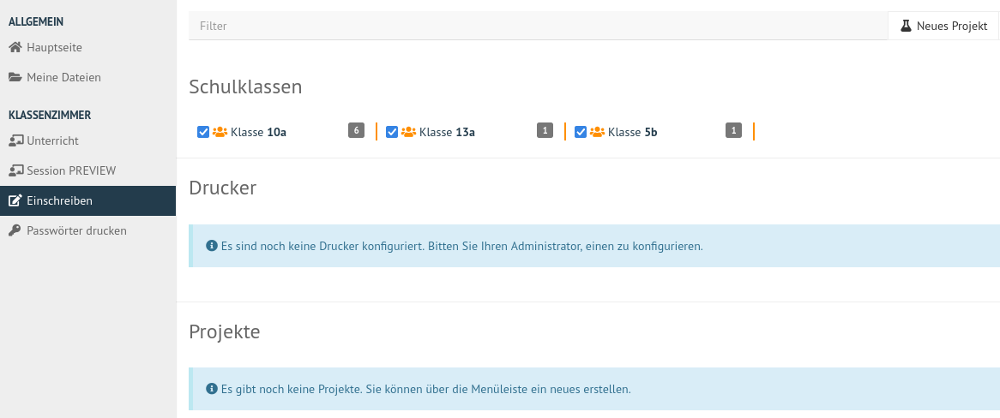
   
   Neues Projekt anlegen

Es erscheint ein neues Fenster, in dem Du den Namen für das anzulegende Projekt einträgst.

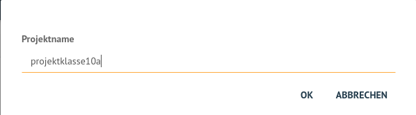

   Namen für das Projekt festlegen

Du darfst nur Kleinbuchstaben und Zahlen in dem Projektnamen verwenden. Bestätige das Anlegen des neuen Projektes mit ``OK``.

**Projektmitglieder verwalten**

Durch Anklicken eines bestimmten Projekts, werden weitere Informationen angezeigt, wie etwa die Mitglieder und Administratoren des Projekts.

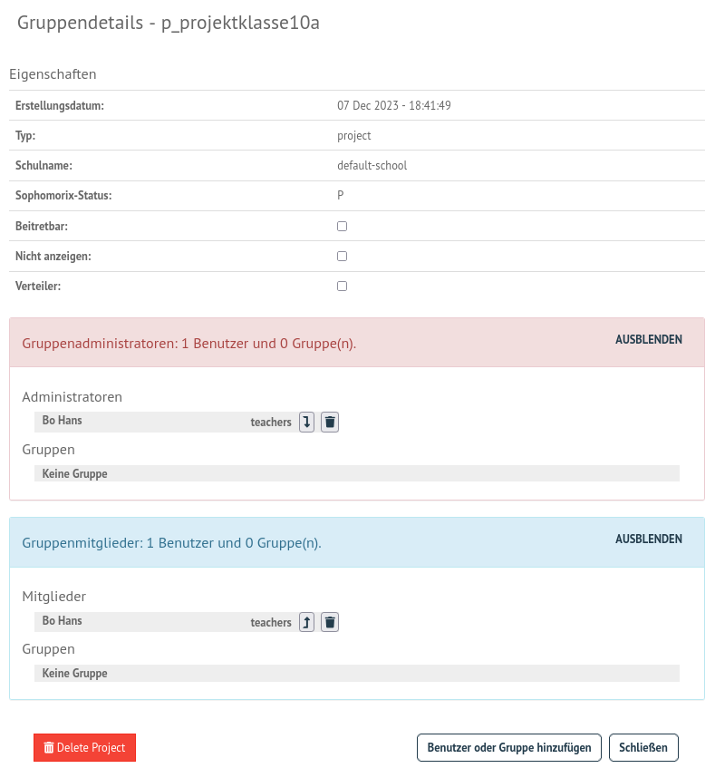

   Weitere Projektinformationen

Über die Funktion ``Beitretbar`` kann die Beitrittmöglichkeit und über die Funktion ``Nicht anzeigen`` die Sichtbarkeit eingestellt werde. 
Klicke die Option ``Beitretbar`` an, damit Benutzer dem Projekt hinzugefügt werden können. 

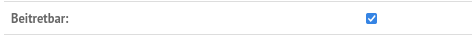

   Projektoption "beitretbar" setzen 

Mitglieder können nun über den Button ``Benutzer oder Gruppe hinzufügen`` dem Projekt zugeordnet werden. Danach erscheint ein Fenster, in dem Du nach Benutzer, Klassen oder Gruppen suchen kannst.

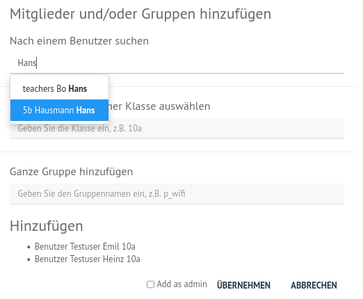
   
   Projektmitglieder hinzufügen

Gebe in einer der Zeilen die ersten beiden Anfangsbuchstaben ein und es werden Dir unter Benutzer, Klasse oder Gruppe die bereits existierenden Einträge aufgelistet. Wähle aus der Liste die gewünschten aus. Wiederhole diese Vorgang für weitere Benutzer oder Gruppen. Die bereits ausgewählten Benutzer oder Gruppen werden Dir unten links in dem Fenster unter der Überschrift ``Hinzufügen`` aufgelistet. Findest Du hier alle gewnüschten Benutzer und Gruppen, klicke auf ``Übernehmen``, um diese dem Projekt hinzuzufügen.

**Projekt löschen**

Klicken auf das jeweilige Projekt und wähle unten links ``Projekt löschen``. Bestätige diesen Vorgang im nächsten Fenster mit ``LÖSCHEN``.

Passwörter drucken
^^^^^^^^^^^^^^^^^^

Hier gibt es die Möglichkeit, eine übersichtliche Liste von Benutzer- & Passwortinformationen im PDF- oder CSV-Format ausdrucken zu lassen bzw. als Datei herunterzuladen.

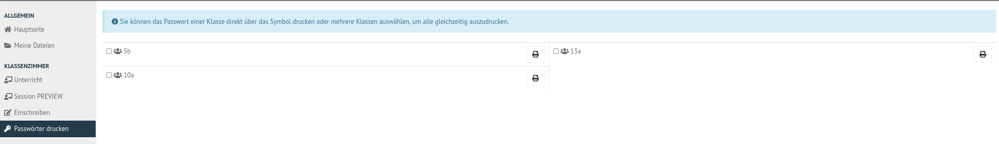
   
   Übersicht der Klassen zum Ausdruck der Passwörter

Der Druck der Passwörter kann durch Anklicken der jeweiligen Klasse klassenspezifisch erfolgen. Markiere die Klasse und klicke auf das Druckersymbol in der Zeile der Klasse. Es erscheint ein neues Fenster.

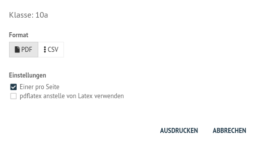
   
   Passwörter der Klasse als PDF ausdrucken
   
Wähle die gewünschten Einstellungen aus und es wird die erstellte Datei heruntergeladen und angezeigt.

Im PDF-Format werden die Benutzer neben dem zugehörigen Passwort in Kästchen angezeigt, wie in diesem Beispiel:

.. figure:: media/42_webui-basics_class-users-export.png
   :align: center
   :alt: WebUI class Users Export
   
   PDF-Datei mit den Passwörtern der Schüler der Klasse

