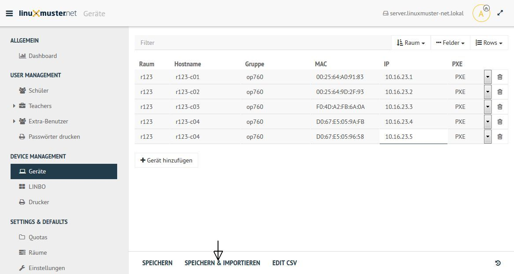

.. include:: /guided-inst.subst

.. _add-computer-label:

======================================
 Rechneraufnahme mit der Schulkonsole
======================================

.. sectionauthor:: `@Alois <https://ask.linuxmuster.net/u/Alois>`_
		   `@Tobias <https://ask.linuxmuster.net/u/Tobias>`_

Um einen Rechner mit der Schulkonsole aufzunehmen geht man wie folgt vor: Melde dich an der Web-UI an.

Im Menüpunkt ``GERÄTEVERWALTUNG/Geräte`` kann man nun `+ Gerät hinzufügen` anklicken. Standardmäßig sind die konfigurierten Server schon in der Liste mit der Rolle `Server` eingetragen.

.. image:: media/computer-add-add.png

In die sich öffnende Zeile gibt man unter Raum den Namen des Raumes (hier `server`) ein. Entsprechend verfährt man mit den Spalten `Hostname`, `Gruppe`, `MAC`, `IP` und `Sophomorix-Rolle`. Im Feld `PXE` wählt man aus, ob der Rechner mit Linbo synchronisiert werden soll. 

Die Schaltfläche `SPEICHERN` überprüft die Eingabe. mit `SPEICHERN & IMPORTIEREN` werden die neuen Geräte imporiert.

Im folgenden erscheinen einige Log-Meldungen und - wenn der Import erfolgreich war - "Import abgeschlossen"

.. image:: media/Webui6.png

.. hint:: Falls du zu dieser Seite von der Beschreibung einer Installation gekommen bist, dann folgende dem Pfeil!

+--------------------------------------------------------------------+-------------------------------------------+
| Installation von Linux-Clients                                     | |follow_me2linux-clients_a|               |
+--------------------------------------------------------------------+-------------------------------------------+
| Installation von Windows-Clients                                   | |follow_me2windows-clients_a|             |
+--------------------------------------------------------------------+-------------------------------------------+
