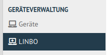
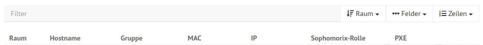
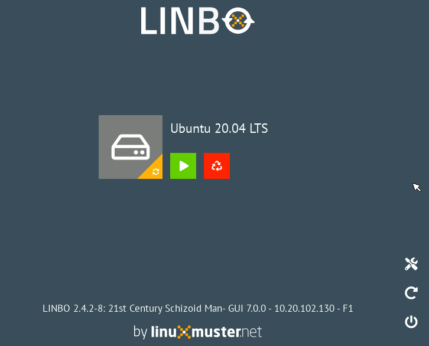
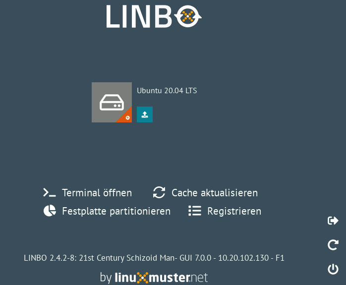

.. include:: /guided-inst.subst

.. _add-computer-label:

==================================
Muster-Clients und Rechneraufnahme
==================================

Muster-Client vorbereiten
=========================

.. sectionauthor:: `@cweikl <https://ask.linuxmuster.net/u/cweikl>`__

In der linuxmuster.net 7 ist es für Clients, denen alle pädagogischen Funktionen im Netz zur Verfügung stehen sollen, erforderlich, dass diese im Active Directory (AD) des Servers (samba 4) einen sog. ``Domänenbeitritt`` ausführen. Hierbei werden Schlüssel erzeugt und ausgetauscht. Diese stellen sicher, dass der Client als berechtigtes Gerät erkannt wird.

Ziel ist es, dass alle PCs mit einem vordefinierten ``Muster-Image`` für Linux oder Windows genutzt werden, sodass nach Möglichkeit nur ein Image oder wenige raumbezogene Images gepflegt werden. Diese werden mit Linbo allen PCs zur Verfügung gestellt. Hierzu ist zunächst ein Rechner mit dem gewünschten Client-Betriebssystem und den gewünschten Programmen zu installieren und vorzukonfigurieren. Dieser ``Muster-Rechner`` muss dann mit dem jeweiligen Betriebssystem einen Domänenbeitritt ausführen, auch dieser wird im Image gespeichert. Erst danach kann dieses Image ebenfalls für alle anderen PCs genutzt werden.

Vorgehen
--------

Prinzipiell kann jeder PC als Muster-PC für das jeweilige Betriebssystem genutzt werden. Besonders flexibel ist es aber, den Muster-PC vorab als virtuelle Maschine (VM) aufzubauen und für weitere Aktualisierungen zu nutzen.

Wenn mehrere Betriebssysteme pro Rechner zum Einsatz kommen sollen, so wird jeweils ein separates Image genutzt. Für jedes Image muss ein eigener Domänenbeitritt ausgeführt werden.

Es wird daher empfohlen, pro genutztem Betriebssystem einen eigenen Muster-Client (ggf. als VM) anzulegen und mit diesem den Domänenbeitritt durchzuführen.

Die nötigen Schritte dafür sind hier beschrieben und lassen sich folgendermaßen zusammenfassen:

1.  PC im Netz anschließen / VM anlegen und geeignete Netzwerkverbindung definieren
2.  Hardwareklasse für den PC/die VM konfigurieren
3.  PC/VM als Rechner aufnehmen
4.  PC/VM via PXE mit Linbo starten
5.  Festplatte mit Linbo partitionieren und formatieren
6.  PC/VM vom ISO-Image booten
7.  Client OS installieren
8.  Erstimage erstellen
9.  Domänenbeitritt ausführen
10. Image erstellen

Die Schritte 1-6 sind für Windows und Linux identisch, sie sind nachstehend beschrieben. Die Besonderheiten von Windows und Linux werden anschliessend in den Kapiteln ``Windows-Clients`` und ``Linux-Clients`` beschrieben.

PC anschließen / VM anlegen
----------------------------

Der PC, der als Hardware zum Aufbau des Muster-Clients genutzt werden soll, ist via Kabel im Netzwerk anzuschließen.

Alternativ kann für den Aufbau des Muster-Clients eine VM in der Virtualisierungsumgebung angelegt werden.

Nachstehende Angaben stellen ein Beispiel für die Rahmendaten einer solchen VM dar:

 * 4 GB vRAM
 * mind. 1 vCPU mit 2 Kernen
 * VGA mit 16GB Speicher
 * 1x vNIC (ggf. im "richtigen" VLAN)
 * PXE-Boot einstellen
 * Boot Firmware: BIOS oder UEFI (je nach später genutzten PCs) - Achtung: start.conf von linbo ggf. anpassen -> siehe Hinweise bei den Client-Systemen
 * 50GB HDD (20GB OS + 20GB Cache + ggf. SWAP oder andere Partitionen)

Hardwareklasse (HWK) / start.conf erstellen
-------------------------------------------

Melde dich als Benutzer ``global-admin`` an der Web-UI an.

.. figure:: media/01-webui-login.png
   :align: center
   :alt: WebUI login

Erstelle nun die Konfiguration für die neue Hardwareklasse. Dafür klickst du links im Menü den Eintrag ``Geräteverwaltung --> Linbo``.

Nun klickst du unten links auf ``+ERSTELLEN``.

Es öffnet sich ein Kontextmenü. Du kannst entweder ein leere start.conf nutzen, oder ein bereits vordefiniertes Template für dein gewünschtes Betriebssystem auswählen.

.. figure:: media/03-webui-menue-linbo-create-start-template.png
   :align: center
   :alt: WebUI menue linbo create start template

Es öffnet sich ein Fenster, in dem du die Namen der neuen Hardwareklasse angibst. Diesen wirst du später brauchen um Geräte dieser Hardwareklasse zuzuweisen.

.. figure:: media/04-webui-menue-linbo-name-for-start-conf.png
   :align: center
   :alt: WebUI menue linbo hwc group name

Danach gelangst du zu den Einstellungen der Hardwareklasse. Dort gibt es die Reiterkarten ``Allgmein`` und  ``Partitionen``.

Unter ``Allgemein`` legst du die IP des Servers fest, gibst das Startverhalten und ggf. Kernel-Optionen für den Boot bei besonderer Hardware an.

.. figure:: media/05-webui-linbo-edit-new-group.png
   :align: center
   :alt: WebUI linbo edit new hwc group

Unter ``Partitionen`` legst du fest, welche Partitionen auf der Festplatte vorgesehen werden sollen.

.. figure:: media/06-webui-linbo-edit-new-group-partition-scheme.png
   :align: center
   :alt: WebUI linbo edit new hwc group - partition scheme

Löschst du dort z.B. die Partitionen ``swap`` und ``data`` so sieht deine Partitionierung wie folgt aus:

.. figure:: media/07-webui-linbo-edit-new-group-partition-scheme-edited.png
   :align: center
   :alt: WebUI linbo edit new hwc group - partition scheme edited

Um Einstellungen für das Betriebssystem vorzunehmen, klickst du auf das Stift-Icon (hier für Ubuntu) und es öffnet sich ein weiteres Fenster, um Einstellungen für das Betriebssystem vorzunehmen.

.. figure:: media/08-webui-linbo-edit-new-group-os-infos-edited.png
   :align: center
   :alt: WebUI linbo edit new hwc group - os edited

Unter der Reiterkarte ``OS`` legst du für das Betriebssystem (OS) die gewünschten Icons, die Start-Optionen und u.a. auch den Namen für das Basisimage fest. Zu Beginn bleibt hier der Eintrag ``None`` noch stehen, da du erst das Image für den Muster-Client erstellen musst.

Auf dem linuxmuster.net Server werden die start.conf-Dateien im Verzeichnis ``/srv/linbo`` abgelegt. Jede Hardwareklasse hat eine eigene start.conf-Datei. Für die neu angelegte Hardwareklasse des Muster-Clients wurde dort nun eine Datei ``start.conf.<name-der-hwk>`` erstellt.

Diese Datei muss normalerweise nicht händisch editiert werden, da sich alle nötigen Einstellungen in der WebUI vornehmen lassen. Das folgende Beispiel dient nur dazu, zu zeigen, was "unter der Decke" passiert.

Folgende Konfiguration zeigt ein mögliches Beispiel für die Hardwareklasse 20210426_focalfossa_base (hier als Linux-Client). Diese würde sich in der Datei ``/srv/linbo/start.conf.20210426_focalfossa_base`` befinden. Hierbei wird von einem Legacy-BIOS und Linux als Betriebssystem ausgegangen:

.. code::

  [LINBO]
  Server = 10.0.0.1
  Group = 20210426_focalfossa_base            #Hardwareklasse
  Cache = /dev/sda2
  RootTimeout = 600
  AutoPartition = no
  AutoFormat = no
  AutoInitCache = no
  DownloadType = torrent
  GuiDisabled = no                    # disable gui <yes|no>
  UseMinimalLayout = no               # gui layout style <yes|no>
  Locale = de-de                      # gui locale <de-de|en-gb|fr-fr|es-es>
  BackgroundColor = 394f5e            # hex code for gui background color
  BackgroundFontColor = white         # font color of status section (default: white)
  ConsoleFontColorStdout = lightgreen # console font color (default: white)
  ConsoleFontColorStderr = orange     # console error font color (default: red)
  SystemType = bios64
  KernelOptions = quiet splash
  
  [Partition]
  Dev = /dev/sda1
  Label = ubuntu
  Size = 30G
  Id = 83
  FSType = ext4
  Bootable = yes
  
  [Partition]
  Dev = /dev/sda2
  Label = cache
  Size =        # verbleibender Plattenplatz wird als Cache genutzt
  Id = 83
  FSType = ext4
  Bootable = yes
  
  [OS]
  Name = Ubuntu 20.04 LTS
  Version = 20
  Description = Ubuntu 20.04
  IconName = ubuntu.png
  Image =
  BaseImage = 20210426_focalfossa_base.cloop
  Boot = /dev/sda1
  Root = /dev/sda1
  Kernel = /boot/vmlinuz
  Initrd = /boot/initrd.img
  Append = ro splash
  StartEnabled = yes
  SyncEnabled = yes
  NewEnabled = yes
  Autostart = no
  AutostartTimeout = 4
  DefaultAction = sync
  RestoreOpsiState = no
  ForceOpsiSetup =
  Hidden = yes

PC / VM als Rechner aufnehmen
-----------------------------

Nachdem du nun die neue Hardwareklasse erstellt hast, musst du noch den PC / die VM mit ihrer MAC-Adresse in der Web-UI als Gerät anlegen. Dort weist du dem Gerät dann die Hardwareklasse zu und wählst im Feld PXE den Eintrag ``Linbo PXE`` aus.

Rechneraufnahme mit der Schulkonsole
====================================

Um einen Rechner mit der Schulkonsole anzulegen, gehst du wie folgt vor: 

Wähle nach der Anmeldung links im Menü unter ``Geräteverwaltung --> Geräte``.

.. figure:: media/09-webui-menue-devices.png
   :align: center
   :alt: WebUI menue devices
 
Nun erscheint die Gerätekonfiguration.

Als Spaltenköpfe siehst du u.a. den Raum, den Hostnamen, ..., PXE.

Die konfigurierten Geräte werden hier angezeigt. Schon eingetragen sind die bereits konfigurierten Server mit der Rolle ``Server``.

.. figure:: media/11-webui-devices-rows.png
   :align: center
   :alt: WebUI devices indicated - examples

Um neue Geräte hinzuzufügen, klicke unten links auf die Schaltfläche ``Gerät hinzufügen``.

.. figure:: media/12-webui-add-new-device.png
   :align: center
   :alt: WebUI menue item add devices

Es wird eine neue Leerzeile hinzugefügt.

.. figure:: media/13-webui-new-device.png
   :align: center
   :alt: WebUI add devices

In diese neue Zeile gibst du unter Raum den Namen des Raumes (hier ``server``) ein. Entsprechend verfährst du mit den Spalten Hostname, MAC, IP und Sophomorix-Rolle.  Im Feld ``Gruppe`` trägst du den Namen deiner Hardwareklasse ein und im Feld ``PXE`` wählst du ``Linbo PXE`` aus.

Die Schaltfläche ``SPEICHERN`` überprüft die Eingabe. Mit ``SPEICHERN & IMPORTIEREN`` werden die neuen Geräte importiert.

.. figure:: media/14-webui-save-and-add-devices.png
   :align: center
   :alt: WebUI add devices

Danach erscheinen einige Log-Meldungen und - wenn der Import erfolgreich war - ``Import abgeschlossen``.

.. figure:: media/15-webui-add-devices-log.png
   :align: center
   :alt: WebUI add devices

Hinweise zur VM
---------------

.. attention::

   Die nachstehenden Hinweise sind nur in Ausnahmefällen bei Nutzung einer VM relevant. Durch diese Änderungen werden zudem Anpassungen in der Boot-Loader Konfiguration von Linbo für die Hardwareklasse nicht mehr bei einem ``linuxmuster-import-devices`` angewendet. Folge diesen Schritten NUR wenn du XCP-ng als Virtualisierungsumgebung verwendest und den Muster-Client in einer VM anlegst.

Sollte der Muster-Client als VM aufgebaut werden, so ist je nach eingesetzter Virtualisierungssoftware darauf zu achten, dass die VGA-Einstellungen eine geringe Auflösung und eine geringe Farbteife aufweisen.

**VGA anpassen**

.. attention::

   Nachstehende Hinweise gelten nur für eine VM unter XCP-ng.

Unter XCP-ng 8.2 sind nachstehende Anpassungen erforderlich, da sonst während des Linbo Boot-Vorgangs ein Hinweis erscheint, dass die Farbtiefe nicht dargestellt werden kann. Rufe auf dem Server die Datei Grub-Datei deiner Hardwareklasse z.B. ``/srv/linbo/boot/grub/20210426_focalfossa_base.cfg`` auf.

Ersetze dort den Eintrag

.. code::

  # if you don't want this file being overwritten by import_workstations remove the following line:
  # ### managed by linuxmuster.net ###
  
  set gfxmode=auto
  set gfxpayload=keep

durch die Angabe für die Bildschirmauflösung und Farbtiefe:

.. code::

  # if you don't want this file being overwritten by import_workstations remove the following line:
  
  set gfxmode=800x600x16
  set gfxpayload=keep

Die Kommentarzeile ``# ### managed by linuxmuster.net ###`` muss entfernt werden, damit beim nächsten ``linuxmuster-import-devices`` diese CFG-Datei nicht überschrieben wird.

Gerät importieren
-----------------

Hast du alle Einstellungen für die Geräte bzw. erneute Änderungen hier vorgenommen, klickst du in der WebUI unter ``Geräteverwaltung --> Geräte`` erneut ``Speichern & Importieren``, damit diese Einstellungen angewendet werden.

Alternativ kann auf dem Server in der Konsole als Benutzer ``root`` der Befehl ``linuxmuster-import-devices`` ausgeführt werden.

PC / VM starten
---------------

Mit o.g. Einstellungen startest du nun den PC / die VM. Während des Boot-Vorgangs erhält der PC / die VM via PXE eine IP-Adresse und Linbo wird geladen.

Der Boot-Vorgang sieht wie folgt aus:

.. figure:: media/16-linbo-start-screen.png
   :align: center
   :alt: Linbo start screen

Wurde in der start.conf kein ``Autostart`` gewählt, startet Linbo mit folgendem Start-Bildschirm:

Klicke nun rechts auf das Icon für Einstellungen / Tools. Es erscheint ein Dialog und du wirst aufgefordert das Kennwort für den Linbo-Benutzer anzugeben.

.. figure:: media/18-linbo-webui-root-login.png
   :align: center
   :alt: Linbo WebUI root login

Gib das Kennwort ein. Die Eingabe wird hierbei nicht angezeigt. Klicke dann auf ``anmelden``.

Danach erscheint der Bildschirm für die Linbo - Einstellungen:

Klicke nun auf den Menüeintrag ``Festplatte partitionieren``. Es öffnet sich ein neues Fenster mit der Rückfrage, ob wirklich partitioniert werden soll.

.. figure:: media/20-linbo-webui-partitioning.png
   :align: center
   :alt: Linbo WebUI paritioning

Bestätige die Paritionierung und Formatierung mit: ``ja``

Fahre danach den PC / die VM über das Icon ``Herunterfahren`` (unten rechts) herunter.

Nun kannst du mit der Installation des gewünschtem Betriebssystems (Linux oder Windows) durch Auswahl einer der nachstehnden Links fortfahren.

+--------------------------------------------------------------------+-------------------------------------------+
| Installation von Linux-Clients                                     | |follow_me2linux-clients_a|               |
+--------------------------------------------------------------------+-------------------------------------------+
| Installation von Windows-Clients                                   | |follow_me2windows-clients_a|             |
+--------------------------------------------------------------------+-------------------------------------------+
