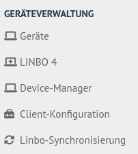
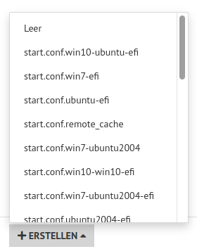
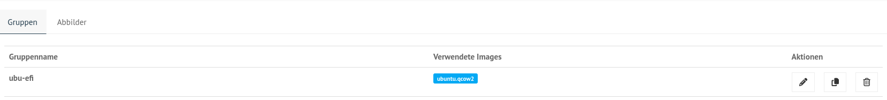
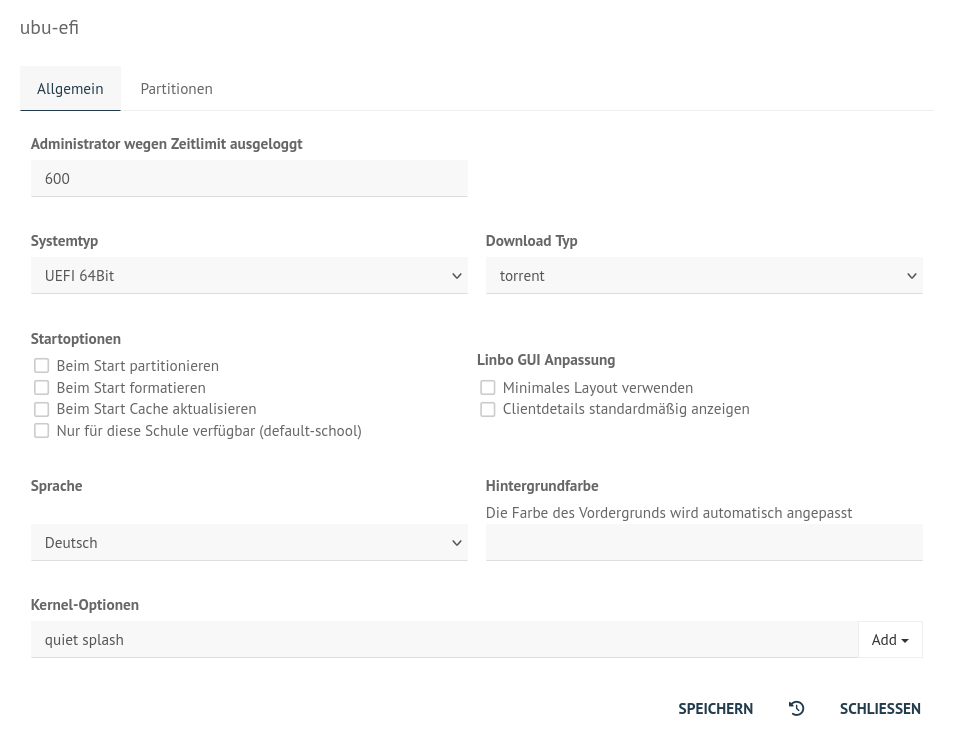
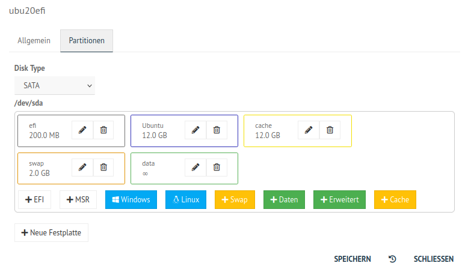
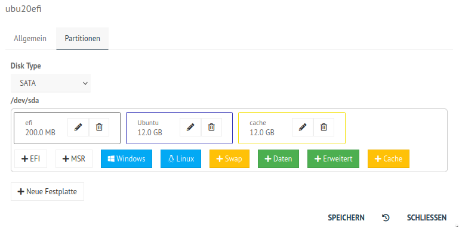
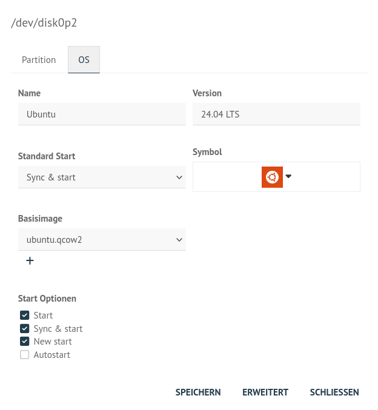

.. |zB| unicode:: z. U+00A0 B. .. Zum Beispiel 
  
.. |ua| unicode:: u. U+00A0 a. .. und andere

.. |_| unicode:: U+202F
   :trim:

.. |copy| unicode:: 0xA9 .. Copyright-Zeichen
   :ltrim:

.. |reg| unicode:: U+00AE .. Trademark
   :ltrim:

.. _hardware-category-label:

=======================================
Hardwareklasse (HWK) / Gruppe erstellen
=======================================

.. sectionauthor:: `@cweikl <https://ask.linuxmuster.net/u/cweikl>`_,
                   `@MachtDochNix (pics) <https://ask.linuxmuster.net/u/MachtDochNix>`_

Melde Dich als Benutzer ``global-admin`` an der Web-UI an.

.. figure:: media/01-webui-login.png
   :align: center
   :alt: WebUI login

Erstelle nun die Konfiguration für die neue Hardwareklasse. Dafür klickst Du links im Menü den Eintrag ``Geräteverwaltung --> Linbo4``.

Nun klickst Du unten links auf ``+ERSTELLEN``.

Es öffnet sich ein Kontextmenü. Du kannst entweder ein leere ``start.conf`` nutzen, oder ein bereits vordefiniertes Template für Dein gewünschtes Betriebssystem auswählen. Hierbei kannst Du Templates für ein oder mehrere Betriebssysteme mit oder ohne UEFI-BIOS auswählen und diese ggf. nach deinen Vorstellungen anpassen.

Es öffnet sich ein Fenster, in dem Du die Namen der neuen Hardwareklasse angibst. Diesen wirst Du später benötigen, um Geräte dieser Hardwareklasse zuzuweisen.

.. hint::

   Die neu angelegte Hardwareklasse wird nicht direkt in der Übersicht mit allen eingerichteten Klassen angezeigt. Hierzu musst Du zunächst mit ``F5`` die Webseite neu laden.

Die Liste der angelegten Hardwareklassen kann dann - z.B. wie nachstehend dargestellt - aussehen (andere Namen für die HWK verwendet):

Du rufst nun die Einstellungen der zuvor angelegten Hardwareklasse auf, indem Du das ``Stift-Symbol`` rechts daneben aufrufst.

Es erscheint ein Fenster mit den Einstellungen der Hardwareklasse. Dort gibt es die Reiterkarten ``Allgmein`` und  ``Partitionen``.

Unter ``Allgemein`` legst Du die IP des Servers fest, gibst das Startverhalten und ggf. Kernel-Optionen für den Boot bei besonderer Hardware an.

Unter ``Partitionen`` legst Du fest, welche Partitionen auf der Festplatte vorgesehen werden sollen.

Löschst Du dort z.B. die Partitionen ``swap`` und ``data`` so sieht Deine Partitionierung wie folgt aus:

Um Einstellungen für das Betriebssystem vorzunehmen, klickst Du auf das Stift-Icon (hier für Ubuntu) und es öffnet sich ein weiteres Fenster, um Einstellungen für das Betriebssystem vorzunehmen.

Unter der Reiterkarte ``OS`` legst Du für das Betriebssystem (OS) die gewünschten Icons, die Start-Optionen und u.a. auch den Namen für das Basisimage fest. Zu Beginn bleibt hier der Eintrag ``None`` noch stehen und auch bei ``Start Optionen`` muss ``Autostart`` deaktiviert bleiben, da Du erst das Image für den Muster-Client erstellen musst.

Auf dem linuxmuster.net Server werden die start.conf-Dateien im Verzeichnis ``/srv/linbo`` abgelegt. Jede Hardwareklasse hat eine eigene start.conf-Datei. Für die neu angelegte Hardwareklasse des Muster-Clients wurde dort nun eine Datei ``start.conf.<name-der-hwk>`` erstellt (z.B. start.conf.ubu20efi).

Diese Datei muss normalerweise nicht händisch editiert werden, da sich alle nötigen Einstellungen in der WebUI vornehmen lassen. Das folgende Beispiel dient nur dazu, zu zeigen, was "unter der Decke" passiert.

Folgende Konfiguration zeigt ein mögliches Beispiel für die ``Hardwareklasse ubu20efi`` (hier als Linux-Client). Diese würde sich in der Datei ``/srv/linbo/start.conf.ubu20efi`` befinden. Hierbei wird von einem UEFI-BIOS und Linux als Betriebssystem ausgegangen:

.. code::

  [LINBO]
   Server = 10.0.0.1
   Group = ubu20efi            #Hardwareklasse
   Cache = /dev/sda3
   RootTimeout = 600
   AutoPartition = no
   AutoFormat = no
   AutoInitCache = no
   GuiDisabled = no                    # disable gui <yes|no>
   UseMinimalLayout = no               # gui layout style <yes|no>
   Locale = de-DE                      # gui locale <de-de|en-gb|fr-fr|es-es>
   DownloadType = torrent
   SystemType = efi64                  # UEFI-BIOS
   KernelOptions = quiet splash        # hier muessen bei speuieller Hardware ggf. Kernel-Parameter angegeben werden
  
   [Partition]
   Dev = /dev/sda1
   Label = efi
   Size = 200M
   Id = ef
   FSType = vfat
   Bootable = yes

   [Partition]
   Dev = /dev/sda2
   Label = ubuntu
   Size = 12G
   Id = 83
   FSType = ext4
   Bootable = no
  
   [Partition]
   Dev = /dev/sda3
   Label = cache
   Size = 12G
   Id = 83
   FSType = ext4
   Bootable = no

   [Partition]
   Dev = /dev/sda4
   Label = swap
   Size = 2G
   Id = 82
   FSType = swap
   Bootable = no

   [Partition]
   Dev = /dev/sda5
   Label = data
   Size =            # verbleibender Plattenplatz wird der Partition zugewiesen
   Id = 83
   FSType = ext4
   Bootable = no
   
   [OS]
   Name = Ubuntu
   Version = 20.04 LTS
   Description = Ubuntu 20.04
   IconName = ubuntu.svg
   Image =
   BaseImage = ubuntu.qcow2
   Boot = /dev/sda2
   Root = /dev/sda2
   Kernel = /boot/vmlinuz
   Initrd = /boot/initrd.img
   Append = ro splash
   StartEnabled = yes
   SyncEnabled = yes
   NewEnabled = yes
   Autostart = no
   AutostartTimeout = 5
   DefaultAction = sync
   RestoreOpsiState = no
   ForceOpsiSetup =
   Hidden = yes

