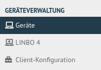
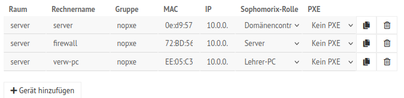
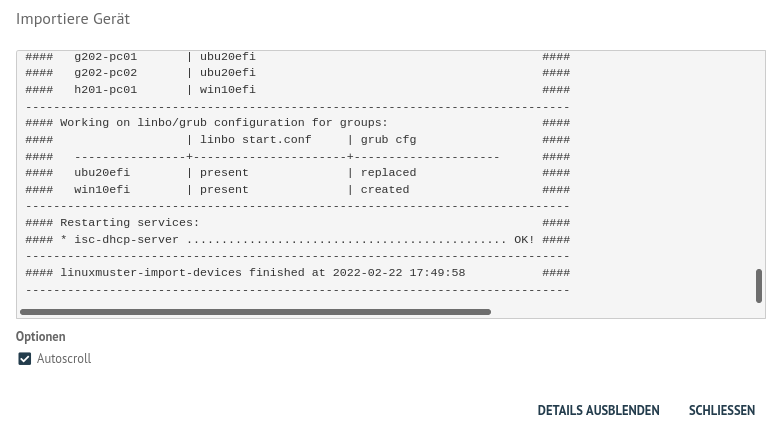
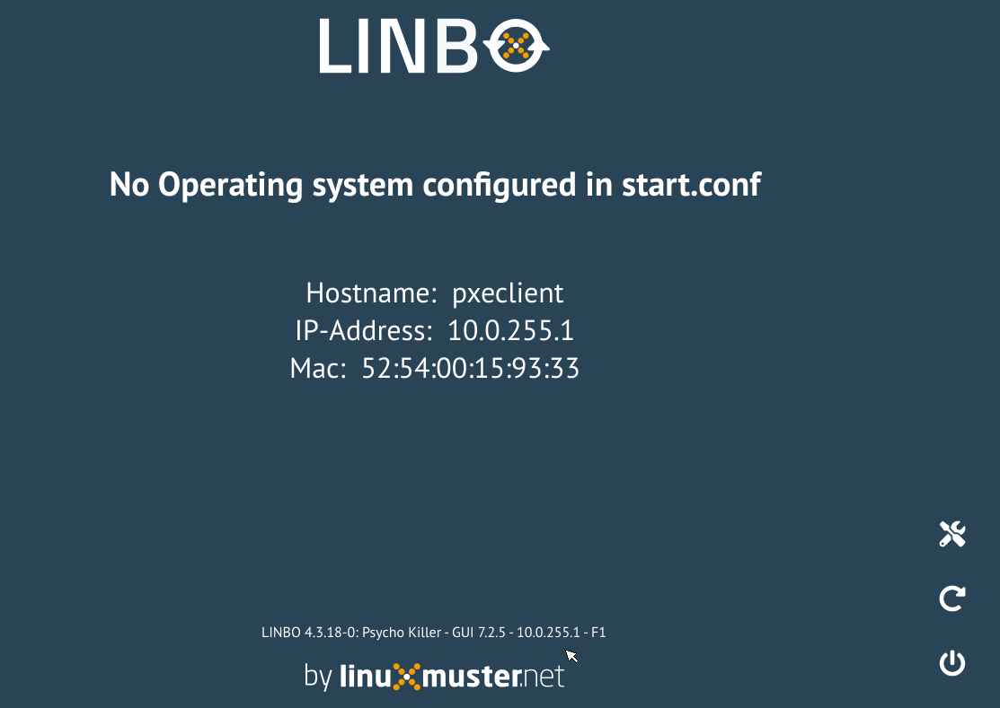
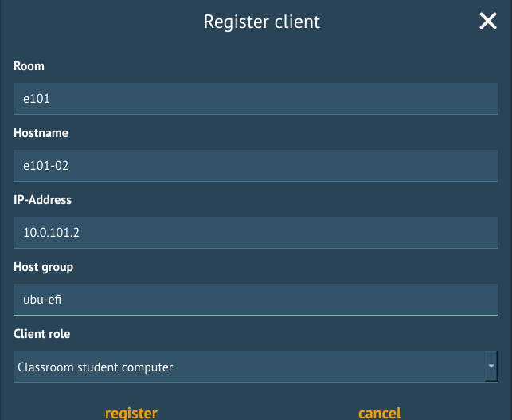
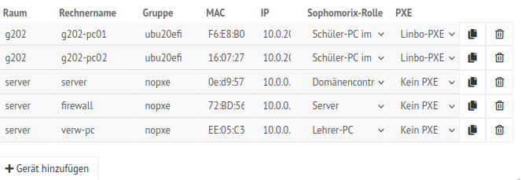
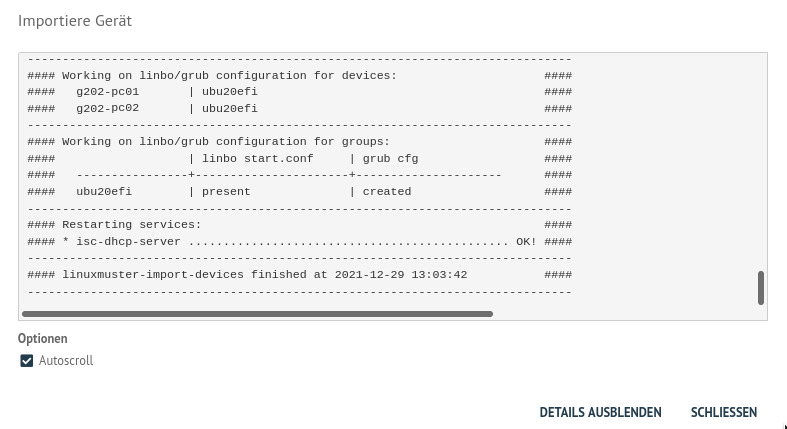

.. include:: ../../../guided-inst.subst

.. _hardware-registration-label:

===============
Rechneraufnahme
===============

.. sectionauthor:: `@cweikl <https://ask.linuxmuster.net/u/cweikl>`_,
                   `@Alois <https://ask.linuxmuster.net/u/Alois>`_ ,
	           `@Tobias <https://ask.linuxmuster.net/u/Tobias>`_,
                   `@michael_kohls <https://ask.linuxmuster.net/u/michael_kohls>`_

Der PC, der als Hardware zum Aufbau des Muster-Clients genutzt werden soll, ist via Kabel mit dem Netzwerk zu verbinden.

Alternativ kann für den Aufbau des Muster-Clients eine VM in der Virtualisierungsumgebung angelegt werden.

Nachstehende Angaben stellen ein Beispiel für die Rahmendaten einer solchen VM dar:

 * 4 GiB vRAM
 * mind. 1 vCPU mit 2 Kernen
 * VGA mit 16 MiB Speicher
 * 1x vNIC (ggf. im "richtigen" VLAN)
 * PXE-Boot einstellen (Bootreihenfolge: NIC first)
 * Boot Firmware: BIOS oder UEFI (je nach später genutzten PCs) - Achtung: start.conf von linbo ggf. anpassen -> siehe Hinweise bei den Client-Systemen
 * z.B. 50 GiB HDD (20 GiB OS + 20 GiB Cache + ggf. SWAP oder andere Partitionen)

.. hint::
   
   Die Gerätenamen dürfen nur aus ASCII-Zeichen (nur Kleinbuchstaben), Ziffern von 0 bis 9 und dem Bindestrich bestehen. Ein Gerätename darf nicht mit einem Bindestrich beginnen oder enden.
   
   Für den Gerätenamen dürfen maximal 15-Zeichen verwendet werden. 
   
   Beispiel: ``g001-r101-pc001``

... mit der WebUI
=================

Um einen Rechner mit der Schulkonsole aufzunehmen, meldest Du Dich zunächst an der Schulkonsole als ``global-admin`` an.

Wähle dann links im Menü ``Geräteverwaltung --> Geräte``.

   
   Menü Geräte

Danach siehst Du rechts die Liste mit allen bereits in der Gerätedatei eingetragenen Geräten. Standardmäßig sind nach dem Setup die konfigurierten Server schon in der Liste mit der Rolle ``Server`` eingetragen.

   
   Eingetragene Server

Klicke unterhalb der Liste auf den Button ``+ Gerät hinzufügen``, um ein neues Gerät einzutragen. Es wird eine neue, noch leere Zeile am Anfang der Geräteliste eingefügt.

.. figure:: media/add-devices/03-device-management-add-new-device.png
   :align: center
   :alt: Device Management: Add New Device
   :width: 80%
   
   Neues Gerät hinzufügen

In der neuen Zeile gibst Du nun folgenes an:

1. Raum: Name des Raums (Achtung: keine Binde- und Unterstriche verwenden, keine Umlaute,  max. 10 Zeichen)
2. Hostname: Name des Geräts (Erlaubte Zeichen ``a-z`` ``A-Z`` ``0-9`` ``-``; Achtung: Keine Unterstriche verwenden; max. 15 Zeichen)
3. Gruppe: Bezeichnung der Linbo-Hardwareklasse. ``Gleiche Bezeichnungen für Raum und Gruppe sind unzulässig``. Reservierte Wörter, wie "con" und "man", dürfen nicht verwendet werden.
4. MAC: Media Access Control - Hardware-Adresse des Netzwerkadapters. Trage 12 Hexadezimalzahlen mit einem Doppelpunkt als Trennzeichen nach zwei Ziffern ein.
5. IP: Gib eine IP-Adresse für das Gerät an, das diesem automatisch zugewiesen werden soll. Z.B. Raum 202 im Gebäude G erhält den Bereich 10.0.202.x/16 und PC01 erhält die UP 10.0.202.1
6. Sophomorix-Rolle: Hier gibst Du an, welche Art von Gerät Du einbindest. Für PCs im Fachraum gibst Du z.B. Schüler-PC im Klassenzimmer an.
7. PXE: Lege über das Drop-down Menü fest, ob der PC mit Linbo-PXE synchronisiert werden soll oder nicht.

.. hint::

   Die Bedeutung der Sophomorix-Rolle wird auf `Github <https://github.com/linuxmuster/sophomorix4/wiki/objectClasses>`_ beschrieben.

Die o.g. Zeile könnte ausgefüllt wie folgt aussehen:

.. figure:: media/add-devices/04-device-management-add-new-device-settings.png
   :align: center
   :alt: Device Management: Add New Device Settings
   :width: 80%
   
   Eintragungen für neuen Client

Die Schaltfläche ``Speichern`` überprüft die Eingabe, ``Speichern & importieren`` werden die neuen Geräte importiert. Mit dem Button ``Im Editor öffnen`` wird die Datei ``/etc/linuxmuster/sophomorix/default-school/devices.csv`` im Editor geöffnet und kann bearbeitet werden.

.. figure:: media/add-devices/05-device-management-buttons.png
   :align: center
   :alt: Device Management: Add New Devices - Buttons
   :width: 50%
   
   Schaltflächen

Im folgenden erscheinen einige Log-Meldungen und - wenn der Import erfolgreich war - "Import abgeschlossen"

   
   Import abgeschlossen

Um weitere Geräte hinzuzufügen, wiederholst Du den beschriebenen Vorgang in der Schulkonsole entsprechend.

.. hint::

   Sind nun die gewünschten Geräte aufgenommen, kannst Du mit ...
    
    ... der Erstellung eines Muster-Clients fortfahren, so dass alle PCs einer Linbo Hardwareklasse ein identisches Image erhalten. Gehe zu :ref:`client-templates-label`

    ... dem Verteilen eines vorhandenen Images auf die aufgenommenen Geräte beginnen. Gehe zu :ref:`using-linbo-label` 

   .. todo Ziel im letzten Aufzählungspunkt muss angepasst werden.

... mittels der Datei devices.csv
=================================

Wenn Du sehr viele Geräte hinzufügen möchtest, deren MAC-Adressen Du bereits kennst, dann ist die o.g. Option ``Im Editor öffnen`` eine Möglichkeit, die Datei devices.csv direkt zu editieren.

.. figure:: media/add-devices/07-device-management-edit-file.png
   :align: center
   :alt: Device Management: Edit file
   :width: 80%
   
   devices.csv im Editor anpassen

Auf dem Server kannst Du Dir in der Konsole mit 

.. code::

   man devices.csv

die ``man pages`` anzeigen lassen. Hier kannst Du Dir alle Felder der CSV-Datei mit Erklärungen ausgeben lassen.

Weitere Hinweise zu den möglichen Rollen eines Gerätes in der devices.csv findest Du hier:

https://github.com/linuxmuster/sophomorix4/wiki/objectClasses

Die Datei kann hier auch zur lokalen Bearbeitung heruntergeladen und wieder hochgeladen werden.

.. hint:: 

  Es sind nun die gewünschten Geräte aufgenommen und Du kannst mit ...
    
  ... der Erstellung eines Muster-Clients fortfahren, so dass alle PCs einer Linbo Hardwareklasse ein identisches Image erhalten. Gehe zu :ref:`client-templates-label`

  ... dem Verteilen eines vorhandenen Images auf die aufgenommenen Geräte beginnen. Gehe zu :ref:`using-linbo-label` 

... mittles LINBO
=================

Wurde z.B. ein neuer Schulungsraum mit 20 PCs ausgestattet, deren MAC-Adressen Du nicht kennst, dann bietet sich diese Möglichkeit an. 

Dazu hat sich folgendes Vorgehen bewährt:

1. Der Clientrechner muss mit dem Schulnetzwerk verbunden sein und den Server erreichen können.
2. Um LINBO zu starten, den PC über das Netzwerk booten (PXE). Dazu entweder im BIOS-Setup in der Bootreihenfolge PXE-Boot als erstes Bootmedium einstellen oder über das Bootmenü PXE-Boot auswählen. Dies gelingt je nach Rechner meistens über die Tasten F2, F10 oder F12. Als virtueller Rechner auf einem Hypervisor unter ``VMxyz --> Options --> Bootorder`` ist hier die Netzwerkkarte als erstes Boot-Medium zu wählen.
3. Es sollte bei einem erfolgreichen Bootvorgang via PXE folgender Startbildschirm zu sehen sein:

   
   PXE-Bootvorgang auf dem Client

4. Wähle in dem LINBO Startbildschirm nun rechts das Werkzeug-Symbol aus. Es erscheint die Kennwortabfrage. Gib das Kennwort des Linbo-Root-Benutzers an, wie es beim Setup erstellt wurde.
  
.. attention:: Deine Eingabe ist nicht zu sehen, es werden auch keine Sternchen für die eingegebenen Ziffern dargestellt.

.. figure:: media/add-devices/16-device-management-linbo4-password.png
   :align: center
   :alt: Device Management: Linbo 4 - password
   :width: 80%
   
   Eingabe des LINBO Kennworts

5. Es werden nun zwei weitere Menü-Symbole dargestellt:

.. figure:: media/add-devices/17-device-management-linbo4-new-menue-symbols.png
   :align: center
   :alt: Device Management: Linbo 4 - new menue symbols
   
   Werkzeug-Symbol - Untermenü

6. Wähle den Eintrag ``Register`` aus.
7. Es öffnet sich ein Fenster, um den Client zu registrieren. Fülle alle Felder aus. Achte darauf, dass Du als Host group die zuvor neu angelegte einträgst.

   
   Register Client

8. Klicke dann auf den Eintrag ``register``. Nach Abschluss der Neuaufnahme siehst Du nachstehende Meldung:

.. figure:: media/add-devices/19-device-management-linbo4-registering-client-finished.png
   :align: center
   :alt: Device Management: Linbo 4 - registering client finished
   :width: 80%
   
   Registrierung abgeschlossen

9. Führe o.g. Vorgang für alle neu aufzunehmenden Clients durch.

10. Wenn alle PCs so registriert wurden, öffne an Deinem Administrations-Rechner die Schulkonsole und melde Dich wieder als ``global-admin`` an. Wähle im Menü ``Geräteverwaltung --> Geräte`` aus. Du siehst nun neben den schon vorhandenen Geräten ebenfalls die neu aufgenommen Geräte (in der Abb. sind dies die PCs für den Raum g202):

   
   Neu aufgenommene Geräte

11. Klicke nun auf ``Speichern & importieren``. Wurde der Vorgang abgeschlossen, siehst Du dies im Importfenster.

   
   Import abgeschlossen

.. hint::

   Es sind nun die gewünschten Geräte aufgenommen und Du kannst mit ...
    
    ... der Erstellung eines Muster-Clients fortfahren, so dass alle PCs einer Linbo Hardwareklasse ein identisches Image erhalten. Gehe zu :ref:`client-templates-label`

    ... dem Verteilen eines vorhandenen Images auf die aufgenommenen Geräte beginnen. Gehe zu :ref:`using-linbo-label` 

