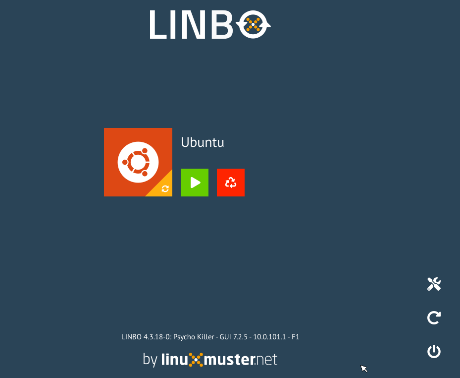
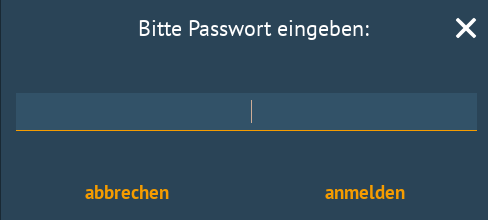
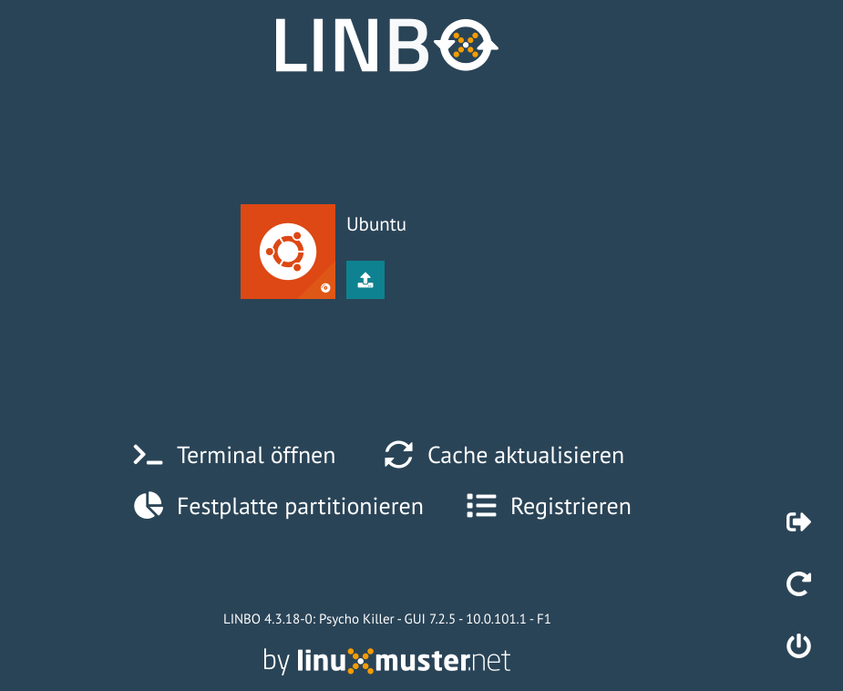

.. include:: ../../../guided-inst.subst

.. _format_hdd_with_linbo-label:

================================
Festplatte mit LINBO vorbereiten
================================

.. sectionauthor:: `@cweikl <https://ask.linuxmuster.net/u/cweikl>`_,
                   `@MachtDochNix (pics) <https://ask.linuxmuster.net/u/MachtDochNix>`_

Du bootest nun den zuvor aufgenommen Client via PXE, so dass dieser vom Server eine IP-Adresse erhält und Du folgenden LINBO-Bildschirm siehst (hier als Beispiel für eine Hardwareklasse für Ubuntu):


   
   LNBO PXE Startbildschirm

Wähle nun das ``Werkzeug-Symbol`` rechts aus.


   
   Werkzeug-Symbol

Es erscheint die Aufforderung, dass Du das LINBO-Passwort eingeben musst. Dies entspricht nach der Installation i.d.R. dem des global-admin. Bei der Eingabe des Kennwortes werden Dir keine Zeichen angezeigt - auch keine Sternchen.


   
   Eingabe des LINBO Kennwortes

Es erscheint dann das LINBO-Tools Menü.


   
   LINBO Werkzeug-Menü

Wähle hier nun den Eintrag ``Festplatte partitionieren`` aus, damit die Festplatte Deines Clients wie zuvor in der Hardwareklasse angegeben, partitioniert und formatiert wird. Bevor der Vorgang angewendet wird, erhälst Du die Rückfrage, ob damit wirklich alle Daten auf dem Laufwerk gelöscht werden sollen.

Bestätige dies mit ``Ja``. 

Während der Partitionierung und Formatierung der Festplatte des Clients siehst Du eine Status-Anzeige.


   
   Partitionierung der Client Festplatte

Wurde der Vorgang abgeschlossen, so findest Du nachstehende Status-Meldung:


   
   Fertigstellung der Partitionierung

Klicke dann auf das Kleiner-Zeichen ``<``.

Fahre nun den Client herunter, indem Du folgenden Button klickst:


   
   Client herunterfahren

Nachdem der Client heruntergefahren wurde, achte darauf, dass das Installationsmedium (z.B. USB-Stick mit ISO-Image oder DVD) für das gewünschte Betriebssystem eingelegt ist.

Starte dann den Client neu, drücke während des Boot-Vorgangs ``F2, F10, F12, usw.``, um in das BIOS Boot-Menü zu gelangen. Als virtueller Rechner auf einem Hypervisor wählst Du unter ``VMxyz ⇒ Options ⇒ Bootorder``` das eingelegte Installationsmedium aus.

Setze nun die Installation fort ...

1. :ref:`install-linux-clients-current-label`
2. :ref:`install-windows10-clients-label` 


