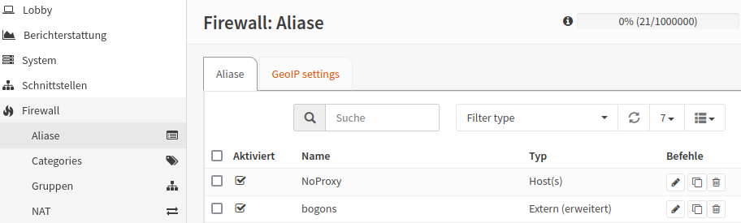
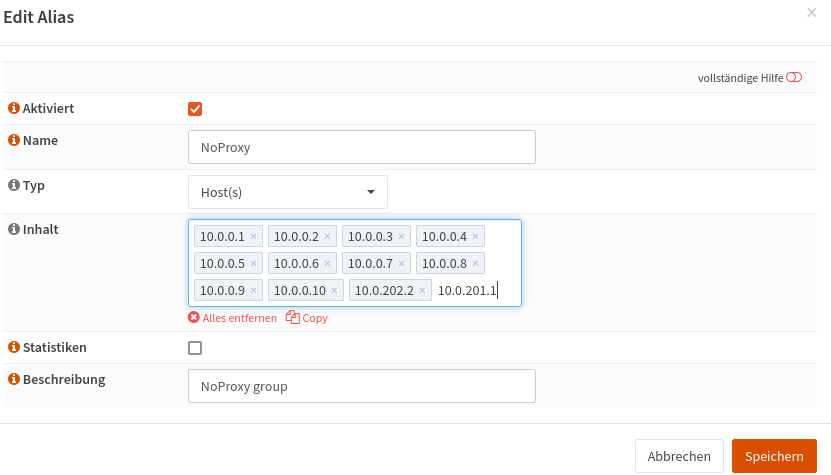

.. include:: ../../../guided-inst.subst

.. _client-templates-label:

============================
Betriebssysteme installieren 
============================

.. sectionauthor:: `@cweikl <https://ask.linuxmuster.net/u/cweikl>`_,
                   `@MachtDochNix <https://ask.linuxmuster.net/u/MachtDochNix>`_

Mit LINBO kannst Du mehrere Betriebssysteme auf einem Client verwalten und als Muster-Clients bereistellen und ausrollen. Du kannst so flexibel verschiedene Anforderungen in PC-Räumen (z.B. Linux mit Virtualisierungs-Partition ohne Synchronisation oder unterschiedliche Images in einem Raum für den Lehrer-PC und die PCs der Schülerinnen und Schüler) abbilden. linuxmuster.net ist darauf ausgelegt, als durchgängige Linux-Lösung genutzt zu werden. Hierzu wurden für den Linux-Client speziell angepasste Ubuntu - Pakete entwickelt, die eine Aufnahme in die Domäne, das Einbinden der Freigaben etc. übernehmen. Windows|ltrim| Betriebssysteme können ebenfalls als Clients vollständig genutzt werden.

Das Partitionierungsschema für die Clients einer Hardwareklasse hast Du mit den Schritten in :ref:`hardware-category-label` festgelegt und im darauf aufbauenden Kapitel :ref:`hardware-registration-label` Deinem Client zugewiesen. Solltest Du das noch nicht gemacht haben, dann hole dies jetzt nach.

.. attention:: Folgende Punkte sind sicherzustellen:

   - Es darf keine Zeitdifferenz zwischen dem Client und dem linuxmuster.net-Server bestehen.
   - Der Client muss via Kabel am Netzwerk angeschlossen sein.
   - Die Botreihenfolge des Clients ist so eingestellt, dass dieser via Netzwerkkarte (PXE) zuerst bootet.
   - Der Client erreicht den Server im gleichen Netzwerk und erhält so eine IP_Adresse.
   - Die Hardwareklasse wurde angelegt und der PC wurde als Gerät in der Schulkonsole oder der devices.csv aufgenommen und importiert.

**Festplatte mit LINBO vorbereiten**

Bevor Du mit der eigentlichen Installation des Client-Betriebssystem beginnen kannst, musst Du die Festplatte mittels LINBO vorbereiten. Dieses wird detailiert unter :ref:`format_hdd_with_linbo-label` beschrieben.

**Betriebssysteme installieren**

Danach kannst Du das gewünschte Betriebssystem auf dem Client installieren. Das Vorgehen hierzu wird ausführlich für 

1. :ref:`install-linux-clients-current-label`
2. :ref:`install-windows10-clients-label` 

beschrieben.

**Muster-Client als NoProxy Gerät**

Für den Zeitraum der Installation und Aktualisierung des Muster-Clients ist es wichtig, dass dieser Internet-Zugriff hat, um Aktualisierungen laden zu können.
Dazu ist es erforderlich, dass nachdem der Client als Gerät importiert wurde, Du die IP-Adresse des Gerätes in der sog. ``NoProxy`` Gruppe in der Firewall der OPNsense aufnimmst.

Dazu meldet Du Dich an der OPNsense als Benutzer ``root`` an und wählst links im Menü unter ``Firewall -> Aliase`` aus.

Du siehst dann anchstehende Firewall: Aliase.

   
   NoProxy aufrufen

Klicke rechts neben dem Eintrag der Alias-Gruppe ``NoProxy`` das Stift-Symbol zum Editieren der Gruppe. Trage hier im Feld ``Inhalt`` nun die IP-Adresse des Muster-Clients ein. 

   
   IP des Clients in die NoProxy Gruppe eintragen

Bestätige die IP mit ENTER, so dass der Eintrag grau hinterlegt wird. Klicke zum Abschluss auf ``Speichern`` und anschließend auf ``Anwenden``, um die Einstellungen zu speichern und zu übernehmen.

Nach Abschluss der Installation und Konfiguration  des Muster-Clients kannst Du diesen wieder aus der NoProxy - Gruppe entfernen. Es sei denn, Du nutzt exklusiv immer den identischen Client zur Weiterentwicklung des Muster-Clients.

.. toctree::
   :maxdepth: 3
   :caption: Musterclients
   :hidden:

   format_hdd_with_linbo
   linux-clients/index
   linux-clients/installation-popos
   windows10clients/index
   windows11clients/index

