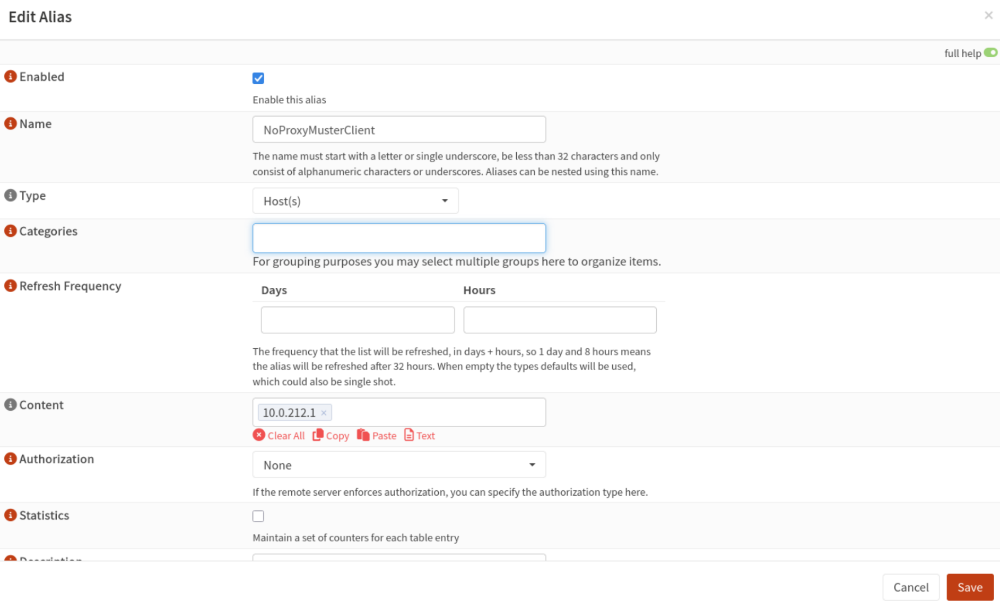
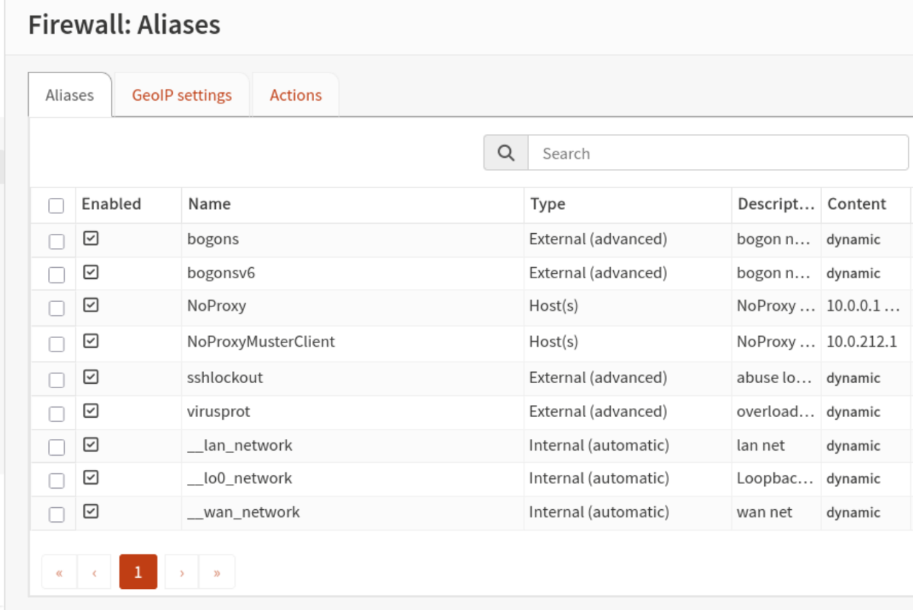
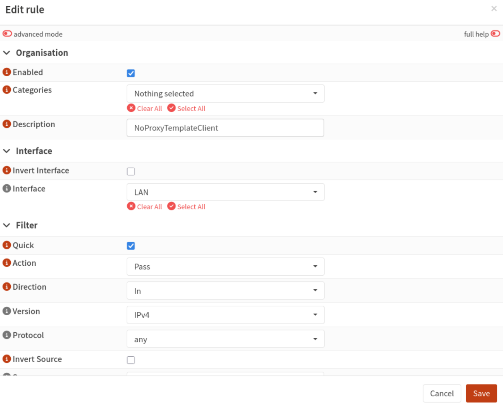
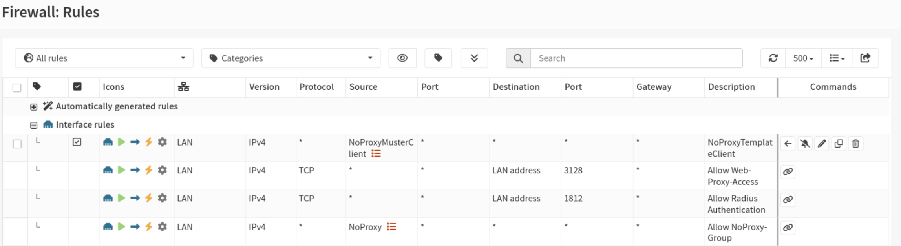

.. include:: /guided-inst.subst

.. _client-templates-label:

============================
Betriebssysteme installieren 
============================

.. sectionauthor:: `@cweikl <https://ask.linuxmuster.net/u/cweikl>`_,
                   `@MachtDochNix <https://ask.linuxmuster.net/u/MachtDochNix>`_

Mit LINBO kannst Du mehrere Betriebssysteme auf einem Client verwalten und als Muster-Clients bereistellen und ausrollen. Du kannst so flexibel verschiedene Anforderungen in PC-Räumen (z.B. Linux mit Virtualisierungs-Partition ohne Synchronisation oder unterschiedliche Images in einem Raum für den Lehrer-PC und die PCs der Schülerinnen und Schüler) abbilden. linuxmuster.net ist darauf ausgelegt, als durchgängige Linux-Lösung genutzt zu werden. Hierzu wurden für den Linux-Client speziell angepasste Ubuntu - Pakete entwickelt, die eine Aufnahme in die Domäne, das Einbinden der Freigaben etc. übernehmen. Windows|ltrim| Betriebssysteme können ebenfalls als Clients vollständig genutzt werden.

Das Partitionierungsschema für die Clients einer Hardwareklasse hast Du mit den Schritten in :ref:`hardware-category-label` festgelegt und im darauf aufbauenden Kapitel :ref:`hardware-registration-label` Deinem Client zugewiesen. Solltest Du das noch nicht gemacht haben, dann hole dies jetzt nach.

.. attention:: Folgende Punkte sind sicherzustellen:

   - Es darf keine Zeitdifferenz zwischen dem Client und dem linuxmuster.net-Server bestehen.
   - Der Client muss via Kabel am Netzwerk angeschlossen sein.
   - Die Botreihenfolge des Clients ist so eingestellt, dass dieser via Netzwerkkarte (PXE) zuerst bootet.
   - Der Client erreicht den Server im gleichen Netzwerk und erhält so eine IP_Adresse.
   - Die Hardwareklasse wurde angelegt und der PC wurde als Gerät in der Schulkonsole oder der devices.csv aufgenommen und importiert.

**Festplatte mit LINBO vorbereiten**

Bevor Du mit der eigentlichen Installation des Client-Betriebssystem beginnen kannst, musst Du die Festplatte mittels LINBO vorbereiten. Dieses wird detailiert unter :ref:`format_hdd_with_linbo-label` beschrieben.

**Betriebssysteme installieren**

Danach kannst Du das gewünschte Betriebssystem auf dem Client installieren. Das Vorgehen hierzu wird ausführlich für 

1. :ref:`install-linux-clients-current-label`
2. :ref:`install-windows11-clients-label` 

beschrieben.

**Muster-Client Zugriff ohne Proxy ermöglichen**

Für den Zeitraum der Installation und Aktualisierung des Muster-Clients ist es wichtig, dass dieser Internet-Zugriff hat, um Aktualisierungen laden zu können.

Beim Setup von linuxmuster.net wurde in der OPNsense |reg| eine ``NoProxy`` Gruppe als sog. Alias angelegt. Für diese wurde eine Firewall-Regel erstellt, die den IPs ``10.0.0.1 bis 10.0.0.20`` den Internet-Zugriff ohne Proxy ermöglicht.

Damit der Muster-Client Zugriff auf das Internet erhält, erstellst Du einen neuen Alias-Eintrag, in dem die IP des Muster-Client als Host eingetragen ist.

Dazu meldet Du Dich an der OPNsense als Benutzer ``root`` an und wählst links im Menü unter ``Firewall -> Aliase`` aus.
Lege mit dem ``+``-Zeichen einen neuen Alias an.

   
   Neuen Alias anlegen

Trage hier im Feld ``Inhalt`` nun die IP-Adresse des Muster-Clients ein. Übernimm die Einstellungen.
Du siehst Deinen neuen Alias dann in der Liste.

   
   Alias-Liste

Lege danach eine neue Firewall-Regel an. Klicke hierzu auf ``Firewall -> Riles -> + - Zeichen``. Mit dem
``+ - Zeichen`` legst Du eine neue Regel an.

Gib folgende Werte ein:

   Anlegen einer neuen Firewall-Regeln

Überimm diese Regel. Danach siehst Du die neue Gesamtliste der aktuellen Firewall-Regeln:

   Übersicht der Firewall-Regel

.. toctree::
   :maxdepth: 3
   :caption: Musterclients
   :hidden:

   format_hdd_with_linbo
   linux-clients/index
   windows11clients/index

