.. include:: ../../../../guided-inst.subst

.. _install-linux-clients-current-label:

============
Linux-Client
============

.. sectionauthor:: `@cweikl <https://ask.linuxmuster.net/u/cweikl>`_, 
                   `@dorian <https://ask.linuxmuster.net/u/dorian>`_

linuxmuster.net stellt für Ubuntu basierte Clients das Paket ``linuxmuster-linuxclient7`` bereit. Es führt automatisiert den Domänenbeitritt aus und vereinheitlicht das Management von Linux- und Windows-Clients durch Auslesen der GPO-Konfigurationen im Active Directory.

Offiziell wird derzeit Ubuntu 22.04 und Pop!_OS 22.04 mit gdm3 und Gnome unterstützt. Andere Ubuntu basierte Distributionen mit gdm3 und Gnome könnten aber auch funktionieren.

Voraussetzung
=============

Du hast bereits:
   1.  PC im Netz angeschlossen / VM angelegt und geeignete Netzwerkverbindung definiert
   2.  Eine Hardwareklasse für den PC / die VM konfiguriert
   3.  PC/VM als Rechner aufgenommen
   4.  PC/VM via PXE mit Linbo gestartet
   5.  Die Festplatte mit Linbo partitioniert und formatiert

Falls Du das noch nicht getan hast, starte zuerst mit den Schritten, die im Kapitel :ref:`hardware-registration-label` beschrieben werden und mache erst danach hier weiter.

Einrichten eines Linux-Clients
==============================

Imagenamen eintragen (HWK)
--------------------------

Vor der Installation bzw. Imageerstellung musst Du eine Hardwareklasse (HWK) zuweisen, sofern nicht bereits bei der Rechneraufnahme erfolgt. 

Gehe dazu in der WebUI auf ``Geräteverwaltung -> Linbo 4 -> Gruppen -> <hwk auswählen>``. Klicke für die gewünschte HWK das Stift-Symbol, um die Einstellungen anzupassen.
Es öffnet sich das Fenster mit den Einstellungen für die HWK. Wähle hier unter ``Partitionen`` Dein Betriebssystem (Reiterkarte ``OS``) aus und klicke das Stift-Icon. Klicke in dem sich öffnenden Fenster die Reiterkarte unter ``OS`` und klicke auf das ``+`` - Symbol, um einen neuen Eintrag für das ``Basisisimage`` festzulegen. Alternativ kannst Du auch einen Namen
aus der Drop-down Liste auswählen. Bei der Erstellung des Erstimages wird ein vorhandenes überschrieben. (vgl. hierzu auch das Vorgehen unter ref:`add-computer-label`).

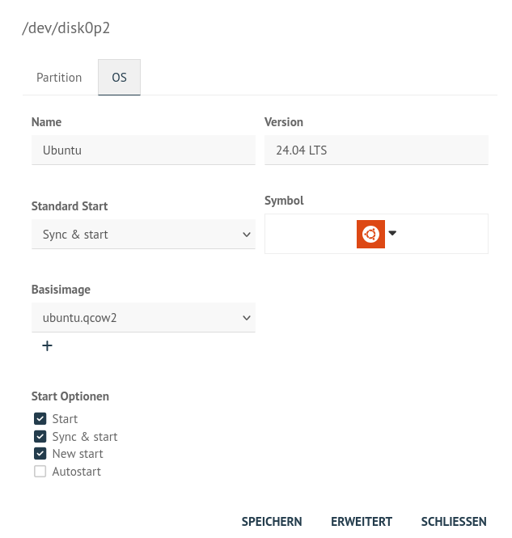
   
   Festelegen des Dateinamens für das Basisimage

Übernehme die Eintragungen jeweils mit ``Speichern & Importieren``. Danach wird automatisch ein Import der Geräte ausgeführt, um diese Einstellungen für alle Geräte der HWK zu übernehmen.

.. hint::

   Das neue Image befindet sich später auf dem Server unter ``/srv/linbo/images/<os>/`` - also für o.g. Abb. z.B. /srv/linbo/images/ubuntu/pop_os_mlm.qcow2

Client OS installieren
----------------------

Gib im PC / in der VM nun an, dass von dem gewünschten ISO-Image / der Installations-DVD gestartet werden soll. Hierbei musst Du darauf achten, die Boot-Reihenfolge so zu ändern, dass nicht mehr vom Netzwerk, sondern von der ISO-Datei / der Installations-DVD gebootet wird.

Starte nun den PC / die VM mit den neuen Einstellungen, sodass Ubuntu vom ISO-Image / von der Installations-DVD startet. Nachdem der Start ausgeführt wurde, wähle auf dem ersten Bildschirm aus, dass Du Ubuntu installieren möchtest.

Nachstehend findest Du die Beschreibung zur Installation von Ubuntu.

Möchtest Du pop!os installieren, so folge dieser Beschreibung :ref:`install-linux-clients-popos-label`

Installation Ubuntu
-------------------

.. hint::
   Bei Ubuntu sollte man darauf achten, dass der Firefox nicht als Snap-Paket installiert wird, da damit SSO nicht funktioniert! Möglicherweise trifft das auch auf andere Distributionen zu!
   
Hast Du den PC / die VM von vom ISO-Image / der Installations-DVD gestartet, siehst Du zunächst folgenden Start-Bildschirm:

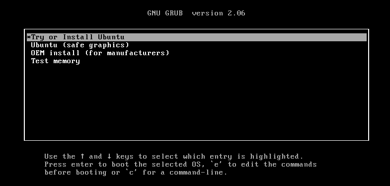
   
   Installationsart festlegen   

Gib in den ersten Schritten der Installation die gewünschte Sprache und Tastaturbelegung an.

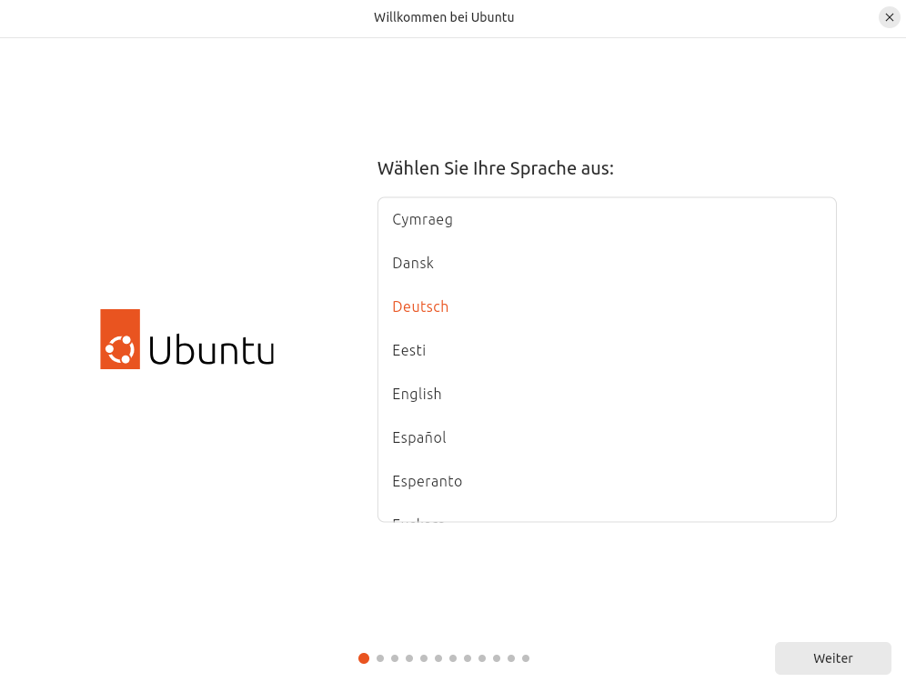
   
   Sprache auswählen
   
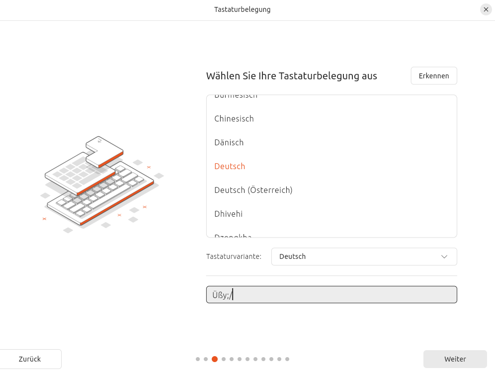
   
   Tastaturlayout auswählen
   
Lege danach die Installationsart sowie weitere Optionen fest. Falls Du hier Aktualisierungen herunterladen wählst, so muss für dieser Client in der OPNSense® in der NoProxy Gruppe eingetragen sein.

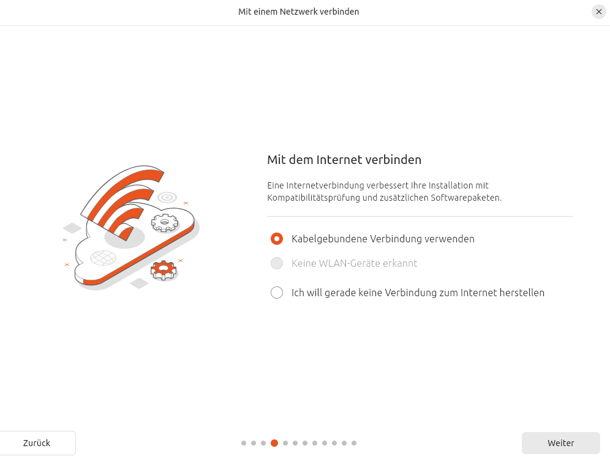
   
   Installationsart und -optionen festlegen

Bei der ``Installationsart`` wählst Du ``Etwas Anderes`` aus.

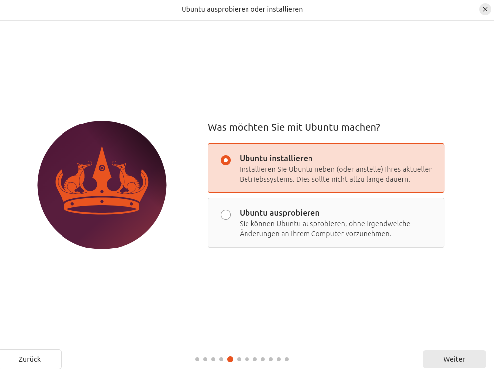
   
   Installationsart festlegen

Du hattest mit LINBO bereits die Festplatte partitioniert und formatiert.

Es werden Dir also die bereits vorhandenen Partitionen und Dateisysteme angezeigt. Je nach genutzter Virtualisierungsumgebung / Hardware können die Festplattenbezeichnungen hier auch als ``/dev/xvda`` und die Partionen als ``/dev/xvda1`` etc. angezeigt werden.

Wähle, wie in der nachstehenden Abb. zu sehen, die Partition aus, auf der Ubuntu installiert werden soll.

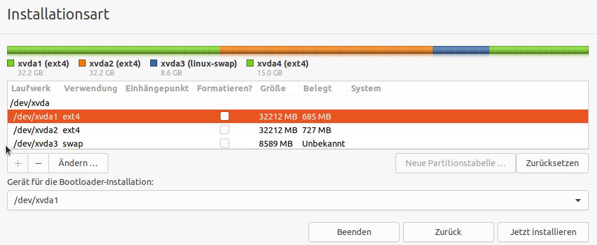
   
   Wähle die Ubuntu-Partition aus

Klicke nun auf ``Ändern`` und es erscheint das nächste Fenster:

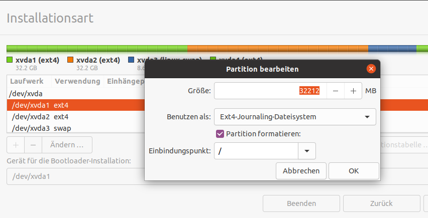
   
   Partition bearbeiten

Belasse die angezeigte Größe und das Dateisystem. Setze den Haken bei ``Partition formatieren`` und wähle als ``Einbindungspunkt`` das Root-Verzeichnis ``/`` aus.

Klicke auf ``ok`` und es werden nochmals alle Einstellungen angezeigt:

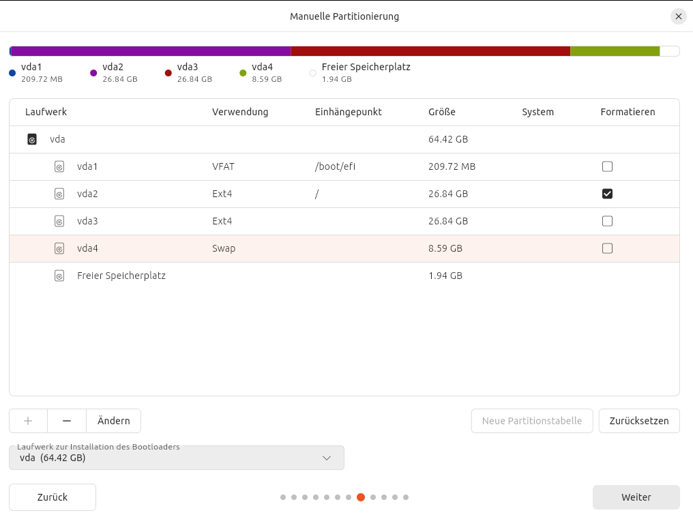
   
   Übersicht der Partitionen

Sind diese Einstellungen korrekt, prüfe noch, ob das Gerät für die Bootloader-Installation die Ubuntu-Parition ist (hier in der Abb. /dev/sda1). Falls nicht passe dies an. Der Bootloader sollte nicht auf den MBR der Festplatte installiert werden (hier also nicht auf /dev/sda).

Setze die Installation mit dem Button ``Jetzt installieren`` fort.

Im Verlauf der Installation wirst Du nach dem Namen für den Computer und dem Benutzername und Kennwort für den neuen Administrator gefragt. Gib hier als Benutzername ``linuxadmin`` ein. Beim Namen des Rechners musst Du den Namen des PCs / der VM angeben, wie Du ihn in der Gerätekonfiguration des festgelegt hast.

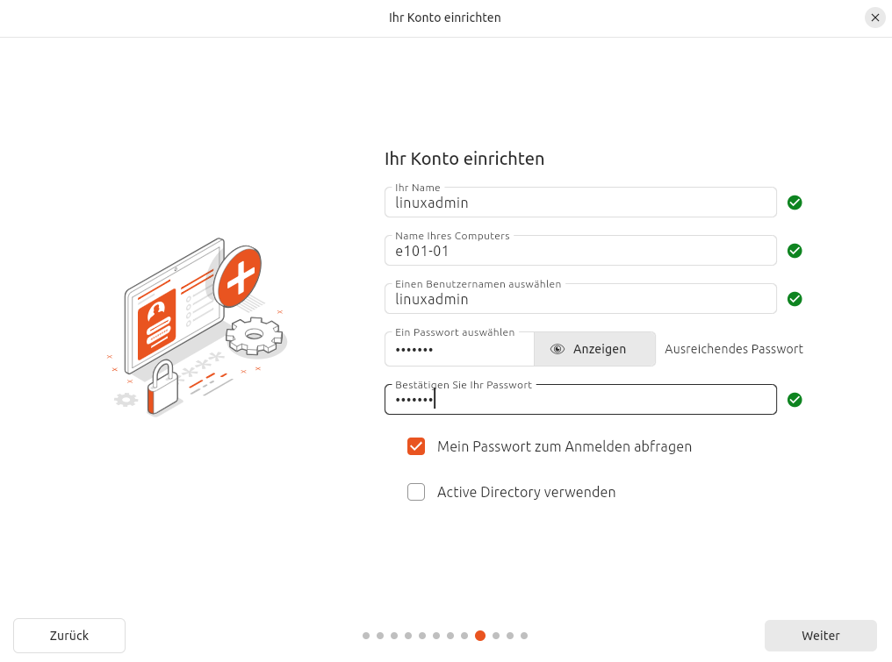
   
   Benutzer festlegen

Am Ende der Installation wirst Du aufgefordert, den Rechner neu zu starten. Fahre die VM herunter und werfe das ISO-Image / die Installations-DVD aus.

Erstimage erstellen
-------------------

Passe die Boot-Reihenfolge für den PC / die VM jetzt so an, dass diese wieder via PXE bootet. Du siehst dann die Startoptionen in Linbo für das installierte Ubuntu 22.04.

   
   LINBO Startoptionen

Klicke nun unten rechts auf das Werkzeug-Symbol, um zum Menü für die Imageerstellung zu gelangen.

.. figure:: media/07-linux-client-ubu-install.png
   :align: center
   :alt: Ubuntu Installation: Menue Tools
   
   Wekzeug-Symbol

Du wirst nach dem Linbo-Passwort gefragt. Gib dieses ein. 

.. attention:: 

   Deine Eingabe wird hierbei nicht angezeigt.

.. figure:: media/08-linux-client-ubu-install.png
   :align: center
   :alt: Ubuntu Installation: root login
   :width: 80%
   
   LINBO Kennwort

Klicke dann auf ``anmelden`` und Du gelangst zu folgender Ansicht:

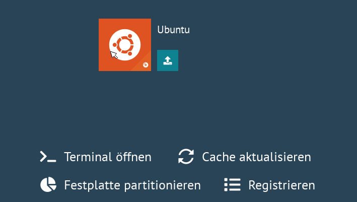
   
   Werkzeug-Menü

Klicke auf das große Festplatten-Symbol, das in der Ecke rechts unten farblich markiert ist, um nun ein Image zu erstellen. 

   
   Imaging-Symbol Ubuntu

Anstatt des Festplatten-Symbol wird bei Dir eventuell das Symbol des Betriebssystems angezeigt, dass Du in der WebUI festgelegt hast.

Es wird ein neues Fenster geöffnet:

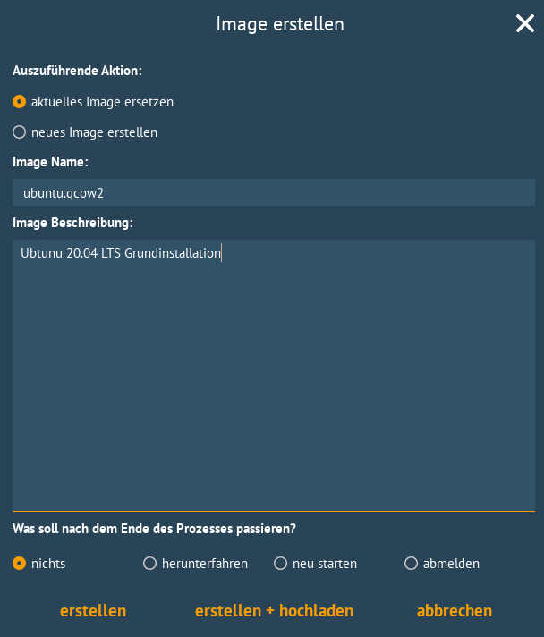
   
   Image erstellen

Gibt es das Image noch nicht, so wird ein neues Image mit dem zuvor in der WebUI festgelegten Namen erstellt. Sollte ein Image bereits vorhanden sein, so wird dieses überschrieben. Soll ein neuer Dateiname für das neue Image festgelegt werden, so muss dies zuerst in der WebUI in der Hardwareklasse festgelegt und ein neuer Import ausgeführt werden.

Klicke nun ``erstellen + hochladen``.

Während des Vorgangs siehst Du nachstehenden Bildschirm:

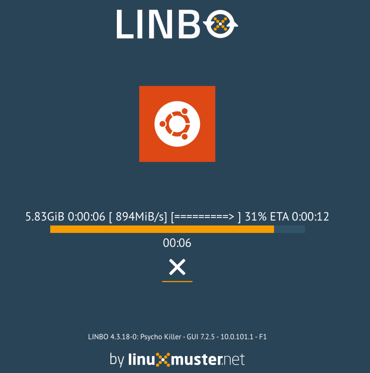
   
   Imageerstellung

Zum Abschluss erscheint die Meldung, dass das Image erfolgreich hochgeladen wurde.

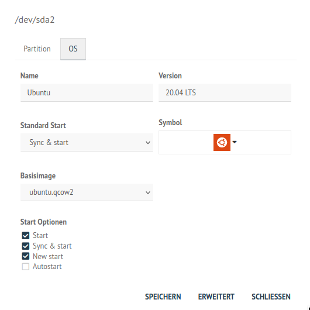
   
   Image wurde erfolgreich erstellt und auf den Server geladen

Gehe durch einen Klick auf das Zeichen ``<`` zurück und klicke im nächsten Bildschirm das obere Symbol auf der rechten Seite an, um Dich abzumelden.

Du siehst nun drei Start-Symbole. Der grosse Symbol started das Image sychronisiert, während das grüne Icon das lokale Image aus dem Cache ohne Synchronisation startet.

   
   LINBO Start-Symbole

Starte nun Ubuntu synchronisiert.

Paket linuxmuster-linuxclient7 installieren
--------------------------------------------

Melde Dich an dem gestarteten Ubuntu 22.04 als Benutzer ``linuxadmin`` an.

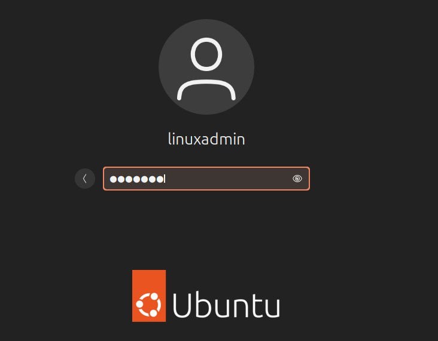
   
   Anmelden als Benutzer linuxadmin

Installiere das Paket ``linuxmuster-linuxclient7`` wie folgt:

1. Importiere den GPG-Schlüssel des linuxmuster.net Respository.
2. Trage das linuxmuster.net Repository ein.
3. Installiere das Paket

1. Schritt
^^^^^^^^^^

Öffne ein Terminal unter Ubuntu mit ``strg`` + ``T`` oder klicke unten links auf die Kacheln und gib in der Suchzeile als Anwendung ``Terminal`` ein.

Importiere nun den GPG-Schlüssel des linuxmuster.net Repository:

.. code::

   sudo sh -c 'wget -qO- "https://deb.linuxmuster.net/pub.gpg" | gpg --dearmour -o /usr/share/keyrings/linuxmuster.net.gpg'

2. Schritt
^^^^^^^^^^

Trage das linuxmuster.net Repository in die Paketquellen des Clients ein:

.. code::

   sudo sh -c 'echo "deb [arch=amd64 signed-by=/usr/share/keyrings/linuxmuster.net.gpg] https://deb.linuxmuster.net/ lmn71 main" > /etc/apt/sources.list.d/lmn71.list'

Aktualisiere die Paketinformationen mit ``sudo apt update``.

3. Schritt
^^^^^^^^^^

Führe die Installation des Pakets mit ``sudo apt install linuxmuster-linuxclient7 -y`` durch.

Es kommt während der Paketinstallation die Nachfrage, welches voreingestellte Realm für Kerberos 5 zu verwenden. Dieser Eintrag bleibt leer.

.. figure:: media/14-linux-client-ubu-install-paket-configuration-client.png
   :align: center
   :alt: Ubuntu Setup: Paketkonfiguration
   :width: 80%
   
   Paketkonfiguration

Lasse das Feld leer und bestätige die Paketkonfiguration mit ``OK``.

Setup
-----

Um den Domänenbeitritt auszuführen, rufe das Setup des linuxmuster-linuxclient7 auf:

.. code::

   sudo linuxmuster-linuxclient7 setup

Für den Domänenbeitritt wird das Kennwort des Domänen-Admins ``global-admin`` abgefragt.

Am Ende des Domänenbeitritts erfolgt eine Bestätigung, dass dieser erfolgreich durchgeführt wurde. Falls nicht, musst Du das Setup für den linuxmuster-linuxclient7 erneut durchlaufen.

Image vorbereiten
-----------------

Der Linux-Client muss nun für die Erstellung des Images vorbereitet werden.
Rufe hierzu den Befehl auf:

.. code::

   sudo linuxmuster-linuxclient7 prepare-image -y

Der Client erhält dadurch Aktualisierungen und es werden einige Dateien (journalctl & apt-caches) aufgeräumt, um Speicherplatz im Image zu sparen.

.. attention::

   Danach unbedingt S O F O R T ein neues Image mit Linbo erstellen. Beim Neustart via PXE darf Ubuntu N I C H T gestartet werden.

Image erstellen
---------------

Führe einen Neustart des Linux-Client durch, sodass die VM via PXE in Linbo bootet.

Nun erstellst Du in Linbo - genauso wie zuvor unter **Erstimage erstellen** beschrieben - das Image des neuen Muster-Clients für Linux. Das bisherige Image wird dadurch ersetzt. Wähle ``erstellen + hochladen``.

Wurde der Vorgang erfolgreich beendet, kannst Du Dich wieder abmelden und den vorbereiteten Linux-Client synchronisiert starten. Nun sollte die Anmeldung mit jedem in der Schulkonsole eingetragenen Benutzer funktionieren.

Eigene Anpassungen im Image
===========================

Um den Linux-Client als Mustervorlage zu aktualisieren und Anpassungen vorzunehmen, startest Du den Client synchronisiert und meldest Dich mit dem Benutzer ``linuxadmin`` an.

Danach installierst Du die benötigte Software und nimmst die gewünschten Einstellungen vor.

Beispielsweise installierst Du auf dem Linux-Client zuerst Libre-Office:

.. code::

   sudo apt update
   sudo apt install libreoffice

Hast Du alle Anpassungen vorgenommen, musst Du den Linux-Client noch zur Erstellung des Images vorbereiten.

Das machst Du mit folgendem Befehl:

.. code::

 sudo linuxmuster-linuxclient7 prepare-image

.. attention::

   Falls Du die history Deines Terminals nutzt um Befehle wieder zu nutzen, dann achte darauf das Du den Parameter ``-y`` entfernst.
   
Sollte während des Updates oder der Image-Vorbereitung die Meldung erscheinen, dass lokale Änderungen der PAM-Konfiguration außer Kraft gesetzt werden sollen, wähle hier immer ``Nein`` (siehe Abb.), da sonst der konfigurierte Login nicht mehr funktioniert.

.. figure:: media/15-linux-client-ubu-update-pam.png
   :align: center
   :alt: Linux-Client: Update - PAM Settings

Solltest Du versehentlich ``ja`` ausgewählt haben, kannst Du die Anmeldung mit folgendem Befehl reparieren:

.. code::

  sudo linuxmuster-linuxclient7 upgrade

Im Anschluss startest Du Deinen Linux-Client neu und erstellst wiederum, wie zuvor beschrieben, ein neues Image.

Serverseitige Anpassungen
=========================

Damit der Linux-Client die Drucker automatisch ermittelt und der Proxy korrekt eingerichtet wird, ist es erforderlich, dass auf dem linuxmuster.net Server einige Anpassungen vorgenommen werden.

Proxy-Einstellungen
-------------------

Bei der Anmeldung vom Linux-Client werden sog. ``Hook-Skripte`` ausgeführt.

Diese finden sich auf dem linuxmuster.net Server im Verzeichnis: ``/var/lib/samba/sysvol/linuxmuster.lan/scripts/default-school/custom/linux/``.

.. hint::

   Ersetze ``linuxmuster.lan`` durch den von Dir beim Setup festgelegten Domänennamen.

Hier findet sich das Logon-Skript (``logon.sh``). Es wird immer dann ausgeführt, wenn sich ein Benutzer am Linux-Client anmeldet.

In diesem Logon-Skript musst Du die Einstellungen für den zu verwenden Proxy-Server festlegen, sofern dieser von den Linux-Clients verwendet werden soll.

Editiere die Datei ``/var/lib/samba/sysvol/linuxmuster.lan/scripts/default-school/custom/linux/logon.sh`` und füge folgende Zeilen hinzu. Passe die ``PROXY_DOMAIN`` für Dein Einsatzszenario an.

.. code::

  PROXY_DOMAIN=linuxmuster.lan #change it to your DOMAIN
  PROXY_HOST=http://firewall.$PROXY_DOMAIN
  PROXY_PORT=3128

  # set proxy via env (for Firefox)
  lmn-export no_proxy=127.0.0.0/8,10.0.0.0/8,192.168.0.0/16,172.16.0.0/12,localhost,.local,.$PROXY_DOMAIN
  lmn-export http_proxy=$PROXY_HOST:$PROXY_PORT
  lmn-export ftp_proxy=$PROXY_HOST:$PROXY_PORT
  lmn-export https_proxy=$PROXY_HOST:$PROXY_PORT

  # set proxy gconf (for Chrome)
  gsettings set org.gnome.system.proxy ignore-hosts "['127.0.0.0/8','10.0.0.0/8','192.168.0.0/16','172.16.0.0/12','localhost','.local','.$PROXY_DOMAIN']"
  gsettings set org.gnome.system.proxy mode "manual"
  gsettings set org.gnome.system.proxy.http port "$PROXY_PORT"
  gsettings set org.gnome.system.proxy.http host "$PROXY_HOST"
  gsettings set org.gnome.system.proxy.https port "$PROXY_PORT"
  gsettings set org.gnome.system.proxy.https host "$PROXY_HOST"
  gsettings set org.gnome.system.proxy.ftp port "$PROXY_PORT"
  gsettings set org.gnome.system.proxy.ftp host "$PROXY_HOST"

Drucker vorbereiten
-------------------

.. hint:: 

   Dies sind nur kurze allgemeine Hinweise. Im Kapitel :ref:`configure-printers-label` findet sich eine ausführliche Anleitung.

Damit die Drucker richtig gefunden und via GPO administriert werden können, ist es erforderlich, dass jeder Drucker im CUPS-Server als Namen exakt seinen Hostnamen aus der Geräteverwaltung bekommt.

Die Zuordnung von Druckern zu Computern geschieht auf Basis von Gruppen im Active Directory. Im Kapitel :ref:`configure-printers-label` gibt es weitere Informationen dazu.

Damit auf jedem Rechner nur die Drucker angezeigt werden, die ihm auch zugeordnet wurden, muss auf dem Server in der Datei ``/etc/cups/cupsd.conf`` der Eintrag ``Browsing On`` auf ``Browsing Off`` umgestellt werden. Ansonsten werden auf jedem Rechner ALLE Drucker angezeigt, nicht nur die ihm zugeteilten.

Weiterführende Dokumentation
============================

- `Entwicklerdokumentation <https://github.com/linuxmuster/linuxmuster-linuxclient7/wiki/Setup>`_
- :ref:`using-linbo-label`

