.. include:: ../../../../guided-inst.subst

.. _install-linux-clients-popos-label:

=====================
Linux-Client: pop!os
=====================

.. sectionauthor:: `@cweikl <https://ask.linuxmuster.net/u/cweikl>`_

Hast Du alle Vorarbeiten wie im Kapitel :ref:`install-linux-clients-current-label` ausgeführt, startetst Du nun den PC/die VM von CD/DVD/USB-Stick mit pop!os.

.. hint::

   Die ISO-Datei zur Erstellung des Installationsmediums findest Du unter: https://pop.system76.com

   z.B. https://iso.pop-os.org/22.04/amd64/intel/35/pop-os_22.04_amd64_intel_35.iso

Zur Erinnerung - folgende Vorarbeiten sollten bereits erledigt sein:

1. Lege in der WebUI unter LINBO4 eine neue Hardwareklasse (HWK) an.

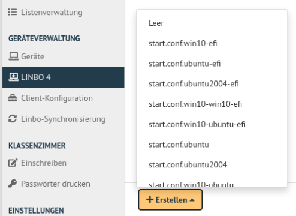
   
   Hardwareklasse hinzufügen

2. Vergebe für die HWK einen eindeutigen Namen.

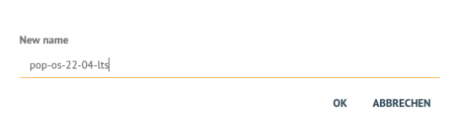
   
   Name der HWK festlegen

3. Editiere die Eintragungen für die HWK, in dem Du auf das Stift-Symbol klickst.

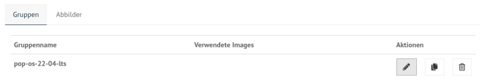
   
   HWK editieren

4. Trage unter der Reiterkarte ``Allgemein`` die Server IP sowie den Systemtyp ein.

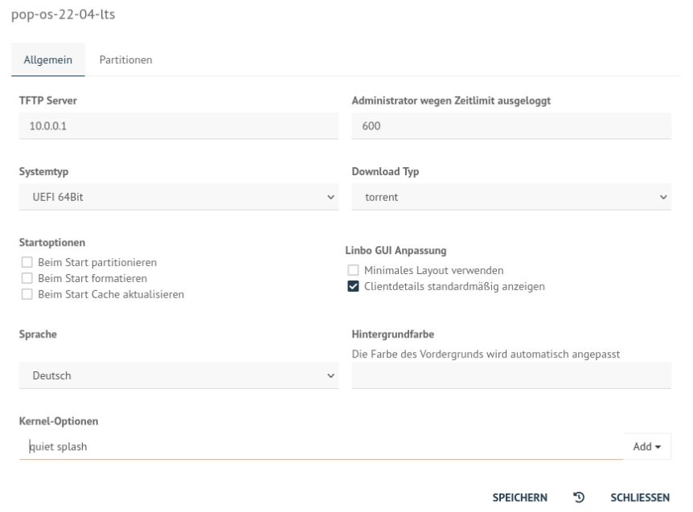

5. Gebe auf der Reiterkarte ``Partitionen`` die erforderlichen Partitionen EFI (für UEFI-Systeme - mind 1 GiB), pop!os, cache und swap an. Die Größenangaben richten sich nach Deinen Anforderungen und sollten i.d.R. größer sein als auf der Abbildung.

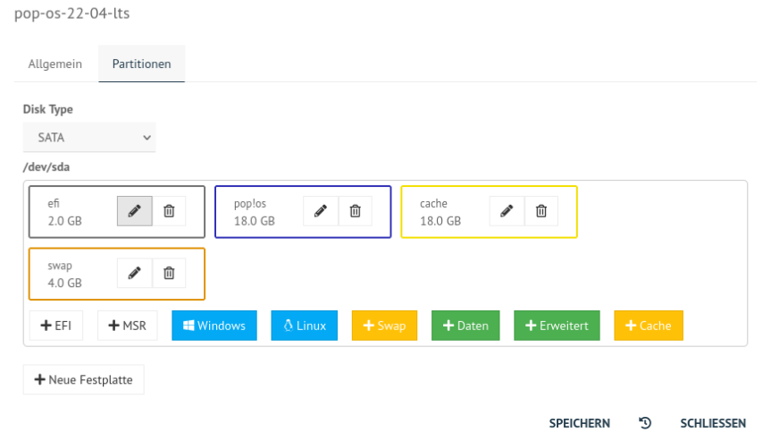
   
   Allgemeine Einstellungen der HWK

.. hint::

   Bei pop!os sollte darauf geachtet werden, dass bei UEFI-System die EFI-Partition eine Größe von mind. 1 GiB aufweist!

6. Bearbeite die Partition pop!os mit dem Stift und gebe auf der Reiterkarte ``OS`` einen eindeutigen Namen an. Lege den Namen für das Basisimage fest. Dies erreichst Du über das ``+``-Symbol und der Angabe eines neuen Namens, der auf .qcow2 enden muss. Danach kannst Du diesen aus der Dropdown-Liste auswählen.

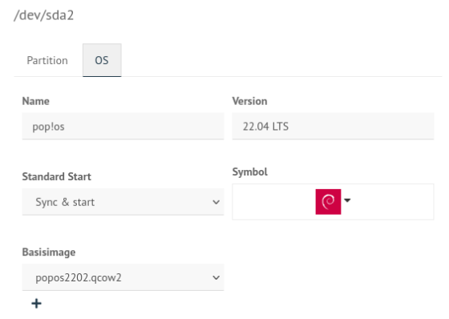
   
   Partitionen festlegen

Nutzt Du ein UEFI-System, so musst Du für pop!os die Einträge für Kernel und initrd anpassen, die auf das Verzeichnis ``boot/`` verweisen, das auf der EFI-Partition liegt.

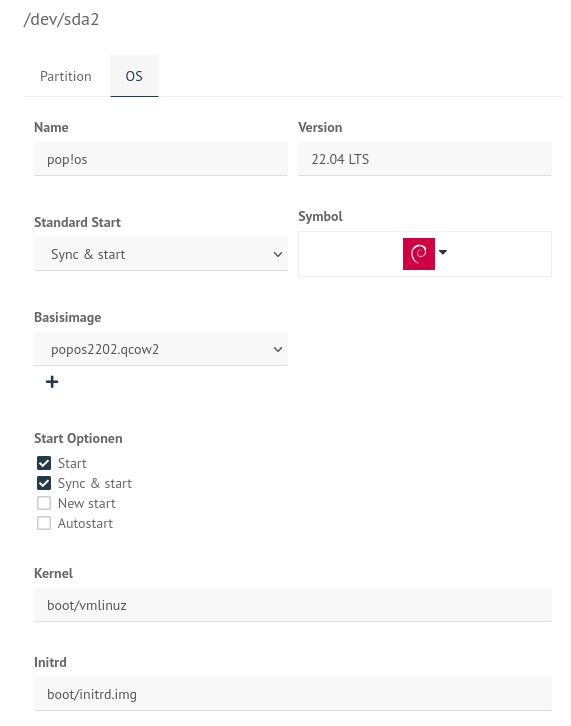

7. Gebe in der WebUI für diesen PC als Gruppe die neu angelegte HWK - hier pop-os-22-04-lts - an und klicke auf ``Spechern & importieren``.

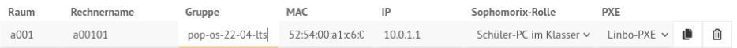
   
   Gerät der HWK zuordnen und importieren

8. Starte danach den Client via PXE und LINBO.

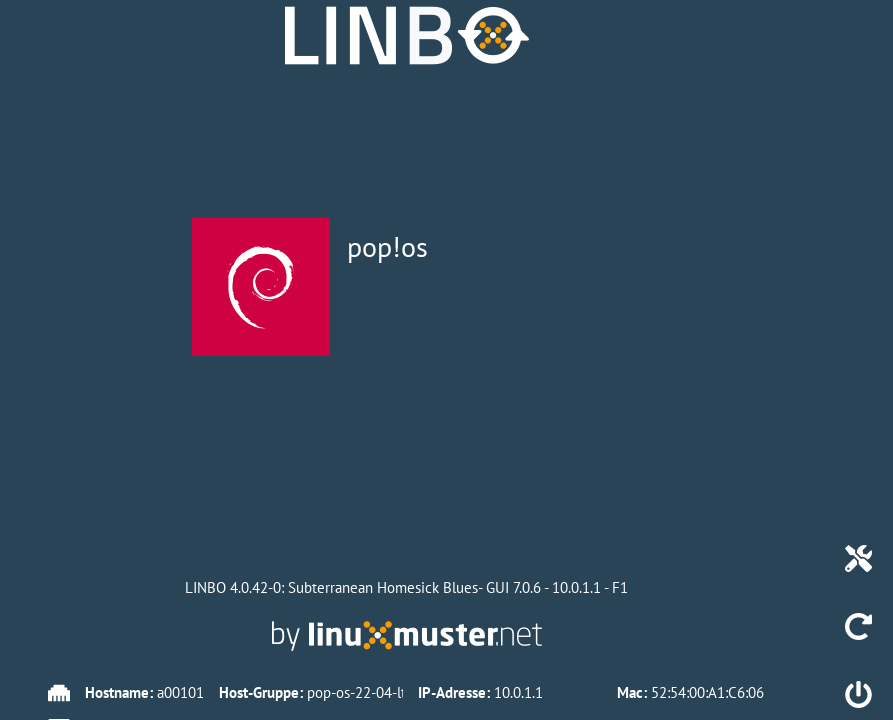
   
   LINBO Startbildschirm pop!os

9. Klicke auf das Werkzeugsymbol, authentifiziere Dich mit dem Kennwort das LINBO-Admins (dieses siehst Du bei der Eingabe nicht - auch keine Sternchen).

10. In der sich öffnenden Anzeige klicke auf den Eintrag ``Festplatte partitionieren``.

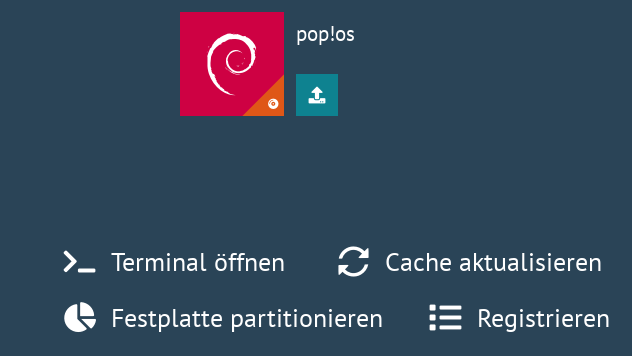
   
   LINBO Werkzeugleiste - Menüeinträge für pop!os

11. Gehe nach erfolgreicher Ausführung mit dem Pfeil-Symbol zurück und schalte danach den Client aus.

12. Stelle die Bootreihenfolge auf dem Client so um, dass dieser nun vom pop!os Installationsmedium startet.

Installation pop!os
-------------------

Nach dem Start von dem Installationsmedium erhälst Du den Hinweis, dass pop!os gestartet wird. Es kann einige Zeit dauern, bis Du den grafischen Installations-Bildschirm siehst.

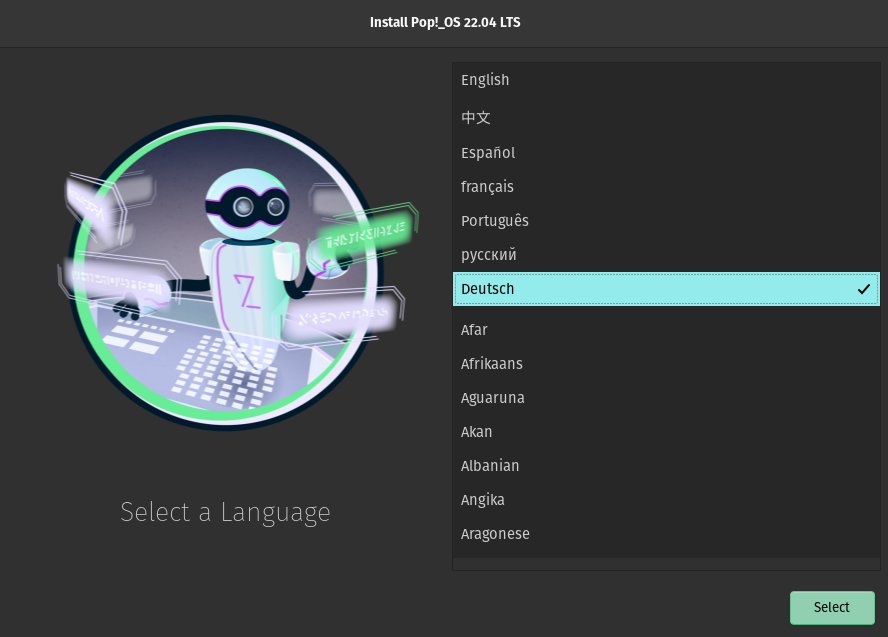
   
   Sprache auswählen

Wähle die gewünschte Sprache und bestätige dies mit ``Select``.

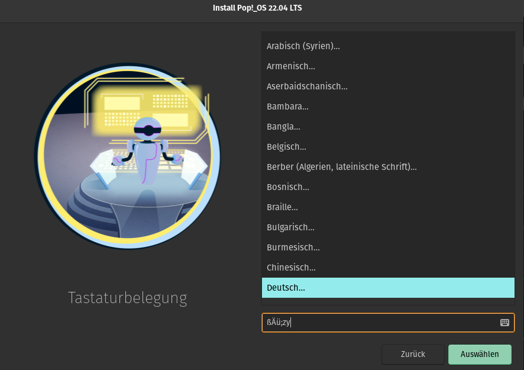
   
   Tastaturlayout festlegen

Wähle die gewünschte Tastaturbelegung. Diese kannst Du im Eingabefeld testen. Bestätige Deine Wahl mit ``Auswählen``.

.. figure:: media/popos/client-install-13.png
   :align: center
   :alt: Custom Install
   :width: 80%
   
   Installationsart wählen

Die Partitionen auf Deinem Muster-Client sind bereits mit LINBO angelegt worden, so dass Du hier die Option ``Custom (Advanced)`` auswählst und bestätigst.

Du gelangst zu nachstehendem Bildschirm, in dem Deine bisherigen Partitionen angezeigt werden.

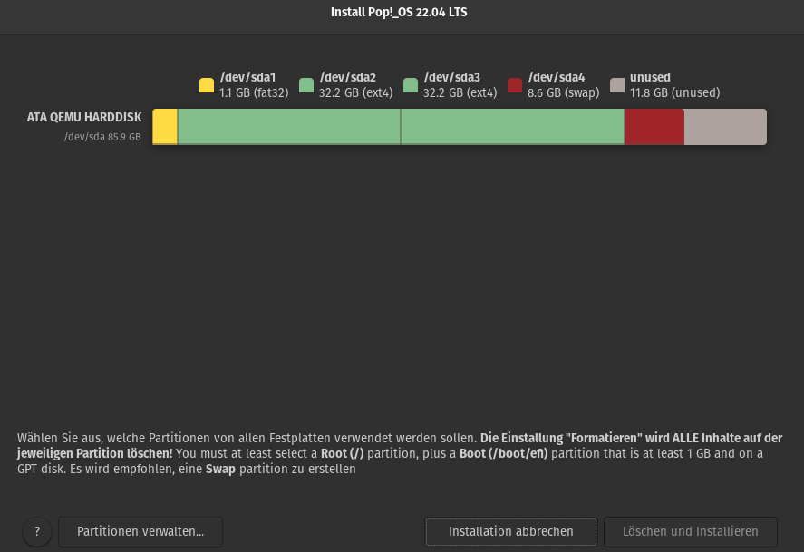
   
   Partitionsübersicht

Du hattest mit LINBO bereits die Festplatte partitioniert und formatiert.

Es werden Dir die bereits vorhandenen Partitionen und Dateisysteme angezeigt. Je nach genutzter Virtualisierungsumgebung / Hardware können die Festplattenbezeichnungen hier auch als ``/dev/vda`` und die Partionen als ``/dev/vda1`` etc. angezeigt werden.

Markiere zunächst Die EFI-Partition (gelb) und lege fest, dass diese Partition verwendet werden soll.

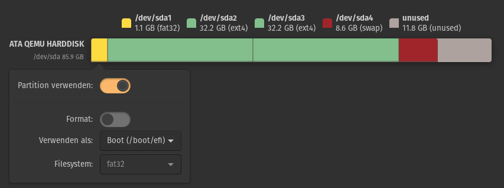
   
   EFI-Partition aktivieren

Diese soll unter pop!os als /boot/efi Boot-Partition eingehangen, aber N I C H T formatiert werden.

Klicke danach auf die pop!os-Partition und binde diese als Root-Partition ( / ) ein. Diese ist ebenfalls nicht zu formatieren.

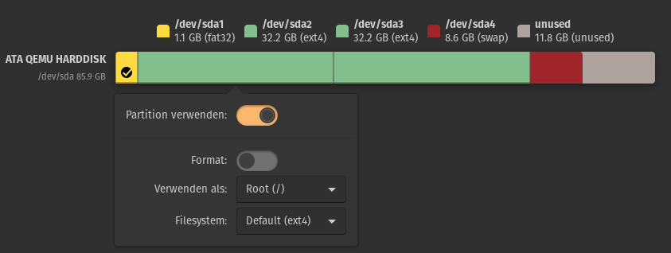
   
   Partition für pop!os einhängen

Klicke abschliessend auf die SWAP-Partition (rot) und binde diese als Swap ein.

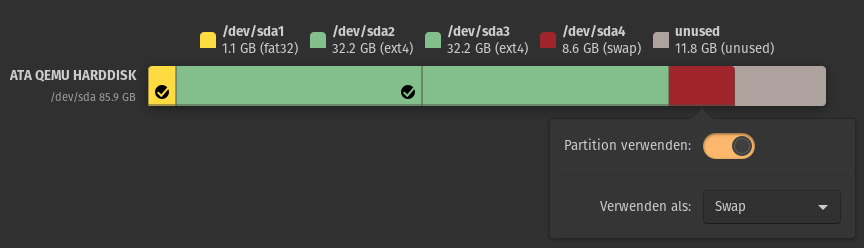
   
   SWAP-Partition einhängen

Danach siehst Du Deine einegbundenden Partitionen, die jeweils mit einem Häkchen gekennzeichnet sind.

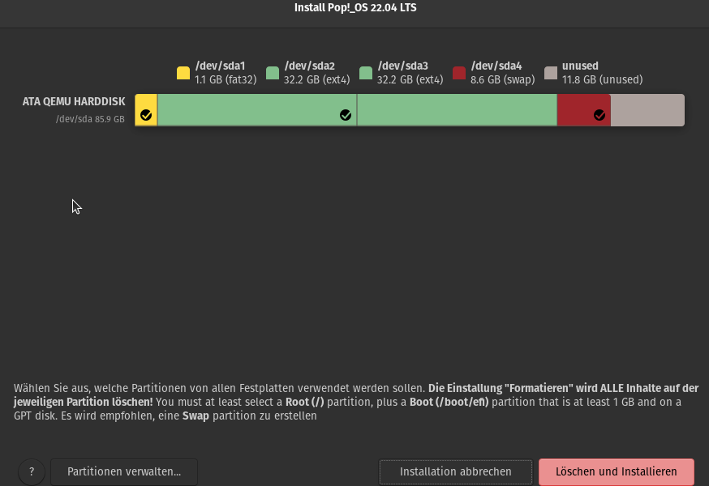
   
   ÜArtitionsübersicht

Starte die Installation mit dem Button ``Löschen und installieren``.

Danach musst Du noch einen neuen Benutzer ``linuxadmin`` festlegen.

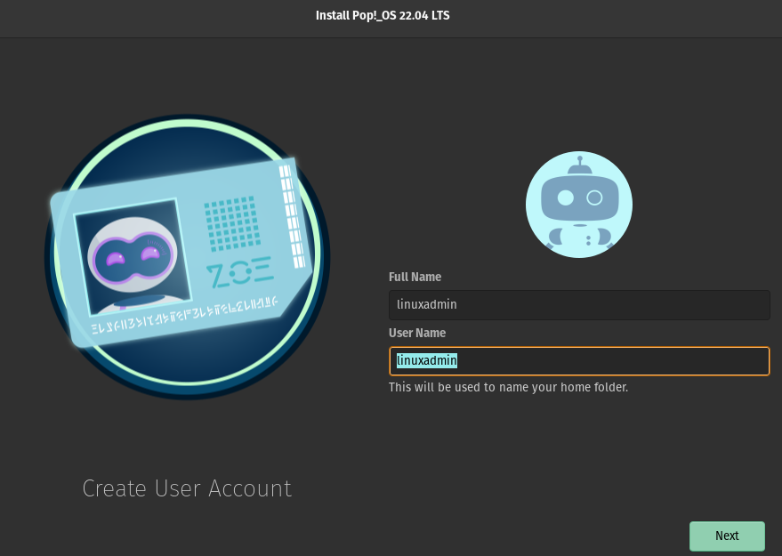
   
   Neuen bentuzer linuxadmin anlegen

Lege für den neuen Benutzer ein Kennwort fest, das mind. 8 Zeichen aufweist.

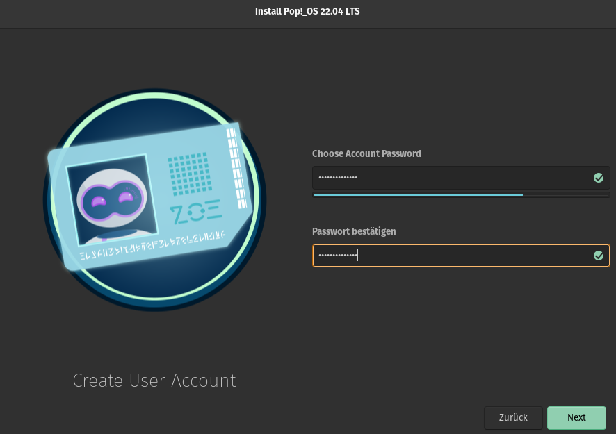
   
   Kennwort für linuxadmin festlegen

Bestätige dies mit ``Next``. Danach startet die Installation.

Gelangst Du nach erfolgreicher Installation zunm Abschluss-Bildschirm, so wähle hier ``Herunterfahren`` aus.

Werfe das Installationsmedium aus.

Erstimage erstellen
-------------------

Passe die Boot-Reihenfolge für den PC / die VM jetzt so an, dass wieder via PXE/LINBO gebootet wird. Du siehst dann die Startoptionen in Linbo für das installierte pop!os.

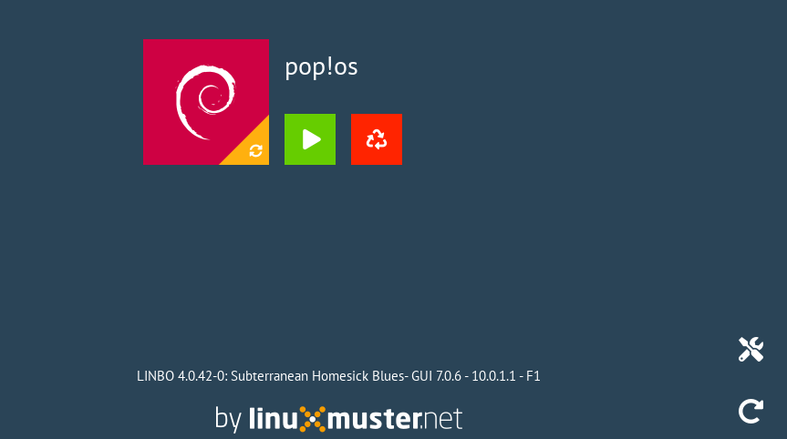
   
   LINBO Startbildschirm für pop!os

Klicke nun unten rechts auf das Werkzeug-Icon, um zum Menü für die Imageerstellung zu gelangen.

.. figure:: media/07-linux-client-ubu-install.png
   :align: center
   :alt: Menue Tools
   :width: 40%
   
   Werkzeugleiste

Du wirst nach dem Linbo-Passwort gefragt. Gib dieses ein.

.. attention:: 

   Deine Eingabe wird hierbei nicht angezeigt.

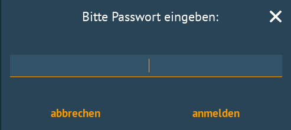
   
   LINBO Kennwort eingeben

Klicke dann auf ``anmelden`` und Du gelangst zu folgender Ansicht:

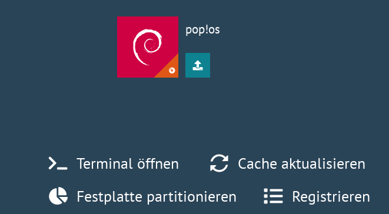
   
   Menü Werkzeugleiste

Klicke auf das große Festplatten-Symbol, das in der Ecke rechts unten farblich markiert ist, um nun ein Image zu erstellen. Anstatt des Festplatten-Symbols wird bei Dir eventuell das Symbol des Betriebssystems angezeigt, dass Du in der WebUI festgelegt hast.

Es wird ein neues Fenster geöffnet:

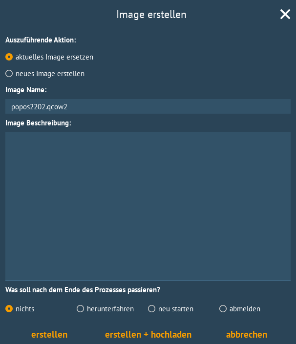
   
   Image erstellen

Starte den Vorgang mit ``erstellen & hochladen``.

Gibt es das Image noch nicht, so wird ein neues Image mit dem zuvor in der WebUI festgelegten Namen erstellt. Ansonsten wir das bestehende Image überschrieben.

Während des Vorgangs siehst Du nachstehenden Bildschirm:

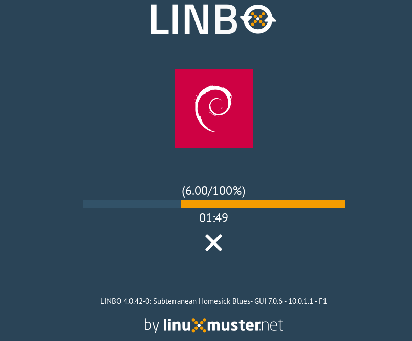
   
   Uploading Image

Zum Abschluss erscheint die Meldung, dass das Image erfolgreich hochgeladen wurde.

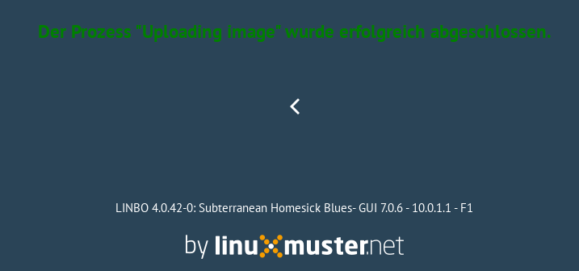
   
   Image erfolgreich hochgeladen

Gehe durch einen Klick auf das Zeichen ``<`` zurück und melde Dich ab.

Rufst Du mit der WebUI denMenüpunkt ``Geräteverwaltung --> LINBO4`` auf, siehst Du Deine HWK.
Klickst Du hier auf die Reiterkarte ``Abbilder``, wird das soeben erstellte Image angezeigt.

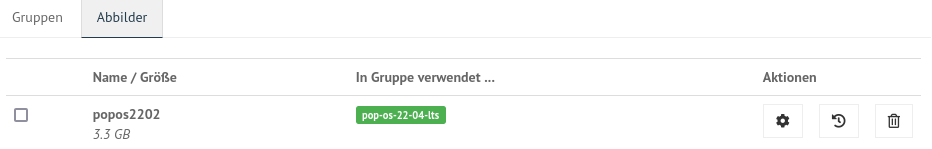
   
   Schulkonsole Abbilder

Klickst Du hier auf das Zahnrad-Symbol siehst Du weitere Informationen zu dem erstellten Image.

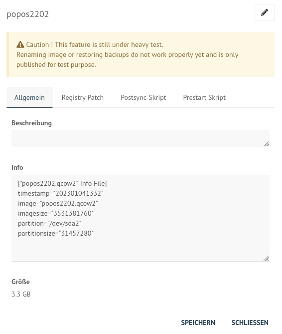
   
   Informationen zum Image

Wichtige Hinweise
-----------------

pop!os versucht während der Installation für die EFI-Partition und für die SWAP-Partition diese mithile von UUIDs einzubinden. Startest Du das synchronisierte Image, so wird es einige Zeit bei einem grauen Bildschirm hängen bleiben. Danach erscheinen Fehlerhinweise und eine Notfallkonsole.

In der Notfallkonsole musst Du nun folgende Dateien

.. code::

   /etc/fstab
   /etc/crypttab

auf dem Client korrigieren.

Die Datei ``/etc/fstab`` sollte folgende Einträge aufweisen:

.. code::

   # /etc/fstab: static file system information.
   #
   # Use 'blkid' to print the universally unique identifier for a
   # device; this may be used with UUID= as a more robust way to name devices
   # that works even if disks are added and removed. See fstab(5).
   #
   # <file system>  <mount point>  <type>  <options>  <dump>  <pass>
   /dev/sda1  /boot/efi  vfat  umask=0077  0  0
   /dev/sda2 / ext4 noatime,errors=remount-ro 0 0
   /dev/mapper/cryptswap  none  swap  defaults  0  0

Ersetze hierbei Einträge wie ``PARTUUID=61bb910e-54ce-45e3-bd81-18f6f445d1d0`` durch den Partitionseintrag ``/dev/sda1``.

Die Datei ``/etc/crypttab`` sollte folgende Einträge aufweisen:

.. code::

   cryptswap /dev/sda4 /dev/urandom swap,plain,offset=1024,cipher=aes-xts-plain64,size=512

Hier musst Du ebenfalls UUID-Einträge durch die Angabe der SWAP-Partition ersetzen.

Fahre das System herunter. Starte den Client und starte diesen mithilfe der ``grünen Pfeiltaste``, so dass nur das lokale System mit den soeben durchgeführten Anpassungen gestartet wird.

Danach solltest Du bis zum Login-Bildschirm kommen.

Paket linuxmuster-linuxclient7 installieren
--------------------------------------------

Melde Dich an dem gestarteten pop!os 22.04 als Benutzer ``linuxadmin`` an.

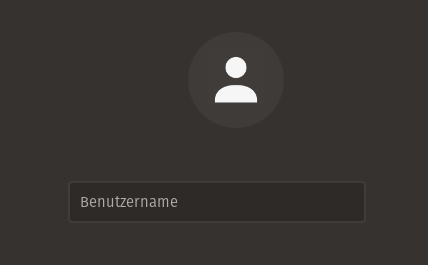
   
   Anmelden als Benutzer linuxadmin

Installiere das Paket ``linuxmuster-linuxclient7`` wie folgt:

1. Importiere den GPG-Schlüssel des linuxmuster.net Respository.
2. Trage das linuxmuster.net Repository ein.
3. Installiere eine Library und das Paket

1. Schritt
^^^^^^^^^^

Öffne ein Terminal unter Ubuntu mit ``strg`` + ``T`` oder klicke unten links auf die Kacheln und gib in der Suchzeile als Anwendung ``Terminal`` ein.

Importiere nun den GPG-Schlüssel des linuxmuster.net Repository:

.. code::

   sudo sh -c 'wget -qO- "https://deb.linuxmuster.net/pub.gpg" | gpg --dearmour -o /usr/share/keyrings/linuxmuster.net.gpg'

2. Schritt
^^^^^^^^^^

Trage das linuxmuster.net Repository in die Paketquellen des Clients ein:

.. code::

   sudo sh -c 'echo "deb [arch=amd64 signed-by=/usr/share/keyrings/linuxmuster.net.gpg] https://deb.linuxmuster.net/ lmn71 main" > /etc/apt/sources.list.d/lmn71.list'

Aktualisiere die Paketinformationen mit ``sudo apt update``.

3. Schritt
^^^^^^^^^^

Installiere vorab eine Library mit ``sudo apt install libsss-sudo -y``.
Führe danach die Installation des Pakets mit ``sudo apt install linuxmuster-linuxclient7 -y`` durch.

Setup
-----

Um den Domänenbeitritt auszuführen, rufe das Setup des linuxmuster-linuxclient7 auf:

.. code::

   sudo linuxmuster-linuxclient7 setup

Für den Domänenbeitritt wird das Kennwort des Domänen-Admins ``global-admin`` abgefragt.

Am Ende des Domänenbeitritts erfolgt eine Bestätigung, dass dieser erfolgreich durchgeführt wurde. Falls nicht, musst Du das Setup für den linuxmuster-linuxclient7 erneut durchlaufen.

Image vorbereiten
-----------------

Der Linux-Client muss nun für die Erstellung des Images vorbereitet werden.
Rufe hierzu den Befehl auf:

.. code::

   sudo linuxmuster-linuxclient7 prepare-image -y

Der Client erhält daruch Aktualisierungen und es werden einige Dateien (journalctl & apt-caches) aufgeräumt, um Speicherplatz im Image zu sparen.

.. attention::

   Danach unbedingt S O F O R T ein neues Image mit Linbo erstellen. Beim Neustart via PXE darf Ubuntu N I C H T gestartet werden.

Image erstellen
---------------

Führe einen Neustart des Linux-Client durch, sodass die VM via PXE in Linbo bootet.

Nun erstellst Du in Linbo - genauso wie zuvor unter **Erstimage erstellen** beschrieben - das Image des neuen Muster-Clients für Linux.

Wurde der Vorgang erfolgreich beendet, kannst Du Dich wieder abmelden und den vorbereiteten Linux-Client synchronisiert starten. Nun sollte die Anmeldung mit jedem in der Schulkonsole eingetragenen Benutzer funktionieren.

Eigene Anpassungen im Image
---------------------------

Um den Linux-Client als Mustervorlage zu aktualisieren und Anpassungen vorzunehmen, startest Du den Client synchronisiert und meldest Dich mit dem Benutzer ``linuxadmin`` an.

Danach installierst Du die benötigte Software und nimmst die gewünschten Einstellungen vor.

Beispielsweise installierst Du auf dem Linux-Client zuerst Libre-Office:

.. code::

   sudo apt update
   sudo apt install libreoffice

Hast Du alle Anpassungen vorgenommen, musst Du den Linux-Client noch zur Erstellung des Images vorbereiten.

Das machst Du mit folgendem Befehl:

.. code::

 sudo linuxmuster-linuxclient7 prepare-image

.. attention::

   Falls Du die history Deines Terminals nutzt um Befehle wieder zu nutzen, dann achte darauf das Du den Parameter ``-y`` entfernst.
   
Sollte während des Updates oder der Image-Vorbereitung die Meldung erscheinen, dass lokale Änderungen der PAM-Konfiguration außer Kraft gesetzt werden sollen, wähle hier immer ``Nein`` (siehe Abb.), da sonst der konfigurierte Login nicht mehr funktioniert.

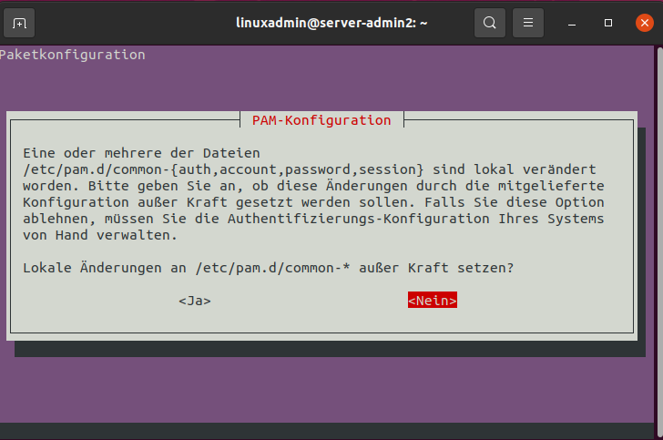
   
   PAM-Settings

Solltest Du versehentlich ``ja`` ausgewählt haben, kannst Du die Anmeldung mit folgendem Befehl reparieren:

.. code::

  sudo linuxmuster-linuxclient7 upgrade

Im Anschluss startest Du Deinen Linux-Client neu und erstellst wiederum, wie zuvor beschrieben, ein neues Image.

Serverseitige Anpassungen
-------------------------

Damit der Linux-Client die Drucker automatisch ermittelt und der Proxy korrekt eingerichtet wird, ist es erforderlich, dass auf dem linuxmuster.net Server einige Anpassungen vorgenommen werden.

Proxy-Einstellungen
-------------------

Bei der Anmeldung vom Linux-Client werden sog. ``Hook-Skripte`` ausgeführt.

Diese finden sich auf dem linuxmuster.net Server im Verzeichnis: ``/var/lib/samba/sysvol/gshoenningen.linuxmuster.lan/scripts/default-school/custom/linux/``.

.. hint::

   Ersetze ``gshoenningen.linuxmuster.lan`` durch den von Dir beim Setup festgelegten Domänennamen.

Hier findet sich das Logon-Skript (``logon.sh``). Es wird immer dann ausgeführt, wenn sich ein Benutzer am Linux-Client anmeldet.

In diesem Logon-Skript musst Du die Einstellungen für den zu verwenden Proxy-Server festlegen, sofern dieser von den Linux-Clients verwendet werden soll.

Editiere die Datei ``/var/lib/samba/sysvol/gshoenningen.linuxmuster.lan/scripts/default-school/custom/linux/logon.sh`` und füge folgende Zeilen hinzu. Passe die ``PROXY_DOMAIN`` für Dein Einsatzszenario an.

.. code::

  PROXY_DOMAIN=gshoenningen.linuxmuster.lan #change it to your DOMAIN
  PROXY_HOST=http://firewall.$PROXY_DOMAIN
  PROXY_PORT=3128

  # set proxy via env (for Firefox)
  lmn-export no_proxy=127.0.0.0/8,10.0.0.0/8,192.168.0.0/16,172.16.0.0/12,localhost,.local,.$PROXY_DOMAIN
  lmn-export http_proxy=$PROXY_HOST:$PROXY_PORT
  lmn-export ftp_proxy=$PROXY_HOST:$PROXY_PORT
  lmn-export https_proxy=$PROXY_HOST:$PROXY_PORT

  # set proxy gconf (for Chrome)
  gsettings set org.gnome.system.proxy ignore-hosts "['127.0.0.0/8','10.0.0.0/8','192.168.0.0/16','172.16.0.0/12','localhost','.local','.$PROXY_DOMAIN']"
  gsettings set org.gnome.system.proxy mode "manual"
  gsettings set org.gnome.system.proxy.http port "$PROXY_PORT"
  gsettings set org.gnome.system.proxy.http host "$PROXY_HOST"
  gsettings set org.gnome.system.proxy.https port "$PROXY_PORT"
  gsettings set org.gnome.system.proxy.https host "$PROXY_HOST"
  gsettings set org.gnome.system.proxy.ftp port "$PROXY_PORT"
  gsettings set org.gnome.system.proxy.ftp host "$PROXY_HOST"

Drucker vorbereiten
-------------------

.. hint:: 

   Dies sind nur kurze allgemeine Hinweise. Im Kapitel :ref:`configure-printers-label` findet sich eine ausführliche Anleitung.

Damit die Drucker richtig gefunden und via GPO administriert werden können, ist es erforderlich, dass jeder Drucker im CUPS-Server als Namen exakt seinen Hostnamen aus der Geräteverwaltung bekommt.

Die Zuordnung von Druckern zu Computern geschieht auf Basis von Gruppen im Active Directory. Im Kapitel :ref:`configure-printers-label` gibt es weitere Informationen dazu.

Damit auf jedem Rechner nur die Drucker angezeigt werden, die ihm auch zugeordnet wurden, muss auf dem Server in der Datei ``/etc/cups/cupsd.conf`` der Eintrag ``Browsing On`` auf ``Browsing Off`` umgestellt werden. Andernfalls werden auf jedem Rechner ALLE Drucker angezeigt, nicht nur die ihm zugeteilten.

Appendix
--------

Die HWK wird auf dem Server unter ``/srv/linbo/start.conf.pop-os-22-04-lts`` (Name für die hier dargestellte HWK) abgelegt.

Für die dargestellte Beispiel-HWK weist diese folgenden Inhalt auf:

.. code::

   [LINBO]
   Server = 10.0.0.1
   Group = pop-os-22-04-lts
   Cache = /dev/sda3
   RootTimeout = 600
   AutoPartition = no
   AutoFormat = no
   AutoInitCache = no
   GuiDisabled = no
   UseMinimalLayout = no
   Locale = de-DE
   DownloadType = torrent
   SystemType = efi64
   KernelOptions = quiet splash
   clientDetailsVisibleByDefault = yes
   
   [Partition]
   Dev = /dev/sda1
   Label = efi
   Size = 1G
   Id = ef
   FSType = vfat
   Bootable = yes
   
   [Partition]
   Dev = /dev/sda2
   Label = popos
   Size = 30G
   Id = 83
   FSType = ext4
   Bootable = no
   
   [Partition]
   Dev = /dev/sda3
   Label = cache
   Size = 30G
   Id = 83
   FSType = ext4
   Bootable = no
   
   [Partition]
   Dev = /dev/sda4
   Label = swap
   Size = 8G
   Id = 82
   FSType = swap
   Bootable = no
   
   [OS]
   Name = Pop!OS
   Version = 22.04 LTS
   Description = Ubuntu 20.04
   IconName = debian.svg
   Image =
   BaseImage = popos2204.qcow2
   Boot = /dev/sda2
   Root = /dev/sda2
   Kernel = boot/vmlinuz
   Initrd = boot/initrd.img
   Append = ro splash
   StartEnabled = yes
   SyncEnabled = yes
   NewEnabled = yes
   Autostart = no
   AutostartTimeout = 5
   DefaultAction = sync
   Hidden = yes
  
In der WebUI kannst Du unter ``Geräteverwaltung --> Linbo-Synchronisierung`` die PC und die HWK Gruppen einsehen und hier sog. ``linbo-remote`` Befehle vom Server aus absetzen, die z.B. bewirken, dass der PC a00101 ausgeschaltet (Halt) wird.

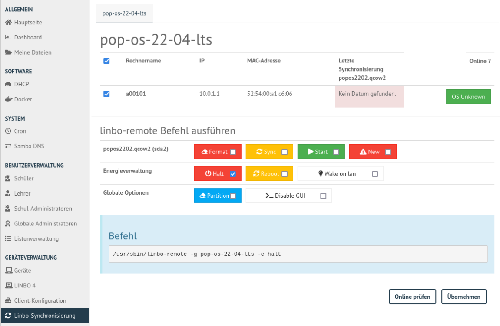
   
   WebUI LINBO-Synchronisierung

